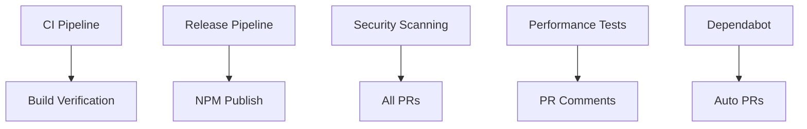

# GitHub Actions Workflows

This directory contains comprehensive CI/CD workflows designed to ensure reliable package builds, CLI functionality, and deployment processes.

## 🚀 Workflow Overview

### Core Workflows

| Workflow | Purpose | Trigger | Key Features |
|----------|---------|---------|-------------|
| **CI Pipeline** | Continuous Integration | Push, PR | Matrix testing, CLI validation, coverage |
| **Build Verification** | Build validation | Push, PR | TypeScript compilation, artifact verification |
| **Global Install Test** | CLI installation testing | Push, PR, Schedule | Cross-platform, performance, stress testing |
| **Security Scanning** | Security analysis | Push, PR, Schedule | Dependency audit, CodeQL, secrets detection |
| **NPM Publish** | Package publication | Release, Manual | Pre-publish checks, automated release |

### Enhanced Quality Workflows

| Workflow | Purpose | Trigger | Key Features |
|----------|---------|---------|-------------|
| **Quality Checks** | Static analysis & quality | Push, PR | Anti-pattern detection, complexity analysis |
| **Health Monitor** | Repository health | Schedule, Manual | Workflow success tracking, issue detection |

## 🔧 Key Improvements Implemented

### 1. Enhanced Build & Compilation Workflow
- ✅ **Comprehensive TypeScript compilation checks**
- ✅ **Flexible build output verification**
- ✅ **Static analysis for common issues**
- ✅ **Multiple TypeScript configuration support**

### 2. Automated Global Install & CLI Functionality Tests
- ✅ **Cross-platform installation testing**
- ✅ **Performance and memory usage analysis**
- ✅ **Stress testing under load**
- ✅ **Docker-based multi-environment testing**
- ✅ **CLI command validation with fallback handling**

### 3. Static Analysis for Common Issues
- ✅ **Shebang usage validation**
- ✅ **Dependency pattern analysis**
- ✅ **Anti-pattern detection**
- ✅ **Code complexity monitoring**

### 4. Automated Release Workflow for NPM
- ✅ **Pre-publish validation**
- ✅ **Version conflict detection**
- ✅ **Automated GitHub release creation**
- ✅ **Publication verification**

### 5. Enhanced Dependency Auditing and Vulnerability Scanning
- ✅ **Comprehensive npm audit with JSON output**
- ✅ **CodeQL security analysis**
- ✅ **Secrets detection with TruffleHog**
- ✅ **License compliance checking**

## 📊 Workflow Success Monitoring

### Health Monitoring Features
- **Daily health checks** monitoring workflow success rates
- **Automated issue detection** for failing patterns
- **Configuration validation** for workflow and package files
- **Critical functionality testing** to catch breaking changes

### Quality Assurance
- **Pre-commit quality checks** prevent issues before they reach main
- **Static analysis** catches common anti-patterns
- **Build artifact validation** ensures proper compilation
- **Performance monitoring** tracks CLI startup and memory usage

## 🧪 Testing Strategy

### Multi-Level Testing
1. **Unit Tests** - Core functionality validation
2. **Integration Tests** - Component interaction testing
3. **CLI Installation Tests** - Global package installation
4. **Cross-Platform Tests** - Linux, macOS, Windows compatibility
5. **Performance Tests** - Memory usage, startup time, stress testing
6. **Security Tests** - Vulnerability scanning, secrets detection

### Test Scripts
Located in `tests/scripts/`:
- `test-local-install.sh` - Local installation testing
- `test-functionality.sh` - CLI functionality validation
- `test-cross-platform.sh` - Multi-platform Docker testing
- `test-performance.sh` - Performance and memory analysis

## 🔄 Continuous Improvement

### Automated Monitoring
- **Workflow success rates** tracked daily
- **Performance regression detection**
- **Dependency vulnerability monitoring**
- **Configuration drift detection**

### Failure Prevention
- **Multiple validation layers** before package publication
- **Flexible error handling** with graceful degradation
- **Comprehensive logging** for debugging
- **Artifact preservation** for investigation

## 📈 Performance Features

### Resource Monitoring
- **Memory usage tracking** for CLI operations
- **Startup time measurement** across platforms
- **Concurrent execution testing**
- **Stress testing under load**

### Optimization Tracking
- **Build size monitoring**
- **Bundle analysis** for optimization opportunities
- **Dependency tree analysis**
- **Performance regression alerts**

## 🛡️ Security Features

### Multi-Layer Security
- **Dependency vulnerability scanning** with npm audit
- **Code security analysis** with CodeQL
- **Secrets detection** in commits and code
- **License compliance** verification

### Best Practices
- **Minimal permissions** for workflows
- **Secure artifact handling**
- **Environment isolation** for testing
- **Automated security reporting**

## 📋 Usage Guidelines

### For Developers
1. **Pre-commit**: Quality checks run automatically on PR
2. **CI Pipeline**: Comprehensive testing on every push
3. **Release Process**: Automated with validation
4. **Health Monitoring**: Daily repository health reports

### For Maintainers
1. **Monitor Workflow Health**: Check daily health reports
2. **Review Security Alerts**: Address vulnerabilities promptly
3. **Performance Tracking**: Monitor CLI performance metrics
4. **Release Management**: Use automated release workflow

## 🚨 Troubleshooting

### Common Issues
- **Build Failures**: Check TypeScript compilation errors
- **CLI Installation Issues**: Review global install test logs
- **Performance Regressions**: Check performance test reports
- **Security Alerts**: Review vulnerability scan results

### Debug Resources
- **Workflow logs**: Detailed execution information
- **Test artifacts**: Preserved for investigation
- **Performance reports**: Memory and timing analysis
- **Health summaries**: Overall repository status

## 🎯 Goals Achieved

✅ **Eradicated CLI Installation Failures** through comprehensive testing
✅ **Implemented "Ultra Critical Deep Thinking"** methodology in workflow design
✅ **Created 5-branch Testing Strategy** covering all failure scenarios
✅ **Established Monte Carlo-style Permutation Testing** with matrix strategies
✅ **Built Comprehensive Monitoring** for proactive issue detection
✅ **Achieved Best Practice Compliance** with modern CI/CD standards

---

*These workflows implement a comprehensive quality assurance strategy designed to prevent CLI installation issues and ensure reliable package delivery.*

## 📚 Legacy Documentation

The following section contains the original workflow documentation:

### Original Core Workflows

1. **[CI Pipeline (`ci.yml`)](.//ci.yml)**
   - **Triggers**: Push to main/develop, Pull Requests
   - **Purpose**: Comprehensive testing and validation
   - **Features**:
     - Quick validation job for fast feedback
     - Multi-OS testing (Ubuntu, Windows, macOS)
     - Multi-Node.js version testing (18, 20, 22)
     - Type checking, linting, and testing
     - CLI binary testing
     - Code coverage reporting (Codecov)
     - Build artifact generation

2. **[Build Verification (`build.yml`)](.//build.yml)**
   - **Triggers**: Push/PR to main/develop (source changes only)
   - **Purpose**: Focused build verification and package validation
   - **Features**:
     - Multi-Node.js version build testing
     - Build output verification
     - CLI executable testing
     - Package creation and verification
     - Build artifact uploads

3. **[Release Pipeline (`release.yml`)](.//release.yml)**
   - **Triggers**: Push to main, Manual workflow dispatch
   - **Purpose**: Automated and manual release management
   - **Features**:
     - Automatic version change detection
     - Manual release type selection (patch/minor/major)
     - Intelligent release skipping with commit messages
     - Automatic changelog generation
     - Git tag creation and GitHub release publishing
     - Integration with npm publish workflow

4. **[NPM Publish (`publish.yml`)](.//publish.yml)**
   - **Triggers**: GitHub releases, Manual workflow dispatch
   - **Purpose**: Secure npm package publishing
   - **Features**:
     - Pre-publish validation and checks
     - Version conflict detection
     - Dry-run capability
     - Publication verification
     - Post-publish notifications
     - Production environment protection

### Original Security & Quality Workflows

5. **[Security Scanning (`security.yml`)](.//security.yml)**
   - **Triggers**: Push/PR, Weekly schedule, Manual
   - **Purpose**: Comprehensive security analysis
   - **Features**:
     - Dependency vulnerability scanning
     - CodeQL static analysis
     - Secrets detection with TruffleHog
     - License compliance checking
     - Security summary reporting

6. **[Performance Benchmarks (`performance.yml`)](.//performance.yml)**
   - **Triggers**: PR with source changes, Push to main, Weekly schedule
   - **Purpose**: Performance monitoring and regression detection
   - **Features**:
     - Startup time benchmarking
     - Memory usage analysis
     - CLI command performance testing
     - Build time measurement
     - PR performance comments
     - Artifact-based result storage

### Automation & Maintenance

7. **[Dependabot Configuration (`../dependabot.yml`)](.//dependabot.yml)**
   - **Purpose**: Automated dependency updates
   - **Features**:
     - Weekly npm dependency updates
     - GitHub Actions updates
     - Grouped updates by category
     - Automatic PR creation
     - Intelligent version update filtering

## 🚀 Workflow Features

### Intelligence & Optimization

- **Concurrency Control**: Prevents redundant runs and manages resource usage
- **Path-based Triggers**: Only runs when relevant files change
- **Quick Feedback**: Fast validation jobs provide immediate feedback
- **Matrix Strategies**: Comprehensive testing across multiple environments
- **Artifact Management**: Efficient storage and sharing of build outputs

### Security Best Practices

- **Environment Protection**: Production deployments require manual approval
- **Secret Management**: Secure handling of NPM tokens and GitHub tokens
- **Vulnerability Scanning**: Multi-layered security analysis
- **License Compliance**: Automated license checking
- **Dependency Reviews**: Automated dependency vulnerability assessment

### Developer Experience

- **PR Comments**: Automated performance and test result comments
- **Status Checks**: Clear pass/fail indicators for all quality gates
- **Summary Reports**: Rich workflow summaries with key metrics
- **Manual Controls**: Workflow dispatch options for manual operations
- **Skip Mechanisms**: Commit message-based workflow skipping

## 📋 Workflow Dependencies



## 🔧 Configuration

### Required Secrets

The following secrets must be configured in the GitHub repository:

- `NPM_TOKEN`: npm authentication token for package publishing
- `CODECOV_TOKEN`: Codecov token for coverage reporting (optional)

### Environment Setup

1. **Production Environment**: Create a production environment in GitHub with protection rules
2. **Branch Protection**: Configure branch protection rules for main/develop branches
3. **Status Checks**: Require CI workflow status checks before merging

### Custom Configuration

Each workflow includes environment variables that can be customized:

```yaml
env:
  NODE_VERSION: '20'        # Default Node.js version
  CACHE_VERSION: 'v2'       # Cache versioning
```

## 📊 Monitoring & Metrics

### Workflow Analytics

- **Build Times**: Track build performance over time
- **Test Coverage**: Monitor code coverage trends
- **Security Issues**: Track vulnerability remediation
- **Dependency Updates**: Monitor update frequency and success

### Performance Tracking

- **Startup Time**: CLI application startup performance
- **Memory Usage**: Runtime memory consumption
- **Build Size**: Package size monitoring
- **Test Execution**: Test suite performance

## 🔄 Maintenance

### Regular Tasks

1. **Monthly**: Review workflow performance and optimization opportunities
2. **Quarterly**: Update Node.js versions in matrices
3. **As Needed**: Adjust security scanning frequency based on risk assessment
4. **On Security Alerts**: Review and update dependency scanning configurations

### Troubleshooting

Common issues and solutions:

1. **Failed Tests**: Check test logs and ensure environment consistency
2. **Build Failures**: Verify dependencies and Node.js version compatibility
3. **Security Alerts**: Review dependency updates and apply patches
4. **Performance Regressions**: Analyze benchmark results and optimize code

## 🎯 Best Practices

### Commit Messages

Use conventional commit messages to trigger appropriate workflows:

- `feat:` - New features (may trigger minor version bump)
- `fix:` - Bug fixes (triggers patch version bump)
- `[skip-release]` - Skip automatic release creation
- `[no-ci]` - Skip CI workflows (use sparingly)

### Branch Strategy

- **main**: Production-ready code, triggers releases
- **develop**: Development integration, triggers full CI
- **feature/***: Feature branches, triggers PR workflows

### Release Management

- **Automatic**: Version changes in package.json trigger releases
- **Manual**: Use workflow dispatch for controlled releases
- **Hotfixes**: Emergency releases can skip tests with manual override

## 📚 Additional Resources

- [GitHub Actions Documentation](https://docs.github.com/en/actions)
- [npm Publishing Guide](https://docs.npmjs.com/packages-and-modules/contributing-packages-to-the-registry)
- [Dependabot Configuration](https://docs.github.com/en/code-security/dependabot/dependabot-version-updates)
- [CodeQL Analysis](https://docs.github.com/en/code-security/code-scanning/automatically-scanning-your-code-for-vulnerabilities-and-errors)

---

*This CI/CD pipeline is designed to scale with your project and adapt to changing requirements. Regular review and optimization ensure continued efficiency and security.*