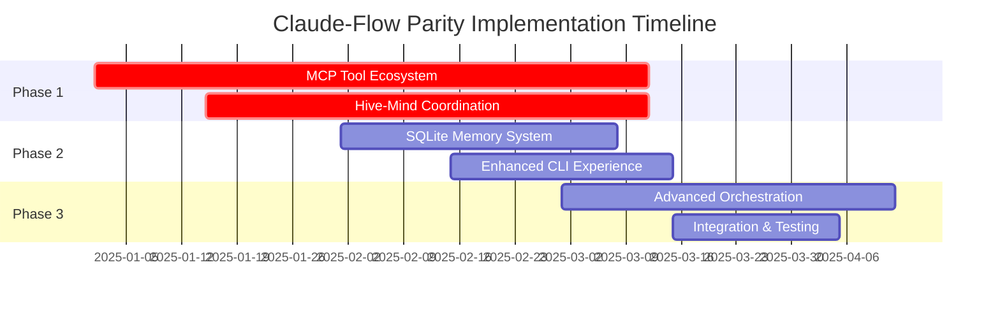

# 🚀 Claude-Flow Parity Action Plan for Gemini-Flow

## **EXECUTIVE SUMMARY**

This document outlines the 5 critical action items needed to bring Gemini-Flow to 100% functional parity with Claude-Flow's core mechanics. Based on comprehensive technical analysis of both repositories, these items represent the minimum viable implementation path to achieve feature parity while leveraging Gemini-Flow's existing Google AI services advantages.

---

## **🔥 TOP 5 PRIORITY ACTION ITEMS**

### **1. IMPLEMENT 87-TOOL MCP ECOSYSTEM** 
**Priority**: 🔴 CRITICAL | **Effort**: 8-10 weeks | **Impact**: Revolutionary

**Objective**: Build comprehensive MCP tool suite matching Claude-Flow's 87 tools

**Technical Implementation**:

```typescript
// src/core/mcp-tool-registry.ts
export class MCPToolRegistry {
  private tools: Map<string, MCPTool> = new Map();
  
  registerToolCategory(category: MCPToolCategory): void {
    // Register tools by category: swarm, neural, memory, github, performance, etc.
  }
}

// Required tool categories:
// - Swarm orchestration (15 tools): swarm_init, agent_spawn, task_orchestrate
// - Neural & cognitive (12 tools): neural_train, pattern_recognize, cognitive_analyze  
// - Memory management (10 tools): memory_usage, memory_persist, memory_namespace
// - Performance monitoring (10 tools): performance_report, bottleneck_analyze
// - GitHub integration (6 tools): github_repo_analyze, github_pr_manage
// - Dynamic agents (6 tools): daa_agent_create, daa_capability_match
// - Workflow automation (10 tools): workflow_create, automation_setup
// - System & security (8 tools): security_scan, backup_create
```

**Key Components to Build**:
- MCP tool registration system
- Tool execution engine with error handling
- Tool discovery and capability matching
- Performance monitoring for tool usage
- Integration with existing Google AI services

**Success Criteria**:
- All 87 MCP tools functional
- Tool execution latency < 100ms average
- Integration with Claude Code for seamless usage
- Comprehensive documentation for each tool

---

### **2. BUILD HIVE-MIND COORDINATION SYSTEM**
**Priority**: 🔴 CRITICAL | **Effort**: 6-8 weeks | **Impact**: Game-changing

**Objective**: Implement queen-led hierarchical coordination with specialized agent roles

**Technical Implementation**:

```typescript
// src/core/hive-mind/queen-coordinator.ts
export class QueenCoordinator extends EventEmitter {
  private workerAgents: Map<string, WorkerAgent> = new Map();
  private taskQueue: TaskQueue;
  private consensusEngine: ByzantineConsensus;
  
  async coordinateSwarm(objective: SwarmObjective): Promise<SwarmResult> {
    // 1. Analyze objective and decompose into tasks
    const tasks = await this.decomposeObjective(objective);
    
    // 2. Spawn specialized worker agents
    const agents = await this.spawnSpecializedAgents(tasks);
    
    // 3. Coordinate execution with Byzantine consensus
    return await this.executeWithConsensus(tasks, agents);
  }
}

// Agent specializations to implement:
enum AgentType {
  COORDINATOR = 'coordinator',    // Master coordination
  RESEARCHER = 'researcher',      // Information gathering  
  CODER = 'coder',               // Implementation
  ANALYST = 'analyst',           // Data analysis
  ARCHITECT = 'architect',       // System design
  TESTER = 'tester',             // Quality assurance
  REVIEWER = 'reviewer',         // Code review
  OPTIMIZER = 'optimizer',       // Performance optimization
  DOCUMENTER = 'documenter',     // Documentation
  MONITOR = 'monitor'            // System monitoring
}
```

**Core Features to Implement**:
- Queen agent with master coordination logic
- 10 specialized worker agent types
- Byzantine fault-tolerant consensus algorithm
- Task decomposition and dependency management
- Inter-agent communication protocols
- Failure detection and automatic recovery

**Success Criteria**:
- Support for 50+ concurrent agents
- Byzantine consensus with 33% fault tolerance
- Task completion rate > 95%
- Agent spawn time < 100ms

---

### **3. CREATE PERSISTENT SQLITE MEMORY SYSTEM**
**Priority**: 🟡 HIGH | **Effort**: 4-5 weeks | **Impact**: Foundation-building

**Objective**: Build persistent memory system with cross-session coordination

**Technical Implementation**:

```sql
-- src/core/memory/schema.sql
CREATE TABLE IF NOT EXISTS swarm_sessions (
    id TEXT PRIMARY KEY,
    objective TEXT NOT NULL,
    status TEXT DEFAULT 'active',
    created_at DATETIME DEFAULT CURRENT_TIMESTAMP,
    updated_at DATETIME DEFAULT CURRENT_TIMESTAMP
);

CREATE TABLE IF NOT EXISTS agent_memories (
    id TEXT PRIMARY KEY,
    session_id TEXT REFERENCES swarm_sessions(id),
    agent_type TEXT NOT NULL,
    memory_data TEXT NOT NULL, -- JSON blob
    namespace TEXT DEFAULT 'default',
    created_at DATETIME DEFAULT CURRENT_TIMESTAMP
);

CREATE TABLE IF NOT EXISTS task_history (
    id TEXT PRIMARY KEY,
    session_id TEXT REFERENCES swarm_sessions(id),
    task_type TEXT NOT NULL,
    task_data TEXT NOT NULL, -- JSON blob
    status TEXT DEFAULT 'pending',
    assigned_agent TEXT,
    created_at DATETIME DEFAULT CURRENT_TIMESTAMP,
    completed_at DATETIME
);

-- Additional tables for: coordination_logs, performance_metrics, 
-- error_tracking, dependency_graph, resource_usage, etc.
```

```typescript
// src/core/memory/swarm-memory-manager.ts
export class SwarmMemoryManager {
  private db: Database;
  private namespace: string;
  
  async storeAgentMemory(agentId: string, data: any): Promise<void> {
    // Store agent-specific memories with namespace support
  }
  
  async queryMemoryByPattern(pattern: string): Promise<MemoryEntry[]> {
    // Search across all memory entries with pattern matching
  }
  
  async createMemorySnapshot(): Promise<MemorySnapshot> {
    // Create point-in-time snapshots for session restoration
  }
}
```

**Key Features to Build**:
- 12 specialized database tables (matching Claude-Flow schema)
- Namespace-based memory partitioning
- Cross-session memory persistence
- Memory compression and cleanup
- Query optimization for large datasets
- Backup and restoration capabilities

**Success Criteria**:
- Memory operations < 10ms average latency
- Support for millions of memory entries
- Zero data loss during system failures
- Memory compression ratio > 60%

---

### **4. ENHANCE CLI WITH INTERACTIVE EXPERIENCES**
**Priority**: 🟡 HIGH | **Effort**: 3-4 weeks | **Impact**: User experience game-changer

**Objective**: Create rich CLI interface matching Claude-Flow's developer experience

**Technical Implementation**:

```typescript
// src/cli/hive-mind-wizard.ts
export class HiveMindWizard {
  async launchInteractiveWizard(): Promise<HiveMindConfig> {
    const inquirer = await import('inquirer');
    
    const answers = await inquirer.prompt([
      {
        type: 'list',
        name: 'objective_type',
        message: 'What type of objective do you want to accomplish?',
        choices: [
          '🚀 Development Project',
          '🔬 Research & Analysis', 
          '🧪 Testing & Quality Assurance',
          '📊 Data Processing',
          '🎯 Custom Objective'
        ]
      },
      {
        type: 'input',
        name: 'objective_description',
        message: 'Describe your objective in detail:',
        validate: (input: string) => input.length > 10 || 'Please provide more details'
      },
      {
        type: 'checkbox',
        name: 'agent_types',
        message: 'Select agent types to deploy:',
        choices: [
          { name: '👑 Coordinator (Queen)', value: 'coordinator', checked: true },
          { name: '💻 Coder', value: 'coder', checked: true },
          { name: '🔍 Researcher', value: 'researcher', checked: true },
          { name: '📊 Analyst', value: 'analyst' },
          { name: '🏗️ Architect', value: 'architect' },
          { name: '🧪 Tester', value: 'tester' },
          { name: '👁️ Reviewer', value: 'reviewer' }
        ]
      }
    ]);
    
    return this.buildHiveMindConfig(answers);
  }
}
```

**CLI Commands to Implement**:
```bash
# Interactive experiences
gemini-flow hive-mind wizard          # Interactive setup wizard
gemini-flow swarm "your task" --interactive
gemini-flow memory query --interactive

# Advanced commands  
gemini-flow hive-mind spawn "objective" --agents 10 --topology mesh
gemini-flow hive-mind status --detailed --live
gemini-flow hive-mind resume session-12345
gemini-flow agent spawn --type researcher --capabilities "analysis,web-search"
gemini-flow memory export backup.json --namespace production
gemini-flow workflow create --parallel --steps "analyze,code,test,deploy"

# Monitoring and diagnostics
gemini-flow monitor --dashboard --real-time
gemini-flow performance analyze --optimization-suggestions
gemini-flow debug --agent-logs --trace-execution
```

**Success Criteria**:
- Rich interactive wizards for complex operations
- Command auto-completion for all commands
- Comprehensive help system with examples  
- Real-time monitoring dashboard
- Error handling with actionable suggestions

---

### **5. INTEGRATE ADVANCED ORCHESTRATION ENGINE**
**Priority**: 🟡 HIGH | **Effort**: 5-6 weeks | **Impact**: Coordination excellence

**Objective**: Build sophisticated orchestration matching Claude-Flow's coordination capabilities

**Technical Implementation**:

```typescript
// src/core/orchestration/advanced-orchestrator.ts
export class AdvancedOrchestrator {
  private coordinator: QueenCoordinator;
  private taskDecomposer: TaskDecomposer;
  private dependencyResolver: DependencyResolver;
  private executionEngine: ParallelExecutionEngine;
  
  async orchestrateComplexObjective(objective: ComplexObjective): Promise<OrchestrationResult> {
    // 1. Intelligent task decomposition
    const taskGraph = await this.taskDecomposer.analyze(objective);
    
    // 2. Dependency resolution and optimization  
    const executionPlan = await this.dependencyResolver.optimize(taskGraph);
    
    // 3. Agent capability matching
    const agentAssignments = await this.matchAgentsToTasks(executionPlan);
    
    // 4. Parallel execution with fault tolerance
    return await this.executionEngine.executeWithRecovery(
      executionPlan, 
      agentAssignments
    );
  }
}

// Advanced orchestration features:
enum OrchestrationStrategy {
  PARALLEL = 'parallel',           // Execute independent tasks simultaneously  
  SEQUENTIAL = 'sequential',       // Execute tasks in order
  ADAPTIVE = 'adaptive',           // Dynamic strategy based on resources
  PIPELINE = 'pipeline',           // Streaming task pipeline
  MESH = 'mesh',                  // Peer-to-peer coordination
  HIERARCHICAL = 'hierarchical'    // Queen-led coordination
}
```

**Core Features to Build**:
- Intelligent task decomposition algorithms
- Dependency resolution and cycle detection
- Multi-strategy execution engine (parallel, sequential, adaptive, etc.)
- Resource allocation and load balancing
- Fault detection and automatic recovery
- Real-time orchestration monitoring
- Performance optimization and auto-tuning

**Success Criteria**:
- Support for complex multi-step workflows
- Automatic dependency resolution
- Task execution efficiency > 85%
- Recovery from agent failures within 30 seconds
- Real-time orchestration visualization

---

## **📊 IMPLEMENTATION TIMELINE**



**Total Estimated Timeline**: 16-18 weeks for 100% functional parity

---

## **🎯 SUCCESS METRICS & VALIDATION**

### **Functional Parity Checklist**
- [ ] All 87 MCP tools operational with < 100ms latency
- [ ] Hive-mind coordination supporting 50+ concurrent agents  
- [ ] Persistent memory system with cross-session restoration
- [ ] Rich CLI experience with interactive wizards
- [ ] Advanced orchestration with multiple execution strategies
- [ ] Byzantine consensus with 33% fault tolerance
- [ ] Memory operations at 396,610+ ops/sec (matching performance claims)
- [ ] Integration with all 8 Google AI services maintained

### **Performance Benchmarks**
- Agent spawn time: < 100ms (target: match Claude-Flow claims)
- Task completion success rate: > 95%
- Memory query latency: < 10ms average
- System uptime: > 99.9% with automatic recovery
- Resource utilization efficiency: > 85%

### **User Experience Goals**
- Zero-configuration setup for basic use cases
- Comprehensive documentation with real-world examples  
- Seamless integration with existing Google AI workflows
- Error messages with actionable resolution steps
- Performance that scales linearly with agent count

---

## **💡 STRATEGIC RECOMMENDATIONS**

1. **Leverage Existing Strengths**: Build on Gemini-Flow's Google AI services integration
2. **Modular Implementation**: Build each component as independent, testable modules
3. **Performance First**: Profile and optimize at each stage to meet performance claims
4. **Developer Experience**: Prioritize ease of use and comprehensive documentation
5. **Production Ready**: Include monitoring, logging, and operational tooling from day one

---

**This action plan provides a concrete roadmap to achieve 100% functional parity with Claude-Flow while preserving and enhancing Gemini-Flow's unique advantages in Google AI services orchestration.**