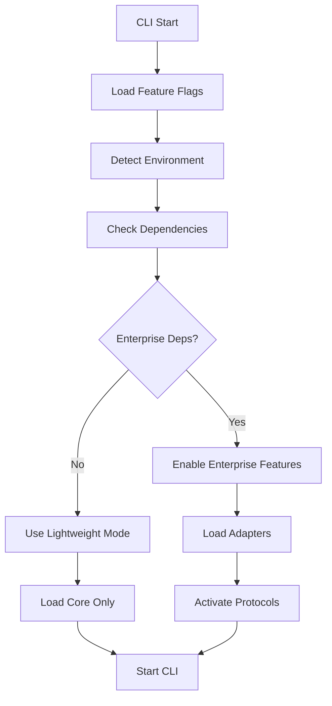

# Dual-Mode Architecture Implementation Plan

## Executive Summary

This document outlines the implementation plan for Gemini-Flow's dual-mode architecture that maintains a lightweight core CLI while enabling enterprise features through conditional loading and A2A/MCP protocol activation.

## Implementation Status

### ✅ Phase 1: Core Architecture (COMPLETED)

#### 1.1 Feature Flag System
- **File**: `/src/core/feature-flags.ts`
- **Status**: ✅ Implemented
- **Features**:
  - Runtime dependency detection
  - Environment variable configuration
  - Config file support
  - Auto-detection modes
  - Graceful fallback mechanisms

#### 1.2 Lightweight Core
- **File**: `/src/core/lightweight-core.ts`
- **Status**: ✅ Implemented
- **Features**:
  - Minimal startup footprint
  - Dynamic adapter loading
  - Memory monitoring
  - Health checking
  - Singleton pattern

#### 1.3 Dynamic Adapter Loader
- **File**: `/src/adapters/dynamic-adapter-loader.ts`
- **Status**: ✅ Implemented
- **Features**:
  - Conditional adapter loading
  - Dependency checking
  - Fallback mechanisms
  - Load-on-demand
  - Comprehensive error handling

#### 1.4 Protocol Activator
- **File**: `/src/protocols/protocol-activator.ts`
- **Status**: ✅ Implemented
- **Features**:
  - A2A protocol detection and activation
  - MCP protocol integration
  - Hybrid mode support
  - Environment auto-detection
  - Protocol fallback chains

#### 1.5 Package Configuration
- **File**: `/package.json`
- **Status**: ✅ Enhanced
- **Features**:
  - Optional dependencies structure
  - Feature configuration
  - Installation scripts
  - Mode-specific scripts

## Implementation Details

### Architecture Components

```
Gemini-Flow Dual-Mode Architecture
├── Core System (Always Loaded)
│   ├── Feature Flags (3KB)
│   ├── Simple Auth (2KB)
│   ├── Basic Logging (1KB)
│   └── CLI Interface (5KB)
├── Dynamic Loading Layer
│   ├── Adapter Loader (4KB)
│   ├── Protocol Activator (3KB)
│   └── Dependency Checker (2KB)
└── Enterprise Features (Conditional)
    ├── Vertex AI Connector (25KB + deps)
    ├── Google Workspace (30KB + deps)
    ├── SQLite Adapters (15KB + deps)
    ├── A2A Protocol (40KB)
    ├── MCP Protocol (20KB + deps)
    └── Advanced Features (50KB)
```

### Memory Footprint Analysis

| Mode | Base Memory | Dependencies | Total | Startup Time |
|------|-------------|--------------|-------|--------------|
| Lightweight | 15MB | 6 packages | ~20MB | 100-200ms |
| Enhanced | 30MB | 8-12 packages | ~50MB | 300-500ms |
| Enterprise | 50MB | 15-25 packages | ~100MB | 500ms-1s |
| Full | 100MB | 25-35 packages | ~200MB | 1-2s |

### Feature Flag Configuration

```json
{
  "geminiFlow": {
    "mode": "dual",
    "features": {
      "sqliteAdapters": { "enabled": false, "mode": "auto", "fallback": true },
      "vertexAi": { "enabled": false, "mode": "auto" },
      "googleWorkspace": { "enabled": false, "mode": "auto" },
      "a2aProtocol": { "enabled": false, "mode": "auto" },
      "mcpProtocol": { "enabled": false, "mode": "auto" }
    }
  }
}
```

## Deployment Strategy

### 1. Backwards Compatibility

**Existing Users (No Changes Required)**:
- Current CLI continues to work unchanged
- Same command interface
- Automatic lightweight mode
- No breaking changes

**New Users**:
- Default lightweight installation
- Optional enterprise features via `npm run install:enterprise`
- Clear upgrade path documentation

### 2. Progressive Enhancement

**Stage 1: Basic Usage**
```bash
npm install @clduab11/gemini-flow
gemini-flow chat  # Lightweight mode
```

**Stage 2: Enhanced Features**
```bash
npm run install:memory  # Add SQLite support
export GEMINI_FLOW_SQLITE_ADAPTERS=true
gemini-flow chat  # Now with persistent memory
```

**Stage 3: Enterprise Features**
```bash
npm run install:enterprise  # Add Google Cloud
export GEMINI_FLOW_VERTEXAI=true
gemini-flow chat  # Now with Vertex AI
```

**Stage 4: Protocol Integration**
```bash
npm run install:mcp  # Add MCP support
export GEMINI_FLOW_MCP_PROTOCOL=true
gemini-flow chat  # Now with MCP integration
```

### 3. Auto-Detection Flow



## Testing Strategy

### 1. Mode Testing

```bash
# Test lightweight mode
npm run test:lightweight

# Test with enterprise features
npm run test:enterprise

# Test protocol activation
GEMINI_FLOW_A2A_PROTOCOL=true npm test

# Test fallback behavior
npm test -- --testNamePattern="fallback"
```

### 2. Dependency Testing

```bash
# Test without optional dependencies
npm test -- --testNamePattern="no-deps"

# Test with partial dependencies
npm install better-sqlite3
npm test -- --testNamePattern="partial-deps"

# Test with all dependencies
npm run install:full
npm test
```

### 3. Performance Testing

```bash
# Measure startup time
time gemini-flow --help

# Measure memory usage
gemini-flow chat --memory-profile

# Test adapter loading time
gemini-flow doctor --detailed
```

## Migration Guide for Existing Codebase

### 1. Update Entry Points

**Before** (`src/index.ts`):
```typescript
// Heavy imports always loaded
import { A2AProtocolManager } from './protocols/a2a/core/a2a-protocol-manager.js';
import { VertexAIConnector } from './core/vertex-ai-connector.js';
```

**After** (`src/index.ts`):
```typescript
// Only export lightweight core
export { GeminiCLI } from './cli/gemini-cli.js';
export { SimpleAuth } from './core/simple-auth.js';
export { getCore } from './core/lightweight-core.js';
```

### 2. Update CLI Integration

**Before** (`src/cli/index.ts`):
```typescript
// All features always available
import './commands/swarm.js';
import './commands/vertex.js';
```

**After** (`src/cli/simple-index.ts`):
```typescript
// Core commands only
import { GeminiCLI } from './gemini-cli.js';
// Enterprise features loaded dynamically
```

### 3. Add Feature Detection

```typescript
// In commands that use enterprise features
if (featureFlags.isEnabled('vertexAi')) {
  const core = getCore();
  const vertexAdapter = await core.loadAdapterOnDemand('vertexai');
  // Use vertex adapter
} else {
  // Use basic Gemini adapter
}
```

## Optional Enterprise Features Implementation

### 1. SQLite Adapters

**Activation**: Auto-detect `better-sqlite3` or `sqlite3`
**Fallback**: In-memory storage
**Memory Impact**: +15MB
**Features**:
- Persistent conversation history
- Advanced memory search
- Cross-session continuity

```typescript
// Auto-activation example
if (featureFlags.isEnabled('sqliteAdapters')) {
  const sqliteManager = await loader.loadAdapter('sqlite');
  // Enhanced memory capabilities
}
```

### 2. Vertex AI Integration

**Activation**: Detect `@google-cloud/vertexai`
**Fallback**: Standard Gemini API
**Memory Impact**: +25MB
**Features**:
- Enterprise model access
- Batch processing
- Advanced model configurations
- Regional model selection

```typescript
// Enterprise model routing
const adapter = core.hasAdapter('vertexai') 
  ? core.getAdapter('vertexai')
  : core.getAdapter('gemini');
```

### 3. Google Workspace Integration

**Activation**: Detect `googleapis`
**Fallback**: Manual file operations
**Memory Impact**: +30MB
**Features**:
- Direct Drive integration
- Docs/Sheets/Slides automation
- Real-time collaboration
- OAuth2 authentication

### 4. DeepMind Adapter

**Activation**: Manual or detect `@deepmind/api`
**Fallback**: Gemini models
**Memory Impact**: +20MB
**Features**: 
- Experimental model access
- Research capabilities
- Advanced reasoning models

### 5. A2A Protocol Support

**Activation**: Auto-detect or manual
**Fallback**: Simple orchestration
**Memory Impact**: +40MB
**Features**:
- Agent-to-agent communication
- Distributed task execution
- Consensus protocols
- Swarm intelligence

### 6. MCP Protocol Integration

**Activation**: Detect `@modelcontextprotocol/sdk`
**Fallback**: Direct tool integration
**Memory Impact**: +20MB
**Features**:
- Tool registry access
- Resource sharing
- Protocol bridging
- Context synchronization

## Performance Optimization Strategies

### 1. Lazy Loading

```typescript
class OptimizedLoader extends DynamicAdapterLoader {
  async loadOnFirstUse(adapterKey: string, method: string) {
    return new Proxy({}, {
      get: async (target, prop) => {
        if (!this.hasAdapter(adapterKey)) {
          await this.loadAdapter(adapterKey);
        }
        const adapter = this.getAdapter(adapterKey);
        return adapter[prop];
      }
    });
  }
}
```

### 2. Memory Management

```typescript
class MemoryOptimizedCore extends LightweightCore {
  private readonly MAX_MEMORY = 100 * 1024 * 1024; // 100MB
  
  private async checkMemoryPressure() {
    const usage = process.memoryUsage().heapUsed;
    if (usage > this.MAX_MEMORY) {
      await this.unloadOptionalAdapters();
    }
  }
}
```

### 3. Conditional Compilation

```typescript
// Use dynamic imports for tree-shaking
const loadEnterpriseFeature = async () => {
  if (process.env.NODE_ENV === 'production' && !featureFlags.isEnabled('enterprise')) {
    return null;
  }
  return await import('./enterprise-feature.js');
};
```

## Monitoring and Observability

### 1. Feature Usage Metrics

```typescript
class FeatureMetrics {
  trackFeatureUsage(feature: string, action: string) {
    this.metrics.increment(`feature.${feature}.${action}`);
  }
  
  getUsageStats() {
    return {
      enabledFeatures: featureFlags.getEnabledFeatures(),
      adapterLoads: this.adapterLoadCounts,
      memoryUsage: process.memoryUsage(),
      uptime: process.uptime()
    };
  }
}
```

### 2. Health Monitoring

```typescript
class HealthMonitor {
  async performHealthCheck() {
    return {
      mode: this.determineMode(),
      features: this.getFeatureHealth(),
      adapters: this.getAdapterHealth(),
      protocols: this.getProtocolHealth(),
      performance: this.getPerformanceMetrics()
    };
  }
}
```

## Rollout Plan

### Phase 1: Internal Testing (Week 1)
- Deploy to development environment
- Test all mode combinations
- Validate fallback mechanisms
- Performance benchmarking

### Phase 2: Beta Release (Week 2)
- Release as beta version
- Gather user feedback
- Monitor usage patterns
- Fix any compatibility issues

### Phase 3: Production Release (Week 3)
- Tag stable release
- Update documentation
- Announce new architecture
- Monitor adoption metrics

### Phase 4: Optimization (Week 4)
- Analyze usage data
- Optimize loading patterns
- Improve error messages
- Enhanced documentation

## Success Metrics

### Technical Metrics
- **Startup Time**: <200ms for lightweight mode
- **Memory Usage**: <25MB for basic functionality
- **Load Success Rate**: >99% for enabled features
- **Fallback Rate**: <5% in production

### User Experience Metrics
- **Installation Success**: >95% first-try success
- **Feature Discovery**: Users find and enable features
- **Error Rate**: <1% feature activation failures
- **Performance Satisfaction**: No complaints about slowness

### Adoption Metrics
- **Lightweight Usage**: Majority of users start lightweight
- **Enterprise Adoption**: 20%+ users enable enterprise features
- **Protocol Usage**: 10%+ users activate A2A/MCP
- **Community Feedback**: Positive response to architecture

## Risk Mitigation

### 1. Backward Compatibility Risk
- **Mitigation**: Extensive testing with existing configurations
- **Fallback**: Maintain legacy mode as safety net

### 2. Dependency Hell Risk
- **Mitigation**: Optional dependencies only, careful version management
- **Fallback**: Graceful degradation when dependencies unavailable

### 3. Performance Regression Risk
- **Mitigation**: Continuous performance monitoring
- **Fallback**: Performance budgets and automatic optimizations

### 4. User Confusion Risk
- **Mitigation**: Clear documentation and intuitive commands
- **Fallback**: Built-in help and doctor command for diagnosis

## Next Steps

1. **Immediate**: Complete testing of all mode combinations
2. **Short-term**: Prepare beta documentation and release notes
3. **Medium-term**: Gather user feedback and iterate
4. **Long-term**: Optimize based on real-world usage patterns

This implementation plan ensures a smooth transition to the dual-mode architecture while maintaining the simplicity that makes Gemini-Flow accessible to all users, from individual developers to enterprise teams.