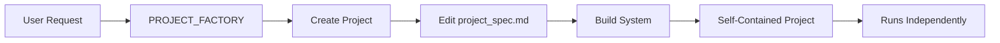

# 🏭 PROJECT FACTORY - Meta-System Generator

## Koncept

PROJECT_FACTORY är ett **meta-system** som skapar nya, självständiga projekt genom att använda ALL intelligens från hela systemet:

- **THE_ORCHESTRATOR** - Multi-agent orchestration
- **BACOWR Platform** - Backlink automation
- **SEO Intelligence** - Analysis and optimization
- **Visual Flow System** - Workflow design
- **CLI-aware execution** - Direct processing

## Hur det fungerar

```
1. Skapa nytt projekt → PROJECT_FACTORY/projects/[ditt_projekt]/
2. Redigera project_spec.md → Definiera vad du vill bygga
3. Kör build.py → Genererar självständigt system
4. Projektet blir oberoende → Kan köras var som helst
```

## 🚀 Snabbstart

### Skapa nytt projekt:
```cmd
cd PROJECT_FACTORY
new_project.bat
```

### Efter skapandet:
```cmd
cd projects/[ditt_projekt_timestamp]/
# Redigera project_spec.md
python build.py
python run.py
```

## 📁 Struktur

```
PROJECT_FACTORY/
├── project_generator.py     # Skapar nya projekt
├── build.py                 # Bygger självständiga system
├── new_project.bat         # Quick launcher
├── templates/              # Project templates
├── generators/             # Code generators
└── projects/              # Dina skapade projekt
    └── [projekt_namn]_[timestamp]/
        ├── project_spec.md         # Din specifikation
        ├── src/                    # Generated code
        ├── orchestration/          # Orchestrator
        ├── agents/                 # Agent definitions
        ├── workflows/              # Workflows
        ├── .intelligence/          # System connections
        └── run.py                  # Launcher
```

## 📝 project_spec.md

Detta är hjärtat i varje projekt. Här definierar du:

### System Intelligence
```markdown
- [ ] THE_ORCHESTRATOR - Multi-agent orchestration
- [ ] BACOWR - Backlink campaigns
- [ ] SEO Intelligence - SEO analysis
- [ ] Visual Flow - Drag-drop workflows
- [ ] Custom Agents - Your own agents
```

### Orchestration Pattern
```markdown
- [ ] Hierarchical - Top-down control
- [ ] Evolutionary - Genetic algorithms
- [ ] Swarm - Collective intelligence
- [ ] Temporal - Predictive
- [ ] Unified - All patterns
```

### Build Configuration
```yaml
build:
  type: "autonomous"
  intelligence:
    orchestrator: true
    bacowr: true
    seo: true
  deployment:
    target: "local"
    auto_start: true
```

## 🧠 Intelligence Inheritance

Varje projekt får:

1. **Full Intelligence** - All kunskap från parent system
2. **Independence** - Fungerar helt självständigt
3. **No Dependencies** - Behöver inte parent system för att köra
4. **Self-Contained** - Allt inkluderat i projektet

## 🔄 Workflow



## 💡 Exempel på projekt du kan skapa

### SEO Analysis System
```yaml
build:
  intelligence:
    seo: true
    orchestrator: true
  features:
    - SERP analysis
    - Keyword research
    - Content optimization
```

### Backlink Automation
```yaml
build:
  intelligence:
    bacowr: true
    orchestrator: true
  features:
    - Campaign management
    - Quality control
    - Indexation monitoring
```

### Full Stack AI System
```yaml
build:
  intelligence:
    orchestrator: true
    bacowr: true
    seo: true
    visual: true
  pattern: unified
```

## 🎯 Fördelar

1. **Återanvändbarhet** - Samma factory för alla projekt
2. **Isolering** - Varje projekt är helt isolerat
3. **Självständighet** - Projekt fungerar utan parent system
4. **Full Intelligence** - All systemkunskap inkluderad
5. **Skalbarhet** - Skapa obegränsat antal projekt

## 🔧 Avancerad användning

### Custom Agents
Lägg till egna agenter i project_spec.md:
```yaml
custom_agents:
  - name: "DataAnalyzer"
    capabilities: ["analyze", "report"]
  - name: "ContentWriter"
    capabilities: ["write", "optimize"]
```

### Workflow Automation
Definiera automatiska workflows:
```yaml
workflows:
  daily_analysis:
    trigger: "schedule"
    time: "09:00"
    steps:
      - serp_analysis
      - competitor_check
      - report_generation
```

## 🚫 Viktigt att förstå

- **Parent system förblir neutralt** - Påverkas inte av projekt
- **Projekt är isolerade** - Kan inte påverka varandra
- **Full autonomi** - Projekt kan flyttas var som helst
- **Ingen runtime dependency** - Behöver inte parent för att köra

## 🎉 Resultat

Efter `python build.py` får du:

✅ Ett komplett, självständigt system
✅ All intelligence från parent system
✅ Ingen dependency på original system
✅ Kan köras var som helst
✅ Helt autonomt

---

**PROJECT_FACTORY** - Where systems create systems! 🏭✨