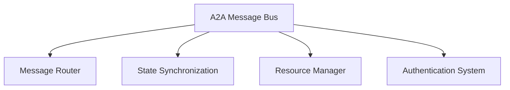

# A2A Implementation Dependency Graph & Critical Path Analysis

## Dependency Graph Overview

### Level 0: Foundation Layer (No Dependencies)
**Duration: 1-2 days**

#### Core Infrastructure Components (Must be implemented first)


**No External Dependencies:**
- Message Bus Infrastructure
- Basic Agent Registry
- Communication Protocol Base
- Error Handling Framework
- Security Authentication

### Level 1: Core Swarm Infrastructure (Depends on Level 0)
**Duration: 1-2 days**

#### Swarm Management Tools (16 tools)
```
Foundation Layer → Swarm Management Tools
```

**Direct Dependencies:**
- `mcp__claude-flow__swarm_init` ← Message Bus, Agent Registry
- `mcp__claude-flow__swarm_status` ← Message Bus, State Sync
- `mcp__claude-flow__swarm_monitor` ← Message Bus, Resource Manager
- `mcp__ruv-swarm__swarm_init` ← Message Bus, Agent Registry
- `mcp__claude-flow__agent_spawn` ← Swarm Init, Resource Manager
- `mcp__claude-flow__agent_list` ← Agent Registry, State Sync
- `mcp__claude-flow__topology_optimize` ← Swarm Status, Agent Metrics

**Critical Path Impact:** All subsequent levels depend on this working

### Level 2: Task Orchestration (Depends on Level 0-1)
**Duration: 2-3 days**

#### Task Management Tools (12 tools)
```
Swarm Infrastructure → Task Orchestration
```

**Dependencies:**
- `mcp__claude-flow__task_orchestrate` ← Agent Spawn, Message Router
- `mcp__claude-flow__task_status` ← Task Orchestrate, State Sync
- `mcp__claude-flow__task_results` ← Task Status, Message Bus
- `mcp__claude-flow__parallel_execute` ← Task Orchestrate, Resource Manager
- `mcp__claude-flow__load_balance` ← Agent List, Resource Manager
- `mcp__claude-flow__coordination_sync` ← Swarm Status, State Sync

**Parallel Implementation Opportunity:** Can be developed alongside Memory Management

### Level 2: Memory & State Management (Depends on Level 0-1)
**Duration: 2-3 days**

#### Memory Tools (14 tools)
```
Swarm Infrastructure → Memory Management
```

**Dependencies:**
- `mcp__claude-flow__memory_usage` ← State Sync, Agent Registry
- `mcp__claude-flow__memory_sync` ← State Sync, Message Bus
- `mcp__claude-flow__state_snapshot` ← Memory Usage, Coordination Sync
- `mcp__claude-flow__context_restore` ← State Snapshot, Message Router
- `mcp__claude-flow__cache_manage` ← Memory Usage, Resource Manager

**Parallel Implementation Opportunity:** Can be developed alongside Task Orchestration

### Level 3: Advanced Coordination (Depends on Level 0-2)
**Duration: 2-3 days**

#### DAA Tools (15 tools)
```
Task Orchestration + Memory Management → DAA Tools
```

**Dependencies:**
- `mcp__ruv-swarm__daa_init` ← Memory Sync, Task Orchestrate
- `mcp__claude-flow__daa_consensus` ← DAA Init, Coordination Sync
- `mcp__claude-flow__daa_communication` ← Message Bus, Authentication
- `mcp__ruv-swarm__daa_knowledge_share` ← DAA Communication, State Sync
- `mcp__claude-flow__daa_fault_tolerance` ← DAA Consensus, Load Balance

**Critical Path Impact:** Required for advanced neural and workflow features

### Level 4: Specialized Operations (Depends on Level 0-3)
**Duration: 2-3 days (Parallelizable)**

#### Neural & AI Tools (16 tools)
```
DAA Tools + Memory Management → Neural Operations
```

**Dependencies:**
- `mcp__claude-flow__neural_train` ← DAA Knowledge Share, Memory Sync
- `mcp__claude-flow__neural_predict` ← Neural Train, Load Balance
- `mcp__claude-flow__ensemble_create` ← Neural Predict, DAA Consensus
- `mcp__claude-flow__transfer_learn` ← Neural Train, DAA Communication

#### Performance & Analytics (12 tools)
```
Task Orchestration + Agent Management → Performance Tools
```

**Dependencies:**
- `mcp__claude-flow__performance_report` ← Agent Metrics, Task Status
- `mcp__claude-flow__bottleneck_analyze` ← Performance Report, Load Balance
- `mcp__claude-flow__metrics_collect` ← Agent List, Memory Usage

#### GitHub Integration (8 tools)
```
Task Orchestration → GitHub Tools
```

**Dependencies:**
- `mcp__claude-flow__github_pr_manage` ← Task Orchestrate, Authentication
- `mcp__claude-flow__github_code_review` ← GitHub PR Manage, Neural Predict
- `mcp__claude-flow__github_sync_coord` ← Coordination Sync, Parallel Execute

#### Workflow & Automation (6 tools)
```
Task Orchestration + DAA → Workflow Tools
```

**Dependencies:**
- `mcp__claude-flow__workflow_execute` ← Task Orchestrate, DAA Communication
- `mcp__claude-flow__pipeline_create` ← Workflow Execute, State Snapshot
- `mcp__claude-flow__sparc_mode` ← Pipeline Create, Neural Operations

### Level 5: System Integration (Depends on All Previous)
**Duration: 1-2 days**

#### System & Infrastructure (11 tools)
```
All Previous Levels → System Tools
```

**Dependencies:**
- `mcp__claude-flow__backup_create` ← Memory Backup, State Snapshot
- `mcp__claude-flow__diagnostic_run` ← Health Check, Performance Report
- `mcp__claude-flow__security_scan` ← Authentication, System Status

## Critical Path Analysis

### Primary Critical Path (Longest Duration: 8-10 days)
```
Day 1-2: Foundation Layer (A2A Bus, Message Router, State Sync)
    ↓
Day 2-3: Swarm Infrastructure (Swarm Init, Agent Spawn, Agent Management)
    ↓
Day 4-5: Task Orchestration (Task Orchestrate, Load Balance, Coordination)
    ↓
Day 6-7: DAA Implementation (Consensus, Communication, Knowledge Share)
    ↓
Day 8-9: Neural Operations (Training, Prediction, Ensemble)
    ↓
Day 9-10: System Integration & Testing
```

### Secondary Critical Paths

#### Memory Management Path (6-7 days)
```
Foundation → Swarm → Memory Sync → State Management → Neural Training
```

#### Performance Monitoring Path (5-6 days)
```
Foundation → Swarm → Agent Metrics → Performance Reports → Analytics
```

#### GitHub Integration Path (4-5 days)
```
Foundation → Swarm → Task Orchestration → GitHub Tools
```

## Parallelization Strategy

### Parallel Work Stream 1: Core Infrastructure
**Team Size:** 2-3 developers
**Duration:** Days 1-3
**Components:**
- A2A Message Bus Implementation
- State Synchronization System
- Resource Management
- Basic Swarm Operations

### Parallel Work Stream 2: Task & Memory Systems
**Team Size:** 2-3 developers
**Duration:** Days 3-6
**Components:**
- Task Orchestration A2A Support
- Memory Management A2A Support
- Load Balancing
- Coordination Mechanisms

### Parallel Work Stream 3: Advanced Features
**Team Size:** 2-3 developers
**Duration:** Days 5-8
**Components:**
- DAA Implementation
- Neural Operations A2A Support
- Performance Analytics
- Workflow Automation

### Parallel Work Stream 4: Integration & Applications
**Team Size:** 1-2 developers
**Duration:** Days 6-9
**Components:**
- GitHub Integration
- System Tools
- Security Features
- Testing & Validation

## Risk Analysis & Mitigation

### High-Risk Dependencies

#### 1. A2A Message Bus (Risk: High, Impact: Critical)
**Risk:** Foundation component failure blocks everything
**Mitigation:** 
- Implement robust message bus first
- Create comprehensive unit tests
- Build fallback mechanisms
- Allocate best developers to this component

#### 2. State Synchronization (Risk: Medium, Impact: High)
**Risk:** Distributed state conflicts cause data corruption
**Mitigation:**
- Implement conflict resolution early
- Use proven consistency models
- Build extensive testing scenarios
- Create state validation mechanisms

#### 3. DAA Consensus (Risk: Medium, Impact: Medium)
**Risk:** Consensus algorithms may be complex to implement
**Mitigation:**
- Use established consensus protocols (Raft, PBFT)
- Implement simple majority voting first
- Build comprehensive testing
- Create fallback to centralized coordination

### Resource Allocation Risks

#### 1. GPU Resource Contention
**Risk:** Neural operations competing for limited GPU resources
**Mitigation:**
- Implement resource queuing
- Create GPU time-slicing
- Build resource priority system
- Monitor resource utilization

#### 2. Memory Synchronization Overhead
**Risk:** State sync causing performance bottlenecks
**Mitigation:**
- Implement efficient delta synchronization
- Use memory-mapped files for large states
- Create caching mechanisms
- Optimize serialization

## Success Metrics & Milestones

### Level 0 Success Criteria:
- [ ] Message bus handles 1000+ messages/sec
- [ ] State synchronization latency < 10ms
- [ ] Resource allocation success rate > 99%
- [ ] Authentication validates in < 5ms

### Level 1 Success Criteria:
- [ ] Swarm initialization completes in < 30 seconds
- [ ] Agent spawning success rate > 98%
- [ ] Agent discovery works across all topology types
- [ ] Health monitoring detects failures within 5 seconds

### Level 2 Success Criteria:
- [ ] Task orchestration distributes work optimally
- [ ] Parallel execution coordinates without conflicts
- [ ] Memory synchronization maintains consistency
- [ ] Load balancing improves resource utilization by 25%

### Level 3 Success Criteria:
- [ ] DAA consensus reaches agreement within 10 seconds
- [ ] Knowledge sharing propagates within 5 seconds
- [ ] Fault tolerance recovers from failures automatically
- [ ] Inter-agent communication is secure and reliable

### Level 4 Success Criteria:
- [ ] Neural training coordinates across multiple agents
- [ ] Performance monitoring provides real-time insights
- [ ] GitHub integration automates development workflows
- [ ] Workflow automation reduces manual tasks by 80%

### Level 5 Success Criteria:
- [ ] System integration passes all end-to-end tests
- [ ] Security scanning detects vulnerabilities
- [ ] Backup and recovery works reliably
- [ ] All 104 MCP tools support A2A interactions

## Implementation Timeline Summary

**Total Duration:** 8-10 days with optimal parallelization
**Critical Path:** Foundation → Swarm → Tasks → DAA → Neural → Integration
**Parallel Streams:** 4 concurrent development streams
**Resource Requirements:** 6-10 developers
**Risk Level:** Medium (well-defined dependencies, proven technologies)

The dependency graph shows that while the implementation is complex, the dependencies are well-structured and allow for significant parallelization opportunities. The critical path is clearly defined, and risk mitigation strategies are in place for the highest-impact components.