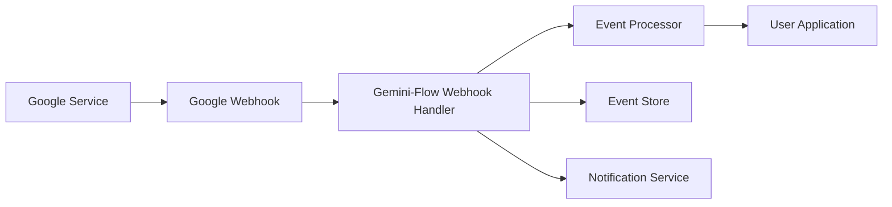

# Webhook Events Documentation

## Overview

Gemini-Flow provides comprehensive webhook support for real-time notifications from Google services. This enables reactive programming patterns, automated workflows, and immediate synchronization across systems.

## Webhook Architecture

### Event Flow


### Webhook Configuration
```typescript
interface WebhookConfig {
  endpoint: string;
  events: string[];
  secret: string;
  retryPolicy: RetryPolicy;
  filterCriteria?: FilterCriteria;
}

interface RetryPolicy {
  maxRetries: number;
  backoffStrategy: 'exponential' | 'linear' | 'fixed';
  initialDelay: number;
  maxDelay: number;
}
```

## Google Workspace Webhooks

### Drive API Events

#### File Creation
```json
{
  "eventType": "file.created",
  "eventId": "evt_1234567890abcdef",
  "timestamp": "2025-01-15T10:30:00.000Z",
  "source": "drive.googleapis.com",
  "data": {
    "fileId": "1BxiMVs0XRA5nFMdKvBdBZjgmUUqptlbs74OgvE2upms",
    "name": "Project Document.docx",
    "mimeType": "application/vnd.openxmlformats-officedocument.wordprocessingml.document",
    "size": 2048576,
    "parents": ["1BxiMVs0XRA5nFMdKvBdBZjgmUUqptlbs74OgvE2upms"],
    "createdBy": {
      "email": "user@example.com",
      "name": "John Doe"
    },
    "permissions": {
      "canEdit": true,
      "canShare": true,
      "canComment": true
    },
    "location": {
      "folderId": "1BxiMVs0XRA5nFMdKvBdBZjgmUUqptlbs74OgvE2upms",
      "folderPath": "/Projects/Q1 2025/"
    }
  },
  "changes": {
    "added": ["file"]
  }
}
```

**Handler Implementation**:
```typescript
class DriveFileCreatedHandler implements WebhookHandler {
  async handle(event: DriveFileCreatedEvent): Promise<void> {
    const { fileId, name, mimeType, createdBy } = event.data;

    // Auto-categorization based on file type and content
    const category = await this.categorizeFile(mimeType, name);
    
    // Update search index
    await this.searchIndex.addDocument({
      id: fileId,
      title: name,
      type: mimeType,
      author: createdBy.email,
      category,
      createdAt: event.timestamp
    });

    // Trigger automated workflows
    await this.triggerWorkflows('file.created', {
      fileId,
      category,
      author: createdBy.email
    });

    // Send notifications to relevant users
    await this.notificationService.send({
      type: 'file_created',
      recipients: await this.getInterestedUsers(event.data.location.folderId),
      data: { fileName: name, author: createdBy.name }
    });
  }
}
```

#### File Modification
```json
{
  "eventType": "file.modified",
  "eventId": "evt_1234567890abcdef",
  "timestamp": "2025-01-15T10:35:00.000Z",
  "source": "drive.googleapis.com",
  "data": {
    "fileId": "1BxiMVs0XRA5nFMdKvBdBZjgmUUqptlbs74OgvE2upms",
    "name": "Project Document.docx",
    "modifiedBy": {
      "email": "collaborator@example.com",
      "name": "Jane Smith"
    },
    "revision": {
      "id": "125",
      "timestamp": "2025-01-15T10:35:00.000Z",
      "changes": {
        "contentModified": true,
        "nameChanged": false,
        "permissionsChanged": false
      }
    },
    "size": 2051072,
    "previousSize": 2048576
  },
  "changes": {
    "modified": ["content", "size", "modifiedTime"]
  }
}
```

#### File Deletion
```json
{
  "eventType": "file.deleted",
  "eventId": "evt_1234567890abcdef",
  "timestamp": "2025-01-15T10:40:00.000Z",
  "source": "drive.googleapis.com",
  "data": {
    "fileId": "1BxiMVs0XRA5nFMdKvBdBZjgmUUqptlbs74OgvE2upms",
    "name": "Temporary Notes.txt",
    "deletedBy": {
      "email": "user@example.com",
      "name": "John Doe"
    },
    "deletionType": "trash", // or "permanent"
    "restorePossible": true,
    "retentionPeriod": "30d"
  },
  "changes": {
    "removed": ["file"]
  }
}
```

#### Permission Changes
```json
{
  "eventType": "file.permissions.changed",
  "eventId": "evt_1234567890abcdef",
  "timestamp": "2025-01-15T10:45:00.000Z",
  "source": "drive.googleapis.com",
  "data": {
    "fileId": "1BxiMVs0XRA5nFMdKvBdBZjgmUUqptlbs74OgvE2upms",
    "name": "Confidential Report.pdf",
    "changedBy": {
      "email": "admin@example.com",
      "name": "Admin User"
    },
    "permissionChanges": [
      {
        "action": "added",
        "permission": {
          "id": "perm_123",
          "type": "user",
          "role": "reader",
          "emailAddress": "newuser@example.com"
        }
      },
      {
        "action": "modified",
        "permission": {
          "id": "perm_456",
          "type": "user", 
          "role": "writer", // changed from "reader"
          "emailAddress": "existing@example.com"
        },
        "previousRole": "reader"
      }
    ]
  },
  "changes": {
    "modified": ["permissions"]
  }
}
```

### Docs API Events

#### Document Content Changed
```json
{
  "eventType": "document.content.changed",
  "eventId": "evt_1234567890abcdef",
  "timestamp": "2025-01-15T10:30:00.000Z",
  "source": "docs.googleapis.com",
  "data": {
    "documentId": "1BxiMVs0XRA5nFMdKvBdBZjgmUUqptlbs74OgvE2upms",
    "title": "Meeting Notes - Q1 Planning",
    "modifiedBy": {
      "email": "user@example.com",
      "name": "John Doe"
    },
    "revision": {
      "id": "89",
      "createTime": "2025-01-15T10:30:00.000Z"
    },
    "changes": {
      "insertions": [
        {
          "index": 150,
          "text": "Action item: Review budget proposal by Friday"
        }
      ],
      "deletions": [
        {
          "startIndex": 100,
          "endIndex": 120,
          "deletedText": "Preliminary notes:"
        }
      ],
      "formatting": [
        {
          "startIndex": 150,
          "endIndex": 200,
          "style": "bold"
        }
      ]
    },
    "wordCount": 1250,
    "previousWordCount": 1230
  }
}
```

#### Comments Added
```json
{
  "eventType": "document.comment.added",
  "eventId": "evt_1234567890abcdef", 
  "timestamp": "2025-01-15T10:35:00.000Z",
  "source": "docs.googleapis.com",
  "data": {
    "documentId": "1BxiMVs0XRA5nFMdKvBdBZjgmUUqptlbs74OgvE2upms",
    "commentId": "comment_123",
    "author": {
      "email": "reviewer@example.com",
      "name": "Jane Smith"
    },
    "content": "This section needs more detail about the implementation timeline",
    "anchor": {
      "startIndex": 500,
      "endIndex": 650,
      "selectedText": "The project will be completed in phases"
    },
    "replies": [],
    "resolved": false,
    "createdTime": "2025-01-15T10:35:00.000Z"
  }
}
```

### Sheets API Events

#### Cell Value Changed
```json
{
  "eventType": "spreadsheet.cell.changed",
  "eventId": "evt_1234567890abcdef",
  "timestamp": "2025-01-15T10:30:00.000Z",
  "source": "sheets.googleapis.com",
  "data": {
    "spreadsheetId": "1BxiMVs0XRA5nFMdKvBdBZjgmUUqptlbs74OgvE2upms",
    "title": "Sales Data Q1 2025",
    "modifiedBy": {
      "email": "analyst@example.com",
      "name": "Data Analyst"
    },
    "changes": [
      {
        "sheetId": 0,
        "sheetName": "January",
        "range": "B15",
        "previousValue": "45000",
        "newValue": "47500",
        "valueType": "NUMBER"
      },
      {
        "sheetId": 0,
        "sheetName": "January", 
        "range": "C15",
        "previousValue": "=B15*0.15",
        "newValue": "=B15*0.18",
        "valueType": "FORMULA"
      }
    ],
    "affectedFormulas": [
      {
        "range": "D15:D20",
        "description": "Total calculations updated"
      }
    ]
  }
}
```

#### New Sheet Added
```json
{
  "eventType": "spreadsheet.sheet.added",
  "eventId": "evt_1234567890abcdef",
  "timestamp": "2025-01-15T10:40:00.000Z",
  "source": "sheets.googleapis.com",
  "data": {
    "spreadsheetId": "1BxiMVs0XRA5nFMdKvBdBZjgmUUqptlbs74OgvE2upms",
    "sheetId": 123456789,
    "title": "February Data",
    "addedBy": {
      "email": "manager@example.com",
      "name": "Project Manager"
    },
    "properties": {
      "gridProperties": {
        "rowCount": 1000,
        "columnCount": 26
      },
      "tabColor": {
        "red": 0.2,
        "green": 0.6,
        "blue": 0.9
      }
    }
  }
}
```

## AI Model Events

### Generation Completed
```json
{
  "eventType": "ai.generation.completed",
  "eventId": "evt_1234567890abcdef",
  "timestamp": "2025-01-15T10:30:00.000Z",
  "source": "gemini-api",
  "data": {
    "requestId": "req_1234567890abcdef",
    "model": "gemini-1.5-pro",
    "userId": "user_123",
    "input": {
      "prompt": "Write a technical specification for...",
      "parameters": {
        "temperature": 0.7,
        "maxTokens": 2000
      }
    },
    "output": {
      "content": "# Technical Specification...",
      "finishReason": "STOP",
      "tokenUsage": {
        "promptTokens": 150,
        "completionTokens": 1200,
        "totalTokens": 1350
      }
    },
    "performance": {
      "processingTime": 3.2,
      "queueTime": 0.1
    },
    "cost": 0.00675
  }
}
```

### Generation Failed
```json
{
  "eventType": "ai.generation.failed",
  "eventId": "evt_1234567890abcdef", 
  "timestamp": "2025-01-15T10:32:00.000Z",
  "source": "gemini-api",
  "data": {
    "requestId": "req_1234567890abcdef",
    "model": "gemini-1.5-pro",
    "userId": "user_123",
    "error": {
      "code": "SAFETY_FILTER",
      "message": "Content was blocked due to safety concerns",
      "category": "HARM_CATEGORY_HARASSMENT"
    },
    "retryable": false,
    "cost": 0.0
  }
}
```

### Quota Threshold Reached
```json
{
  "eventType": "ai.quota.threshold",
  "eventId": "evt_1234567890abcdef",
  "timestamp": "2025-01-15T10:35:00.000Z",
  "source": "gemini-api",
  "data": {
    "userId": "user_123",
    "quotaType": "monthly_tokens",
    "threshold": 0.8, // 80%
    "current": 800000,
    "limit": 1000000,
    "period": "monthly",
    "resetDate": "2025-02-01T00:00:00.000Z",
    "recommendations": [
      "Consider upgrading to higher tier",
      "Optimize prompts to reduce token usage",
      "Implement request batching"
    ]
  }
}
```

## Webhook Handler Implementation

### Base Webhook Handler
```typescript
export abstract class BaseWebhookHandler {
  constructor(
    protected eventStore: EventStore,
    protected logger: Logger,
    protected metrics: MetricsCollector
  ) {}

  async processWebhook(request: WebhookRequest): Promise<WebhookResponse> {
    const startTime = Date.now();
    
    try {
      // Verify webhook signature
      await this.verifySignature(request);
      
      // Parse and validate event
      const event = this.parseEvent(request.body);
      await this.validateEvent(event);
      
      // Store event for audit and replay
      await this.eventStore.store(event);
      
      // Process event
      const result = await this.handleEvent(event);
      
      // Record metrics
      this.metrics.recordWebhookProcessed({
        eventType: event.eventType,
        source: event.source,
        processingTime: Date.now() - startTime,
        success: true
      });
      
      return {
        status: 'success',
        processedAt: new Date(),
        eventId: event.eventId
      };
      
    } catch (error) {
      this.logger.error('Webhook processing failed', {
        error: error.message,
        requestId: request.headers['x-request-id'],
        processingTime: Date.now() - startTime
      });
      
      this.metrics.recordWebhookProcessed({
        eventType: request.body?.eventType,
        source: request.body?.source,
        processingTime: Date.now() - startTime,
        success: false,
        error: error.message
      });
      
      throw error;
    }
  }

  protected async verifySignature(request: WebhookRequest): Promise<void> {
    const signature = request.headers['x-webhook-signature'];
    const payload = JSON.stringify(request.body);
    const expectedSignature = this.calculateSignature(payload);
    
    if (signature !== expectedSignature) {
      throw new WebhookSecurityError('Invalid webhook signature');
    }
  }

  protected parseEvent(body: any): WebhookEvent {
    if (!body.eventType || !body.eventId || !body.timestamp) {
      throw new WebhookValidationError('Missing required event fields');
    }
    
    return body as WebhookEvent;
  }

  protected abstract handleEvent(event: WebhookEvent): Promise<any>;
}
```

### Drive Webhook Handler
```typescript
export class DriveWebhookHandler extends BaseWebhookHandler {
  constructor(
    eventStore: EventStore,
    logger: Logger,
    metrics: MetricsCollector,
    private driveService: DriveService,
    private searchIndex: SearchIndex,
    private workflowEngine: WorkflowEngine
  ) {
    super(eventStore, logger, metrics);
  }

  protected async handleEvent(event: WebhookEvent): Promise<void> {
    switch (event.eventType) {
      case 'file.created':
        return this.handleFileCreated(event as DriveFileCreatedEvent);
      case 'file.modified':
        return this.handleFileModified(event as DriveFileModifiedEvent);
      case 'file.deleted':
        return this.handleFileDeleted(event as DriveFileDeletedEvent);
      case 'file.permissions.changed':
        return this.handlePermissionsChanged(event as DrivePermissionsChangedEvent);
      default:
        this.logger.warn(`Unknown Drive event type: ${event.eventType}`);
    }
  }

  private async handleFileCreated(event: DriveFileCreatedEvent): Promise<void> {
    const { fileId, name, mimeType } = event.data;
    
    // Index file for search
    await this.searchIndex.addDocument({
      id: fileId,
      title: name,
      type: mimeType,
      createdAt: event.timestamp,
      path: event.data.location.folderPath
    });

    // Trigger content analysis for supported file types
    if (this.isSupportedForAnalysis(mimeType)) {
      await this.workflowEngine.trigger('analyze-new-file', {
        fileId,
        mimeType,
        priority: this.getAnalysisPriority(name, mimeType)
      });
    }

    // Auto-tagging based on content and location
    const tags = await this.generateAutoTags(event.data);
    if (tags.length > 0) {
      await this.driveService.updateFileMetadata(fileId, { tags });
    }
  }

  private async generateAutoTags(fileData: any): Promise<string[]> {
    const tags: string[] = [];
    
    // Location-based tags
    if (fileData.location.folderPath.includes('Projects')) {
      tags.push('project');
    }
    
    // Name-based tags
    if (fileData.name.toLowerCase().includes('meeting')) {
      tags.push('meeting', 'notes');
    }
    
    // Type-based tags
    if (fileData.mimeType.includes('spreadsheet')) {
      tags.push('data', 'analysis');
    }
    
    return tags;
  }
}
```

## Event Processing Pipeline

### Event Router
```typescript
export class WebhookEventRouter {
  private handlers = new Map<string, WebhookHandler[]>();
  private filters = new Map<string, EventFilter[]>();

  register(eventType: string, handler: WebhookHandler, filter?: EventFilter): void {
    // Register handler
    const handlers = this.handlers.get(eventType) || [];
    handlers.push(handler);
    this.handlers.set(eventType, handlers);

    // Register filter if provided
    if (filter) {
      const filters = this.filters.get(eventType) || [];
      filters.push(filter);
      this.filters.set(eventType, filters);
    }
  }

  async route(event: WebhookEvent): Promise<void> {
    const handlers = this.handlers.get(event.eventType) || [];
    
    if (handlers.length === 0) {
      this.logger.info(`No handlers registered for event type: ${event.eventType}`);
      return;
    }

    // Apply filters
    const applicableHandlers = await this.filterHandlers(event, handlers);
    
    // Process with all applicable handlers in parallel
    const promises = applicableHandlers.map(handler => 
      this.safeProcessEvent(handler, event)
    );
    
    await Promise.allSettled(promises);
  }

  private async filterHandlers(
    event: WebhookEvent, 
    handlers: WebhookHandler[]
  ): Promise<WebhookHandler[]> {
    const filters = this.filters.get(event.eventType) || [];
    
    if (filters.length === 0) {
      return handlers;
    }

    const results = await Promise.all(
      handlers.map(async (handler, index) => {
        const filter = filters[index];
        const shouldProcess = filter ? await filter.shouldProcess(event) : true;
        return shouldProcess ? handler : null;
      })
    );

    return results.filter(handler => handler !== null) as WebhookHandler[];
  }

  private async safeProcessEvent(
    handler: WebhookHandler, 
    event: WebhookEvent
  ): Promise<void> {
    try {
      await handler.handleEvent(event);
    } catch (error) {
      this.logger.error(`Handler failed for event ${event.eventId}`, {
        handler: handler.constructor.name,
        eventType: event.eventType,
        error: error.message
      });
      
      // Don't throw - allow other handlers to process
    }
  }
}
```

### Event Filters
```typescript
export interface EventFilter {
  shouldProcess(event: WebhookEvent): Promise<boolean>;
}

export class FileTypeFilter implements EventFilter {
  constructor(private allowedTypes: string[]) {}

  async shouldProcess(event: WebhookEvent): Promise<boolean> {
    if (event.eventType.startsWith('file.')) {
      const fileEvent = event as DriveFileEvent;
      return this.allowedTypes.some(type => 
        fileEvent.data.mimeType?.includes(type)
      );
    }
    return true;
  }
}

export class UserPermissionFilter implements EventFilter {
  constructor(private permissionService: PermissionService) {}

  async shouldProcess(event: WebhookEvent): Promise<boolean> {
    // Check if the event involves a user the system should care about
    const userEmail = this.extractUserEmail(event);
    if (!userEmail) return true;
    
    return await this.permissionService.isAuthorizedUser(userEmail);
  }

  private extractUserEmail(event: WebhookEvent): string | null {
    if ('createdBy' in event.data) {
      return (event.data as any).createdBy.email;
    }
    if ('modifiedBy' in event.data) {
      return (event.data as any).modifiedBy.email;
    }
    return null;
  }
}
```

## Webhook Security

### Signature Verification
```typescript
import { createHmac } from 'crypto';

export class WebhookSecurityManager {
  constructor(private secretKey: string) {}

  verifyWebhookSignature(
    payload: string, 
    signature: string,
    timestamp: string
  ): boolean {
    // Check timestamp to prevent replay attacks
    const currentTime = Math.floor(Date.now() / 1000);
    const webhookTime = parseInt(timestamp);
    
    if (Math.abs(currentTime - webhookTime) > 300) { // 5 minutes tolerance
      throw new WebhookSecurityError('Webhook timestamp too old');
    }

    // Verify signature
    const expectedSignature = this.calculateSignature(payload, timestamp);
    return this.secureCompare(signature, expectedSignature);
  }

  private calculateSignature(payload: string, timestamp: string): string {
    const signaturePayload = `${timestamp}.${payload}`;
    return createHmac('sha256', this.secretKey)
      .update(signaturePayload, 'utf8')
      .digest('hex');
  }

  private secureCompare(a: string, b: string): boolean {
    if (a.length !== b.length) {
      return false;
    }
    
    let result = 0;
    for (let i = 0; i < a.length; i++) {
      result |= a.charCodeAt(i) ^ b.charCodeAt(i);
    }
    
    return result === 0;
  }
}
```

## Testing Webhook Handlers

### Unit Tests
```typescript
describe('DriveWebhookHandler', () => {
  let handler: DriveWebhookHandler;
  let mockSearchIndex: jest.Mocked<SearchIndex>;
  let mockWorkflowEngine: jest.Mocked<WorkflowEngine>;

  beforeEach(() => {
    mockSearchIndex = createMockSearchIndex();
    mockWorkflowEngine = createMockWorkflowEngine();
    
    handler = new DriveWebhookHandler(
      mockEventStore,
      mockLogger,
      mockMetrics,
      mockDriveService,
      mockSearchIndex,
      mockWorkflowEngine
    );
  });

  test('should handle file created event', async () => {
    const event: DriveFileCreatedEvent = {
      eventType: 'file.created',
      eventId: 'test-event-123',
      timestamp: '2025-01-15T10:30:00.000Z',
      source: 'drive.googleapis.com',
      data: {
        fileId: 'file-123',
        name: 'Test Document.docx',
        mimeType: 'application/vnd.openxmlformats-officedocument.wordprocessingml.document',
        // ... other required fields
      }
    };

    await handler.handleEvent(event);

    expect(mockSearchIndex.addDocument).toHaveBeenCalledWith({
      id: 'file-123',
      title: 'Test Document.docx',
      type: event.data.mimeType,
      createdAt: event.timestamp,
      path: event.data.location.folderPath
    });

    expect(mockWorkflowEngine.trigger).toHaveBeenCalledWith(
      'analyze-new-file',
      expect.any(Object)
    );
  });
});
```

### Integration Tests
```typescript
describe('Webhook Integration', () => {
  let app: Application;
  let webhookHandler: DriveWebhookHandler;

  beforeAll(async () => {
    app = await createTestApp();
    webhookHandler = app.get<DriveWebhookHandler>('DriveWebhookHandler');
  });

  test('should process valid webhook request', async () => {
    const webhookPayload = createTestWebhookPayload('file.created');
    const signature = calculateTestSignature(webhookPayload);

    const response = await request(app)
      .post('/webhooks/drive')
      .set('X-Webhook-Signature', signature)
      .set('X-Webhook-Timestamp', Math.floor(Date.now() / 1000).toString())
      .send(webhookPayload)
      .expect(200);

    expect(response.body.status).toBe('success');
    expect(response.body.eventId).toBe(webhookPayload.eventId);
  });

  test('should reject webhook with invalid signature', async () => {
    const webhookPayload = createTestWebhookPayload('file.created');
    
    await request(app)
      .post('/webhooks/drive')
      .set('X-Webhook-Signature', 'invalid-signature')
      .send(webhookPayload)
      .expect(401);
  });
});
```

This comprehensive webhook events documentation provides everything needed to implement robust real-time event processing for Google services integration. The next step will be creating developer getting started guides.