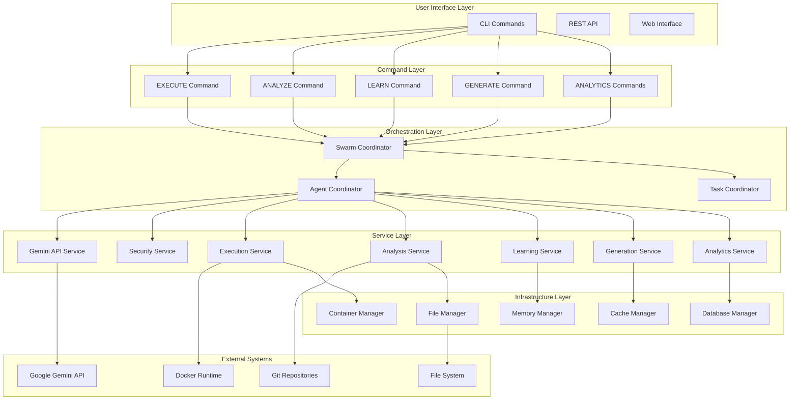
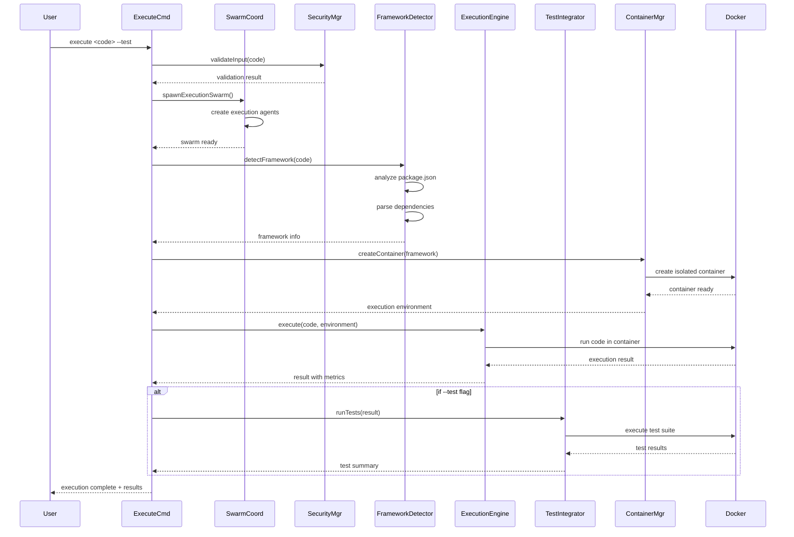
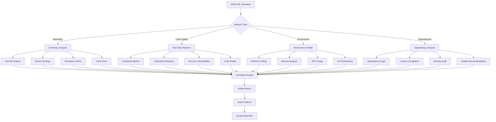
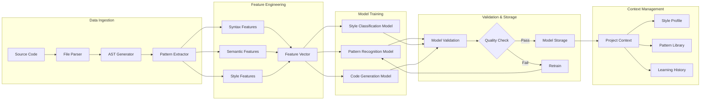
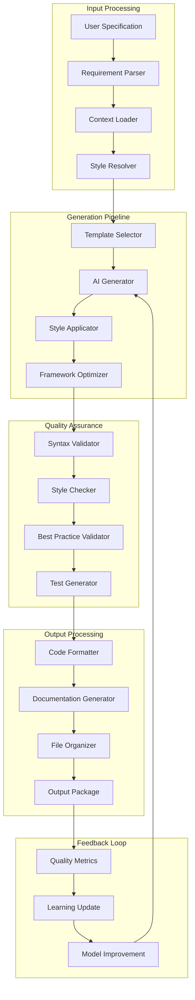
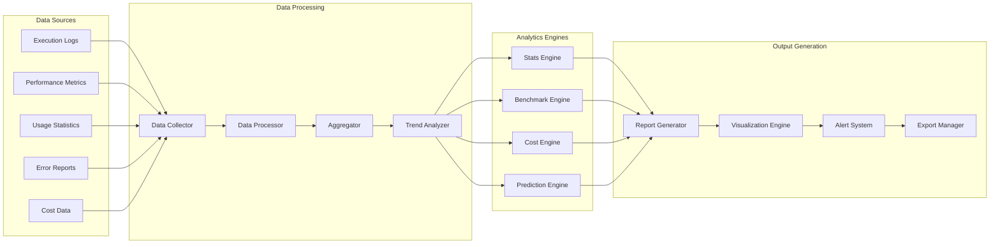
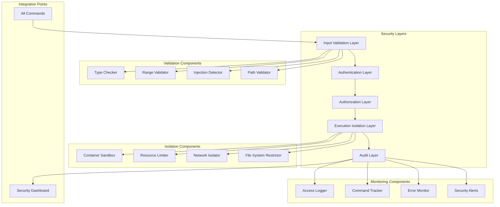
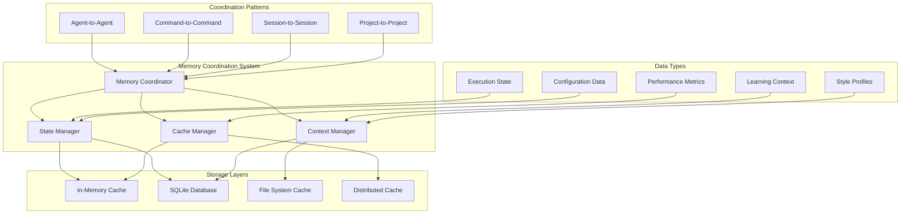
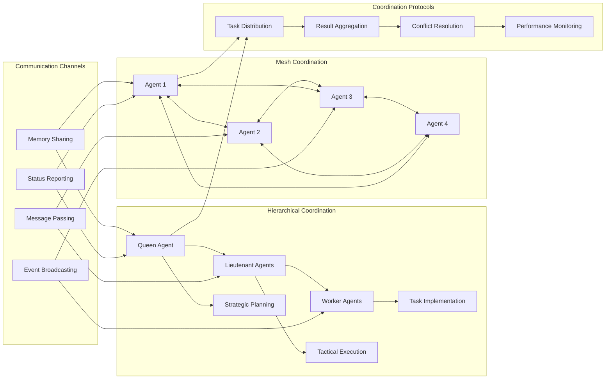

# Component Interaction Diagrams
## Command Bible Implementation

### System Overview Diagram

### EXECUTE Command Detailed Flow

### ANALYZE Command Workflow

### LEARN Command ML Pipeline

### GENERATE Command Architecture

### ANALYTICS Commands Data Flow

### Security Architecture Components

### Memory Coordination Architecture

### Agent Swarm Coordination

These diagrams provide a comprehensive view of how the Command Bible commands will integrate with the existing Gemini Flow architecture, showing the flow of data, coordination between components, and the security measures that ensure safe execution.