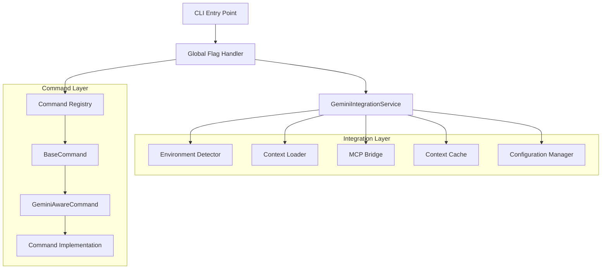
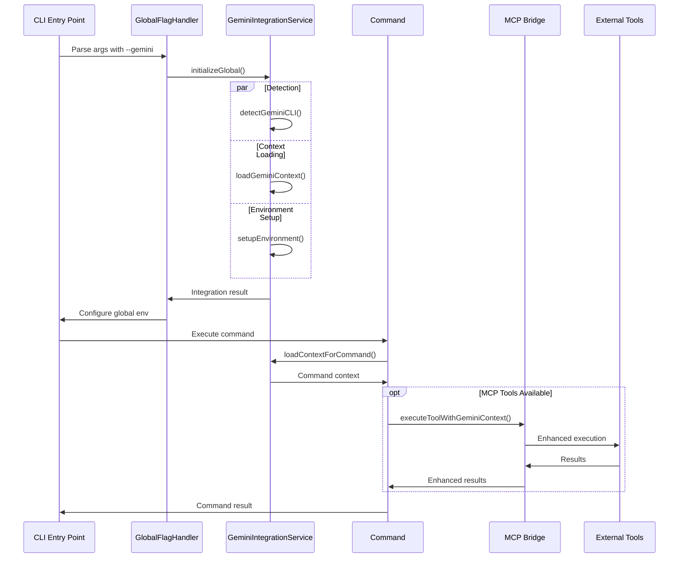

# Gemini Flag Integration Architecture
## Complete System Design for --gemini Flag Implementation

### 🎯 Executive Summary

This document defines the complete architecture for implementing the `--gemini` flag integration across all commands in gemini-flow, providing seamless context loading, environment detection, and enhanced AI coordination capabilities.

### 📋 Architecture Decision Record (ADR)

**Decision**: Implement global `--gemini` flag with centralized integration service and command-level coordination
**Context**: Need to provide enhanced AI capabilities when Gemini CLI is available while maintaining fallback compatibility
**Consequences**: 
- ✅ Consistent behavior across all commands
- ✅ Automatic environment detection and configuration
- ✅ Graceful degradation when Gemini CLI unavailable
- ⚠️ Additional complexity in command initialization

---

## 🏗️ System Architecture Overview

### Core Components



---

## 🔧 Component Specifications

### 1. GeminiIntegrationService (Enhanced)

```typescript
export interface GeminiIntegrationConfig {
  enableAutoDetection: boolean;
  contextCacheTimeout: number;
  fallbackBehavior: 'graceful' | 'strict' | 'warn';
  verboseLogging: boolean;
  mcpToolsEnabled: boolean;
}

export interface GeminiIntegrationResult {
  status: 'success' | 'partial' | 'failed';
  detection: {
    cliInstalled: boolean;
    version?: string;
    path?: string;
    mcpToolsAvailable: boolean;
  };
  context: {
    loaded: boolean;
    source: 'GEMINI.md' | 'fallback' | 'cache';
    size: number;
    timestamp: Date;
  };
  environment: {
    configured: boolean;
    variables: Record<string, string>;
    toolsRegistered: string[];
  };
  capabilities: {
    enhancedCoordination: boolean;
    contextAwareness: boolean;
    mcpIntegration: boolean;
  };
}

export class GeminiIntegrationService {
  private config: GeminiIntegrationConfig;
  private integrationCache: Map<string, GeminiIntegrationResult>;
  private mcpToolRegistry: MCPToolRegistry;
  
  async initializeGlobal(config?: Partial<GeminiIntegrationConfig>): Promise<GeminiIntegrationResult>;
  async detectCapabilities(): Promise<GeminiCapabilities>;
  async loadContextForCommand(commandName: string): Promise<CommandContext>;
  async registerMCPTools(): Promise<MCPToolRegistration>;
  async enableEnhancedCoordination(): Promise<void>;
  
  // Command-specific integration
  async integrateCommand(command: BaseCommand): Promise<void>;
  async wrapCommandExecution<T>(command: string, args: string[], executor: () => Promise<T>): Promise<T>;
}
```

### 2. GlobalFlagHandler

```typescript
export interface GlobalFlags {
  gemini: boolean;
  verbose: boolean;
  profile?: string;
  [key: string]: any;
}

export class GlobalFlagHandler {
  private integrationService: GeminiIntegrationService;
  private flagProcessors: Map<string, FlagProcessor>;
  
  constructor(integrationService: GeminiIntegrationService) {
    this.integrationService = integrationService;
    this.setupFlagProcessors();
  }
  
  async processGlobalFlags(args: string[]): Promise<ProcessedFlags> {
    const flags = this.parseFlags(args);
    
    if (flags.gemini) {
      await this.handleGeminiFlag(flags);
    }
    
    return {
      processed: flags,
      environment: this.buildEnvironment(flags),
      context: await this.loadCommandContext(flags)
    };
  }
  
  private async handleGeminiFlag(flags: GlobalFlags): Promise<void> {
    const spinner = ora('Initializing Gemini integration...').start();
    
    try {
      const result = await this.integrationService.initializeGlobal({
        verboseLogging: flags.verbose,
        enableAutoDetection: true,
        fallbackBehavior: 'graceful'
      });
      
      if (result.status === 'success') {
        spinner.succeed('Gemini integration activated');
        if (flags.verbose) {
          this.displayIntegrationStatus(result);
        }
      } else {
        spinner.warn('Gemini integration partial');
        if (flags.verbose) {
          this.displayWarnings(result);
        }
      }
      
      // Configure global environment
      this.configureGlobalEnvironment(result);
      
    } catch (error) {
      spinner.fail('Gemini integration failed');
      this.handleIntegrationError(error, flags.verbose);
    }
  }
  
  private configureGlobalEnvironment(result: GeminiIntegrationResult): void {
    process.env.GEMINI_FLOW_INTEGRATED = 'true';
    process.env.GEMINI_FLOW_STATUS = result.status;
    process.env.GEMINI_FLOW_CAPABILITIES = JSON.stringify(result.capabilities);
    
    if (result.detection.cliInstalled) {
      process.env.GEMINI_CLI_AVAILABLE = 'true';
      process.env.GEMINI_CLI_VERSION = result.detection.version || 'unknown';
    }
    
    if (result.context.loaded) {
      process.env.GEMINI_CONTEXT_LOADED = 'true';
      process.env.GEMINI_CONTEXT_SOURCE = result.context.source;
    }
  }
}
```

### 3. Enhanced BaseCommand Interface

```typescript
export interface GeminiAwareCommand extends Command {
  geminiIntegration?: GeminiCommandIntegration;
  supportedGeminiFeatures: GeminiFeature[];
  
  // Lifecycle hooks for Gemini integration
  onGeminiEnabled?(integration: GeminiIntegrationResult): Promise<void>;
  onGeminiDisabled?(): Promise<void>;
  onContextLoaded?(context: CommandContext): Promise<void>;
}

export interface GeminiCommandIntegration {
  enhancedCoordination: boolean;
  contextAwareness: boolean;
  mcpToolsEnabled: boolean;
  customPrompts?: Record<string, string>;
  coordinationPatterns?: CoordinationPattern[];
}

export abstract class EnhancedBaseCommand extends Command implements GeminiAwareCommand {
  protected geminiService: GeminiIntegrationService;
  protected logger: Logger;
  public supportedGeminiFeatures: GeminiFeature[] = [];
  
  constructor(name: string, geminiService: GeminiIntegrationService) {
    super(name);
    this.geminiService = geminiService;
    this.logger = new Logger(`${name}Command`);
    this.setupGeminiIntegration();
  }
  
  private setupGeminiIntegration(): void {
    // Add global --gemini option to all commands
    this.option('--gemini', 'Enable Gemini integration with context loading');
    
    // Override action to handle Gemini integration
    const originalAction = this.action.bind(this);
    this.action(async (...args) => {
      await this.handleGeminiIntegration();
      return originalAction(...args);
    });
  }
  
  private async handleGeminiIntegration(): Promise<void> {
    const hasGeminiFlag = process.env.GEMINI_FLOW_INTEGRATED === 'true';
    
    if (hasGeminiFlag) {
      await this.enableGeminiFeatures();
    }
  }
  
  protected async enableGeminiFeatures(): Promise<void> {
    if (this.onGeminiEnabled) {
      const integration = JSON.parse(process.env.GEMINI_FLOW_CAPABILITIES || '{}');
      await this.onGeminiEnabled(integration);
    }
    
    // Load command-specific context
    const context = await this.geminiService.loadContextForCommand(this.name());
    if (context && this.onContextLoaded) {
      await this.onContextLoaded(context);
    }
  }
  
  // Utility methods for commands
  protected isGeminiEnabled(): boolean {
    return process.env.GEMINI_FLOW_INTEGRATED === 'true';
  }
  
  protected getGeminiCapabilities(): GeminiCapabilities {
    return JSON.parse(process.env.GEMINI_FLOW_CAPABILITIES || '{}');
  }
  
  protected async executeWithGeminiCoordination<T>(
    operation: string,
    executor: () => Promise<T>
  ): Promise<T> {
    if (this.isGeminiEnabled()) {
      return this.geminiService.wrapCommandExecution(this.name(), [operation], executor);
    }
    return executor();
  }
}
```

### 4. Context Loading Architecture

```typescript
export interface CommandContext {
  command: string;
  baseContext: string;
  enhancedPrompts: Record<string, string>;
  coordinationHints: CoordinationHint[];
  mcpTools: MCPToolReference[];
  metadata: ContextMetadata;
}

export interface CoordinationHint {
  pattern: 'sequential' | 'parallel' | 'hierarchical' | 'adaptive';
  applicability: string[];
  configuration: Record<string, any>;
}

export class ContextLoader {
  private contextCache: Map<string, CommandContext>;
  private promptTemplates: Map<string, PromptTemplate>;
  
  async loadCommandContext(commandName: string, projectRoot?: string): Promise<CommandContext> {
    const cacheKey = `${commandName}:${projectRoot || process.cwd()}`;
    
    if (this.contextCache.has(cacheKey)) {
      return this.contextCache.get(cacheKey)!;
    }
    
    const context = await this.buildCommandContext(commandName, projectRoot);
    this.contextCache.set(cacheKey, context);
    
    return context;
  }
  
  private async buildCommandContext(commandName: string, projectRoot?: string): Promise<CommandContext> {
    const baseContext = await this.loadBaseContext(projectRoot);
    const commandSpecific = await this.loadCommandSpecificContext(commandName, projectRoot);
    
    return {
      command: commandName,
      baseContext: baseContext.content,
      enhancedPrompts: this.buildEnhancedPrompts(commandName, baseContext, commandSpecific),
      coordinationHints: this.extractCoordinationHints(commandSpecific),
      mcpTools: this.identifyRelevantMCPTools(commandName),
      metadata: {
        loaded: new Date(),
        source: baseContext.source,
        commandSpecific: !!commandSpecific
      }
    };
  }
  
  private buildEnhancedPrompts(
    commandName: string,
    baseContext: GeminiContext,
    commandContext?: CommandSpecificContext
  ): Record<string, string> {
    const prompts: Record<string, string> = {};
    
    // Base coordination prompt
    prompts.coordination = `
${baseContext.content}

Command: ${commandName}
Enhanced AI Coordination Mode: ACTIVE

Please coordinate your response with available tools and context to provide
the most helpful and accurate assistance for this ${commandName} operation.
    `.trim();
    
    // Command-specific prompts
    if (commandContext?.prompts) {
      Object.assign(prompts, commandContext.prompts);
    }
    
    return prompts;
  }
}
```

### 5. MCP Tools Integration Bridge

```typescript
export interface MCPGeminiBridge {
  availableTools: MCPTool[];
  toolRegistry: Map<string, MCPToolHandler>;
  
  registerTool(tool: MCPTool): void;
  executeToolWithGeminiContext(toolName: string, args: any[], context: string): Promise<any>;
  translateGeminiToMCP(geminiRequest: any): MCPRequest;
  translateMCPToGemini(mcpResponse: any): GeminiResponse;
}

export class MCPGeminiBridgeImpl implements MCPGeminiBridge {
  public availableTools: MCPTool[] = [];
  public toolRegistry: Map<string, MCPToolHandler> = new Map();
  
  private geminiService: GeminiIntegrationService;
  private logger: Logger;
  
  constructor(geminiService: GeminiIntegrationService) {
    this.geminiService = geminiService;
    this.logger = new Logger('MCPGeminiBridge');
  }
  
  async initializeBridge(): Promise<void> {
    // Discover and register available MCP tools
    const mcpTools = await this.discoverMCPTools();
    
    for (const tool of mcpTools) {
      this.registerTool(tool);
    }
    
    this.logger.info(`Registered ${mcpTools.length} MCP tools for Gemini integration`);
  }
  
  registerTool(tool: MCPTool): void {
    this.availableTools.push(tool);
    this.toolRegistry.set(tool.name, tool.handler);
    
    this.logger.debug(`Registered MCP tool: ${tool.name}`);
  }
  
  async executeToolWithGeminiContext(
    toolName: string,
    args: any[],
    context: string
  ): Promise<any> {
    const handler = this.toolRegistry.get(toolName);
    if (!handler) {
      throw new Error(`MCP tool not found: ${toolName}`);
    }
    
    // Enhance args with Gemini context
    const enhancedArgs = this.enhanceArgsWithContext(args, context);
    
    // Execute with enhanced context
    const result = await handler.execute(enhancedArgs);
    
    // Post-process result for Gemini consumption
    return this.postProcessForGemini(result);
  }
  
  private enhanceArgsWithContext(args: any[], context: string): any[] {
    // Add context as metadata to tool execution
    return args.map(arg => {
      if (typeof arg === 'object' && arg !== null) {
        return {
          ...arg,
          _geminiContext: context,
          _enhancedMode: true
        };
      }
      return arg;
    });
  }
  
  private async discoverMCPTools(): Promise<MCPTool[]> {
    // Discovery logic for available MCP tools
    const tools: MCPTool[] = [];
    
    // Check for gemini-flow tools
    if (process.env.CLAUDE_FLOW_AVAILABLE) {
      tools.push(...await this.discoverClaudeFlowTools());
    }
    
    // Check for ruv-swarm tools
    if (process.env.RUV_SWARM_AVAILABLE) {
      tools.push(...await this.discoverRuvSwarmTools());
    }
    
    return tools;
  }
}
```

---

## 🔄 Integration Flow Diagram



---

## 📁 File Structure and Implementation

### Directory Structure
```
src/
├── cli/
│   ├── index.ts                 # Enhanced with GlobalFlagHandler
│   ├── global-flag-handler.ts   # NEW: Global flag processing
│   └── commands/
│       ├── base-command.ts      # NEW: Enhanced base class
│       ├── gemini.ts           # ENHANCED: Extended functionality
│       └── [other-commands].ts # ENHANCED: Implement GeminiAwareCommand
├── services/
│   ├── gemini-integration.ts   # ENHANCED: Extended service
│   └── context-loader.ts       # NEW: Context loading service
├── bridges/
│   ├── mcp-gemini-bridge.ts   # NEW: MCP integration bridge
│   └── tool-registry.ts       # NEW: Tool registration system
└── types/
    ├── gemini-integration.ts   # NEW: Integration types
    └── command-interfaces.ts   # NEW: Command interface definitions
```

### Implementation Phases

#### Phase 1: Core Infrastructure (Week 1)
1. **GlobalFlagHandler** implementation
2. **Enhanced GeminiIntegrationService** 
3. **BaseCommand** enhancement
4. **Context loading** architecture

#### Phase 2: Command Integration (Week 2)
1. Update all existing commands to extend **EnhancedBaseCommand**
2. Implement command-specific **Gemini features**
3. Add **context loading** for each command
4. Test **flag propagation** across all commands

#### Phase 3: MCP Bridge (Week 3)
1. **MCPGeminiBridge** implementation
2. **Tool discovery** and registration
3. **Context enhancement** for tool execution
4. **Integration testing** with available MCP tools

#### Phase 4: Advanced Features (Week 4)
1. **Performance optimization**
2. **Caching strategies**
3. **Error handling** and fallback mechanisms
4. **Documentation** and **examples**

---

## 🧪 Testing Strategy

### Unit Tests
```typescript
describe('GeminiIntegrationService', () => {
  it('should detect Gemini CLI correctly');
  it('should load context with fallback');
  it('should configure environment variables');
  it('should handle initialization errors gracefully');
});

describe('GlobalFlagHandler', () => {
  it('should process --gemini flag correctly');
  it('should handle missing Gemini CLI gracefully');
  it('should configure global environment');
});

describe('EnhancedBaseCommand', () => {
  it('should inherit Gemini capabilities');
  it('should load command-specific context');
  it('should execute with enhanced coordination');
});
```

### Integration Tests
```typescript
describe('Gemini Flag Integration', () => {
  it('should work across all commands');
  it('should load appropriate context per command');
  it('should integrate with available MCP tools');
  it('should maintain performance targets');
});
```

### End-to-End Tests
```typescript
describe('Complete Integration Flow', () => {
  it('should initialize Gemini integration on --gemini flag');
  it('should enhance command execution with context');
  it('should coordinate with MCP tools when available');
  it('should provide fallback behavior when CLI unavailable');
});
```

---

## 📊 Performance Targets

### Integration Performance
- **Flag detection**: <50ms
- **Context loading**: <200ms (cached), <500ms (fresh)
- **Environment setup**: <100ms
- **Command enhancement**: <10ms overhead per command

### Memory Efficiency
- **Context cache**: <50MB for typical project
- **Integration overhead**: <10MB base memory
- **Tool registry**: <5MB for full MCP toolset

### Reliability Targets
- **Graceful degradation**: 100% when Gemini CLI unavailable
- **Error recovery**: Handle all integration failures
- **Cache hit rate**: >90% for context loading
- **Integration success**: >95% when CLI available

---

## 🛡️ Security Considerations

### Environment Variable Security
```typescript
const SENSITIVE_ENV_VARS = [
  'GEMINI_API_KEY',
  'GOOGLE_APPLICATION_CREDENTIALS',
  'GOOGLE_CLIENT_SECRET'
];

function sanitizeEnvironmentForLogging(env: Record<string, string>): Record<string, string> {
  const sanitized = { ...env };
  
  SENSITIVE_ENV_VARS.forEach(key => {
    if (sanitized[key]) {
      sanitized[key] = '***REDACTED***';
    }
  });
  
  return sanitized;
}
```

### Context Data Protection
- **No sensitive data** in context files
- **Sanitize paths** and personal information
- **Validate context** content before loading
- **Secure caching** with appropriate permissions

---

## 🚀 Implementation Recommendations

### Development Approach
1. **Incremental implementation** - Start with core infrastructure
2. **Backward compatibility** - Ensure existing functionality unaffected
3. **Comprehensive testing** - Test with and without Gemini CLI
4. **Performance monitoring** - Track integration overhead
5. **Documentation first** - Clear examples and usage patterns

### Code Quality Standards
- **TypeScript strict mode** for all new code
- **Comprehensive error handling** with specific error types
- **Logging at appropriate levels** (debug, info, warn, error)
- **Unit test coverage** >90% for new components
- **Integration test coverage** for all command combinations

### Deployment Strategy
- **Feature flags** for gradual rollout
- **Monitoring dashboards** for integration success rates
- **Rollback procedures** for integration failures
- **User communication** about new capabilities

---

This architecture provides a robust, scalable foundation for the --gemini flag integration while maintaining compatibility with existing gemini-flow patterns and ensuring graceful degradation when Gemini CLI is unavailable.