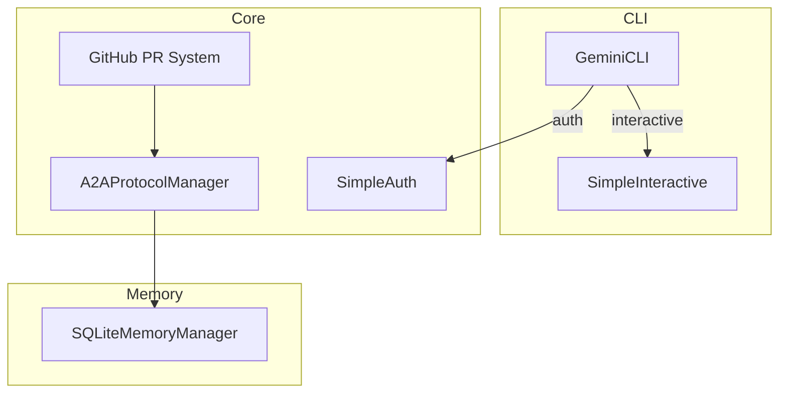
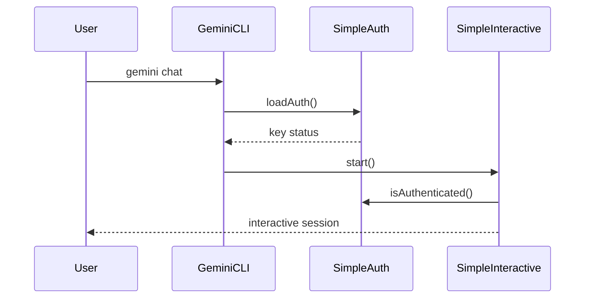

# Gemini-Flow Architecture & Roadmap

## Milestone 1 – Codebase Scanning & Architecture Mapping
- **Entry Point:** `src/index.ts` re-exports CLI, auth, and interactive modules, forming the public API surface【F:src/index.ts†L1-L16】
- **CLI Components:** `GeminiCLI` wires commander-based commands and pulls in `SimpleAuth`, `SimpleInteractive`, and logging utilities for orchestration【F:src/cli/gemini-cli.ts†L8-L118】
- **Authentication:** `SimpleAuth` resolves API keys from env/config and offers testing, save, and status helpers【F:src/core/simple-auth.ts†L1-L104】
- **Interactive Mode:** `SimpleInteractive` manages readline I/O, session history, and welcome flows【F:src/cli/simple-interactive.ts†L1-L118】
- **Memory Layer:** `SQLiteMemoryManager` abstracts persistent namespaces with a three-tier fallback: `better-sqlite3 → sqlite3 → sql.js` and WAL tuning【F:src/memory/sqlite-manager.ts†L1-L22】【F:src/memory/sqlite-manager.ts†L68-L110】
- **Protocol Handling:** `A2AProtocolManager` queues and routes JSON‑RPC messages with metrics, validation, and shutdown semantics【F:src/protocols/a2a/core/a2a-protocol-manager.ts†L1-L142】
- **GitHub A2A PR System:** coordinates multi-agent review strategies and scoring【F:src/core/github-a2a-pr-system.ts†L1-L152】

## Milestone 2 – Key Modules & Dependencies
- **Node Engine:** `>=18 <=24`【F:package.json†L12-L14】
- **Test Scripts:** unit, integration, performance, protocol, Google services, live integration【F:package.json†L21-L40】
- **Dependency Matrix (excerpt):**

| Type | Modules |
| --- | --- |
| Prod | axios, eventemitter3, express, redis, pg, ws |
| Dev | jest, eslint(+security plugin), typedoc, rollup |
| Optional | canvas, puppeteer, sharp |

- **Key Module Roles:**
  - `sqlite-manager.ts`: namespaced persistent storage with normalization utilities and periodic cleanup hooks【F:src/memory/sqlite-manager.ts†L44-L66】
  - `a2a-protocol-manager.ts`: priority queues, retry policies, and transport hooks for agent messaging【F:src/protocols/a2a/core/a2a-protocol-manager.ts†L50-L108】
  - `github-a2a-pr-system.ts`: strategy-driven PR review sessions across specialized agents【F:src/core/github-a2a-pr-system.ts†L88-L152】

## Milestone 3 – Technical Debt, Security, Risk
- **SQLite Persistence:** WAL pragmas enabled but no concurrent write guards or cross-platform fallback tests.
- **A2A Manager:** lacks input sanitization for payload sizes and graceful shutdown if transports hang.
- **Dependency Audit:** `npm audit` flags 13 vulnerabilities across `braces`, `lodash`, `minimist`, `shelljs`, etc.【685528†L1-L66】
- **CI Recommendation:** enforce `npm audit`, `eslint-plugin-security`, and upgrade vulnerable packages.

## Milestone 4 – Build/Test/Deployment Reliability
 - **Test Status:** `npm test` → 20 failing suites (protocol translation, auth, agent counts)【120e9a†L1-L71】
- **Scripts:** Docker/Kubernetes deploy, Grafana import, health checks, enterprise optimization【F:package.json†L41-L90】
- **Docs:** `tests/TESTING_GUIDE.md` exists; expand for Node 18–24 parity and cross-platform steps.

## Milestone 5 – Agentic Orchestration/Swarm
- `AGENT_DEFINITIONS` enumerates 64 agents across 16 categories, extending Claude-flow taxonomy with Google roles【F:src/agents/agent-definitions.ts†L1-L74】
- Recommend priority/consensus hooks in A2A manager and additional Google service agents for GitHub PR system.

## Milestone 6 – Database & Memory Integration
- Implement automated tests for SQLite fallbacks (`better-sqlite3 → sqlite3 → sql.js`) and namespace hierarchies.
- Add connection pooling, WAL metrics, and adapters for Postgres/Redis to reach Claude-flow parity.

## Milestone 7 – Documentation & Onboarding
- Merge existing `README.md`, `GEMINI.md`, `CLAUDE.md`, and migration guides into a unified onboarding tutorial.
- Provide CLI walkthroughs, swarm demos, and contribution/security guides aligned with Google & Claude flows.

---
### Roadmap Checklist
- [ ] Harden SQLite manager for concurrency & cross-platform WAL
- [ ] Add payload validation and transport timeouts to A2A protocol manager
- [ ] Resolve `npm audit` vulnerabilities & pin critical deps
- [ ] Fix failing unit tests and ensure Node 18–24 matrix
- [ ] Extend agent taxonomy and PR review agents
- [ ] Implement DB fallback tests and Postgres/Redis adapters
- [ ] Consolidate onboarding documentation with guided tutorials

