# Gemini Flag Integration Flow Diagram
## Visual Architecture and Data Flow Specifications

### 🎯 Overview

This document provides comprehensive visual representations of the --gemini flag integration architecture, including component interactions, data flows, and integration patterns.

---

## 🏗️ High-Level Component Architecture

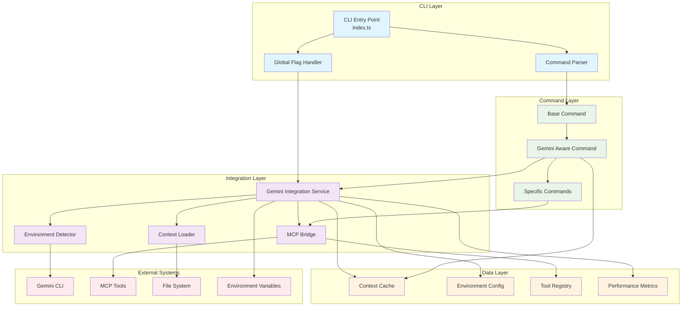

---

## 🔄 Integration Initialization Flow

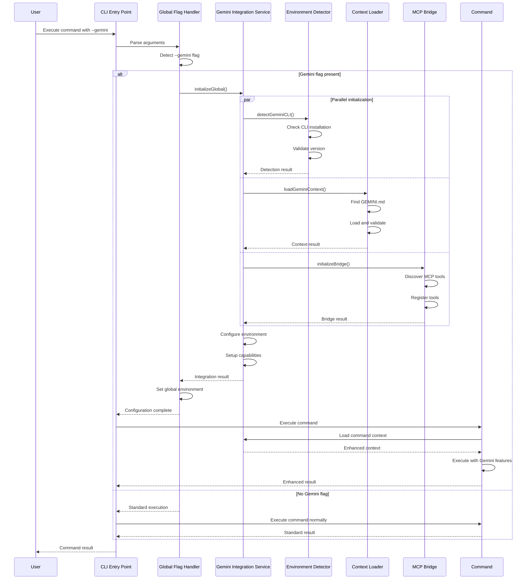

---

## 🧠 Context Loading Architecture

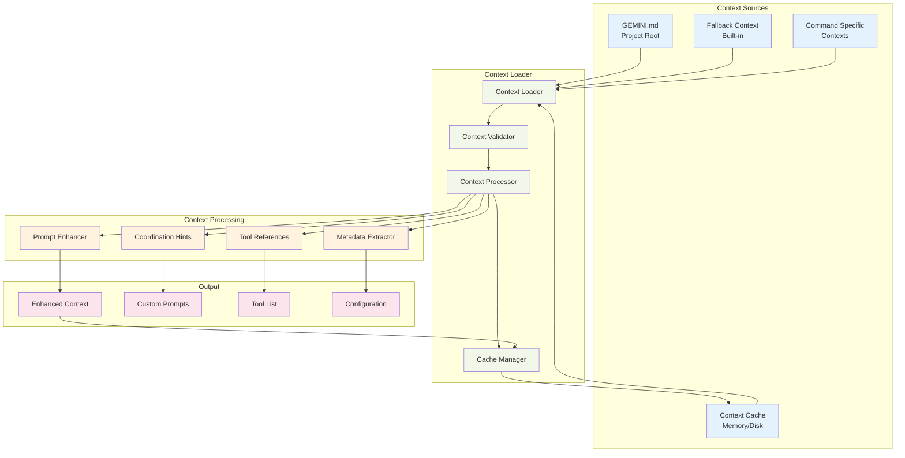

---

## 🔧 Command Enhancement Flow

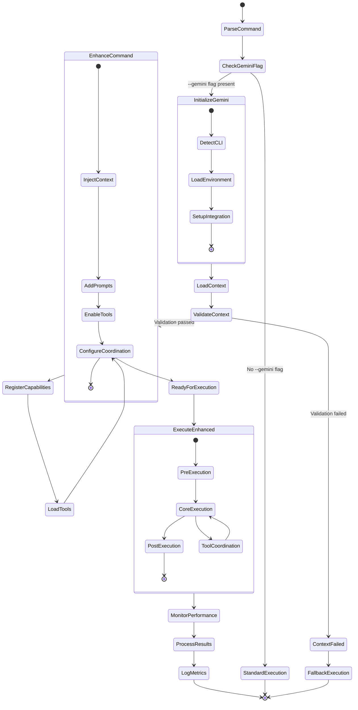

---

## 🌉 MCP Bridge Integration Flow

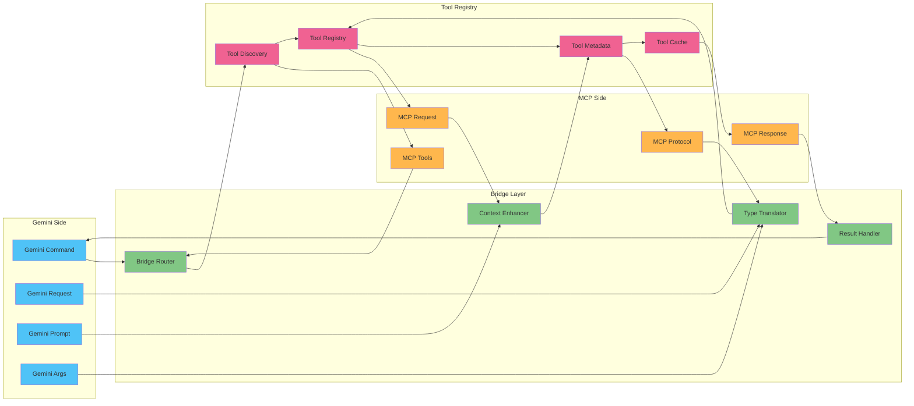

---

## 📊 Performance Monitoring Flow

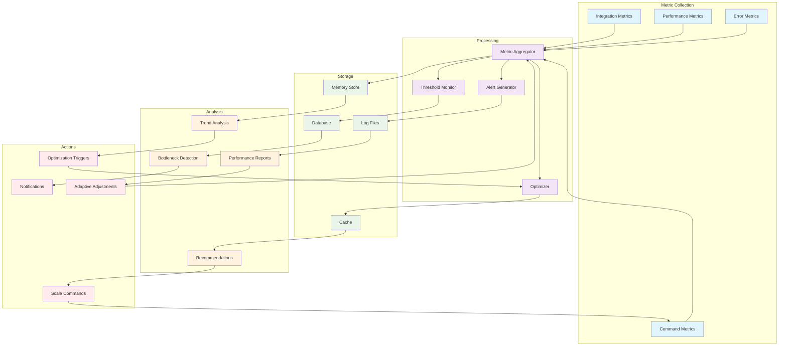

---

## 🔄 Error Handling and Recovery Flow

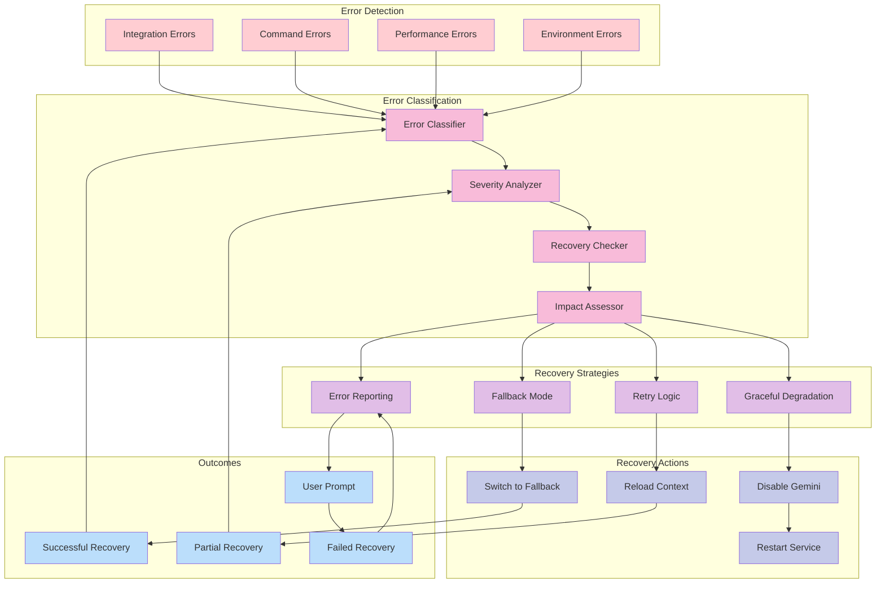

---

## 🎯 Command-Specific Integration Patterns

### Swarm Command Integration

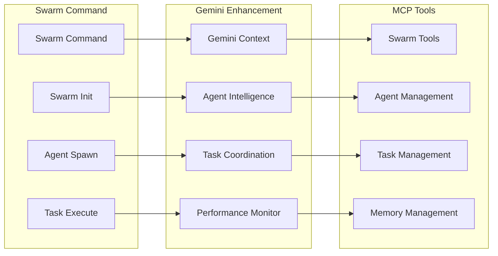

### Execute Command Integration

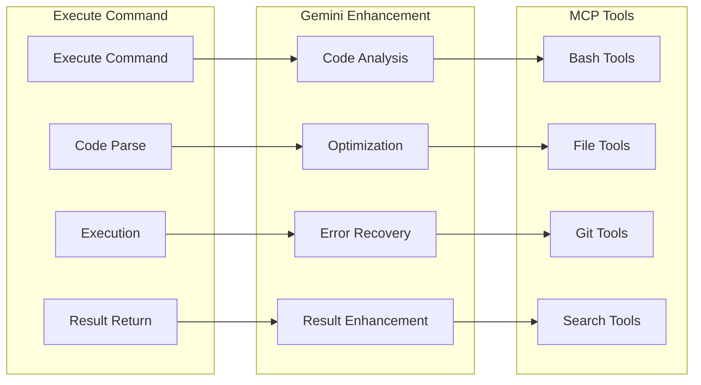

### Query Command Integration

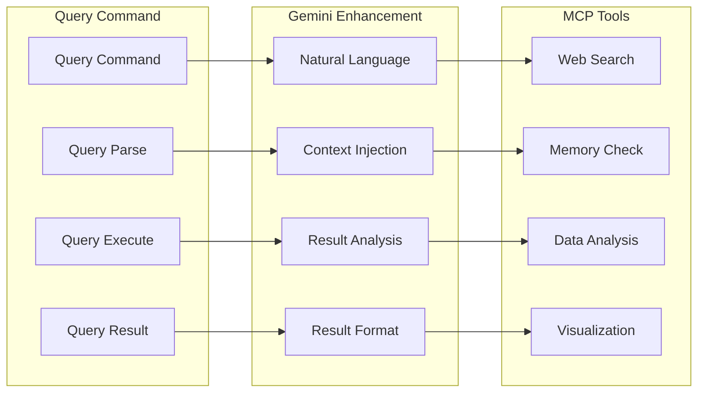

---

## 📈 Scalability and Load Distribution

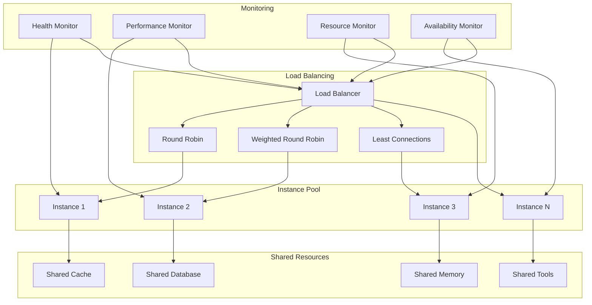

---

This comprehensive flow diagram specification provides clear visualization of all aspects of the --gemini flag integration architecture, from high-level component interactions to specific command integration patterns and scalability considerations.