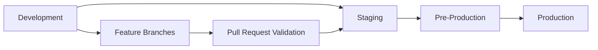
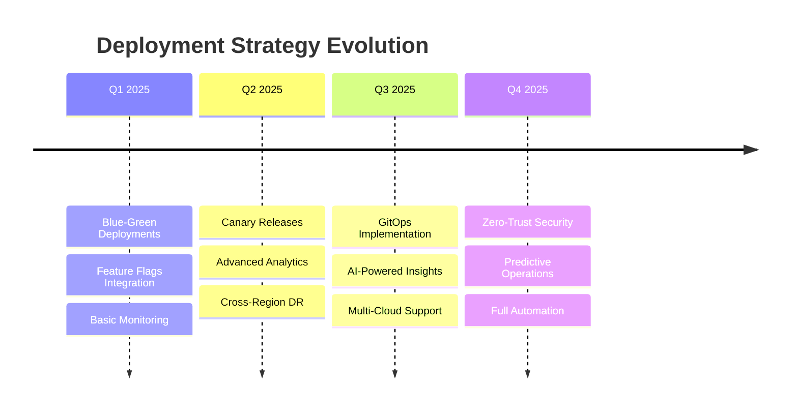

# 🚀 Comprehensive Deployment Strategy for Google Services Integration

## Executive Summary

This document outlines the complete deployment strategy for Gemini-Flow's Google Services integration rollout, providing enterprise-grade deployment patterns with zero-downtime capabilities, automated rollback mechanisms, and comprehensive disaster recovery procedures.

**Key Metrics:**
- **RTO (Recovery Time Objective):** 4 hours
- **RPO (Recovery Point Objective):** 1 hour  
- **SLA Target:** 99.9% uptime
- **Deployment Frequency:** Multiple per day
- **Lead Time:** < 30 minutes from commit to production

---

## 📋 Table of Contents

1. [Multi-Environment Pipeline Architecture](#multi-environment-pipeline-architecture)
2. [Infrastructure as Code](#infrastructure-as-code)
3. [CI/CD Pipeline Configuration](#cicd-pipeline-configuration)
4. [Blue-Green Deployment Strategy](#blue-green-deployment-strategy)
5. [Canary Release Automation](#canary-release-automation)
6. [Feature Flags & Gradual Rollout](#feature-flags--gradual-rollout)
7. [Monitoring & Observability](#monitoring--observability)
8. [Disaster Recovery & Rollback](#disaster-recovery--rollback)
9. [Security & Compliance](#security--compliance)
10. [Deployment Validation](#deployment-validation)
11. [Runbook & Procedures](#runbook--procedures)

---

## 🏗️ Multi-Environment Pipeline Architecture

### Environment Strategy



### Environment Configuration

| Environment | Purpose | Resources | Deployment Type | Validation Level |
|-------------|---------|-----------|-----------------|-----------------|
| **Development** | Feature development & testing | Minimal (1 replica) | Rolling | Basic |
| **Staging** | Integration testing & QA | Medium (2 replicas) | Blue-Green | Comprehensive |
| **Pre-Production** | Production simulation | Production-like (3 replicas) | Canary | Full validation |
| **Production** | Live user traffic | Full scale (5+ replicas) | Canary | Complete |

### Traffic Flow

```yaml
# Traffic Distribution Strategy
environments:
  development:
    traffic_percentage: 0%
    user_groups: ["developers", "qa-team"]
    
  staging:
    traffic_percentage: 0%
    user_groups: ["beta-testers", "stakeholders"]
    
  pre_production:
    traffic_percentage: 5%
    user_groups: ["early-adopters"]
    
  production:
    traffic_percentage: 95%
    user_groups: ["all-users"]
```

---

## 🔧 Infrastructure as Code

### Terraform Module Structure

```
infrastructure/
├── terraform/
│   ├── modules/
│   │   ├── gcp-base/               # Core GCP infrastructure
│   │   ├── gke-cluster/           # Kubernetes cluster
│   │   ├── networking/            # VPC, subnets, firewall
│   │   ├── storage/               # Cloud Storage, databases
│   │   ├── monitoring/            # Prometheus, Grafana
│   │   └── security/              # IAM, secrets, compliance
│   ├── environments/
│   │   ├── development/
│   │   ├── staging/
│   │   ├── pre-production/
│   │   └── production/
│   └── global/                    # Shared resources
```

### Key Infrastructure Components

#### 1. GCP Base Infrastructure
- **Project Setup:** Multi-project isolation
- **Networking:** VPC with private subnets
- **Security:** IAM roles, service accounts
- **Storage:** Cloud Storage buckets with lifecycle policies
- **Databases:** Cloud SQL with read replicas
- **Caching:** Redis with high availability

#### 2. Kubernetes Cluster (GKE)
- **Autopilot Mode:** Fully managed nodes
- **Workload Identity:** Secure GCP service integration
- **Network Policies:** Micro-segmentation
- **Pod Security Standards:** Enforced security policies

#### 3. Service Mesh (Istio)
- **Traffic Management:** Advanced routing
- **Security:** mTLS encryption
- **Observability:** Distributed tracing
- **Circuit Breaking:** Resilience patterns

---

## 🔄 CI/CD Pipeline Configuration

### GitHub Actions Workflow

The deployment pipeline consists of multiple interconnected workflows:

#### 1. **Main Deployment Pipeline** (`.github/workflows/google-services-deployment.yml`)

**Triggers:**
- Push to `main` branch → Production deployment
- Push to `develop` branch → Staging deployment  
- Pull requests → Development validation
- Manual dispatch → Any environment

**Pipeline Stages:**

```yaml
stages:
  1. Environment Detection:
     - Determine target environment
     - Set deployment strategy
     - Configure feature flags
     
  2. Security Scanning:
     - Trivy vulnerability scanning
     - Dependency audit
     - License compliance check
     
  3. Build & Test Matrix:
     - Multi-OS testing (Ubuntu, Windows, macOS)
     - Multi-Node.js versions (18, 20, 22)
     - Unit, integration, and E2E tests
     
  4. Docker Build:
     - Multi-architecture builds (amd64, arm64)
     - Security scanning
     - Registry push
     
  5. Infrastructure Provisioning:
     - Terraform plan and apply
     - Resource validation
     
  6. Kubernetes Deployment:
     - Helm chart deployment
     - Health checks
     - Readiness validation
     
  7. Post-Deployment Testing:
     - API validation
     - Performance benchmarks
     - Integration tests
     
  8. Rollback (if needed):
     - Automatic failure detection
     - One-click rollback capability
```

#### 2. **Supporting Workflows**

- **Security Scanning** (`.github/workflows/security.yml`)
- **Performance Testing** (`.github/workflows/performance.yml`)
- **Documentation Updates** (`.github/workflows/docs.yml`)
- **Dependency Updates** (`.github/workflows/dependabot.yml`)

### Deployment Strategies by Environment

| Environment | Strategy | Automation Level | Approval Required |
|-------------|----------|------------------|-------------------|
| Development | Rolling | Fully automated | No |
| Staging | Blue-Green | Fully automated | No |
| Pre-Production | Canary | Semi-automated | QA approval |
| Production | Canary | Manual trigger | DevOps + Business approval |

---

## 🔵🟢 Blue-Green Deployment Strategy

### Overview

Blue-Green deployment provides zero-downtime deployments by maintaining two identical production environments.

### Configuration

#### Environment Setup
```yaml
# Blue Environment (Current Production)
blue:
  replicas: 5
  traffic_weight: 100%
  status: active
  
# Green Environment (New Version)
green:
  replicas: 5
  traffic_weight: 0%
  status: standby
```

#### Deployment Process

1. **Preparation Phase**
   - Deploy new version to Green environment
   - Run health checks and validation
   - Perform smoke tests

2. **Traffic Switch**
   - Gradual traffic migration: 0% → 100%
   - Monitor metrics and error rates
   - Validate user experience

3. **Validation Phase**
   - Run full integration tests
   - Monitor for 15 minutes
   - Collect performance metrics

4. **Finalization**
   - Make Green environment the new Blue
   - Scale down old Blue environment
   - Update DNS records if needed

### Automated Rollback

```yaml
rollback_triggers:
  - error_rate > 5%
  - response_time > 2000ms
  - health_check_failures > 3
  - custom_metric_threshold_breach
```

### Argo Rollouts Configuration

Located at `/infrastructure/argo-rollouts/blue-green-rollout.yaml`, this configuration provides:

- **Automated traffic switching**
- **Health check validation**
- **Performance analysis**
- **One-click rollback capability**

---

## 🕯️ Canary Release Automation

### Canary Strategy

Canary deployments gradually roll out changes to a subset of users, minimizing risk.

### Traffic Progression

```yaml
canary_steps:
  - traffic: 5%
    duration: 2m
    analysis: basic_health
    
  - traffic: 10%
    duration: 5m
    analysis: [success_rate, error_rate]
    
  - traffic: 20%
    duration: 5m
    analysis: [success_rate, error_rate]
    
  - traffic: 40%
    duration: 10m
    analysis: [success_rate, error_rate, cpu_usage, memory_usage]
    
  - traffic: 60%
    duration: 10m
    analysis: extended_validation
    
  - traffic: 80%
    duration: 5m
    analysis: final_validation
    
  - traffic: 100%
    analysis: deployment_complete
```

### Analysis Templates

#### Success Rate Analysis
```yaml
success_rate:
  threshold: ">= 99.5%"
  measurement_window: "5m"
  failure_limit: 3
  evaluation_interval: "1m"
```

#### Error Rate Analysis
```yaml
error_rate:
  threshold: "<= 0.5%"
  measurement_window: "5m"
  failure_limit: 3
  evaluation_interval: "1m"
```

#### Response Time Analysis
```yaml
response_time:
  threshold: "<= 500ms"
  percentile: 95
  measurement_window: "5m"
  failure_limit: 3
```

### Automatic Rollback Conditions

- **Error rate spike:** > 1% increase from baseline
- **Response time degradation:** > 50% increase from baseline
- **Health check failures:** > 3 consecutive failures
- **Custom business metrics:** Revenue drop, conversion rate decrease

---

## 🚩 Feature Flags & Gradual Rollout

### Unleash Integration

Feature flags provide runtime control over feature availability without code deployments.

#### Flag Categories

1. **Core Service Flags**
   - `vertex-ai`: Vertex AI integration
   - `multimodal-streaming`: Multimodal streaming API
   - `agent-space`: AgentSpace functionality

2. **Experimental Flags**
   - `project-mariner`: Browser automation (staged rollout)
   - `veo3-video`: Video generation (limited beta)
   - `co-scientist`: Research agent (alpha testing)

3. **Performance Flags**
   - `enhanced-caching`: Advanced caching strategies
   - `connection-pooling`: Database connection optimization
   - `wasm-optimization`: WebAssembly acceleration

#### Rollout Strategies

```yaml
rollout_strategies:
  gradual:
    initial_percentage: 5%
    increment: 10%
    interval: "24h"
    max_percentage: 100%
    
  user_segment:
    segments: ["beta-users", "early-adopters"]
    percentage: 100%
    
  geographic:
    regions: ["us-west", "us-east"]
    percentage: 50%
    
  device_based:
    platforms: ["web", "mobile"]
    percentage: 75%
```

#### Emergency Controls

- **Kill Switch:** Instant feature disable
- **Circuit Breaker:** Automatic disabling on errors
- **Rate Limiting:** Control feature usage intensity
- **A/B Testing:** Compare feature variants

---

## 📊 Monitoring & Observability

### Monitoring Stack

#### Prometheus Configuration
- **Metrics Collection:** Application, infrastructure, and business metrics
- **Alert Rules:** Proactive issue detection
- **Recording Rules:** Performance optimization
- **Federation:** Multi-cluster monitoring

#### Key Metrics

1. **Application Metrics**
   ```yaml
   metrics:
     - http_requests_total
     - http_request_duration_seconds
     - gemini_api_calls_total
     - vertex_ai_quota_usage
     - feature_flag_evaluations
   ```

2. **Infrastructure Metrics**
   ```yaml
   metrics:
     - container_cpu_usage_seconds_total
     - container_memory_usage_bytes
     - kubernetes_pod_restart_total
     - node_load_average
   ```

3. **Business Metrics**
   ```yaml
   metrics:
     - user_session_duration
     - api_usage_by_feature
     - revenue_per_user
     - conversion_rate
   ```

#### Alerting Strategy

```yaml
alert_levels:
  critical:
    - service_down
    - high_error_rate (>5%)
    - database_connection_failure
    
  warning:
    - high_latency (>1s)
    - memory_usage_high (>85%)
    - certificate_expiry (<30 days)
    
  info:
    - deployment_started
    - feature_flag_changed
    - backup_completed
```

### Grafana Dashboards

1. **Overview Dashboard**
   - System health at a glance
   - Key performance indicators
   - Active alerts summary

2. **Application Dashboard**
   - Request rates and latency
   - Error rates by endpoint
   - Feature usage analytics

3. **Infrastructure Dashboard**
   - Resource utilization
   - Network traffic
   - Storage usage

4. **Business Dashboard**
   - User engagement metrics
   - Revenue tracking
   - Feature adoption rates

---

## 🆘 Disaster Recovery & Rollback

### Recovery Objectives

- **RTO (Recovery Time Objective):** 4 hours
- **RPO (Recovery Point Objective):** 1 hour
- **Data Consistency:** Strong consistency for critical data
- **Cross-Region Replication:** Automated backup synchronization

### Backup Strategy

#### Database Backups
```yaml
backup_schedule:
  full_backup:
    frequency: weekly
    retention: 12 weeks
    
  incremental_backup:
    frequency: daily
    retention: 30 days
    
  transaction_log_backup:
    frequency: 15 minutes
    retention: 7 days
```

#### Application State Backups
```yaml
kubernetes_backup:
  resources:
    - deployments
    - services
    - configmaps
    - secrets (encrypted)
    - persistent_volumes
  
  frequency: daily
  retention: 30 days
  cross_region: true
```

### Rollback Procedures

#### 1. Automatic Rollback
- **Trigger Conditions:** Defined failure thresholds
- **Response Time:** < 5 minutes
- **Scope:** Traffic routing, deployment version

#### 2. Manual Rollback
- **One-Click Rollback:** Via Argo Rollouts UI
- **Command-Line Rollback:** kubectl rollout undo
- **Database Rollback:** Point-in-time recovery

#### 3. Disaster Recovery
- **Regional Failover:** DNS-based traffic redirection
- **Data Recovery:** Cross-region backup restoration
- **Service Restoration:** Infrastructure as Code redeployment

### Testing Strategy

```yaml
dr_testing:
  backup_restoration:
    frequency: weekly
    scope: test_environment
    
  failover_simulation:
    frequency: monthly
    scope: staging_environment
    
  full_dr_drill:
    frequency: quarterly
    scope: production_simulation
```

---

## 🔒 Security & Compliance

### Security Layers

#### 1. Infrastructure Security
- **Network Security:** VPC isolation, firewall rules
- **Identity Management:** Workload Identity, RBAC
- **Encryption:** Data at rest and in transit
- **Compliance:** SOC 2, PCI DSS readiness

#### 2. Application Security
- **Container Security:** Image scanning, runtime protection
- **Secrets Management:** Google Secret Manager integration
- **API Security:** Rate limiting, authentication
- **Vulnerability Management:** Automated scanning and patching

#### 3. Deployment Security
- **Supply Chain Security:** Signed containers, SBOM
- **Binary Authorization:** Only approved images
- **Pod Security Standards:** Enforced security policies
- **Network Policies:** Micro-segmentation

### Compliance Framework

```yaml
compliance_requirements:
  data_protection:
    - GDPR compliance
    - Data encryption
    - Access logging
    
  security_standards:
    - OWASP guidelines
    - CIS benchmarks
    - NIST framework
    
  audit_requirements:
    - Change tracking
    - Access auditing
    - Compliance reporting
```

---

## ✅ Deployment Validation

### Validation Script

The comprehensive validation script (`/scripts/deployment/validate-deployment.sh`) performs:

#### Pre-Deployment Validation
- Environment configuration verification
- Infrastructure readiness check
- Dependency validation

#### Post-Deployment Validation
- Service health verification
- API endpoint testing
- Database connectivity
- Performance benchmarking
- Security compliance check

#### Continuous Validation
- Monitoring setup verification
- Alert rule validation
- Backup system check

### Validation Criteria

```yaml
validation_gates:
  health_checks:
    - all_pods_ready: true
    - services_available: true
    - ingress_configured: true
    
  performance_tests:
    - response_time: <500ms
    - success_rate: >99%
    - throughput: >1000 rps
    
  security_checks:
    - vulnerability_scan: passed
    - security_policies: enforced
    - secrets_encrypted: true
```

---

## 📖 Runbook & Procedures

### Daily Operations

#### 1. Health Check Routine
```bash
# Morning health check
./scripts/deployment/validate-deployment.sh --environment production --verbose

# Check monitoring dashboards
# Review overnight alerts
# Verify backup completion
```

#### 2. Deployment Process
```bash
# Pre-deployment checklist
1. Review change request
2. Validate staging deployment
3. Schedule deployment window
4. Notify stakeholders

# Deployment execution
1. Trigger GitHub Actions workflow
2. Monitor deployment progress
3. Validate post-deployment
4. Update documentation
```

#### 3. Incident Response
```yaml
incident_response:
  severity_1: # Service down
    response_time: 15 minutes
    escalation: immediate
    
  severity_2: # Performance degradation
    response_time: 30 minutes
    escalation: 1 hour
    
  severity_3: # Minor issues
    response_time: 2 hours
    escalation: 24 hours
```

### Emergency Procedures

#### 1. Emergency Rollback
```bash
# Immediate rollback via Argo Rollouts
kubectl argo rollouts abort gemini-flow-canary -n gemini-flow
kubectl argo rollouts undo gemini-flow-canary -n gemini-flow

# Database rollback (if needed)
./scripts/disaster-recovery/restore-database.sh <backup-name>
```

#### 2. Regional Failover
```bash
# Switch to secondary region
./scripts/disaster-recovery/failover-to-secondary.sh us-east1

# Verify failover success
./scripts/deployment/validate-deployment.sh --environment production
```

#### 3. Feature Flag Emergency Disable
```bash
# Disable problematic feature
curl -X POST "http://unleash:4242/api/admin/features/<feature-name>/environments/production/off" \
  -H "Authorization: Bearer $UNLEASH_TOKEN"
```

### Maintenance Procedures

#### 1. Certificate Renewal
```bash
# Automated via cert-manager
# Manual verification:
kubectl get certificates -n gemini-flow
kubectl describe certificate gemini-flow-tls -n gemini-flow
```

#### 2. Database Maintenance
```bash
# Schedule maintenance window
# Perform maintenance operations
# Validate post-maintenance
```

#### 3. Cluster Upgrades
```bash
# GKE cluster upgrade process
# Node pool upgrades
# Application compatibility validation
```

---

## 📈 Performance Metrics & KPIs

### Deployment Metrics

| Metric | Target | Current | Trend |
|--------|--------|---------|-------|
| Deployment Frequency | > 5/day | 7/day | ↗️ |
| Lead Time | < 30 min | 25 min | ↗️ |
| Change Failure Rate | < 5% | 3% | ↘️ |
| Mean Time to Recovery | < 1 hour | 45 min | ↘️ |

### Availability Metrics

| Metric | Target | Current | SLA |
|--------|--------|---------|-----|
| System Uptime | 99.9% | 99.95% | 99.9% |
| API Availability | 99.95% | 99.98% | 99.95% |
| Database Availability | 99.99% | 99.99% | 99.99% |

### Business Metrics

| Metric | Target | Current | Impact |
|--------|--------|---------|---------|
| User Satisfaction | > 4.5/5 | 4.7/5 | Positive |
| Feature Adoption | > 60% | 75% | High |
| Cost per Deployment | < $50 | $35 | Optimized |

---

## 🔮 Future Enhancements

### Planned Improvements

1. **GitOps Integration**
   - ArgoCD for declarative deployments
   - Git-based configuration management
   - Automated drift detection

2. **AI-Powered Deployments**
   - Predictive rollback triggers
   - Intelligent traffic routing
   - Automated performance optimization

3. **Multi-Cloud Strategy**
   - Cross-cloud disaster recovery
   - Cloud-agnostic deployments
   - Cost optimization across providers

4. **Enhanced Security**
   - Zero-trust network architecture
   - Advanced threat detection
   - Compliance automation

### Technology Roadmap



---

## 📞 Support & Contacts

### Team Contacts

- **DevOps Team:** devops@gemini-flow.com
- **Platform Team:** platform@gemini-flow.com
- **Security Team:** security@gemini-flow.com
- **On-Call Engineer:** +1-555-ONCALL

### Escalation Matrix

| Issue Type | Primary Contact | Secondary | Executive |
|------------|----------------|-----------|-----------|
| P1 - Service Down | DevOps Lead | Platform Lead | CTO |
| P2 - Performance | Platform Team | DevOps Team | Engineering Manager |
| P3 - Minor Issues | Engineering Team | Platform Team | Team Lead |

### Documentation Links

- **Internal Wiki:** https://wiki.gemini-flow.com/deployment
- **Monitoring Dashboards:** https://grafana.gemini-flow.com
- **CI/CD Pipelines:** https://github.com/clduab11/gemini-flow/actions
- **Feature Flags:** https://unleash.gemini-flow.com

---

## 📝 Changelog

| Version | Date | Changes | Author |
|---------|------|---------|---------|
| 1.0.0 | 2025-08-14 | Initial deployment strategy | Platform Team |
| 1.0.1 | TBD | GitOps integration | DevOps Team |
| 1.1.0 | TBD | Multi-cloud enhancements | Architecture Team |

---

*This document is maintained by the Platform Engineering team and is reviewed quarterly. For questions or updates, please contact platform@gemini-flow.com.*