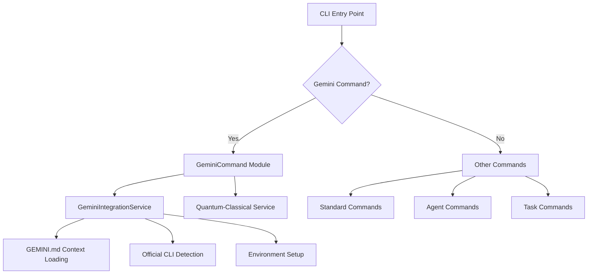
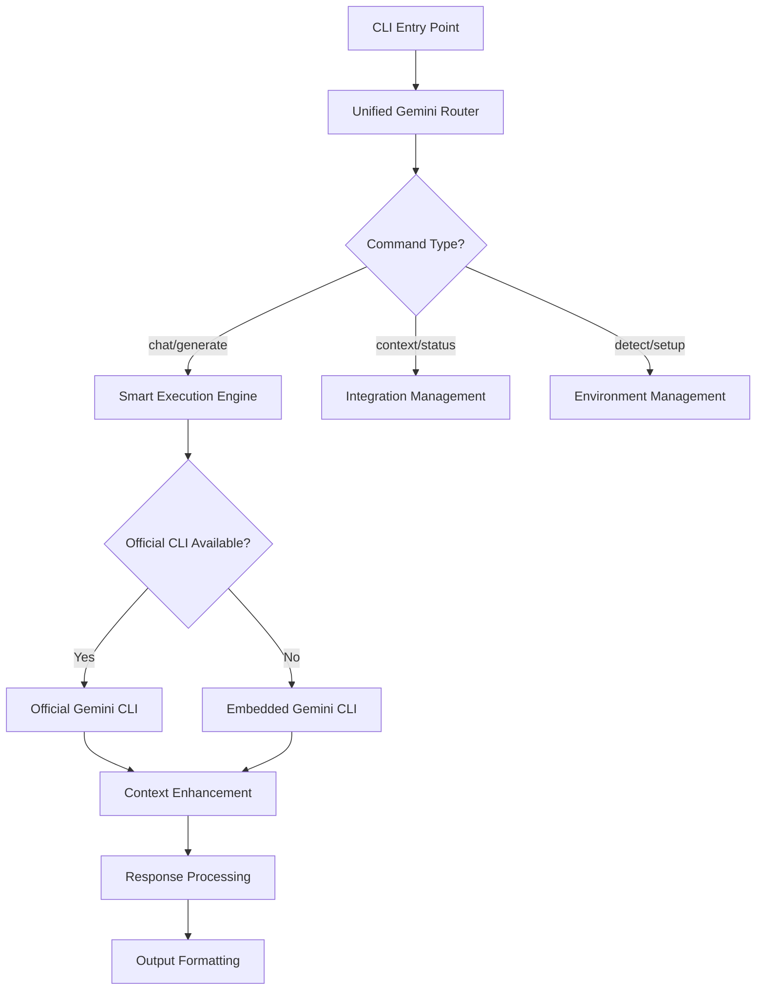

# Gemini CLI Integration Architecture

## Current State Analysis

### Component Overview

| Component | Purpose | Status | Integration Level |
|-----------|---------|--------|------------------|
| **GeminiCLI** | Standalone CLI implementation | ✅ Complete | ❌ Not Integrated |
| **GeminiCommand** | Integration management | ✅ Complete | ⚠️ Partial |
| **GeminiAdapter** | Model adapter layer | ✅ Complete | ✅ Integrated |
| **GeminiIntegrationService** | Context & detection service | ✅ Complete | ⚠️ Partial |

### Current Architecture



## Identified Integration Gaps

### 1. Disconnected CLI Implementations
- **Issue**: Two separate Gemini CLI implementations exist but don't work together
- **Impact**: Users get inconsistent behavior and limited functionality
- **Current**: GeminiCLI provides full CLI but standalone; GeminiCommand manages integration but lacks execution

### 2. Missing Pass-Through Mechanism
- **Issue**: No mechanism to route commands to official Gemini CLI when available
- **Impact**: Users can't leverage official CLI features like newest models
- **Current**: Only embedded implementation available

### 3. Context Loading Isolation
- **Issue**: GEMINI.md context loaded by integration service but not used by CLI
- **Impact**: Rich context not available for Gemini interactions
- **Current**: Context loaded but not connected to actual CLI execution

### 4. Authentication Fragmentation
- **Issue**: Multiple authentication mechanisms not unified
- **Impact**: API key management complexity
- **Current**: SimpleAuth in CLI, integration service separate

## Proposed Architecture

### Unified Command Router



### Component Responsibilities

| Component | Responsibility | Interface |
|-----------|----------------|-----------|
| **UnifiedGeminiRouter** | Route commands to appropriate handler | CLI command interface |
| **SmartExecutionEngine** | Choose between official/embedded CLI | Execution strategy pattern |
| **ContextManager** | Load and provide GEMINI.md context | Context provider interface |
| **AuthenticationBridge** | Unify API key management | Auth provider interface |

### Data Flow

1. **Command Reception**: CLI receives gemini command
2. **Context Loading**: GEMINI.md context loaded and cached
3. **Execution Strategy**: Determine official vs embedded execution
4. **Authentication**: Unified API key resolution
5. **Command Execution**: Execute via chosen method with context
6. **Response Processing**: Format and return results

## Implementation Plan

### Phase 1: Foundation
- Create unified command router
- Implement execution strategy pattern
- Bridge authentication mechanisms

### Phase 2: Context Integration
- Connect context loading to CLI execution
- Implement context injection mechanism
- Add context caching and invalidation

### Phase 3: Pass-Through Implementation
- Add official CLI detection and routing
- Implement graceful fallback to embedded CLI
- Add version compatibility checking

### Phase 4: Enhancement
- Add command history and session management
- Implement response caching
- Add performance monitoring

## Integration Points

### Required Interfaces

```typescript
interface GeminiExecutionStrategy {
  execute(command: string, options: any): Promise<GeminiResponse>
  isAvailable(): Promise<boolean>
  getVersion(): Promise<string>
}

interface ContextProvider {
  loadContext(projectRoot?: string): Promise<GeminiContext>
  enhancePrompt(prompt: string, context: GeminiContext): string
}

interface AuthenticationProvider {
  getApiKey(): string | null
  setApiKey(key: string): Promise<boolean>
  validateKey(key: string): Promise<boolean>
}
```

### Environment Integration

```bash
# Enhanced environment variables
GEMINI_CLI_MODE=auto|official|embedded
GEMINI_CONTEXT_AUTO_LOAD=true
GEMINI_FALLBACK_ENABLED=true
GEMINI_SESSION_PERSISTENCE=true
```

## Benefits

### User Experience
- **Unified Interface**: Single command set regardless of CLI availability
- **Best Performance**: Automatic selection of optimal execution method
- **Rich Context**: GEMINI.md content automatically enhances interactions
- **Graceful Degradation**: Fallback when official CLI unavailable

### Developer Experience
- **Clear Architecture**: Well-defined boundaries and interfaces
- **Extensible Design**: Easy to add new execution strategies
- **Testable Components**: Strategy pattern enables easy testing
- **Maintainable Code**: Separation of concerns

### Operational Benefits
- **Resource Optimization**: Use official CLI when available, embedded when not
- **Context Utilization**: Leverage project-specific knowledge
- **Error Resilience**: Multiple fallback mechanisms
- **Monitoring**: Built-in performance and usage tracking

## Migration Strategy

### Backward Compatibility
- Existing commands continue to work unchanged
- New functionality opt-in via feature flags
- Gradual rollout of enhanced features

### Testing Approach
- Unit tests for each strategy implementation
- Integration tests for command routing
- End-to-end tests for full workflows

### Deployment
- Feature flags control rollout
- Configuration-driven behavior
- Monitoring and metrics collection