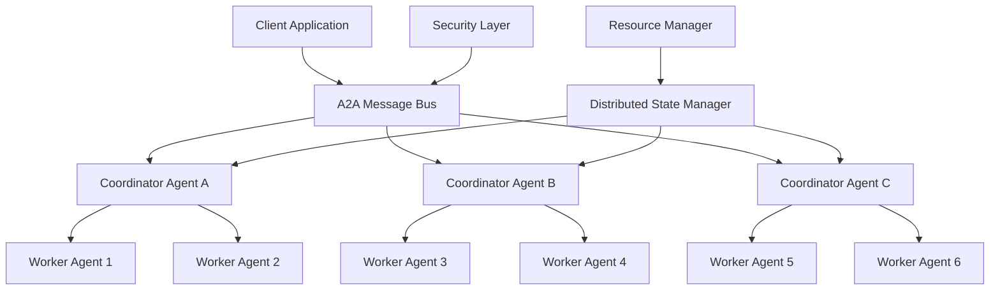

# A2A Developer Guide: Agent-to-Agent Integration Patterns

## Table of Contents
- [Introduction](#introduction)
- [Core Concepts](#core-concepts)
- [Integration Patterns](#integration-patterns)
- [Security Best Practices](#security-best-practices)
- [Performance Optimization](#performance-optimization)
- [Error Handling](#error-handling)
- [Testing Strategies](#testing-strategies)
- [Deployment Guidelines](#deployment-guidelines)
- [Advanced Patterns](#advanced-patterns)
- [Troubleshooting](#troubleshooting)

## Introduction

The Agent-to-Agent (A2A) system in Gemini Flow enables distributed AI agent coordination across all 104 MCP tools. This guide provides comprehensive patterns, best practices, and implementation strategies for building robust A2A integrations.

### What is A2A?

A2A is a distributed communication protocol that allows AI agents to:
- **Coordinate Tasks**: Distribute complex tasks across multiple agents
- **Share State**: Synchronize data and state across the agent network
- **Allocate Resources**: Dynamically manage computational resources
- **Reach Consensus**: Make collective decisions through various algorithms
- **Handle Failures**: Automatically recover from agent or network failures

### Architecture Overview



## Core Concepts

### 1. Message Bus Architecture

The A2A message bus is the central communication hub:

```typescript
interface A2AMessageBus {
  // Core messaging operations
  send(message: A2AMessage): Promise<A2AResponse>;
  broadcast(message: A2AMessage, targets: string[]): Promise<A2AResponse[]>;
  subscribe(agentId: string, patterns: string[]): void;
  unsubscribe(agentId: string, patterns: string[]): void;
  
  // Advanced coordination
  route(message: A2AMessage): Promise<void>;
  multicast(message: A2AMessage, group: string): Promise<A2AResponse[]>;
  pipeline(messages: A2AMessage[]): Promise<A2AResponse[]>;
}
```

### 2. Agent Targeting

A2A supports flexible agent targeting strategies:

```typescript
// Single agent targeting
const singleTarget: SingleTarget = {
  type: 'single',
  agentId: 'coder-001'
};

// Multiple agents with coordination
const multipleTargets: MultipleTargets = {
  type: 'multiple',
  agentIds: ['coder-001', 'coder-002', 'coder-003'],
  coordinationMode: 'parallel'
};

// Group targeting by role
const groupTarget: GroupTarget = {
  type: 'group',
  role: 'system-architect',
  capabilities: ['microservices', 'kubernetes'],
  maxAgents: 3,
  selectionStrategy: 'capability-matched'
};

// Broadcast to all matching agents
const broadcastTarget: BroadcastTarget = {
  type: 'broadcast',
  filter: {
    role: 'tester',
    status: 'idle'
  },
  excludeSource: true
};
```

### 3. Coordination Modes

Four primary coordination patterns enable different interaction models:

#### Direct Coordination (1-to-1)
```typescript
const directCoordination: DirectCoordination = {
  mode: 'direct',
  timeout: 5000,
  retries: 3,
  acknowledgment: true
};
```

#### Broadcast Coordination (1-to-Many)
```typescript
const broadcastCoordination: BroadcastCoordination = {
  mode: 'broadcast',
  aggregation: 'majority',  // all, majority, first, any
  timeout: 10000,
  partialSuccess: true
};
```

#### Consensus Coordination (Many-to-Many)
```typescript
const consensusCoordination: ConsensusCoordination = {
  mode: 'consensus',
  consensusType: 'majority',  // unanimous, majority, weighted
  votingTimeout: 30000,
  minimumParticipants: 3
};
```

#### Pipeline Coordination (Sequential)
```typescript
const pipelineCoordination: PipelineCoordination = {
  mode: 'pipeline',
  stages: [
    {
      name: 'design',
      agentTarget: { type: 'group', role: 'system-architect' },
      toolName: 'mcp__claude-flow__sparc_mode',
      parameters: { mode: 'architect' }
    },
    {
      name: 'implement', 
      agentTarget: { type: 'multiple', agentIds: ['coder-001', 'coder-002'] },
      toolName: 'mcp__claude-flow__parallel_execute'
    },
    {
      name: 'test',
      agentTarget: { type: 'group', role: 'tester' },
      toolName: 'mcp__claude-flow__sparc_mode',
      parameters: { mode: 'tdd' }
    }
  ],
  failureStrategy: 'retry',
  statePassthrough: true
};
```

## Integration Patterns

### Pattern 1: Distributed Task Orchestration

Coordinate complex tasks across multiple specialized agents:

```typescript
class DistributedTaskOrchestrator {
  async orchestrateComplexTask(
    taskDescription: string,
    requirements: TaskRequirements
  ): Promise<TaskResult> {
    
    // 1. Analyze task complexity
    const analysis = await this.analyzeTask(taskDescription);
    
    // 2. Create execution plan
    const plan = await this.createExecutionPlan(analysis, requirements);
    
    // 3. Allocate resources
    const resources = await this.allocateResources(plan);
    
    // 4. Execute with coordination
    const result = await this.executeWithCoordination(plan, resources);
    
    return result;
  }
  
  private async executeWithCoordination(
    plan: ExecutionPlan,
    resources: ResourceAllocation
  ): Promise<TaskResult> {
    const message: A2AMessage = {
      target: {
        type: 'pipeline',
        stages: plan.stages.map(stage => ({
          agentTarget: this.selectAgentsForStage(stage),
          toolName: stage.toolName,
          parameters: stage.parameters
        }))
      },
      toolName: 'mcp__claude-flow__task_orchestrate',
      coordination: {
        mode: 'pipeline',
        failureStrategy: 'retry',
        statePassthrough: true
      },
      resourceRequirements: resources.requirements,
      stateRequirements: [
        {
          type: 'shared',
          namespace: 'task-execution',
          keys: ['progress', 'intermediate-results'],
          consistency: 'strong'
        }
      ]
    };
    
    const response = await this.messageBus.send(message);
    return this.processTaskResult(response);
  }
}
```

### Pattern 2: Collaborative Intelligence

Enable multiple agents to collaborate on complex reasoning:

```typescript
class CollaborativeIntelligence {
  async collaborativeAnalysis(
    problem: Problem,
    perspectiveTypes: string[]
  ): Promise<AnalysisResult> {
    
    // Request different perspectives from specialized agents
    const perspectiveRequests = perspectiveTypes.map(type => ({
      target: { type: 'group', role: type, maxAgents: 1 },
      toolName: 'mcp__claude-flow__cognitive_analyze',
      parameters: { 
        problem, 
        perspective: type,
        depth: 'comprehensive'
      },
      coordination: { mode: 'direct', timeout: 30000 }
    }));
    
    // Execute perspectives in parallel
    const perspectives = await Promise.all(
      perspectiveRequests.map(req => this.messageBus.send(req))
    );
    
    // Synthesize perspectives through consensus
    const synthesisMessage: A2AMessage = {
      target: { 
        type: 'group', 
        role: 'synthesis-coordinator',
        maxAgents: 1 
      },
      toolName: 'mcp__ruv-swarm__daa_consensus',
      parameters: {
        proposal: {
          type: 'synthesis',
          perspectives: perspectives.map(p => p.result),
          synthesisMethod: 'weighted-integration'
        },
        algorithm: 'deliberative'
      },
      coordination: {
        mode: 'consensus',
        consensusType: 'weighted',
        minimumParticipants: Math.min(3, perspectives.length)
      }
    };
    
    const synthesis = await this.messageBus.send(synthesisMessage);
    return this.formatAnalysisResult(synthesis);
  }
}
```

### Pattern 3: Distributed State Management

Manage shared state across agents with consistency guarantees:

```typescript
class DistributedStateManager {
  async updateSharedState(
    namespace: string,
    updates: StateUpdate[],
    consistency: ConsistencyLevel = 'strong'
  ): Promise<StateUpdateResult> {
    
    // Create state update coordination message
    const message: A2AMessage = {
      target: {
        type: 'broadcast',
        filter: { 
          capabilities: [`state-manager-${namespace}`] 
        }
      },
      toolName: 'mcp__claude-flow__memory_sync',
      parameters: {
        namespace,
        updates,
        conflictResolution: 'last-write-wins'
      },
      coordination: {
        mode: 'consensus',
        consensusType: 'majority',
        votingTimeout: 15000
      },
      stateRequirements: [
        {
          type: 'write',
          namespace,
          keys: updates.map(u => u.key),
          consistency
        }
      ]
    };
    
    // Execute state update
    const response = await this.messageBus.send(message);
    
    // Verify consistency
    if (consistency === 'strong') {
      await this.verifyConsistency(namespace, updates);
    }
    
    return this.processStateUpdateResult(response);
  }
  
  async readSharedState(
    namespace: string, 
    keys: string[],
    consistency: ConsistencyLevel = 'eventual'
  ): Promise<StateReadResult> {
    
    const readStrategy = consistency === 'strong' 
      ? { mode: 'consensus', consensusType: 'majority' }
      : { mode: 'direct' };
    
    const message: A2AMessage = {
      target: {
        type: 'group',
        role: 'state-manager',
        capabilities: [`state-manager-${namespace}`],
        maxAgents: consistency === 'strong' ? 3 : 1
      },
      toolName: 'mcp__claude-flow__memory_usage',
      parameters: {
        action: 'retrieve',
        namespace,
        keys
      },
      coordination: readStrategy,
      stateRequirements: [
        {
          type: 'read',
          namespace,
          keys,
          consistency
        }
      ]
    };
    
    const response = await this.messageBus.send(message);
    return this.processStateReadResult(response);
  }
}
```

### Pattern 4: Resource Coordination

Coordinate resource allocation across agents:

```typescript
class ResourceCoordinator {
  async allocateResources(
    resourceRequests: ResourceRequest[]
  ): Promise<ResourceAllocationResult> {
    
    // Request resource availability from managers
    const availabilityMessage: A2AMessage = {
      target: {
        type: 'broadcast',
        filter: { role: 'resource-manager' }
      },
      toolName: 'mcp__claude-flow__daa_resource_alloc',
      parameters: {
        action: 'query-availability',
        requests: resourceRequests
      },
      coordination: {
        mode: 'broadcast',
        aggregation: 'all',
        timeout: 10000
      }
    };
    
    const availability = await this.messageBus.send(availabilityMessage);
    
    // Create allocation plan
    const allocationPlan = this.createAllocationPlan(
      resourceRequests, 
      availability.result
    );
    
    // Execute allocation through consensus
    const allocationMessage: A2AMessage = {
      target: {
        type: 'group',
        role: 'resource-manager',
        maxAgents: allocationPlan.managersRequired
      },
      toolName: 'mcp__ruv-swarm__daa_consensus',
      parameters: {
        proposal: {
          type: 'resource-allocation',
          plan: allocationPlan,
          priority: 'high'
        },
        algorithm: 'raft'
      },
      coordination: {
        mode: 'consensus',
        consensusType: 'majority',
        minimumParticipants: Math.ceil(allocationPlan.managersRequired / 2)
      }
    };
    
    const allocation = await this.messageBus.send(allocationMessage);
    return this.processAllocationResult(allocation);
  }
}
```

## Security Best Practices

### 1. Certificate-Based Authentication

All A2A communication uses X.509 certificates:

```typescript
class A2ASecurityManager {
  async authenticateAgent(agentId: string, certificate: X509Certificate): Promise<boolean> {
    // Verify certificate chain
    const isValidChain = await this.verifyCertificateChain(certificate);
    if (!isValidChain) return false;
    
    // Check certificate revocation
    const isRevoked = await this.checkRevocation(certificate);
    if (isRevoked) return false;
    
    // Verify agent identity
    const identity = this.extractIdentity(certificate);
    return identity.agentId === agentId;
  }
  
  async signMessage(message: A2AMessage, privateKey: PrivateKey): Promise<string> {
    const messageHash = this.hashMessage(message);
    return this.sign(messageHash, privateKey);
  }
  
  async verifyMessage(
    message: A2AMessage, 
    signature: string, 
    certificate: X509Certificate
  ): Promise<boolean> {
    const messageHash = this.hashMessage(message);
    const publicKey = certificate.publicKey;
    return this.verify(messageHash, signature, publicKey);
  }
}
```

### 2. Zero Trust Implementation

Implement zero trust principles for all agent interactions:

```typescript
class ZeroTrustManager {
  async evaluateAccess(
    agentId: string,
    resource: string,
    action: string,
    context: SecurityContext
  ): Promise<AccessDecision> {
    
    // 1. Verify identity
    const identity = await this.verifyIdentity(agentId, context);
    if (!identity.verified) {
      return { allowed: false, reason: 'Identity verification failed' };
    }
    
    // 2. Check trust score
    const trustScore = await this.getTrustScore(agentId);
    if (trustScore < this.getMinimumTrustScore(resource, action)) {
      return { allowed: false, reason: 'Insufficient trust score' };
    }
    
    // 3. Evaluate policies
    const policyDecision = await this.evaluatePolicies(
      agentId, resource, action, context
    );
    if (!policyDecision.allowed) {
      return policyDecision;
    }
    
    // 4. Check behavioral patterns
    const behaviorAnalysis = await this.analyzeBehavior(agentId, context);
    if (behaviorAnalysis.suspicious) {
      return { 
        allowed: false, 
        reason: 'Suspicious behavior detected',
        monitoring: ['increased-logging', 'behavior-tracking']
      };
    }
    
    return { 
      allowed: true, 
      reason: 'Access granted',
      conditions: ['audit-logging', 'time-limited'],
      monitoring: ['standard-logging']
    };
  }
}
```

### 3. Message Encryption

Encrypt sensitive messages end-to-end:

```typescript
class MessageEncryption {
  async encryptMessage(
    message: A2AMessage,
    recipientPublicKey: PublicKey
  ): Promise<EncryptedMessage> {
    
    // Generate symmetric key
    const symmetricKey = await this.generateSymmetricKey();
    
    // Encrypt message with symmetric key
    const encryptedContent = await this.encryptSymmetric(
      JSON.stringify(message), 
      symmetricKey
    );
    
    // Encrypt symmetric key with recipient's public key
    const encryptedKey = await this.encryptAsymmetric(
      symmetricKey, 
      recipientPublicKey
    );
    
    return {
      encryptedContent,
      encryptedKey,
      algorithm: 'AES-256-GCM',
      keyAlgorithm: 'RSA-OAEP'
    };
  }
  
  async decryptMessage(
    encryptedMessage: EncryptedMessage,
    privateKey: PrivateKey
  ): Promise<A2AMessage> {
    
    // Decrypt symmetric key
    const symmetricKey = await this.decryptAsymmetric(
      encryptedMessage.encryptedKey,
      privateKey
    );
    
    // Decrypt message content
    const messageJson = await this.decryptSymmetric(
      encryptedMessage.encryptedContent,
      symmetricKey
    );
    
    return JSON.parse(messageJson);
  }
}
```

## Performance Optimization

### 1. Message Batching

Batch multiple messages for improved throughput:

```typescript
class MessageBatcher {
  private batchBuffer: A2AMessage[] = [];
  private batchTimer: NodeJS.Timeout | null = null;
  
  async sendMessage(message: A2AMessage): Promise<A2AResponse> {
    // Add to batch buffer
    this.batchBuffer.push(message);
    
    // Setup batch timer if not already set
    if (!this.batchTimer) {
      this.batchTimer = setTimeout(() => this.flushBatch(), this.batchDelay);
    }
    
    // Flush immediately if batch is full
    if (this.batchBuffer.length >= this.maxBatchSize) {
      clearTimeout(this.batchTimer);
      this.batchTimer = null;
      return this.flushBatch();
    }
    
    // Return promise that resolves when batch is sent
    return new Promise((resolve) => {
      message._batchResolver = resolve;
    });
  }
  
  private async flushBatch(): Promise<A2AResponse> {
    if (this.batchBuffer.length === 0) return;
    
    const batch = [...this.batchBuffer];
    this.batchBuffer = [];
    
    // Group messages by target for optimal routing
    const groupedMessages = this.groupMessagesByTarget(batch);
    
    // Send batched messages
    const responses = await Promise.all(
      Object.entries(groupedMessages).map(([target, messages]) =>
        this.sendBatchToTarget(target, messages)
      )
    );
    
    // Resolve individual message promises
    this.resolveBatchPromises(batch, responses);
    
    return responses[0]; // Return first response for compatibility
  }
}
```

### 2. Connection Pooling

Maintain persistent connections for reduced latency:

```typescript
class ConnectionPool {
  private connections: Map<string, Connection> = new Map();
  private connectionMetrics: Map<string, ConnectionMetrics> = new Map();
  
  async getConnection(agentId: string): Promise<Connection> {
    let connection = this.connections.get(agentId);
    
    if (!connection || !connection.isHealthy()) {
      connection = await this.createConnection(agentId);
      this.connections.set(agentId, connection);
    }
    
    this.updateMetrics(agentId, 'connection_used');
    return connection;
  }
  
  private async createConnection(agentId: string): Promise<Connection> {
    const endpoint = await this.resolveAgentEndpoint(agentId);
    const connection = new WebSocketConnection(endpoint);
    
    // Setup connection monitoring
    connection.on('error', (error) => {
      this.handleConnectionError(agentId, error);
    });
    
    connection.on('close', () => {
      this.connections.delete(agentId);
    });
    
    await connection.connect();
    return connection;
  }
  
  // Periodic connection health check
  startHealthCheck(): void {
    setInterval(() => {
      this.connections.forEach(async (connection, agentId) => {
        if (!connection.isHealthy()) {
          await this.recreateConnection(agentId);
        }
      });
    }, 30000); // Check every 30 seconds
  }
}
```

### 3. Adaptive Load Balancing

Distribute load based on agent performance:

```typescript
class AdaptiveLoadBalancer {
  private agentMetrics: Map<string, AgentMetrics> = new Map();
  
  selectOptimalAgent(
    candidates: string[],
    taskType: string,
    resourceRequirements: ResourceRequirement[]
  ): string {
    
    // Filter agents by availability and capabilities
    const availableAgents = candidates.filter(agentId => 
      this.isAgentAvailable(agentId, taskType, resourceRequirements)
    );
    
    if (availableAgents.length === 0) {
      throw new Error('No suitable agents available');
    }
    
    // Calculate scores for each agent
    const agentScores = availableAgents.map(agentId => ({
      agentId,
      score: this.calculateAgentScore(agentId, taskType, resourceRequirements)
    }));
    
    // Select agent with highest score
    agentScores.sort((a, b) => b.score - a.score);
    return agentScores[0].agentId;
  }
  
  private calculateAgentScore(
    agentId: string,
    taskType: string,
    resourceRequirements: ResourceRequirement[]
  ): number {
    const metrics = this.agentMetrics.get(agentId);
    if (!metrics) return 0;
    
    // Performance score (40%)
    const performanceScore = this.calculatePerformanceScore(metrics, taskType);
    
    // Resource availability score (30%)
    const resourceScore = this.calculateResourceScore(metrics, resourceRequirements);
    
    // Load balancing score (20%)
    const loadScore = this.calculateLoadScore(metrics);
    
    // Historical success rate (10%)
    const successScore = this.calculateSuccessScore(metrics, taskType);
    
    return (performanceScore * 0.4) + 
           (resourceScore * 0.3) + 
           (loadScore * 0.2) + 
           (successScore * 0.1);
  }
  
  updateAgentMetrics(agentId: string, taskResult: TaskResult): void {
    const currentMetrics = this.agentMetrics.get(agentId) || new AgentMetrics();
    
    // Update performance metrics
    currentMetrics.updatePerformance(taskResult);
    
    // Update resource utilization
    currentMetrics.updateResourceUtilization(taskResult.resourceUsage);
    
    // Update success rate
    currentMetrics.updateSuccessRate(taskResult.success);
    
    this.agentMetrics.set(agentId, currentMetrics);
  }
}
```

## Error Handling

### 1. Comprehensive Error Classification

```typescript
enum A2AErrorCode {
  // Network errors
  NETWORK_TIMEOUT = 'NETWORK_TIMEOUT',
  CONNECTION_FAILED = 'CONNECTION_FAILED',
  MESSAGE_CORRUPTION = 'MESSAGE_CORRUPTION',
  
  // Agent errors
  AGENT_NOT_FOUND = 'AGENT_NOT_FOUND',
  AGENT_UNAVAILABLE = 'AGENT_UNAVAILABLE',
  AGENT_OVERLOADED = 'AGENT_OVERLOADED',
  
  // Coordination errors
  CONSENSUS_FAILED = 'CONSENSUS_FAILED',
  COORDINATION_TIMEOUT = 'COORDINATION_TIMEOUT',
  INSUFFICIENT_PARTICIPANTS = 'INSUFFICIENT_PARTICIPANTS',
  
  // Security errors
  AUTHENTICATION_FAILED = 'AUTHENTICATION_FAILED',
  AUTHORIZATION_DENIED = 'AUTHORIZATION_DENIED',
  CERTIFICATE_INVALID = 'CERTIFICATE_INVALID',
  
  // Resource errors
  INSUFFICIENT_RESOURCES = 'INSUFFICIENT_RESOURCES',
  RESOURCE_CONFLICT = 'RESOURCE_CONFLICT',
  QUOTA_EXCEEDED = 'QUOTA_EXCEEDED',
  
  // State errors
  STATE_CONFLICT = 'STATE_CONFLICT',
  CONSISTENCY_VIOLATION = 'CONSISTENCY_VIOLATION',
  STALE_DATA = 'STALE_DATA'
}

class A2AErrorHandler {
  async handleError(error: A2AError, context: ErrorContext): Promise<ErrorResolution> {
    const errorCode = error.code as A2AErrorCode;
    
    switch (errorCode) {
      case A2AErrorCode.NETWORK_TIMEOUT:
        return this.handleNetworkTimeout(error, context);
        
      case A2AErrorCode.AGENT_NOT_FOUND:
        return this.handleAgentNotFound(error, context);
        
      case A2AErrorCode.CONSENSUS_FAILED:
        return this.handleConsensusFailed(error, context);
        
      case A2AErrorCode.INSUFFICIENT_RESOURCES:
        return this.handleInsufficientResources(error, context);
        
      case A2AErrorCode.STATE_CONFLICT:
        return this.handleStateConflict(error, context);
        
      default:
        return this.handleGenericError(error, context);
    }
  }
  
  private async handleNetworkTimeout(
    error: A2AError, 
    context: ErrorContext
  ): Promise<ErrorResolution> {
    
    if (context.retryCount < context.maxRetries) {
      // Exponential backoff retry
      const delay = Math.min(1000 * Math.pow(2, context.retryCount), 30000);
      
      return {
        strategy: 'retry',
        delay,
        modifications: {
          timeout: context.originalTimeout * 1.5, // Increase timeout
          fallbackAgent: await this.findFallbackAgent(context.targetAgent)
        }
      };
    }
    
    return {
      strategy: 'failover',
      alternativeApproach: 'degrade-gracefully',
      fallbackOptions: await this.getFallbackOptions(context)
    };
  }
  
  private async handleConsensusFailed(
    error: A2AError,
    context: ErrorContext
  ): Promise<ErrorResolution> {
    
    // Analyze consensus failure reason
    const failureAnalysis = this.analyzeConsensusFailure(error, context);
    
    if (failureAnalysis.reason === 'insufficient-participants') {
      // Try to recruit more participants
      const additionalParticipants = await this.findAdditionalParticipants(
        context.consensusRequirements
      );
      
      if (additionalParticipants.length > 0) {
        return {
          strategy: 'retry-with-modifications',
          modifications: {
            participants: [...context.participants, ...additionalParticipants],
            threshold: Math.max(0.51, context.threshold * 0.9) // Lower threshold slightly
          }
        };
      }
    }
    
    // Fall back to simpler coordination mode
    return {
      strategy: 'degrade',
      alternativeCoordination: {
        mode: 'broadcast',
        aggregation: 'majority'
      }
    };
  }
}
```

### 2. Circuit Breaker Pattern

Prevent cascade failures with circuit breakers:

```typescript
class CircuitBreaker {
  private state: 'closed' | 'open' | 'half-open' = 'closed';
  private failureCount = 0;
  private lastFailureTime = 0;
  private successCount = 0;
  
  constructor(
    private failureThreshold: number = 5,
    private recoveryTimeout: number = 30000,
    private successThreshold: number = 3
  ) {}
  
  async execute<T>(operation: () => Promise<T>): Promise<T> {
    if (this.state === 'open') {
      if (Date.now() - this.lastFailureTime > this.recoveryTimeout) {
        this.state = 'half-open';
        this.successCount = 0;
      } else {
        throw new Error('Circuit breaker is OPEN');
      }
    }
    
    try {
      const result = await operation();
      this.onSuccess();
      return result;
    } catch (error) {
      this.onFailure();
      throw error;
    }
  }
  
  private onSuccess(): void {
    this.failureCount = 0;
    
    if (this.state === 'half-open') {
      this.successCount++;
      if (this.successCount >= this.successThreshold) {
        this.state = 'closed';
      }
    }
  }
  
  private onFailure(): void {
    this.failureCount++;
    this.lastFailureTime = Date.now();
    
    if (this.failureCount >= this.failureThreshold) {
      this.state = 'open';
    }
  }
}
```

## Testing Strategies

### 1. Unit Testing A2A Components

```typescript
describe('A2A Message Bus', () => {
  let messageBus: A2AMessageBus;
  let mockAgentRegistry: jest.Mocked<AgentRegistry>;
  
  beforeEach(() => {
    mockAgentRegistry = createMockAgentRegistry();
    messageBus = new A2AMessageBus(mockAgentRegistry);
  });
  
  describe('Direct Coordination', () => {
    it('should send message to single agent successfully', async () => {
      // Arrange
      const targetAgent = 'test-agent-001';
      const message: A2AMessage = {
        target: { type: 'single', agentId: targetAgent },
        toolName: 'mcp__claude-flow__agent_spawn',
        parameters: { type: 'coder' },
        coordination: { mode: 'direct', timeout: 5000 }
      };
      
      mockAgentRegistry.findAgent.mockResolvedValue({
        agentId: targetAgent,
        status: 'active',
        endpoint: 'ws://localhost:8001'
      });
      
      // Act
      const response = await messageBus.send(message);
      
      // Assert
      expect(response.success).toBe(true);
      expect(response.messageId).toBeDefined();
      expect(mockAgentRegistry.findAgent).toHaveBeenCalledWith(targetAgent);
    });
    
    it('should handle agent not found error', async () => {
      // Arrange
      const message: A2AMessage = {
        target: { type: 'single', agentId: 'non-existent-agent' },
        toolName: 'mcp__claude-flow__agent_spawn',
        coordination: { mode: 'direct' }
      };
      
      mockAgentRegistry.findAgent.mockRejectedValue(
        new Error('Agent not found')
      );
      
      // Act & Assert
      await expect(messageBus.send(message)).rejects.toThrow('Agent not found');
    });
  });
  
  describe('Consensus Coordination', () => {
    it('should reach consensus with majority vote', async () => {
      // Arrange
      const participants = ['agent-001', 'agent-002', 'agent-003'];
      const message: A2AMessage = {
        target: { type: 'multiple', agentIds: participants },
        toolName: 'mcp__ruv-swarm__daa_consensus',
        parameters: {
          proposal: { type: 'resource-allocation', details: {} }
        },
        coordination: {
          mode: 'consensus',
          consensusType: 'majority',
          minimumParticipants: 2
        }
      };
      
      // Mock responses: 2 approve, 1 reject
      mockAgentRegistry.findAgents.mockResolvedValue(
        participants.map(id => ({ agentId: id, status: 'active' }))
      );
      
      // Act
      const response = await messageBus.send(message);
      
      // Assert
      expect(response.success).toBe(true);
      expect(response.result.decision).toBe('approved');
    });
  });
});
```

### 2. Integration Testing

```typescript
describe('A2A Integration Tests', () => {
  let testCluster: TestCluster;
  let messageBus: A2AMessageBus;
  
  beforeAll(async () => {
    // Setup test cluster with multiple agents
    testCluster = new TestCluster();
    await testCluster.start([
      { type: 'coordinator', count: 1 },
      { type: 'coder', count: 3 },
      { type: 'tester', count: 2 }
    ]);
    
    messageBus = testCluster.getMessageBus();
  });
  
  afterAll(async () => {
    await testCluster.stop();
  });
  
  it('should orchestrate distributed task successfully', async () => {
    // Arrange
    const taskMessage: A2AMessage = {
      target: { type: 'group', role: 'coordinator' },
      toolName: 'mcp__claude-flow__task_orchestrate',
      parameters: {
        task: 'Implement user authentication',
        strategy: 'pipeline'
      },
      coordination: {
        mode: 'pipeline',
        stages: [
          {
            name: 'design',
            agentTarget: { type: 'group', role: 'coordinator' },
            toolName: 'mcp__claude-flow__sparc_mode'
          },
          {
            name: 'implement',
            agentTarget: { type: 'group', role: 'coder', maxAgents: 2 },
            toolName: 'mcp__claude-flow__parallel_execute'
          },
          {
            name: 'test',
            agentTarget: { type: 'group', role: 'tester' },
            toolName: 'mcp__claude-flow__sparc_mode'
          }
        ]
      }
    };
    
    // Act
    const response = await messageBus.send(taskMessage);
    
    // Assert
    expect(response.success).toBe(true);
    expect(response.result.status).toBe('completed');
    
    // Verify all stages were executed
    const taskResult = response.result;
    expect(taskResult.stages).toHaveLength(3);
    expect(taskResult.stages.every(stage => stage.status === 'completed')).toBe(true);
  });
  
  it('should handle partial failures gracefully', async () => {
    // Simulate agent failure during execution
    await testCluster.simulateAgentFailure('coder-002');
    
    const taskMessage: A2AMessage = {
      target: { type: 'group', role: 'coder', maxAgents: 3 },
      toolName: 'mcp__claude-flow__parallel_execute',
      coordination: {
        mode: 'broadcast',
        aggregation: 'majority',
        partialSuccess: true
      }
    };
    
    const response = await messageBus.send(taskMessage);
    
    // Should succeed with remaining agents
    expect(response.success).toBe(true);
    expect(response.result.participantCount).toBe(2); // One failed
  });
});
```

### 3. Chaos Engineering

```typescript
class ChaosTestRunner {
  async runChaosTest(testScenario: ChaosScenario): Promise<ChaosTestResult> {
    const testResults: ChaosTestResult = {
      scenario: testScenario.name,
      startTime: Date.now(),
      events: [],
      metrics: {
        messagesProcessed: 0,
        errors: 0,
        recoveryTime: 0
      }
    };
    
    try {
      // Start background load
      const loadGenerator = this.startLoadGeneration();
      
      // Wait for baseline
      await this.waitForBaseline(5000);
      
      // Inject chaos
      await this.injectChaos(testScenario.chaosActions);
      
      // Monitor recovery
      const recoveryTime = await this.monitorRecovery(
        testScenario.recoveryThreshold
      );
      
      testResults.metrics.recoveryTime = recoveryTime;
      
      // Stop load generation
      await loadGenerator.stop();
      
    } catch (error) {
      testResults.error = error.message;
    }
    
    testResults.endTime = Date.now();
    return testResults;
  }
  
  private async injectChaos(chaosActions: ChaosAction[]): Promise<void> {
    for (const action of chaosActions) {
      switch (action.type) {
        case 'agent-failure':
          await this.simulateAgentFailure(action.target);
          break;
          
        case 'network-partition':
          await this.simulateNetworkPartition(action.partitions);
          break;
          
        case 'high-latency':
          await this.simulateHighLatency(action.target, action.latencyMs);
          break;
          
        case 'resource-exhaustion':
          await this.simulateResourceExhaustion(action.target, action.resource);
          break;
      }
      
      // Wait between chaos actions
      if (action.delayMs) {
        await this.sleep(action.delayMs);
      }
    }
  }
}
```

## Deployment Guidelines

### 1. Production Configuration

```typescript
const productionConfig: A2AConfig = {
  messageBus: {
    topology: 'mesh',
    maxConnections: 10000,
    connectionTimeout: 5000,
    heartbeatInterval: 30000
  },
  
  security: {
    encryption: 'AES-256',
    authentication: 'certificate',
    zeroTrust: true,
    certificateValidation: 'strict',
    keyRotationInterval: 86400000 // 24 hours
  },
  
  performance: {
    batchingEnabled: true,
    maxBatchSize: 100,
    batchTimeout: 50,
    connectionPooling: true,
    maxPoolSize: 1000,
    compression: true,
    caching: {
      enabled: true,
      ttl: 300000, // 5 minutes
      maxSize: 10000
    }
  },
  
  resilience: {
    retryPolicy: {
      maxRetries: 3,
      backoffStrategy: 'exponential',
      baseDelay: 1000,
      maxDelay: 30000
    },
    circuitBreaker: {
      enabled: true,
      failureThreshold: 5,
      recoveryTimeout: 30000
    },
    healthCheck: {
      enabled: true,
      interval: 30000,
      timeout: 5000
    }
  },
  
  monitoring: {
    metricsEnabled: true,
    metricsInterval: 60000,
    loggingLevel: 'info',
    auditLogging: true,
    tracing: {
      enabled: true,
      samplingRate: 0.1
    }
  }
};
```

### 2. Kubernetes Deployment

```yaml
apiVersion: apps/v1
kind: Deployment
metadata:
  name: a2a-message-bus
spec:
  replicas: 3
  selector:
    matchLabels:
      app: a2a-message-bus
  template:
    metadata:
      labels:
        app: a2a-message-bus
    spec:
      containers:
      - name: message-bus
        image: gemini-flow/a2a-message-bus:latest
        ports:
        - containerPort: 8080
          name: http
        - containerPort: 8443
          name: https
        env:
        - name: A2A_TOPOLOGY
          value: "mesh"
        - name: A2A_SECURITY_ENABLED
          value: "true"
        - name: A2A_CERT_PATH
          value: "/etc/certs"
        volumeMounts:
        - name: certificates
          mountPath: /etc/certs
          readOnly: true
        resources:
          requests:
            memory: "512Mi"
            cpu: "500m"
          limits:
            memory: "2Gi"
            cpu: "2000m"
        livenessProbe:
          httpGet:
            path: /health
            port: 8080
          initialDelaySeconds: 30
          periodSeconds: 10
        readinessProbe:
          httpGet:
            path: /ready
            port: 8080
          initialDelaySeconds: 5
          periodSeconds: 5
      volumes:
      - name: certificates
        secret:
          secretName: a2a-certificates
---
apiVersion: v1
kind: Service
metadata:
  name: a2a-message-bus
spec:
  selector:
    app: a2a-message-bus
  ports:
  - name: http
    port: 80
    targetPort: 8080
  - name: https
    port: 443
    targetPort: 8443
  type: LoadBalancer
```

## Advanced Patterns

### 1. Hierarchical Coordination

Implement multi-level coordination for complex scenarios:

```typescript
class HierarchicalCoordinator {
  async executeHierarchicalTask(
    task: HierarchicalTask
  ): Promise<HierarchicalResult> {
    
    // Level 1: Top-level coordination
    const topLevelPlan = await this.createTopLevelPlan(task);
    
    // Level 2: Department coordination
    const departmentResults = await Promise.all(
      topLevelPlan.departments.map(dept => 
        this.coordinateDepartment(dept, task.context)
      )
    );
    
    // Level 3: Team coordination within departments
    const teamResults = await Promise.all(
      departmentResults.flatMap(dept => 
        dept.teams.map(team => 
          this.coordinateTeam(team, dept.context)
        )
      )
    );
    
    // Aggregate results hierarchically
    const aggregatedResult = this.aggregateHierarchically(
      teamResults,
      departmentResults,
      topLevelPlan
    );
    
    return aggregatedResult;
  }
  
  private async coordinateDepartment(
    department: Department,
    context: TaskContext
  ): Promise<DepartmentResult> {
    
    const coordinatorMessage: A2AMessage = {
      target: {
        type: 'single',
        agentId: department.coordinatorId
      },
      toolName: 'mcp__claude-flow__task_orchestrate',
      parameters: {
        task: department.tasks,
        teams: department.teams,
        constraints: department.constraints
      },
      coordination: {
        mode: 'direct',
        timeout: 300000 // 5 minutes for department coordination
      }
    };
    
    const response = await this.messageBus.send(coordinatorMessage);
    return this.processDepartmentResult(response);
  }
}
```

### 2. Adaptive Coordination

Dynamically adjust coordination strategies based on performance:

```typescript
class AdaptiveCoordinator {
  private coordinationHistory: CoordinationHistory[] = [];
  private performanceThresholds = {
    latency: 100, // ms
    throughput: 1000, // ops/sec
    errorRate: 0.01 // 1%
  };
  
  async adaptiveCoordination(
    message: A2AMessage,
    initialStrategy: CoordinationMode
  ): Promise<A2AResponse> {
    
    let currentStrategy = initialStrategy;
    let attempt = 1;
    const maxAttempts = 3;
    
    while (attempt <= maxAttempts) {
      const startTime = Date.now();
      
      try {
        // Execute with current strategy
        const response = await this.executeWithStrategy(message, currentStrategy);
        
        // Measure performance
        const performance = this.measurePerformance(response, startTime);
        
        // Record coordination history
        this.recordCoordinationHistory(currentStrategy, performance, true);
        
        // Check if performance meets thresholds
        if (this.meetsPerformanceThresholds(performance)) {
          return response;
        }
        
        // Adapt strategy for next attempt
        currentStrategy = this.adaptStrategy(currentStrategy, performance);
        attempt++;
        
      } catch (error) {
        // Record failure
        this.recordCoordinationHistory(currentStrategy, null, false);
        
        // Try alternative strategy
        currentStrategy = this.getAlternativeStrategy(currentStrategy, error);
        attempt++;
        
        if (attempt > maxAttempts) {
          throw error;
        }
      }
    }
    
    throw new Error('All coordination strategies failed');
  }
  
  private adaptStrategy(
    currentStrategy: CoordinationMode,
    performance: PerformanceMetrics
  ): CoordinationMode {
    
    // Analyze performance bottlenecks
    if (performance.latency > this.performanceThresholds.latency) {
      // High latency - try more parallel approach
      if (currentStrategy.mode === 'consensus') {
        return {
          mode: 'broadcast',
          aggregation: 'first',
          timeout: currentStrategy.timeout
        };
      }
    }
    
    if (performance.throughput < this.performanceThresholds.throughput) {
      // Low throughput - try batching
      return {
        ...currentStrategy,
        batching: true,
        batchSize: 50
      };
    }
    
    if (performance.errorRate > this.performanceThresholds.errorRate) {
      // High error rate - use more conservative approach
      return {
        mode: 'direct',
        timeout: currentStrategy.timeout * 2,
        retries: 5
      };
    }
    
    return currentStrategy;
  }
}
```

## Troubleshooting

### Common Issues and Solutions

#### 1. Agent Discovery Failures

**Symptoms:**
- `AGENT_NOT_FOUND` errors
- Inconsistent agent availability
- Stale agent registry information

**Diagnosis:**
```typescript
class AgentDiscoveryDiagnostic {
  async diagnoseDiscoveryIssues(): Promise<DiagnosticReport> {
    const report: DiagnosticReport = {
      timestamp: new Date(),
      issues: [],
      recommendations: []
    };
    
    // Check agent registry health
    const registryHealth = await this.checkRegistryHealth();
    if (!registryHealth.healthy) {
      report.issues.push('Agent registry is unhealthy');
      report.recommendations.push('Restart agent registry service');
    }
    
    // Check network connectivity
    const networkHealth = await this.checkNetworkConnectivity();
    if (networkHealth.failedConnections.length > 0) {
      report.issues.push(`Network connectivity issues with ${networkHealth.failedConnections.length} agents`);
      report.recommendations.push('Check network configuration and firewall rules');
    }
    
    // Check certificate validity
    const certHealth = await this.checkCertificateHealth();
    if (certHealth.expiredCerts.length > 0) {
      report.issues.push(`${certHealth.expiredCerts.length} agents have expired certificates`);
      report.recommendations.push('Renew expired certificates');
    }
    
    return report;
  }
}
```

**Solutions:**
```bash
# Check agent registry
kubectl logs deployment/agent-registry

# Verify network connectivity
kubectl exec -it a2a-message-bus-0 -- netstat -an | grep ESTABLISHED

# Check certificate status
kubectl get secrets -l type=a2a-certificate
```

#### 2. Consensus Failures

**Symptoms:**
- `CONSENSUS_FAILED` errors
- Timeouts during voting
- Split-brain scenarios

**Diagnosis:**
```typescript
class ConsensusDiagnostic {
  async diagnoseConsensusIssues(
    consensusId: string
  ): Promise<ConsensusDiagnosticReport> {
    
    const report: ConsensusDiagnosticReport = {
      consensusId,
      participantStatus: [],
      networkPartitions: [],
      timingIssues: []
    };
    
    // Check participant availability
    const participants = await this.getConsensusParticipants(consensusId);
    for (const participant of participants) {
      const status = await this.checkParticipantStatus(participant);
      report.participantStatus.push({
        agentId: participant,
        available: status.available,
        lastSeen: status.lastSeen,
        networkLatency: status.networkLatency
      });
    }
    
    // Detect network partitions
    const partitions = await this.detectNetworkPartitions(participants);
    report.networkPartitions = partitions;
    
    // Check for timing issues
    const timingAnalysis = await this.analyzeTimingIssues(consensusId);
    report.timingIssues = timingAnalysis;
    
    return report;
  }
}
```

#### 3. Performance Degradation

**Symptoms:**
- Increased message latency
- Reduced throughput
- High error rates

**Performance Monitoring:**
```typescript
class PerformanceMonitor {
  async monitorA2APerformance(): Promise<PerformanceReport> {
    const metrics = await this.collectMetrics();
    
    const report: PerformanceReport = {
      timestamp: new Date(),
      overallHealth: this.calculateOverallHealth(metrics),
      metrics: {
        averageLatency: metrics.latency.average,
        p95Latency: metrics.latency.p95,
        p99Latency: metrics.latency.p99,
        throughput: metrics.throughput,
        errorRate: metrics.errorRate,
        activeConnections: metrics.connections.active,
        queuedMessages: metrics.messages.queued
      },
      bottlenecks: this.identifyBottlenecks(metrics),
      recommendations: this.generateRecommendations(metrics)
    };
    
    return report;
  }
  
  private identifyBottlenecks(metrics: Metrics): Bottleneck[] {
    const bottlenecks: Bottleneck[] = [];
    
    if (metrics.latency.p95 > 200) {
      bottlenecks.push({
        type: 'latency',
        severity: 'high',
        description: 'High P95 latency detected',
        suggestedFix: 'Enable connection pooling and message batching'
      });
    }
    
    if (metrics.connections.active > metrics.connections.limit * 0.8) {
      bottlenecks.push({
        type: 'connections',
        severity: 'medium',
        description: 'Connection pool utilization > 80%',
        suggestedFix: 'Increase connection pool size'
      });
    }
    
    if (metrics.messages.queued > 1000) {
      bottlenecks.push({
        type: 'queuing',
        severity: 'high',
        description: 'High message queue backlog',
        suggestedFix: 'Scale up message processing workers'
      });
    }
    
    return bottlenecks;
  }
}
```

This comprehensive developer guide provides the foundation for building robust A2A integrations in Gemini Flow. The patterns, best practices, and troubleshooting techniques covered here will help developers create efficient, secure, and scalable agent-to-agent communication systems.