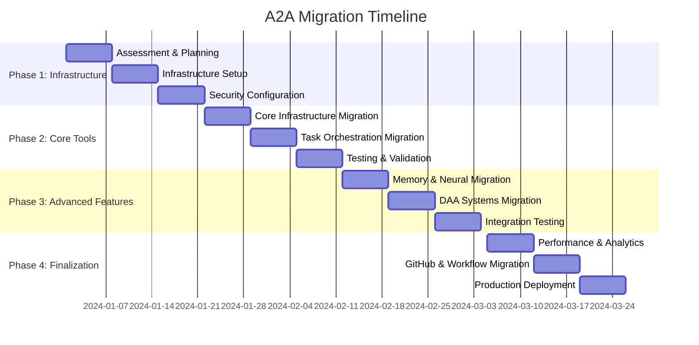

# A2A Migration Guide: From MCP-Only to A2A-Enabled Tools

## Table of Contents

- [Overview](#overview)
- [Migration Strategy](#migration-strategy)
- [Pre-Migration Assessment](#pre-migration-assessment)
- [Migration Phases](#migration-phases)
- [Tool-by-Tool Migration](#tool-by-tool-migration)
- [Code Examples](#code-examples)
- [Testing & Validation](#testing--validation)
- [Performance Considerations](#performance-considerations)
- [Troubleshooting](#troubleshooting)
- [Best Practices](#best-practices)
- [Rollback Strategy](#rollback-strategy)

## Overview

This guide provides comprehensive instructions for migrating from MCP-only tool usage to A2A-enabled distributed agent coordination in Gemini Flow. The migration enables your applications to leverage distributed AI agent networks for improved scalability, fault tolerance, and performance.

### Benefits of A2A Migration

- **Distributed Processing**: Scale operations across multiple agents
- **Fault Tolerance**: Automatic failover and recovery mechanisms
- **Enhanced Performance**: Parallel execution and load balancing
- **Advanced Coordination**: Consensus-based decision making
- **Resource Optimization**: Dynamic resource allocation and management

### Migration Scope

This migration covers all **104 A2A-enabled MCP tools** across **9 categories**:

1. **Core Infrastructure (16 tools)**: Swarm management, agent lifecycle
2. **Task Orchestration (12 tools)**: Task coordination, workflow management
3. **Memory & State (14 tools)**: Distributed memory, state synchronization
4. **Neural & AI (16 tools)**: Neural operations, model coordination
5. **DAA Systems (15 tools)**: Decentralized autonomous agents
6. **Performance & Analytics (12 tools)**: Monitoring, optimization
7. **GitHub Integration (8 tools)**: Repository coordination, PR management
8. **Workflow & Automation (6 tools)**: SPARC modes, automation
9. **System Infrastructure (11 tools)**: System operations, diagnostics

## Migration Strategy

### Migration Approaches

#### 1. Big Bang Migration
- **Timeline**: 1-2 weeks
- **Risk**: High
- **Suitable for**: Small deployments, development environments
- **Benefits**: Complete A2A capabilities immediately

#### 2. Phased Migration (Recommended)
- **Timeline**: 4-8 weeks
- **Risk**: Low-Medium
- **Suitable for**: Production environments, large deployments
- **Benefits**: Gradual transition, reduced risk, easier rollback

#### 3. Parallel Operation
- **Timeline**: Ongoing
- **Risk**: Low
- **Suitable for**: Critical production systems
- **Benefits**: Zero downtime, extensive testing period

### Migration Timeline



## Pre-Migration Assessment

### Current State Analysis

Before beginning migration, assess your current MCP usage:

```typescript
interface MCPUsageAssessment {
  // Tool usage analysis
  toolUsage: {
    toolName: string;
    usageFrequency: 'low' | 'medium' | 'high';
    criticalityLevel: 'low' | 'medium' | 'high' | 'critical';
    currentImplementation: 'synchronous' | 'asynchronous';
    errorHandling: 'basic' | 'comprehensive';
  }[];
  
  // Architecture analysis
  architecture: {
    currentPattern: 'single-agent' | 'multi-agent' | 'hybrid';
    scalabilityRequirements: string[];
    faultToleranceNeeds: string[];
    performanceRequirements: {
      latency: number;
      throughput: number;
      availability: number;
    };
  };
  
  // Resource analysis
  resources: {
    currentAgentCount: number;
    peakResourceUsage: {
      cpu: number;
      memory: number;
      network: number;
    };
    estimatedA2ARequirements: {
      additionalAgents: number;
      networkBandwidth: string;
      storageNeeds: string;
    };
  };
}

class MigrationAssessment {
  async assessCurrentUsage(): Promise<MCPUsageAssessment> {
    const assessment: MCPUsageAssessment = {
      toolUsage: [],
      architecture: {
        currentPattern: 'single-agent',
        scalabilityRequirements: [],
        faultToleranceNeeds: [],
        performanceRequirements: {
          latency: 0,
          throughput: 0,
          availability: 0
        }
      },
      resources: {
        currentAgentCount: 0,
        peakResourceUsage: { cpu: 0, memory: 0, network: 0 },
        estimatedA2ARequirements: {
          additionalAgents: 0,
          networkBandwidth: '',
          storageNeeds: ''
        }
      }
    };
    
    // Analyze current tool usage
    const toolUsage = await this.analyzeToolUsage();
    assessment.toolUsage = toolUsage;
    
    // Assess architecture requirements
    assessment.architecture = await this.assessArchitecture();
    
    // Calculate resource requirements
    assessment.resources = await this.calculateResourceRequirements();
    
    return assessment;
  }
  
  generateMigrationPlan(assessment: MCPUsageAssessment): MigrationPlan {
    return {
      phases: this.createMigrationPhases(assessment),
      timeline: this.calculateTimeline(assessment),
      riskAssessment: this.assessRisks(assessment),
      resourceRequirements: this.calculateMigrationResources(assessment),
      rollbackStrategy: this.createRollbackStrategy(assessment)
    };
  }
}
```

### Compatibility Check

Verify A2A compatibility for your current tools:

```typescript
class CompatibilityChecker {
  async checkA2ACompatibility(toolName: string): Promise<CompatibilityResult> {
    const compatibilityMatrix = {
      // Core Infrastructure - Full A2A Support
      'mcp__gemini-flow__swarm_init': { 
        compatible: true, 
        coordinationModes: ['broadcast', 'consensus'],
        migrationComplexity: 'low'
      },
      'mcp__gemini-flow__agent_spawn': { 
        compatible: true, 
        coordinationModes: ['direct', 'consensus'],
        migrationComplexity: 'low'
      },
      
      // Task Orchestration - Full A2A Support
      'mcp__gemini-flow__task_orchestrate': { 
        compatible: true, 
        coordinationModes: ['pipeline', 'broadcast', 'consensus'],
        migrationComplexity: 'medium'
      },
      'mcp__gemini-flow__parallel_execute': { 
        compatible: true, 
        coordinationModes: ['broadcast', 'pipeline'],
        migrationComplexity: 'low'
      },
      
      // Memory & State - Requires State Synchronization
      'mcp__gemini-flow__memory_usage': { 
        compatible: true, 
        coordinationModes: ['consensus', 'broadcast'],
        migrationComplexity: 'high',
        requirements: ['state-synchronization', 'consistency-guarantees']
      },
      
      // Neural & AI - Complex Coordination
      'mcp__gemini-flow__neural_train': { 
        compatible: true, 
        coordinationModes: ['parameter-server', 'consensus'],
        migrationComplexity: 'high',
        requirements: ['model-synchronization', 'distributed-training']
      }
    };
    
    const compatibility = compatibilityMatrix[toolName];
    
    if (!compatibility) {
      return {
        compatible: false,
        reason: 'Tool not found in A2A compatibility matrix',
        alternativeApproach: 'Use legacy MCP mode'
      };
    }
    
    return {
      compatible: true,
      coordinationModes: compatibility.coordinationModes,
      migrationComplexity: compatibility.migrationComplexity,
      requirements: compatibility.requirements || [],
      estimatedMigrationTime: this.estimateMigrationTime(compatibility.migrationComplexity)
    };
  }
}
```

## Migration Phases

### Phase 1: Infrastructure Setup (Week 1-3)

#### 1.1 A2A Infrastructure Deployment

Set up the core A2A infrastructure:

```typescript
class A2AInfrastructureSetup {
  async deployA2AInfrastructure(): Promise<void> {
    // 1. Deploy message bus
    await this.deployMessageBus({
      topology: 'mesh',
      maxConnections: 1000,
      security: {
        encryption: 'AES-256',
        authentication: 'certificate'
      }
    });
    
    // 2. Setup certificate authority
    await this.setupCertificateAuthority();
    
    // 3. Deploy agent registry
    await this.deployAgentRegistry();
    
    // 4. Setup state synchronization
    await this.setupStateManager();
    
    // 5. Deploy monitoring infrastructure
    await this.setupMonitoring();
  }
  
  async setupSecurityFramework(): Promise<void> {
    // Initialize security components
    const securityConfig = {
      zeroTrust: true,
      rateLimiting: true,
      auditLogging: true,
      threatDetection: true
    };
    
    await this.initializeA2ASecurity(securityConfig);
  }
}
```

#### 1.2 Agent Certificate Generation

Generate certificates for existing agents:

```bash
#!/bin/bash
# generate-agent-certificates.sh

# Create certificate directory
mkdir -p ./certificates/agents

# Generate certificates for existing agents
AGENTS=("agent-001" "agent-002" "agent-003")

for agent in "${AGENTS[@]}"; do
  echo "Generating certificate for $agent"
  
  # Generate private key
  openssl genrsa -out "./certificates/agents/${agent}-key.pem" 4096
  
  # Generate certificate signing request
  openssl req -new \
    -key "./certificates/agents/${agent}-key.pem" \
    -out "./certificates/agents/${agent}-csr.pem" \
    -subj "/C=US/O=Gemini Flow A2A/OU=Agent/CN=${agent}"
  
  # Sign certificate with CA
  openssl x509 -req \
    -in "./certificates/agents/${agent}-csr.pem" \
    -CA "./certificates/ca/ca-cert.pem" \
    -CAkey "./certificates/ca/ca-key.pem" \
    -CAcreateserial \
    -out "./certificates/agents/${agent}-cert.pem" \
    -days 365 \
    -extensions v3_req
done
```

### Phase 2: Core Tool Migration (Week 4-6)

#### 2.1 Swarm Management Migration

Migrate from single-instance to distributed swarm management:

**Before (MCP-only):**
```typescript
class LegacySwarmManager {
  async initializeSwarm(config: SwarmConfig): Promise<void> {
    // Single-instance swarm initialization
    const swarm = new Swarm(config);
    await swarm.initialize();
    
    // Spawn agents sequentially
    for (const agentConfig of config.agents) {
      await swarm.spawnAgent(agentConfig);
    }
  }
}
```

**After (A2A-enabled):**
```typescript
class A2ASwarmManager {
  async initializeSwarm(config: SwarmConfig): Promise<void> {
    // Distributed swarm initialization
    const message: A2AMessage = {
      target: {
        type: 'broadcast',
        filter: { role: 'swarm-coordinator' }
      },
      toolName: 'mcp__gemini-flow__swarm_init',
      parameters: {
        topology: config.topology,
        maxAgents: config.maxAgents,
        strategy: config.strategy
      },
      coordination: {
        mode: 'broadcast',
        aggregation: 'all',
        timeout: 30000
      },
      stateRequirements: [{
        type: 'write',
        namespace: 'swarm-config',
        keys: ['topology', 'max-agents'],
        consistency: 'strong'
      }]
    };
    
    const response = await this.messageBus.send(message);
    
    if (!response.success) {
      throw new Error(`Swarm initialization failed: ${response.error?.message}`);
    }
    
    // Coordinate agent spawning across multiple spawners
    await this.coordinateAgentSpawning(config, response.result);
  }
  
  private async coordinateAgentSpawning(
    config: SwarmConfig, 
    swarmInfo: any
  ): Promise<void> {
    const spawnTasks = config.agents.map(agentConfig => ({
      target: { type: 'group', role: 'agent-spawner', maxAgents: 1 },
      toolName: 'mcp__gemini-flow__agent_spawn',
      parameters: agentConfig,
      coordination: {
        mode: 'consensus',
        consensusType: 'majority',
        minimumParticipants: 2
      }
    }));
    
    const results = await Promise.all(
      spawnTasks.map(task => this.messageBus.send(task))
    );
    
    // Verify all agents spawned successfully
    const failedSpawns = results.filter(r => !r.success);
    if (failedSpawns.length > 0) {
      await this.handleSpawnFailures(failedSpawns);
    }
  }
}
```

#### 2.2 Task Orchestration Migration

**Before (MCP-only):**
```typescript
class LegacyTaskOrchestrator {
  async executeTask(task: Task): Promise<TaskResult> {
    // Sequential task execution
    const agent = await this.selectAgent(task.requirements);
    return await agent.execute(task);
  }
}
```

**After (A2A-enabled):**
```typescript
class A2ATaskOrchestrator {
  async executeTask(task: Task): Promise<TaskResult> {
    const orchestrationMessage: A2AMessage = {
      target: this.determineTargetStrategy(task),
      toolName: 'mcp__gemini-flow__task_orchestrate',
      parameters: {
        task: task.description,
        strategy: this.determineExecutionStrategy(task),
        maxAgents: task.parallelism || 3
      },
      coordination: this.determineCoordinationMode(task),
      resourceRequirements: task.resourceRequirements,
      stateRequirements: task.stateRequirements
    };
    
    const response = await this.messageBus.send(orchestrationMessage);
    
    if (!response.success) {
      return this.handleTaskFailure(task, response.error);
    }
    
    // Monitor task execution
    return await this.monitorTaskExecution(response.result.taskId);
  }
  
  private determineTargetStrategy(task: Task): AgentTarget {
    if (task.requiresSpecialization) {
      return {
        type: 'group',
        role: task.specializedRole,
        capabilities: task.requiredCapabilities,
        maxAgents: task.parallelism
      };
    }
    
    if (task.requiresConsensus) {
      return {
        type: 'multiple',
        agentIds: task.consensusParticipants,
        coordinationMode: 'parallel'
      };
    }
    
    return {
      type: 'single',
      agentId: task.preferredAgent
    };
  }
}
```

### Phase 3: Advanced Features Migration (Week 7-9)

#### 3.1 Memory & State Migration

Migrate from local memory to distributed state management:

**Before (MCP-only):**
```typescript
class LegacyMemoryManager {
  private localStorage: Map<string, any> = new Map();
  
  async store(key: string, value: any): Promise<void> {
    this.localStorage.set(key, value);
  }
  
  async retrieve(key: string): Promise<any> {
    return this.localStorage.get(key);
  }
}
```

**After (A2A-enabled):**
```typescript
class A2AMemoryManager {
  async store(
    key: string, 
    value: any, 
    options: DistributedStoreOptions = {}
  ): Promise<void> {
    const storeMessage: A2AMessage = {
      target: {
        type: 'group',
        role: 'memory-manager',
        maxAgents: options.replicationFactor || 3
      },
      toolName: 'mcp__gemini-flow__memory_usage',
      parameters: {
        action: 'store',
        key,
        value,
        namespace: options.namespace || 'default',
        ttl: options.ttl
      },
      coordination: {
        mode: 'consensus',
        consensusType: 'majority',
        votingTimeout: 10000
      },
      stateRequirements: [{
        type: 'write',
        namespace: options.namespace || 'default',
        keys: [key],
        consistency: options.consistency || 'strong'
      }]
    };
    
    const response = await this.messageBus.send(storeMessage);
    
    if (!response.success) {
      throw new Error(`Distributed store failed: ${response.error?.message}`);
    }
    
    // Verify replication
    await this.verifyReplication(key, options.namespace, options.replicationFactor);
  }
  
  async retrieve(
    key: string, 
    options: DistributedRetrieveOptions = {}
  ): Promise<any> {
    const retrieveMessage: A2AMessage = {
      target: {
        type: 'group',
        role: 'memory-manager',
        maxAgents: options.consistency === 'strong' ? 3 : 1
      },
      toolName: 'mcp__gemini-flow__memory_usage',
      parameters: {
        action: 'retrieve',
        key,
        namespace: options.namespace || 'default'
      },
      coordination: options.consistency === 'strong' 
        ? { mode: 'consensus', consensusType: 'majority' }
        : { mode: 'direct' },
      stateRequirements: [{
        type: 'read',
        namespace: options.namespace || 'default',
        keys: [key],
        consistency: options.consistency || 'eventual'
      }]
    };
    
    const response = await this.messageBus.send(retrieveMessage);
    
    if (!response.success) {
      if (response.error?.code === 'KEY_NOT_FOUND') {
        return undefined;
      }
      throw new Error(`Distributed retrieve failed: ${response.error?.message}`);
    }
    
    return response.result.value;
  }
}
```

#### 3.2 Neural Operations Migration

Migrate to distributed neural network training:

**Before (MCP-only):**
```typescript
class LegacyNeuralTrainer {
  async trainModel(config: TrainingConfig): Promise<TrainingResult> {
    const model = new NeuralNetwork(config.architecture);
    
    for (let epoch = 0; epoch < config.epochs; epoch++) {
      const batch = await this.getTrainingBatch();
      const loss = model.train(batch);
      
      if (epoch % 10 === 0) {
        console.log(`Epoch ${epoch}, Loss: ${loss}`);
      }
    }
    
    return { model: model.serialize(), finalLoss: model.getLoss() };
  }
}
```

**After (A2A-enabled):**
```typescript
class A2ANeuralTrainer {
  async trainModel(config: DistributedTrainingConfig): Promise<TrainingResult> {
    const trainingMessage: A2AMessage = {
      target: {
        type: 'multiple',
        agentIds: config.workerAgents,
        coordinationMode: 'parallel'
      },
      toolName: 'mcp__gemini-flow__neural_train',
      parameters: {
        modelType: config.modelType,
        architecture: config.architecture,
        trainingData: config.dataSource,
        hyperparameters: config.hyperparameters,
        coordination: {
          mode: 'parameter-server',
          synchronization: config.syncMode || 'async',
          aggregationMethod: 'federated-averaging'
        }
      },
      coordination: {
        mode: 'pipeline',
        stages: [
          {
            name: 'initialization',
            agentTarget: { type: 'single', agentId: config.parameterServer },
            toolName: 'mcp__gemini-flow__neural_train'
          },
          {
            name: 'distributed-training',
            agentTarget: { type: 'multiple', agentIds: config.workerAgents },
            toolName: 'mcp__gemini-flow__neural_train'
          },
          {
            name: 'model-aggregation',
            agentTarget: { type: 'single', agentId: config.parameterServer },
            toolName: 'mcp__gemini-flow__neural_train'
          }
        ]
      },
      stateRequirements: [{
        type: 'shared',
        namespace: 'neural-training',
        keys: ['model-weights', 'gradients', 'training-state'],
        consistency: 'eventual'
      }],
      resourceRequirements: [{
        type: 'gpu',
        amount: config.workerAgents.length,
        unit: 'device',
        priority: 'high'
      }]
    };
    
    const response = await this.messageBus.send(trainingMessage);
    
    if (!response.success) {
      throw new Error(`Distributed training failed: ${response.error?.message}`);
    }
    
    // Monitor training progress
    return await this.monitorDistributedTraining(response.result.trainingId);
  }
  
  private async monitorDistributedTraining(trainingId: string): Promise<TrainingResult> {
    let completed = false;
    let result: TrainingResult;
    
    while (!completed) {
      const statusMessage: A2AMessage = {
        target: { type: 'single', agentId: 'training-coordinator' },
        toolName: 'mcp__gemini-flow__neural_status',
        parameters: { trainingId },
        coordination: { mode: 'direct' }
      };
      
      const response = await this.messageBus.send(statusMessage);
      
      if (response.success) {
        const status = response.result;
        
        console.log(`Training Progress: Epoch ${status.currentEpoch}/${status.totalEpochs}, Loss: ${status.currentLoss}`);
        
        if (status.status === 'completed') {
          completed = true;
          result = status.result;
        } else if (status.status === 'failed') {
          throw new Error(`Training failed: ${status.error}`);
        }
      }
      
      await new Promise(resolve => setTimeout(resolve, 5000)); // Check every 5 seconds
    }
    
    return result;
  }
}
```

### Phase 4: Advanced Coordination (Week 10-12)

#### 4.1 DAA (Decentralized Autonomous Agents) Migration

Implement consensus-based decision making:

```typescript
class A2ADAManager {
  async initializeConsensus(proposal: ConsensusProposal): Promise<ConsensusResult> {
    const consensusMessage: A2AMessage = {
      target: {
        type: 'multiple',
        agentIds: proposal.participants,
        coordinationMode: 'parallel'
      },
      toolName: 'mcp__ruv-swarm__daa_consensus',
      parameters: {
        proposal: {
          type: proposal.type,
          details: proposal.details,
          priority: proposal.priority
        },
        algorithm: proposal.algorithm || 'raft',
        timeout: proposal.timeout || 30000,
        threshold: proposal.threshold || 0.67
      },
      coordination: {
        mode: 'consensus',
        consensusType: proposal.consensusType || 'majority',
        minimumParticipants: Math.ceil(proposal.participants.length / 2)
      }
    };
    
    const response = await this.messageBus.send(consensusMessage);
    
    if (!response.success) {
      throw new Error(`Consensus initiation failed: ${response.error?.message}`);
    }
    
    return response.result;
  }
  
  async coordinateResourceAllocation(
    requestingAgent: string,
    resources: ResourceRequest[]
  ): Promise<ResourceAllocation> {
    const allocationProposal: ConsensusProposal = {
      type: 'resource-allocation',
      details: {
        requestingAgent,
        resources,
        duration: 3600000 // 1 hour
      },
      participants: await this.getResourceManagers(),
      algorithm: 'raft',
      threshold: 0.6,
      priority: 'medium'
    };
    
    return await this.initializeConsensus(allocationProposal);
  }
}
```

## Code Examples

### Complete Migration Example

Here's a complete example showing migration from MCP-only to A2A for a typical workflow:

**Before (MCP-only):**
```typescript
class LegacyWorkflow {
  async executeComplexWorkflow(workflowConfig: WorkflowConfig): Promise<WorkflowResult> {
    const results: any[] = [];
    
    // Sequential execution
    for (const step of workflowConfig.steps) {
      try {
        const agent = await this.getAgent(step.agentType);
        const result = await agent.execute(step.task);
        results.push(result);
      } catch (error) {
        // Simple error handling
        console.error(`Step ${step.name} failed:`, error);
        throw error;
      }
    }
    
    return { results, status: 'completed' };
  }
}
```

**After (A2A-enabled):**
```typescript
class A2AWorkflow {
  async executeComplexWorkflow(workflowConfig: A2AWorkflowConfig): Promise<WorkflowResult> {
    // Create distributed workflow
    const workflowMessage: A2AMessage = {
      target: {
        type: 'single',
        agentId: 'workflow-coordinator'
      },
      toolName: 'mcp__gemini-flow__workflow_create',
      parameters: {
        name: workflowConfig.name,
        steps: workflowConfig.steps.map(step => ({
          name: step.name,
          targetAgents: this.determineTargetAgents(step),
          toolName: step.toolName,
          parameters: step.parameters,
          dependencies: step.dependencies,
          retryPolicy: step.retryPolicy || {
            maxRetries: 3,
            backoffStrategy: 'exponential'
          }
        })),
        executionStrategy: workflowConfig.strategy || 'adaptive',
        failureHandling: workflowConfig.failureHandling || {
          strategy: 'partial-retry',
          continueOnFailure: false
        }
      },
      coordination: {
        mode: 'pipeline',
        stages: this.createPipelineStages(workflowConfig),
        failureStrategy: 'abort',
        statePassthrough: true
      },
      stateRequirements: [{
        type: 'shared',
        namespace: 'workflow-execution',
        keys: ['progress', 'intermediate-results', 'shared-state'],
        consistency: 'strong'
      }],
      resourceRequirements: this.calculateResourceRequirements(workflowConfig)
    };
    
    const response = await this.messageBus.send(workflowMessage);
    
    if (!response.success) {
      throw new Error(`Workflow creation failed: ${response.error?.message}`);
    }
    
    // Execute workflow with distributed coordination
    const executionMessage: A2AMessage = {
      target: {
        type: 'single',
        agentId: 'workflow-coordinator'
      },
      toolName: 'mcp__gemini-flow__workflow_execute',
      parameters: {
        workflowId: response.result.workflowId,
        executionContext: {
          priority: workflowConfig.priority || 'medium',
          deadline: workflowConfig.deadline,
          resourceLimits: workflowConfig.resourceLimits
        }
      },
      coordination: { mode: 'direct', timeout: 300000 } // 5 minutes
    };
    
    const executionResponse = await this.messageBus.send(executionMessage);
    
    if (!executionResponse.success) {
      throw new Error(`Workflow execution failed: ${executionResponse.error?.message}`);
    }
    
    // Monitor execution with real-time updates
    return await this.monitorWorkflowExecution(
      executionResponse.result.executionId,
      workflowConfig.monitoringOptions
    );
  }
  
  private async monitorWorkflowExecution(
    executionId: string,
    options: MonitoringOptions = {}
  ): Promise<WorkflowResult> {
    return new Promise((resolve, reject) => {
      const monitor = new WorkflowMonitor(executionId, {
        pollingInterval: options.pollingInterval || 1000,
        timeout: options.timeout || 600000, // 10 minutes
        onProgress: options.onProgress,
        onStepComplete: options.onStepComplete,
        onError: options.onError
      });
      
      monitor.on('completed', (result: WorkflowResult) => {
        resolve(result);
      });
      
      monitor.on('failed', (error: Error) => {
        reject(error);
      });
      
      monitor.start();
    });
  }
  
  private determineTargetAgents(step: WorkflowStep): AgentTarget {
    if (step.parallelExecution) {
      return {
        type: 'multiple',
        agentIds: step.assignedAgents,
        coordinationMode: 'parallel'
      };
    }
    
    if (step.requiresSpecialist) {
      return {
        type: 'group',
        role: step.specialistRole,
        capabilities: step.requiredCapabilities,
        maxAgents: step.maxAgents || 1,
        selectionStrategy: 'capability-matched'
      };
    }
    
    if (step.requiresConsensus) {
      return {
        type: 'group',
        role: step.consensusRole,
        maxAgents: step.consensusParticipants || 3
      };
    }
    
    return {
      type: 'single',
      agentId: step.preferredAgent || 'default-agent'
    };
  }
}
```

## Testing & Validation

### Migration Testing Strategy

```typescript
class MigrationTester {
  async validateMigration(toolName: string): Promise<ValidationResult> {
    const testSuite = await this.createTestSuite(toolName);
    const results: TestResult[] = [];
    
    // 1. Functional testing
    const functionalResult = await this.runFunctionalTests(toolName, testSuite.functional);
    results.push(functionalResult);
    
    // 2. Performance testing
    const performanceResult = await this.runPerformanceTests(toolName, testSuite.performance);
    results.push(performanceResult);
    
    // 3. Coordination testing
    const coordinationResult = await this.runCoordinationTests(toolName, testSuite.coordination);
    results.push(coordinationResult);
    
    // 4. Failure testing
    const failureResult = await this.runFailureTests(toolName, testSuite.failure);
    results.push(failureResult);
    
    return this.aggregateResults(results);
  }
  
  private async runCoordinationTests(
    toolName: string, 
    tests: CoordinationTest[]
  ): Promise<TestResult> {
    const testResults: TestCaseResult[] = [];
    
    for (const test of tests) {
      const startTime = Date.now();
      
      try {
        // Test different coordination modes
        for (const mode of test.coordinationModes) {
          const message: A2AMessage = {
            target: test.target,
            toolName,
            parameters: test.parameters,
            coordination: { mode, ...test.coordinationOptions }
          };
          
          const response = await this.messageBus.send(message);
          
          if (!response.success) {
            throw new Error(`Coordination test failed: ${response.error?.message}`);
          }
          
          // Validate coordination behavior
          await this.validateCoordinationBehavior(mode, response, test.expectedBehavior);
        }
        
        testResults.push({
          name: test.name,
          status: 'passed',
          duration: Date.now() - startTime
        });
        
      } catch (error) {
        testResults.push({
          name: test.name,
          status: 'failed',
          duration: Date.now() - startTime,
          error: error.message
        });
      }
    }
    
    return {
      category: 'coordination',
      passed: testResults.filter(r => r.status === 'passed').length,
      failed: testResults.filter(r => r.status === 'failed').length,
      results: testResults
    };
  }
}
```

### Integration Testing

```typescript
class IntegrationTester {
  async testEndToEndScenario(scenario: TestScenario): Promise<void> {
    console.log(`Testing scenario: ${scenario.name}`);
    
    // Setup test environment
    await this.setupTestEnvironment(scenario);
    
    try {
      // Execute scenario steps
      for (const step of scenario.steps) {
        await this.executeStep(step);
        await this.validateStepResults(step);
      }
      
      // Validate final state
      await this.validateFinalState(scenario.expectedState);
      
      console.log(`✅ Scenario ${scenario.name} passed`);
      
    } catch (error) {
      console.error(`❌ Scenario ${scenario.name} failed:`, error);
      throw error;
    } finally {
      // Cleanup
      await this.cleanupTestEnvironment(scenario);
    }
  }
}
```

## Performance Considerations

### Performance Monitoring

```typescript
class MigrationPerformanceMonitor {
  async comparePerformance(
    toolName: string,
    legacyImplementation: () => Promise<any>,
    a2aImplementation: () => Promise<any>
  ): Promise<PerformanceComparison> {
    const iterations = 100;
    
    // Benchmark legacy implementation
    const legacyMetrics = await this.benchmark(legacyImplementation, iterations);
    
    // Benchmark A2A implementation
    const a2aMetrics = await this.benchmark(a2aImplementation, iterations);
    
    return {
      tool: toolName,
      legacy: legacyMetrics,
      a2a: a2aMetrics,
      improvement: {
        latency: this.calculateImprovement(legacyMetrics.avgLatency, a2aMetrics.avgLatency),
        throughput: this.calculateImprovement(legacyMetrics.throughput, a2aMetrics.throughput),
        errorRate: this.calculateImprovement(legacyMetrics.errorRate, a2aMetrics.errorRate)
      }
    };
  }
  
  private async benchmark(
    implementation: () => Promise<any>, 
    iterations: number
  ): Promise<PerformanceMetrics> {
    const latencies: number[] = [];
    const errors: number[] = [];
    let successCount = 0;
    
    const startTime = Date.now();
    
    for (let i = 0; i < iterations; i++) {
      const operationStart = Date.now();
      
      try {
        await implementation();
        const latency = Date.now() - operationStart;
        latencies.push(latency);
        successCount++;
      } catch (error) {
        errors.push(i);
      }
    }
    
    const totalTime = Date.now() - startTime;
    
    return {
      avgLatency: latencies.reduce((a, b) => a + b, 0) / latencies.length,
      p95Latency: this.calculatePercentile(latencies, 95),
      p99Latency: this.calculatePercentile(latencies, 99),
      throughput: successCount / (totalTime / 1000),
      errorRate: errors.length / iterations,
      successRate: successCount / iterations
    };
  }
}
```

## Troubleshooting

### Common Migration Issues

#### 1. Certificate Authentication Failures

**Issue**: Agents fail to authenticate with A2A infrastructure
**Symptoms**: `AUTHENTICATION_FAILED` errors, connection timeouts
**Solution**:

```typescript
class CertificateDebugger {
  async diagnoseCertificateIssues(agentId: string): Promise<void> {
    // Check certificate validity
    const cert = await this.getCertificate(agentId);
    if (!cert) {
      console.error(`No certificate found for agent ${agentId}`);
      return;
    }
    
    // Validate certificate chain
    const chainValid = await this.validateCertificateChain(cert);
    if (!chainValid.valid) {
      console.error(`Certificate chain invalid: ${chainValid.reason}`);
    }
    
    // Check expiration
    if (new Date() > cert.notAfter) {
      console.error(`Certificate expired on ${cert.notAfter}`);
    }
    
    // Test connection
    try {
      await this.testCertificateAuthentication(agentId);
      console.log('✅ Certificate authentication successful');
    } catch (error) {
      console.error('❌ Certificate authentication failed:', error.message);
    }
  }
}
```

#### 2. State Synchronization Conflicts

**Issue**: Distributed state becomes inconsistent
**Symptoms**: Stale data, state conflicts, inconsistent results
**Solution**:

```typescript
class StateSyncDebugger {
  async diagnoseStateSyncIssues(namespace: string): Promise<void> {
    // Check state consistency across replicas
    const replicas = await this.getStateReplicas(namespace);
    const consistencyReport = await this.checkConsistency(replicas);
    
    if (!consistencyReport.consistent) {
      console.error('State inconsistency detected:', consistencyReport.conflicts);
      
      // Attempt reconciliation
      await this.reconcileState(namespace, consistencyReport.conflicts);
    }
    
    // Check synchronization latency
    const syncLatency = await this.measureSyncLatency(namespace);
    if (syncLatency > 1000) {
      console.warn(`High sync latency detected: ${syncLatency}ms`);
    }
  }
}
```

#### 3. Coordination Timeouts

**Issue**: Coordination operations timeout frequently
**Symptoms**: `COORDINATION_TIMEOUT` errors, incomplete operations
**Solution**:

```typescript
class CoordinationDebugger {
  async diagnoseCoordinationTimeouts(toolName: string): Promise<void> {
    // Analyze coordination patterns
    const patterns = await this.analyzeCoordinationPatterns(toolName);
    
    if (patterns.avgCoordinationTime > 30000) {
      console.warn('Coordination taking longer than expected');
      
      // Suggest optimizations
      const optimizations = this.suggestOptimizations(patterns);
      console.log('Suggested optimizations:', optimizations);
    }
    
    // Check agent availability
    const availability = await this.checkAgentAvailability(toolName);
    if (availability.unavailableCount > 0) {
      console.error(`${availability.unavailableCount} agents unavailable`);
    }
  }
}
```

## Best Practices

### 1. Gradual Migration

- Start with non-critical tools
- Test thoroughly in development environment
- Implement feature flags for easy rollback
- Monitor performance continuously

### 2. Error Handling

```typescript
class RobustA2AImplementation {
  async executeWithFallback(
    primaryMessage: A2AMessage,
    fallbackAction: () => Promise<any>
  ): Promise<any> {
    try {
      const response = await this.messageBus.send(primaryMessage);
      if (response.success) {
        return response.result;
      }
      
      // Log A2A failure
      console.warn('A2A execution failed, falling back to legacy mode:', response.error);
      
      // Use fallback
      return await fallbackAction();
      
    } catch (error) {
      console.error('A2A execution error, using fallback:', error);
      return await fallbackAction();
    }
  }
}
```

### 3. Performance Optimization

```typescript
class A2AOptimizer {
  optimizeForPerformance(message: A2AMessage): A2AMessage {
    // Use connection pooling
    message.connectionPooling = true;
    
    // Enable message batching for high-frequency operations
    if (this.isHighFrequency(message.toolName)) {
      message.batching = {
        enabled: true,
        maxBatchSize: 50,
        maxWaitTime: 100
      };
    }
    
    // Optimize target selection
    message.target = this.optimizeTargetSelection(message.target);
    
    // Use appropriate consistency level
    if (message.stateRequirements) {
      message.stateRequirements = message.stateRequirements.map(req => ({
        ...req,
        consistency: this.optimizeConsistencyLevel(req)
      }));
    }
    
    return message;
  }
}
```

## Rollback Strategy

### Emergency Rollback Procedure

```typescript
class MigrationRollback {
  async emergencyRollback(affectedTools: string[]): Promise<void> {
    console.log('🚨 Initiating emergency rollback');
    
    // 1. Stop A2A operations
    await this.stopA2AOperations(affectedTools);
    
    // 2. Switch to legacy implementations
    await this.switchToLegacyMode(affectedTools);
    
    // 3. Verify rollback success
    await this.verifyRollback(affectedTools);
    
    // 4. Preserve state for analysis
    await this.preserveA2AState();
    
    console.log('✅ Emergency rollback completed');
  }
  
  async plannedRollback(tool: string, reason: string): Promise<void> {
    console.log(`Rolling back ${tool}: ${reason}`);
    
    // 1. Graceful shutdown of A2A operations
    await this.gracefulShutdown(tool);
    
    // 2. Migrate state back to legacy storage
    await this.migrateStateToLegacy(tool);
    
    // 3. Switch implementation
    await this.switchImplementation(tool, 'legacy');
    
    // 4. Validate functionality
    await this.validateLegacyOperation(tool);
    
    console.log(`✅ Rollback of ${tool} completed`);
  }
}
```

### Rollback Testing

```typescript
class RollbackTester {
  async testRollbackScenarios(): Promise<void> {
    const scenarios = [
      'network-partition',
      'high-latency',
      'agent-failures',
      'state-corruption',
      'security-breach'
    ];
    
    for (const scenario of scenarios) {
      console.log(`Testing rollback scenario: ${scenario}`);
      
      // Simulate the failure condition
      await this.simulateFailure(scenario);
      
      // Execute rollback
      await this.executeRollback(scenario);
      
      // Verify system recovery
      await this.verifyRecovery(scenario);
      
      console.log(`✅ Rollback scenario ${scenario} successful`);
    }
  }
}
```

## Summary

This migration guide provides a comprehensive roadmap for transitioning from MCP-only to A2A-enabled tool usage. Key takeaways:

1. **Plan thoroughly**: Assess your current usage and plan migration phases
2. **Start small**: Begin with non-critical tools and gradually expand
3. **Test extensively**: Implement comprehensive testing at each phase
4. **Monitor continuously**: Track performance and reliability metrics
5. **Prepare for rollback**: Have rollback procedures ready for any issues

The A2A migration enables powerful distributed agent coordination capabilities while maintaining backward compatibility and providing graceful fallback mechanisms. Follow this guide systematically to ensure a successful migration to A2A-enabled Gemini Flow operations.