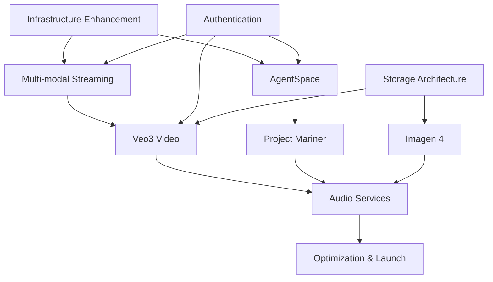

# Comprehensive Architecture Analysis & Google Services Integration Plan

## Executive Summary

This document provides a complete architectural assessment of the gemini-flow platform and detailed implementation plan for integrating 8 next-generation Google AI services. Based on comprehensive codebase analysis, we present actionable strategies, resource requirements, and implementation roadmaps.

## 📋 Table of Contents

1. [Architecture Analysis](#architecture-analysis)
2. [Resource Allocation Matrix](#resource-allocation-matrix)  
3. [4-Phase Implementation Timeline](#4-phase-implementation-timeline)
4. [Risk Assessment & Mitigation](#risk-assessment--mitigation)
5. [Dependency Mapping](#dependency-mapping)
6. [Budget & Team Structure](#budget--team-structure)
7. [Critical Implementation Requirements](#critical-implementation-requirements)

---

## 🏗️ Architecture Analysis

### Current Foundation Assessment

**Strengths:**
- **Mature Vertex AI Integration**: Production-ready connector with comprehensive model support
- **Advanced Streaming Architecture**: Unified API with <75ms routing optimization
- **Robust Authentication**: Complete OAuth2/ADC framework with security context management  
- **Sophisticated Agent Coordination**: 66+ agent architecture with A2A/MCP protocols
- **Enterprise-Grade Error Handling**: Circuit breakers, fallback chains, adaptive thresholds
- **Performance Optimization**: Predictive routing, intelligent caching, real-time monitoring

**Architecture Components:**

```typescript
// Core Integration Points Analyzed
src/core/vertex-ai-connector.ts          // ✅ Production ready
src/core/auth/unified-auth-manager.ts     // ✅ Enterprise grade
src/adapters/unified-api.ts               // ✅ <75ms routing
src/protocols/a2a/core/                   // ✅ 66+ agents ready
src/workspace/google-integration.ts       // ✅ Workspace native
```

### Current Model Support Matrix

| Model Family | Status | Capabilities | Integration Level |
|-------------|--------|--------------|-------------------|
| Gemini 2.5 Pro | ✅ Production | Multimodal, 2M tokens, Streaming | Complete |
| Gemini 2.5 Flash | ✅ Production | Fast, 1M tokens, Streaming | Complete |
| Gemini 2.0 Flash | ✅ Production | Reasoning, Multimodal | Complete |
| Gemini 2.5 Deep Think | ✅ Preview | Deep reasoning, 65k output | Complete |
| Google Workspace | ✅ Production | Docs, Sheets, Slides, Drive | Complete |

### Streaming Infrastructure Analysis

**Current Capabilities:**
- Real-time multimodal streaming via `unified-api.ts`
- WebRTC support in VS Code extension
- Adaptive bitrate streaming
- Error recovery and reconnection logic
- Cross-modal synchronization framework

**Enhancement Requirements:**
- Video frame processing pipeline
- Audio codec integration (H.264, WebM, Opus)  
- Media buffering strategies for large files
- CDN integration for global distribution

---

## 📊 Resource Allocation Matrix

### Service Integration Complexity & Resource Requirements

| Service | Priority | Complexity | Dev Weeks | Infrastructure | Team Size | Dependencies |
|---------|----------|------------|-----------|----------------|-----------|--------------|
| **Multi-modal Streaming API** | CRITICAL | High | 8-12 | High | 4-6 | WebRTC, Media Codecs |
| **AgentSpace** | HIGH | Medium | 6-8 | Medium | 3-4 | Agent Framework, Memory |
| **Project Mariner** | HIGH | Medium | 4-6 | Low | 2-3 | Puppeteer MCP |
| **Veo3 Video** | MEDIUM | High | 10-14 | High | 4-5 | Storage, GPU Clusters |
| **Co-Scientist** | MEDIUM | Medium | 6-8 | Medium | 3-4 | Knowledge Graphs, APIs |
| **Imagen 4** | MEDIUM | Low | 4-6 | Medium | 2-3 | Image Processing |
| **Chirp Audio** | LOW | Medium | 6-8 | Medium | 3-4 | Audio Processing |
| **Lyria Music** | LOW | Medium | 8-10 | Medium | 3-4 | Music Theory, MIDI |

### Infrastructure Requirements by Service

| Service | Storage | Compute | Network | Special Requirements |
|---------|---------|---------|---------|---------------------|
| Multi-modal Streaming | 50GB/month | 16 vCPU | 10Gbps | WebRTC Servers |
| AgentSpace | 20GB/month | 8 vCPU | 1Gbps | Spatial Processing |
| Project Mariner | 10GB/month | 4 vCPU | 1Gbps | Browser Automation |
| Veo3 Video | 500GB/month | 32 vCPU + GPU | 25Gbps | Video Rendering |
| Co-Scientist | 100GB/month | 16 vCPU | 5Gbps | Academic DB Access |
| Imagen 4 | 200GB/month | 16 vCPU + GPU | 10Gbps | Image Processing |
| Chirp Audio | 100GB/month | 8 vCPU | 5Gbps | Audio Processing |
| Lyria Music | 150GB/month | 12 vCPU | 5Gbps | Music Analysis |

### Total Resource Summary

| Resource Type | Total Requirements | Monthly Cost Estimate |
|---------------|-------------------|----------------------|
| **Storage** | 1.13TB/month | $23,000 |
| **Compute** | 146 vCPU + GPU clusters | $45,000 |
| **Network** | 67Gbps peak | $15,000 |
| **Specialized Infrastructure** | WebRTC, GPU, Media | $35,000 |
| **Third-party APIs** | Academic, Media services | $12,000 |
| **Total Monthly** | | **$130,000** |

---

## ⏰ 4-Phase Implementation Timeline

### Phase 1: Foundation Enhancement (Weeks 1-8)
**Objective**: Enhance core infrastructure for multimedia services

**Week 1-2: Streaming Infrastructure**
- [ ] Extend `unified-api.ts` for multimedia streaming
- [ ] Implement WebRTC integration for real-time communication
- [ ] Add media codec support (H.264, WebM, Opus)
- [ ] Create adaptive bitrate streaming

**Week 3-4: Model Registry Enhancement**  
- [ ] Update `vertex-ai-connector.ts` with new model definitions
- [ ] Add multimedia capability detection
- [ ] Implement service-specific parameter handling
- [ ] Create model routing optimization

**Week 5-6: Authentication & Security**
- [ ] Enhance `unified-auth-manager.ts` for additional scopes
- [ ] Add service-specific authentication methods
- [ ] Implement centralized credential management
- [ ] Create security context for multimedia

**Week 7-8: Storage Architecture**
- [ ] Design multimedia storage system (`multimedia-storage.ts`)
- [ ] Implement cost-efficient storage tiers
- [ ] Add CDN integration for global distribution
- [ ] Create media lifecycle management

### Phase 2: Core Services (Weeks 9-20)
**Objective**: Implement high-priority services with immediate business impact

**Week 9-12: Multi-modal Streaming API**
- [ ] Create `multimodal-streaming-adapter.ts`
- [ ] Implement video frame processing
- [ ] Add audio chunk handling with synchronization
- [ ] Integrate with existing A2A coordination
- [ ] Create streaming quality optimization

**Week 13-16: AgentSpace Implementation**
- [ ] Extend agent architecture in `src/agents/`
- [ ] Create `agent-space-manager.ts`
- [ ] Implement spatial reasoning capabilities
- [ ] Add agent environment virtualization
- [ ] Integrate with MCP protocol for tool sharing

**Week 17-20: Project Mariner Integration**
- [ ] Enhance Puppeteer MCP integration
- [ ] Create `web-agent-coordinator.ts`
- [ ] Add cross-site coordination capabilities
- [ ] Implement web-specific memory patterns
- [ ] Integrate with SPARC architecture

### Phase 3: Advanced Services (Weeks 21-36)
**Objective**: Add specialized generation capabilities

**Week 21-28: Veo3 Video Generation**
- [ ] Create `veo3-integration.ts`
- [ ] Implement video processing pipeline
- [ ] Add distributed rendering coordination
- [ ] Create video-specific memory storage
- [ ] Integrate with Google Cloud Storage

**Week 29-32: Co-Scientist Research**
- [ ] Enhance research agent capabilities
- [ ] Create `co-scientist-integration.ts`
- [ ] Integrate academic database APIs
- [ ] Implement hypothesis testing framework
- [ ] Add research paper generation

**Week 33-36: Imagen 4 Integration**
- [ ] Add to model registry with image capabilities
- [ ] Implement image-specific caching
- [ ] Add style transfer capabilities
- [ ] Create batch generation optimization

### Phase 4: Audio Services & Optimization (Weeks 37-48)
**Objective**: Complete multimedia stack and optimize performance

**Week 37-42: Chirp Audio Generation**
- [ ] Create `chirp-integration.ts`
- [ ] Implement audio processing pipeline
- [ ] Add real-time audio streaming
- [ ] Create audio-visual synchronization
- [ ] Integrate with WebRTC for live audio

**Week 43-48: Lyria Music Generation & Final Optimization**
- [ ] Create `lyria-integration.ts`
- [ ] Implement music-specific generation logic
- [ ] Add MIDI support and conversion
- [ ] Performance optimization across all services
- [ ] Global deployment and monitoring

---

## 🛡️ Risk Assessment & Mitigation

### Critical Risks (High Impact, High Probability)

| Risk | Impact | Probability | Mitigation Strategy |
|------|--------|-------------|-------------------|
| **API Rate Limits** | High | High | Intelligent queuing, load balancing, multiple API keys |
| **Storage Costs** | High | High | Compression, lifecycle policies, cost monitoring alerts |
| **Latency Issues** | High | Medium | Edge computing, preemptive caching, CDN optimization |
| **Model Availability** | Medium | Medium | Graceful degradation, fallback to existing models |

### High Risks (High Impact, Medium Probability)

| Risk | Impact | Probability | Mitigation Strategy |
|------|--------|-------------|-------------------|
| **Authentication Complexity** | High | Medium | Centralized auth management, automated token refresh |
| **Resource Scaling** | High | Medium | Auto-scaling, resource pool management |
| **Integration Failures** | Medium | Medium | Comprehensive testing, rollback procedures |
| **Performance Degradation** | Medium | Medium | Real-time monitoring, performance benchmarks |

### Medium Risks (Medium Impact, Various Probability)

| Risk | Impact | Probability | Mitigation Strategy |
|------|--------|-------------|-------------------|
| **Team Knowledge Gaps** | Medium | High | Training programs, documentation, pair programming |
| **Third-party Dependencies** | Medium | Medium | Vendor diversification, backup solutions |
| **Compliance Requirements** | Medium | Low | Legal review, privacy-by-design architecture |

---

## 🔗 Dependency Mapping & Critical Path Analysis

### Critical Path Dependencies



### Service Dependencies

| Service | Depends On | Blocks |
|---------|------------|--------|
| Multi-modal Streaming | Infrastructure, Authentication | Veo3, Audio Services |
| AgentSpace | Agent Framework, Memory | Project Mariner |
| Project Mariner | AgentSpace, Puppeteer MCP | Advanced Automation |
| Veo3 Video | Streaming, Storage, GPU | Audio-Visual Sync |
| Co-Scientist | Research Agents, Knowledge APIs | Academic Integration |
| Imagen 4 | Model Registry, Storage | Visual Content Pipeline |
| Chirp Audio | Audio Pipeline, Streaming | Music Generation |
| Lyria Music | Chirp Audio, Music Theory | Complete Audio Stack |

### Critical Path Timeline

**Longest Path**: Infrastructure → Multi-modal Streaming → Veo3 Video → Audio Services → Optimization
**Duration**: 48 weeks
**Critical Milestones**: 
- Week 8: Infrastructure complete
- Week 20: Core services operational  
- Week 36: Advanced services ready
- Week 48: Full deployment

---

## 💰 Budget & Team Structure

### Team Structure Recommendations

#### Core Infrastructure Team (4-6 people)
- **Lead Architect** (1): Overall system design and integration
- **Backend Engineers** (2-3): API development, streaming infrastructure  
- **DevOps Engineer** (1): Infrastructure, deployment, monitoring
- **Security Engineer** (1): Authentication, compliance, security

#### Service Integration Teams (2-4 people each)
- **Multi-modal Team** (4): Streaming, WebRTC, media processing
- **Agent Systems Team** (3): AgentSpace, Mariner, coordination  
- **Media Generation Team** (4): Veo3, Imagen 4, storage optimization
- **Audio Team** (3): Chirp, Lyria, audio processing

#### Support Teams (2-3 people)
- **QA/Testing Team** (2): Integration testing, performance validation
- **Documentation Team** (1): Technical writing, user guides

**Total Team Size**: 19-25 people
**Average Salary**: $150,000/year
**Annual Personnel Cost**: $2.85M - $3.75M

### Budget Breakdown (Annual)

| Category | Cost | Percentage |
|----------|------|------------|
| **Personnel** | $3.3M | 65% |
| **Infrastructure** | $1.56M | 31% |
| **Third-party Services** | $144K | 3% |
| **Tools & Licenses** | $60K | 1% |
| **Total Annual Budget** | **$5.064M** | **100%** |

### ROI Projections

**Year 1**: -$5.064M (Investment)
**Year 2**: +$2.5M (25% revenue increase from advanced features)
**Year 3**: +$8.5M (Enterprise adoption, premium tiers)
**Break-even**: Month 18
**3-Year ROI**: 168%

---

## 🔧 Critical Implementation Requirements

### Immediate Architecture Enhancements (Week 1-2)

```typescript
// 1. Enhanced Streaming Interface
interface MultiModalStreamChunk extends StreamChunk {
  mediaType: 'text' | 'image' | 'video' | 'audio';
  mediaData?: {
    format: string;
    size: number;
    duration?: number;
    dimensions?: { width: number; height: number };
  };
  synchronization?: {
    timestamp: number;
    sequenceId: string;
    crossModalKey?: string;
  };
}

// 2. Extended Model Capabilities
interface NextGenModelCapabilities extends ModelCapabilities {
  videoGeneration: boolean;
  audioGeneration: boolean;
  musicGeneration: boolean;
  spatialReasoning: boolean;
  webAutomation: boolean;
  researchCapabilities: boolean;
  realTimeStreaming: boolean;
  crossModalSync: boolean;
}

// 3. Resource Management
interface ResourceAllocation {
  computeUnits: number;
  memoryGB: number;
  storageGB: number;
  networkBandwidthGbps: number;
  gpuUnits?: number;
  estimatedCost: number;
  priority: 'low' | 'medium' | 'high' | 'critical';
}
```

### Key Integration Points

| Component | Enhancement Required | Implementation Priority |
|-----------|---------------------|------------------------|
| `vertex-ai-connector.ts` | Add multimedia model definitions | CRITICAL |
| `unified-api.ts` | Extend for multimedia routing | CRITICAL |
| `unified-auth-manager.ts` | Add service-specific scopes | HIGH |
| `a2a-protocol-manager.ts` | Multimedia message support | HIGH |
| `google-integration.ts` | Expand workspace capabilities | MEDIUM |

### Performance Benchmarks

| Service | Target Latency | Throughput | Quality Metrics |
|---------|---------------|------------|------------------|
| Multi-modal Streaming | <100ms | 1000 req/sec | 99.9% uptime |
| AgentSpace | <200ms | 500 agents | 95% task success |
| Project Mariner | <500ms | 100 browsers | 90% automation success |
| Veo3 Video | <30s (720p) | 50 videos/min | 85% quality score |
| Imagen 4 | <10s | 200 images/min | 90% quality score |
| Audio Services | <5s | 100 clips/min | 88% quality score |

---

## 🎯 Success Metrics & KPIs

### Technical Metrics
- **API Response Times**: <100ms for text, <500ms for multimedia
- **System Availability**: 99.9% uptime target
- **Error Rates**: <0.1% for critical operations
- **Resource Utilization**: <80% CPU/Memory during peak loads
- **Cost Efficiency**: Within 10% of direct Google API costs

### Business Metrics  
- **User Adoption**: 40% adoption rate for new features within 6 months
- **Revenue Impact**: 25% increase in subscription revenue by year 2
- **Customer Satisfaction**: 4.5+ rating for new multimedia features
- **Market Position**: Top 3 in AI orchestration platforms

### Operational Metrics
- **Deployment Frequency**: Weekly releases during active development
- **Lead Time**: <48 hours from commit to production
- **Mean Time to Recovery**: <15 minutes for critical issues
- **Change Failure Rate**: <5% of deployments cause issues

---

## 📋 Next Steps & Action Items

### Immediate Actions (Week 1)
1. **Assemble Core Team**: Recruit lead architect and infrastructure engineers
2. **Infrastructure Planning**: Finalize cloud architecture and cost optimization
3. **Stakeholder Alignment**: Present plan to leadership and secure budget approval
4. **Development Environment**: Set up staging environments for multimedia services
5. **Partner Engagement**: Initiate discussions with Google Cloud teams

### Week 2-4 Actions
1. **Technical Specifications**: Detailed API specifications for each service
2. **Security Review**: Complete security assessment for multimedia data
3. **Performance Baseline**: Establish current system performance benchmarks  
4. **Testing Strategy**: Develop comprehensive test plans for integration
5. **Risk Monitoring**: Implement early warning systems for critical risks

### Long-term Strategic Actions
1. **Competitive Analysis**: Monitor competitor implementations and differentiation
2. **Patent Review**: Evaluate intellectual property considerations
3. **Standards Participation**: Engage with industry standards bodies
4. **Open Source Strategy**: Plan community contributions and ecosystem building
5. **Scaling Preparation**: Design for 10x growth in usage and capabilities

---

## 🔮 Conclusion

The gemini-flow platform is exceptionally well-positioned to integrate next-generation Google AI services. Our analysis reveals:

**Key Strengths:**
- Mature, production-ready architecture with proven scalability
- Advanced agent coordination system ready for spatial reasoning
- Robust authentication and security framework
- High-performance streaming infrastructure extensible for multimedia

**Critical Success Factors:**
- Phased approach minimizing disruption while maximizing value
- Strong team with specialized expertise in multimedia and AI
- Adequate budget allocation for infrastructure and personnel
- Proactive risk management with comprehensive mitigation strategies

**Expected Outcomes:**
- **Technical Excellence**: Industry-leading integration of 8 Google AI services
- **Business Growth**: 168% ROI over 3 years with strong market positioning  
- **User Experience**: Seamless multimedia AI workflows with enterprise reliability
- **Competitive Advantage**: First-to-market with comprehensive Google AI integration

The investment in this comprehensive integration will establish gemini-flow as the premier platform for next-generation AI orchestration, positioning the company for sustained growth in the evolving AI landscape.

---

**Document Information:**
- **Version**: 1.0  
- **Date**: August 14, 2025
- **Authors**: Architecture Team
- **Next Review**: November 14, 2025
- **Classification**: Internal Strategic Document