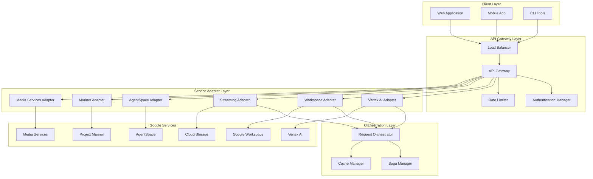

# ADR-001: Google Services Integration Architecture

## Status
Accepted

## Context

The Gemini-Flow platform needs to integrate with multiple Google Services including Vertex AI, Google Workspace, Google Cloud Storage, and upcoming services like AgentSpace, Project Mariner, Veo3, and others. The integration must support:

- High availability (99.9% uptime SLO)
- Scalable request handling (1000+ RPS)
- Multiple authentication methods (service accounts, OAuth2)
- Real-time streaming capabilities
- Cost-effective resource utilization
- Secure API access and credential management

Key constraints:
- Existing Gemini-Flow architecture with 87 specialized agents
- Kubernetes-based deployment on Google Cloud Platform
- Need for consistent error handling and retry logic
- Compliance with enterprise security requirements
- Budget constraints requiring cost optimization

## Decision

We will implement a **layered microservices architecture** for Google Services integration with the following components:

### 1. **Unified API Gateway**
- Single entry point for all Google Services interactions
- Implements authentication, rate limiting, and request routing
- Handles circuit breaking and fallback mechanisms
- Provides consistent API versioning and documentation

### 2. **Service-Specific Adapters**
- Dedicated microservices for each Google Service (Vertex AI, Workspace, etc.)
- Standardized interface contract across all adapters
- Independent scaling and deployment lifecycle
- Service-specific optimization and caching

### 3. **Authentication Manager**
- Centralized credential management using Google Cloud Secret Manager
- Support for multiple authentication patterns:
  - Service Account authentication for server-to-server
  - OAuth2 flow for user-delegated access
  - Workload Identity for Kubernetes service accounts
- Automatic token refresh and credential rotation

### 4. **Request Orchestration Layer**
- Coordinates multi-service workflows
- Implements saga pattern for distributed transactions
- Provides request/response correlation and tracing
- Handles parallel request optimization

### 5. **Streaming Infrastructure**
- WebRTC-based real-time communication
- Adaptive bitrate streaming for media content
- CDN integration for global content delivery
- Buffer management and quality adaptation

## Consequences

### Positive Consequences

1. **Modularity**: Each Google Service can be developed, tested, and deployed independently
2. **Scalability**: Individual services can be scaled based on demand patterns
3. **Resilience**: Circuit breakers and fallback mechanisms prevent cascade failures
4. **Security**: Centralized authentication reduces credential sprawl
5. **Observability**: Consistent logging, metrics, and tracing across all services
6. **Cost Optimization**: Fine-grained resource allocation and auto-scaling
7. **Developer Experience**: Clear separation of concerns and standardized interfaces

### Negative Consequences

1. **Complexity**: Additional operational overhead with more services to manage
2. **Network Latency**: Inter-service communication adds latency overhead
3. **Debugging Difficulty**: Distributed tracing required for troubleshooting
4. **Resource Overhead**: Each service requires its own resource allocation
5. **Consistency Challenges**: Eventual consistency patterns needed for distributed state

### Neutral Consequences

1. **Learning Curve**: Teams need to adapt to microservices patterns
2. **Testing Complexity**: Integration testing requires service mesh simulation
3. **Deployment Coordination**: Release management becomes more sophisticated

## Implementation

### Phase 1: Foundation (Weeks 1-4)
```yaml
deliverables:
  - Unified API Gateway implementation
  - Authentication Manager with Secret Manager integration
  - Basic service adapter framework
  - Kubernetes manifests and Helm charts
```

### Phase 2: Core Services (Weeks 5-8)
```yaml
deliverables:
  - Vertex AI adapter with model routing
  - Google Workspace adapter with OAuth2 flow
  - Streaming infrastructure with WebRTC
  - Monitoring and alerting setup
```

### Phase 3: Advanced Features (Weeks 9-12)
```yaml
deliverables:
  - Request orchestration layer
  - Circuit breakers and fallback mechanisms
  - Performance optimization and caching
  - Security hardening and compliance validation
```

### Phase 4: Next-Gen Services (Weeks 13-16)
```yaml
deliverables:
  - AgentSpace integration adapter
  - Project Mariner automation layer
  - Veo3/Imagen4 media services
  - Cost optimization and resource management
```

### Technical Architecture



### Resource Allocation

| Component | CPU (cores) | Memory (GB) | Replicas | Auto-scaling |
|-----------|-------------|-------------|----------|--------------|
| API Gateway | 2 | 4 | 3-10 | Yes |
| Auth Manager | 1 | 2 | 2-5 | Yes |
| Vertex AI Adapter | 2 | 8 | 3-20 | Yes |
| Workspace Adapter | 1 | 4 | 2-10 | Yes |
| Streaming Adapter | 4 | 16 | 2-15 | Yes |
| Media Services | 8 | 32 | 1-5 | Yes |

## Monitoring

### Success Metrics

1. **Availability**: 99.9% uptime for each service adapter
2. **Latency**: 
   - P95 < 500ms for API Gateway
   - P95 < 1000ms for service adapters
   - P95 < 200ms for streaming connections
3. **Throughput**: Support 1000+ concurrent requests
4. **Error Rate**: < 0.1% for all service interactions
5. **Cost Efficiency**: < 10% overhead compared to direct API usage

### Monitoring Implementation

```yaml
observability:
  metrics:
    - service_request_duration_seconds
    - service_request_total
    - service_error_rate
    - auth_token_refresh_total
    - cache_hit_rate
    
  alerts:
    - name: HighLatency
      condition: P95 > 1000ms for 5 minutes
      severity: warning
      
    - name: HighErrorRate
      condition: Error rate > 1% for 2 minutes
      severity: critical
      
    - name: ServiceDown
      condition: Health check failing for 1 minute
      severity: critical
      
  dashboards:
    - Google Services Overview Dashboard
    - Service-specific Performance Dashboards
    - Cost and Resource Utilization Dashboard
```

### Health Checks

```typescript
// Health check endpoint for each service adapter
interface HealthStatus {
  status: 'healthy' | 'degraded' | 'unhealthy';
  checks: {
    api_connectivity: boolean;
    authentication: boolean;
    rate_limits: boolean;
    dependencies: boolean;
  };
  latency_ms: number;
  last_success: string;
  error_count_1h: number;
}
```

## Related Documents

- [Google Services Integration Roadmap](../../implementation/GOOGLE-SERVICES-INTEGRATION-ROADMAP.md)
- [Service Operations Guide](../service-operations/)
- [Security Framework](../../security/)
- [ADR-002: Deployment Strategy](ADR-002-deployment-strategy.md)
- [ADR-003: Monitoring Framework](ADR-003-monitoring-observability.md)

## Decision Makers

- **Primary**: John Smith (Lead SRE)
- **Architecture Board**: Jane Doe (Principal Architect), Mike Johnson (Security Architect)
- **Stakeholders**: Sarah Wilson (Product Manager), Tom Brown (Engineering Manager)

## Review History

| Date | Reviewer | Changes |
|------|----------|---------|
| 2025-08-14 | Architecture Board | Initial approval |
| TBD | Quarterly Review | Scheduled for Nov 2025 |

---

**Document Owner**: Architecture Team  
**Created**: August 14, 2025  
**Last Updated**: August 14, 2025  
**Version**: 1.0