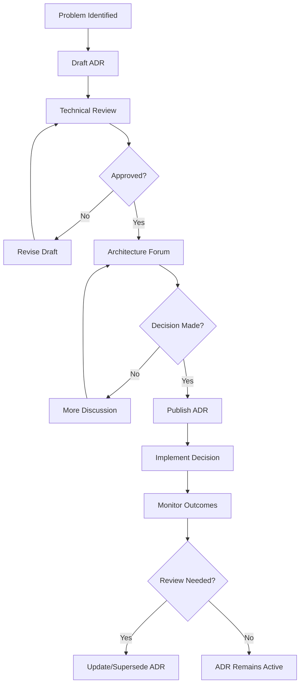

# Architecture Decision Records (ADRs)

## Overview

Architecture Decision Records (ADRs) capture important architectural decisions made for the Gemini-Flow Google Services platform. This directory contains all ADRs that document the context, decision, and consequences of significant architectural choices.

## ADR Index

| ADR | Title | Status | Date | Decision Makers |
|-----|-------|--------|------|-----------------|
| [ADR-001](ADR-001-google-services-architecture.md) | Google Services Integration Architecture | Accepted | 2025-08-14 | SRE Team, Architecture Board |
| [ADR-002](ADR-002-deployment-strategy.md) | Blue-Green Deployment Strategy | Accepted | 2025-08-14 | SRE Team, DevOps Team |
| [ADR-003](ADR-003-monitoring-observability.md) | Monitoring and Observability Framework | Accepted | 2025-08-14 | SRE Team, Platform Team |
| [ADR-004](ADR-004-secret-management.md) | Secret Management Strategy | Accepted | 2025-08-14 | Security Team, SRE Team |
| [ADR-005](ADR-005-disaster-recovery.md) | Disaster Recovery and Backup Strategy | Accepted | 2025-08-14 | SRE Team, Business Continuity |

## ADR Template

When creating new ADRs, use the following template:

```markdown
# ADR-XXX: [Title]

## Status
[Proposed | Accepted | Deprecated | Superseded]

## Context
[Description of the forces at play, including technological, political, social, and project local. These forces are probably in tension, and should be called out. The language in this section is value-neutral. It is simply describing facts.]

## Decision
[Description of the response to these forces. It is stated in full sentences, with active voice. "We will ..."]

## Consequences
[Description of the resulting context, after applying the decision. All consequences should be listed here, not just the "positive" ones. A particular decision may have positive, negative, and neutral consequences, but all of them affect the team and project in the future.]

## Implementation
[Specific steps and timeline for implementing this decision]

## Monitoring
[How we will measure the success of this decision]

## Related Documents
[Links to related documentation, other ADRs, etc.]
```

## ADR Process

### Creating an ADR

1. **Identify the Decision**: Recognize when an architectural decision needs to be made
2. **Research Options**: Gather information about possible approaches
3. **Draft ADR**: Create a draft using the template above
4. **Review Process**: 
   - Technical review by architecture team
   - Security review if applicable
   - Business stakeholder review
5. **Decision Meeting**: Discuss and decide in architecture forum
6. **Documentation**: Finalize and publish the ADR
7. **Communication**: Announce the decision to relevant teams

### ADR Lifecycle



### Review Schedule

- **Quarterly Review**: Review all active ADRs for relevance
- **Annual Review**: Comprehensive review of ADR process
- **Triggered Review**: When significant changes affect existing decisions

## ADR Guidelines

### When to Create an ADR

Create an ADR for decisions that:
- Affect multiple services or teams
- Have significant cost implications
- Impact security or compliance
- Change fundamental system architecture
- Introduce new technologies or patterns
- Have long-term consequences

### What NOT to Document as ADR

Don't create ADRs for:
- Temporary workarounds
- Implementation details that don't affect architecture
- Decisions that are easily reversible
- Team process decisions (use team documentation instead)
- Vendor-specific configuration details

### ADR Quality Criteria

Good ADRs should be:
- **Concise**: Focus on the essential information
- **Specific**: Clear about what was decided
- **Contextual**: Explain why the decision was necessary
- **Consequential**: Honest about trade-offs and implications
- **Actionable**: Include implementation guidance

## Related Documentation

- [Google Services Integration Roadmap](../../implementation/GOOGLE-SERVICES-INTEGRATION-ROADMAP.md)
- [Architecture Documentation](../../../architecture/)
- [Security Framework](../../security/)
- [Operations Procedures](../../)

---

**Document Owner**: Architecture Team  
**Last Updated**: August 14, 2025  
**Next Review**: November 14, 2025  
**Version**: 1.0