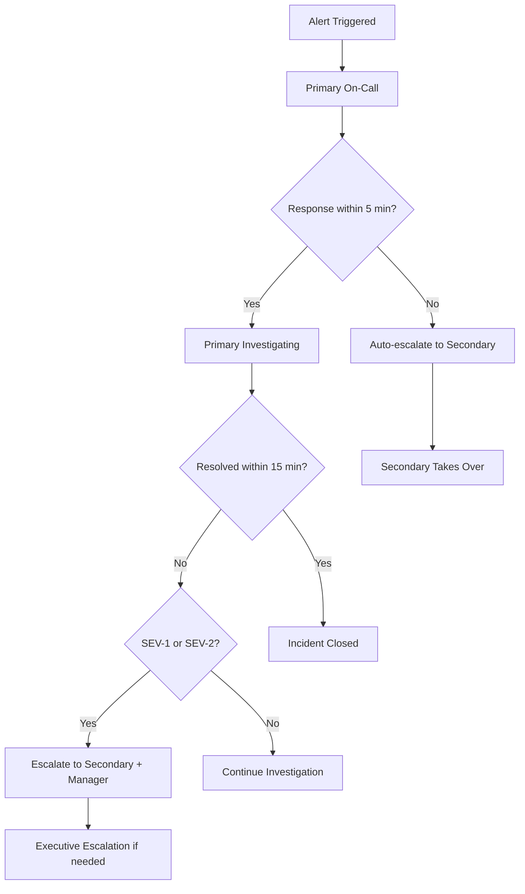

# On-Call Setup Guide

## Overview

This document provides comprehensive instructions for setting up and managing the on-call rotation for Gemini-Flow Google Services operations. The on-call system ensures 24/7 coverage for production incidents while maintaining engineer work-life balance.

## Table of Contents

1. [On-Call Philosophy](#on-call-philosophy)
2. [Rotation Structure](#rotation-structure)
3. [Responsibilities](#responsibilities)
4. [Escalation Process](#escalation-process)
5. [Tools Setup](#tools-setup)
6. [Handoff Procedures](#handoff-procedures)
7. [Burnout Prevention](#burnout-prevention)

## On-Call Philosophy

### Core Principles

1. **Shared Responsibility**: On-call is a team responsibility, not individual burden
2. **Learning Opportunity**: Use incidents as opportunities to improve systems
3. **Sustainable Practice**: Maintain healthy work-life balance for long-term effectiveness
4. **Blameless Culture**: Focus on system improvements, not individual blame
5. **Continuous Improvement**: Regularly review and enhance on-call processes

### Success Metrics

- **MTTR (Mean Time To Recovery)**: < 15 minutes for SEV-1, < 1 hour for SEV-2
- **Alert Noise Ratio**: < 10% false positive alerts
- **On-Call Satisfaction**: > 7/10 engineer satisfaction score
- **Incident Prevention**: 80% of incidents should result in preventive measures

## Rotation Structure

### Primary/Secondary Model

```yaml
# On-Call Rotation Structure
primary_rotation:
  duration: 1_week
  handoff_time: "09:00 UTC Monday"
  coverage: "24/7"
  responsibilities:
    - First responder to all alerts
    - Incident command for SEV-1/SEV-2
    - Customer communication
    - Post-incident coordination

secondary_rotation:
  duration: 1_week  
  handoff_time: "09:00 UTC Monday"
  coverage: "Business hours + escalation"
  responsibilities:
    - Backup for primary on-call
    - Complex technical investigations
    - Cross-team coordination
    - Knowledge sharing support

manager_rotation:
  duration: 1_month
  coverage: "Business hours"
  responsibilities:
    - Executive escalation
    - Resource allocation decisions
    - Customer relationship management
    - Process improvement oversight
```

### Team Assignment

| Role | Team Members | Requirements |
|------|--------------|--------------|
| **Primary Pool** | Senior SREs, DevOps Engineers | 2+ years experience, incident response training |
| **Secondary Pool** | All SREs, Senior Developers | 1+ years experience, basic on-call training |
| **Manager Pool** | Engineering Managers, Tech Leads | Leadership experience, escalation authority |

### Schedule Example

```
Week 1: Alice (Primary), Bob (Secondary), Manager A
Week 2: Charlie (Primary), Alice (Secondary), Manager A  
Week 3: David (Primary), Charlie (Secondary), Manager B
Week 4: Bob (Primary), David (Secondary), Manager B
```

## Responsibilities

### Primary On-Call Engineer

#### Core Duties
- **Alert Response**: Acknowledge and respond to all alerts within 5 minutes
- **Incident Management**: Lead incident response for SEV-1 and SEV-2 incidents
- **Communication**: Update stakeholders and maintain status page
- **Documentation**: Record incident timeline and initial analysis

#### Daily Activities
- **Morning Handoff**: 15-minute call with previous on-call at 09:00 UTC
- **System Health Check**: Review dashboards and recent alerts
- **Runbook Updates**: Document any issues or improvements discovered
- **Evening Summary**: Send daily summary to team channel

#### Code Example - Alert Response Automation
```bash
#!/bin/bash
# on-call-alert-response.sh - Automated alert acknowledgment

ALERT_ID="$1"
SEVERITY="$2"
SERVICE="$3"

# Acknowledge alert in PagerDuty
pd incident ack --incident-id "$ALERT_ID"

# Join incident channel
slack_channel="#incident-${ALERT_ID}"
slack join "$slack_channel"

# Post initial response
slack post "$slack_channel" "🚨 Primary on-call responding to $SEVERITY alert for $SERVICE. Investigating..."

# Gather initial data
kubectl get pods -n gemini-flow -o wide > "/tmp/pods-${ALERT_ID}.txt"
kubectl logs -n gemini-flow -l app=gemini-flow --since=10m > "/tmp/logs-${ALERT_ID}.txt"

# Start health check
./scripts/health-check.sh > "/tmp/health-${ALERT_ID}.txt"

# Update status
slack post "$slack_channel" "📊 Initial data gathered. Health check results: $(head -1 /tmp/health-${ALERT_ID}.txt)"
```

### Secondary On-Call Engineer

#### Core Duties
- **Backup Support**: Available for escalation within 15 minutes
- **Technical Deep Dive**: Handle complex technical investigations
- **Knowledge Sharing**: Assist with unfamiliar systems or procedures
- **Incident Prevention**: Focus on root cause analysis and prevention

#### On-Call Toolkit Setup
```bash
#!/bin/bash
# setup-oncall-toolkit.sh - Prepare on-call environment

echo "Setting up on-call toolkit..."

# Install required tools
brew install kubectl helm gcloud jq yq

# Configure kubectl contexts
kubectl config set-context gemini-flow-prod --cluster=gke_project_us-central1_prod --user=oncall@company.com
kubectl config set-context gemini-flow-staging --cluster=gke_project_us-central1_staging --user=oncall@company.com

# Setup aliases
cat >> ~/.bashrc << 'EOF'
alias k='kubectl'
alias kgp='kubectl get pods'
alias kgs='kubectl get services'
alias kdp='kubectl describe pod'
alias kl='kubectl logs'
alias klf='kubectl logs -f'

# Gemini-Flow specific
alias gf-pods='kubectl get pods -n gemini-flow'
alias gf-logs='kubectl logs -n gemini-flow -l app=gemini-flow'
alias gf-health='curl -s http://gemini-flow-service/health | jq'
EOF

# Setup monitoring shortcuts
mkdir -p ~/oncall-scripts
cat > ~/oncall-scripts/quick-check.sh << 'EOF'
#!/bin/bash
echo "=== Gemini-Flow Quick Health Check ==="
echo "Pods Status:"
kubectl get pods -n gemini-flow
echo -e "\nService Status:"
kubectl get services -n gemini-flow
echo -e "\nRecent Errors:"
kubectl logs -n gemini-flow -l app=gemini-flow --since=5m | grep -i error | tail -5
EOF

chmod +x ~/oncall-scripts/quick-check.sh

echo "On-call toolkit setup complete!"
```

## Escalation Process

### Escalation Matrix



### Escalation Triggers

| Condition | Action | Timeline |
|-----------|--------|----------|
| No response to alert | Auto-escalate to secondary | 5 minutes |
| SEV-1 incident | Immediate secondary + manager notification | Immediate |
| Extended incident (>1 hour) | Manager escalation | 60 minutes |
| Customer-facing impact | Customer success team notification | 15 minutes |
| Security incident | Security team + CISO notification | Immediate |

### Escalation Scripts

```bash
#!/bin/bash
# escalate-incident.sh - Automated incident escalation

INCIDENT_ID="$1"
SEVERITY="$2"
REASON="$3"

case $SEVERITY in
    "SEV-1")
        # Page entire team
        pd incident escalate --incident-id "$INCIDENT_ID" --escalation-policy "sev1-all-hands"
        
        # Notify executives
        slack post "#executive-alerts" "🚨 SEV-1 incident $INCIDENT_ID requires executive attention"
        
        # Create war room
        zoom create-meeting --topic "SEV-1 Incident $INCIDENT_ID" --auto-record
        ;;
        
    "SEV-2")
        # Page secondary + manager
        pd incident escalate --incident-id "$INCIDENT_ID" --escalation-policy "sev2-escalation"
        
        # Notify stakeholders
        slack post "#stakeholder-updates" "SEV-2 incident $INCIDENT_ID escalated: $REASON"
        ;;
        
    *)
        # Standard escalation
        pd incident escalate --incident-id "$INCIDENT_ID" --escalation-policy "standard-escalation"
        ;;
esac

# Log escalation
echo "$(date): Escalated $INCIDENT_ID ($SEVERITY) - $REASON" >> /var/log/oncall/escalations.log
```

## Tools Setup

### PagerDuty Configuration

```yaml
# pagerduty-config.yaml
services:
  - name: "Gemini-Flow Production"
    integration_key: "YOUR_INTEGRATION_KEY"
    escalation_policy: "gemini-flow-escalation"
    alert_creation: "create_alerts_and_incidents"
    
escalation_policies:
  - name: "gemini-flow-escalation"
    teams: ["sre-team"]
    escalation_rules:
      - delay_minutes: 0
        targets:
          - type: "user_reference"
            id: "primary-oncall-schedule"
      - delay_minutes: 5
        targets:
          - type: "user_reference" 
            id: "secondary-oncall-schedule"
      - delay_minutes: 15
        targets:
          - type: "user_reference"
            id: "manager-oncall-schedule"

schedules:
  - name: "Primary On-Call"
    time_zone: "UTC"
    schedule_layers:
      - name: "Weekly Rotation"
        start: "2025-08-14T09:00:00Z"
        rotation_virtual_start: "2025-08-14T09:00:00Z"
        rotation_turn_length_seconds: 604800  # 1 week
        users:
          - user: "alice@company.com"
          - user: "bob@company.com" 
          - user: "charlie@company.com"
          - user: "david@company.com"
```

### Slack Integration

```javascript
// slack-oncall-bot.js - On-call Slack automation
const { WebClient } = require('@slack/web-api');
const slack = new WebClient(process.env.SLACK_BOT_TOKEN);

class OnCallBot {
    async notifyHandoff(previousOnCall, newOnCall, notes) {
        const message = {
            channel: '#oncall-handoffs',
            blocks: [
                {
                    type: 'header',
                    text: {
                        type: 'plain_text',
                        text: '🔄 On-Call Handoff'
                    }
                },
                {
                    type: 'section',
                    fields: [
                        {
                            type: 'mrkdwn',
                            text: `*Previous On-Call:*\n<@${previousOnCall}>`
                        },
                        {
                            type: 'mrkdwn',
                            text: `*New On-Call:*\n<@${newOnCall}>`
                        }
                    ]
                },
                {
                    type: 'section',
                    text: {
                        type: 'mrkdwn',
                        text: `*Handoff Notes:*\n${notes}`
                    }
                }
            ]
        };
        
        await slack.chat.postMessage(message);
    }
    
    async createIncidentChannel(incidentId, severity) {
        const channelName = `incident-${incidentId}`;
        
        // Create channel
        const channel = await slack.conversations.create({
            name: channelName,
            is_private: false
        });
        
        // Set channel purpose
        await slack.conversations.setPurpose({
            channel: channel.channel.id,
            purpose: `${severity} incident response and coordination`
        });
        
        // Invite relevant users
        const onCallUsers = await this.getOnCallUsers();
        await slack.conversations.invite({
            channel: channel.channel.id,
            users: onCallUsers.join(',')
        });
        
        return channel.channel.id;
    }
    
    async getOnCallUsers() {
        // Integration with PagerDuty to get current on-call users
        // Implementation depends on your PagerDuty setup
        return ['primary-oncall-user', 'secondary-oncall-user'];
    }
}

module.exports = OnCallBot;
```

### Monitoring Dashboard Setup

```bash
#!/bin/bash
# setup-oncall-monitoring.sh - Configure monitoring for on-call

# Create on-call specific Grafana dashboard
curl -X POST http://grafana:3000/api/dashboards/db \
  -H "Content-Type: application/json" \
  -H "Authorization: Bearer $GRAFANA_API_KEY" \
  -d @oncall-dashboard.json

# Setup Prometheus alerts for on-call
kubectl apply -f - <<EOF
apiVersion: monitoring.coreos.com/v1
kind: PrometheusRule
metadata:
  name: oncall-alerts
  namespace: monitoring
spec:
  groups:
  - name: oncall.rules
    rules:
    - alert: OnCallResponseTime
      expr: increase(pagerduty_incident_response_time_seconds[5m]) > 300
      for: 0m
      labels:
        severity: warning
      annotations:
        summary: "On-call response time exceeded 5 minutes"
        description: "On-call engineer took longer than 5 minutes to respond"
        
    - alert: ExcessiveAlerts
      expr: increase(alertmanager_notifications_total[1h]) > 50
      for: 0m
      labels:
        severity: warning  
      annotations:
        summary: "Excessive alerts sent to on-call"
        description: "More than 50 alerts sent in the last hour"
EOF

echo "On-call monitoring setup complete"
```

## Handoff Procedures

### Daily Handoff Checklist

```markdown
# On-Call Handoff Checklist

## Previous On-Call (Outgoing)

### Pre-Handoff (30 minutes before)
- [ ] Review overnight incidents and alerts
- [ ] Prepare handoff notes in shared document
- [ ] Check for any ongoing investigations
- [ ] Review scheduled maintenance activities
- [ ] Update any runbook improvements discovered

### During Handoff Call (15 minutes)
- [ ] Brief on system status and recent changes
- [ ] Discuss any ongoing issues or investigations  
- [ ] Share context on recent alerts and their resolution
- [ ] Highlight any upcoming maintenance or deployments
- [ ] Transfer any open incident tickets

### Post-Handoff
- [ ] Update PagerDuty schedule if needed
- [ ] Post handoff summary in #oncall-handoffs channel
- [ ] Remove yourself from incident channels if appropriate

## New On-Call (Incoming)

### Pre-Handoff Preparation
- [ ] Review system status dashboard
- [ ] Check for any scheduled activities today
- [ ] Ensure on-call toolkit is ready
- [ ] Verify access to all required systems
- [ ] Review recent incident reports

### During Handoff Call
- [ ] Ask questions about anything unclear
- [ ] Confirm understanding of ongoing issues
- [ ] Get contact info for any pending escalations
- [ ] Review any customer-facing impacts

### Post-Handoff
- [ ] Test alert reception (ask team to trigger test alert)
- [ ] Post introduction in #oncall-updates channel
- [ ] Review and update personal contact information
- [ ] Perform initial system health check
```

### Handoff Documentation Template

```markdown
# On-Call Handoff - [DATE]

**From:** [Previous On-Call Name]  
**To:** [New On-Call Name]  
**Time:** [Handoff Time UTC]

## System Status
- Overall health: [Green/Yellow/Red]
- Active incidents: [Number and brief description]
- Ongoing investigations: [Any ongoing work]

## Recent Activity (Last 24 Hours)
- Total alerts: [Number]
- Incidents: [Brief summary of any incidents]
- Deployments: [Any recent deployments]
- Maintenance: [Any maintenance activities]

## Ongoing Issues
1. [Issue 1 - description, current status, next steps]
2. [Issue 2 - description, current status, next steps]

## Upcoming Activities
- [Any scheduled maintenance]
- [Planned deployments]
- [Team meetings or reviews]

## Notes and Recommendations
- [Any specific things to watch for]
- [Runbook improvements needed]
- [System quirks or known issues]

## Emergency Contacts
- Secondary On-Call: [Name, Phone]
- Manager: [Name, Phone]
- SMEs: [Relevant experts and contact info]

**Handoff Complete:** [Timestamp]
```

## Burnout Prevention

### Workload Management

1. **Alert Tuning**: Regularly review and reduce false positive alerts
2. **Automation**: Automate common responses and investigation steps
3. **Knowledge Sharing**: Ensure multiple people can handle each type of incident
4. **Reasonable Expectations**: Set realistic response time expectations

### Support Mechanisms

```yaml
# Burnout Prevention Framework
support_mechanisms:
  peer_support:
    - Monthly on-call retrospectives
    - Buddy system for new on-call engineers
    - Incident post-mortems focused on learning
    
  management_support:
    - Regular 1:1s with focus on on-call experience
    - Time off after major incidents
    - Recognition for good incident response
    
  system_improvements:
    - Quarterly alert review sessions
    - Investment in monitoring and automation
    - Runbook improvement initiatives
    
  wellness_programs:
    - Mental health resources
    - Stress management training
    - Flexible work arrangements during/after on-call
```

### Metrics and Monitoring

```bash
#!/bin/bash
# oncall-wellness-metrics.sh - Track on-call wellness indicators

# Calculate on-call workload metrics
echo "=== On-Call Wellness Metrics ==="

# Alert frequency
ALERTS_LAST_WEEK=$(pd incidents list --since="1 week ago" --until="now" | wc -l)
echo "Alerts last week: $ALERTS_LAST_WEEK"

# After-hours incidents
AFTER_HOURS=$(pd incidents list --since="1 week ago" --until="now" | jq '[.incidents[] | select(.created_at | strptime("%Y-%m-%dT%H:%M:%SZ") | .tm_hour < 8 or .tm_hour > 18)] | length')
echo "After-hours incidents: $AFTER_HOURS"

# Average response time
AVG_RESPONSE=$(pd incidents list --since="1 week ago" --until="now" | jq '[.incidents[] | .response_time] | add / length')
echo "Average response time: ${AVG_RESPONSE}s"

# Generate recommendation
if [[ $ALERTS_LAST_WEEK -gt 50 ]]; then
    echo "⚠️  High alert volume - consider alert tuning"
fi

if [[ $AFTER_HOURS -gt 5 ]]; then
    echo "⚠️  High after-hours load - review alert severity"
fi

if [[ $(echo "$AVG_RESPONSE > 300" | bc -l) -eq 1 ]]; then
    echo "⚠️  Slow response times - check on-call engineer wellbeing"
fi
```

### Feedback and Improvement

```markdown
# On-Call Experience Survey Template

## Post-Rotation Survey (Weekly)

### Overall Experience (1-10 scale)
- How would you rate your on-call experience this week?
- How manageable was the workload?
- How effective were the tools and runbooks?

### Specific Feedback
- Which incidents were most challenging and why?
- What additional resources would have been helpful?
- Which runbooks need improvement?
- What tasks could be automated?

### Stress and Wellness
- Did you feel supported during incidents?
- Was the workload sustainable?
- Any suggestions for reducing on-call stress?

### Action Items
- What specific improvements should we prioritize?
- Are there gaps in knowledge or training?
- Any process changes needed?
```

## Training and Onboarding

### New On-Call Engineer Checklist

```markdown
# New On-Call Engineer Onboarding

## Prerequisites (Complete before first rotation)
- [ ] Complete incident response training
- [ ] Shadow experienced on-call engineer for 1 week
- [ ] Pass on-call simulation exercise
- [ ] Review all critical runbooks
- [ ] Set up all required tools and access

## Week 1 (Paired with experienced engineer)
- [ ] Handle alerts with mentor guidance
- [ ] Practice incident command procedures
- [ ] Review escalation processes
- [ ] Complete first incident post-mortem

## Week 2-4 (Supervised practice)
- [ ] Take primary on-call with close backup
- [ ] Lead incident response for SEV-3/SEV-4
- [ ] Complete runbook improvement task
- [ ] Participate in on-call retrospective

## Certification (After 1 month)
- [ ] Pass on-call knowledge assessment
- [ ] Demonstrate incident response capabilities
- [ ] Complete feedback session with manager
- [ ] Join regular on-call rotation
```

---

**Document Owner**: SRE Team  
**Last Updated**: August 14, 2025  
**Next Review**: November 14, 2025  
**Version**: 1.0