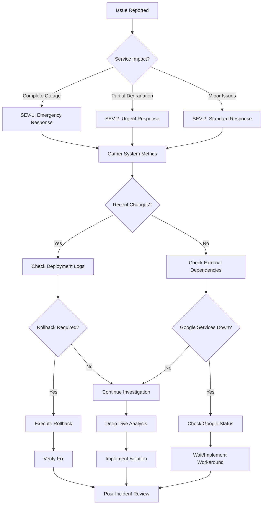
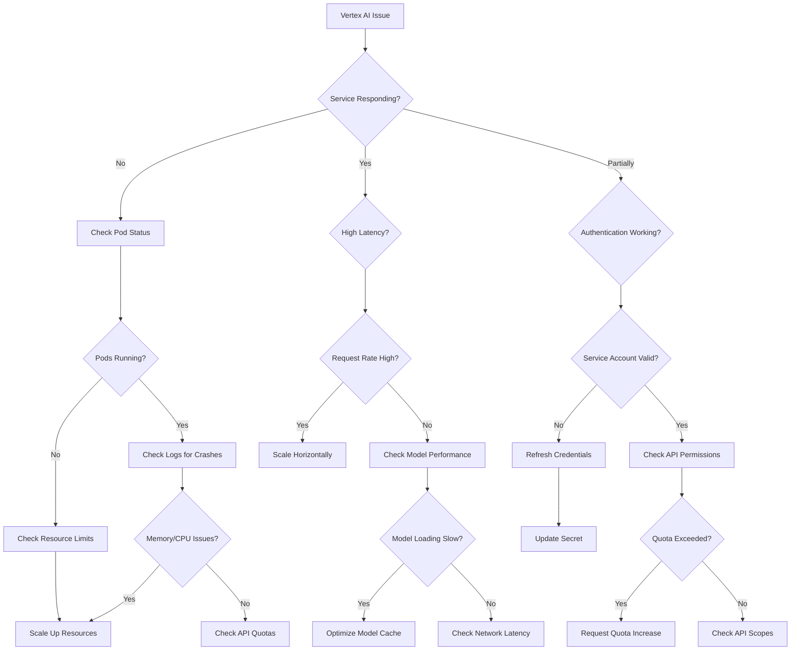
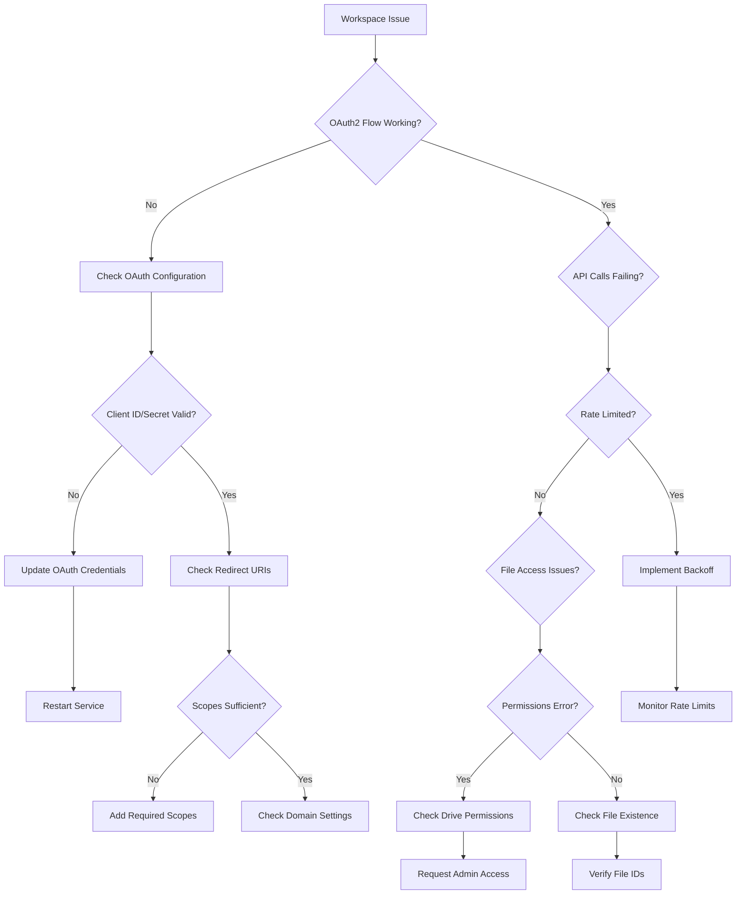
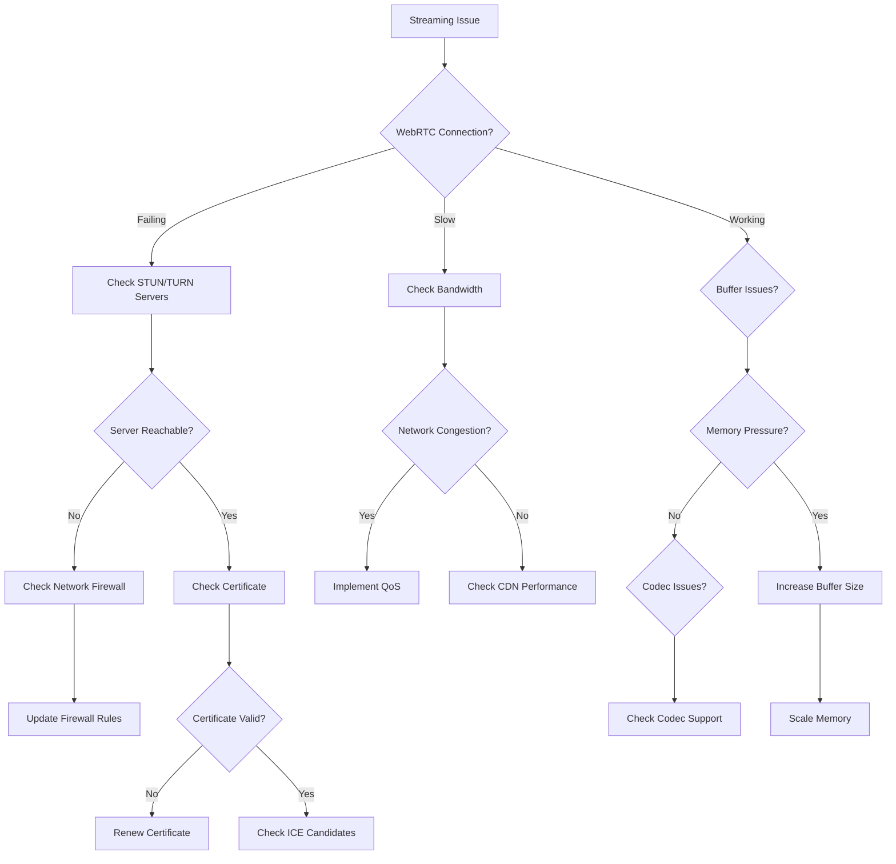

# Troubleshooting Decision Tree

## Overview

This document provides comprehensive troubleshooting decision trees for diagnosing and resolving issues in the Gemini-Flow Google Services platform. Follow the decision trees systematically to quickly identify root causes and implement appropriate solutions.

## Table of Contents

1. [General Troubleshooting Framework](#general-troubleshooting-framework)
2. [Service-Specific Decision Trees](#service-specific-decision-trees)
3. [Common Issue Patterns](#common-issue-patterns)
4. [Escalation Guidelines](#escalation-guidelines)
5. [Knowledge Base](#knowledge-base)

## General Troubleshooting Framework

### Initial Assessment Checklist



### Troubleshooting Toolkit

```bash
#!/bin/bash
# troubleshooting-toolkit.sh - Essential debugging tools

# System health overview
system_health() {
    echo "=== System Health Overview ==="
    echo "Timestamp: $(date)"
    
    # Kubernetes cluster status
    echo "--- Cluster Status ---"
    kubectl get nodes -o wide
    kubectl get pods -n gemini-flow --field-selector=status.phase!=Running
    
    # Resource utilization
    echo "--- Resource Utilization ---"
    kubectl top nodes
    kubectl top pods -n gemini-flow
    
    # Service endpoints
    echo "--- Service Endpoints ---"
    for service in vertex-ai workspace streaming agentspace; do
        endpoint="http://${service}-service.gemini-flow.svc.cluster.local:8080/health"
        status=$(curl -s -o /dev/null -w "%{http_code}" --max-time 5 "$endpoint" || echo "timeout")
        echo "$service: $status"
    done
}

# Recent events analysis
recent_events() {
    echo "=== Recent Events ==="
    
    # Kubernetes events
    kubectl get events --sort-by='.lastTimestamp' -n gemini-flow | tail -20
    
    # Recent deployments
    kubectl rollout history deployment -n gemini-flow
    
    # Recent configuration changes
    kubectl get configmaps -n gemini-flow -o yaml | grep -A 5 -B 5 "lastModified\|creationTimestamp" | tail -20
}

# Error log analysis
analyze_errors() {
    echo "=== Error Analysis ==="
    
    # Recent error logs
    kubectl logs -n gemini-flow -l app=gemini-flow --since=30m | grep -i "error\|exception\|fail" | tail -50
    
    # Error patterns
    echo "--- Error Patterns ---"
    kubectl logs -n gemini-flow -l app=gemini-flow --since=2h | grep -o "HTTP/1.1 [45][0-9][0-9]" | sort | uniq -c | sort -nr
    
    # Database connection errors
    kubectl logs -n gemini-flow -l app=gemini-flow --since=1h | grep -i "database\|connection\|timeout" | tail -20
}

# Network connectivity check
network_check() {
    echo "=== Network Connectivity Check ==="
    
    # Internal service connectivity
    for service in vertex-ai workspace streaming; do
        kubectl exec -n gemini-flow deployment/gemini-flow-api -- \
            curl -s --max-time 5 "http://${service}-service:8080/health" > /dev/null && \
            echo "$service: OK" || echo "$service: FAIL"
    done
    
    # External API connectivity
    kubectl exec -n gemini-flow deployment/gemini-flow-api -- \
        curl -s --max-time 10 "https://aiplatform.googleapis.com" > /dev/null && \
        echo "Vertex AI API: OK" || echo "Vertex AI API: FAIL"
        
    kubectl exec -n gemini-flow deployment/gemini-flow-api -- \
        curl -s --max-time 10 "https://www.googleapis.com/auth/cloud-platform" > /dev/null && \
        echo "Google Auth: OK" || echo "Google Auth: FAIL"
}

# Performance metrics
performance_check() {
    echo "=== Performance Metrics ==="
    
    # Response time check
    for endpoint in health vertex-ai/models workspace/files streaming/status; do
        response_time=$(kubectl exec -n gemini-flow deployment/gemini-flow-api -- \
            curl -s -o /dev/null -w '%{time_total}' "http://localhost:8080/api/v1/$endpoint" || echo "timeout")
        echo "$endpoint: ${response_time}s"
    done
    
    # Queue lengths
    kubectl exec -n gemini-flow deployment/gemini-flow-api -- \
        curl -s "http://localhost:8080/metrics" | grep -E "(queue_length|pending_requests)"
}

# Execute all checks
main() {
    echo "🔍 Starting troubleshooting analysis..."
    
    system_health
    echo
    recent_events
    echo
    analyze_errors
    echo
    network_check
    echo
    performance_check
    
    echo "🔍 Troubleshooting analysis complete"
}

# Allow individual function calls
if [[ "${BASH_SOURCE[0]}" == "${0}" ]]; then
    if [[ $# -eq 0 ]]; then
        main
    else
        "$@"
    fi
fi
```

## Service-Specific Decision Trees

### Vertex AI Connector Issues



### Google Workspace Integration Issues



### Streaming API Issues



## Common Issue Patterns

### Pattern 1: High Memory Usage

```bash
#!/bin/bash
# memory-issue-diagnosis.sh

diagnose_memory_issue() {
    echo "=== Memory Issue Diagnosis ==="
    
    # Check pod memory usage
    kubectl top pods -n gemini-flow --sort-by=memory
    
    # Check for memory-related events
    kubectl get events -n gemini-flow --field-selector reason=OOMKilled,reason=FailedMount
    
    # Check memory limits vs requests
    kubectl describe pods -n gemini-flow | grep -A 5 -B 5 "Limits:\|Requests:"
    
    # Check for memory leaks
    kubectl exec -n gemini-flow deployment/gemini-flow-api -- \
        curl -s "http://localhost:8080/metrics" | grep -E "(memory|heap)"
    
    # Recommendations
    echo "--- Recommendations ---"
    
    # Check if any pod is near memory limit
    kubectl get pods -n gemini-flow -o json | jq -r '
        .items[] | 
        select(.status.phase == "Running") |
        .metadata.name as $name |
        .spec.containers[0].resources.limits.memory as $limit |
        .status.containerStatuses[0].restartCount as $restarts |
        "Pod: \($name), Memory Limit: \($limit), Restarts: \($restarts)"
    '
    
    # If restarts > 5, likely memory issue
    high_restart_pods=$(kubectl get pods -n gemini-flow -o json | jq -r '
        .items[] | 
        select(.status.containerStatuses[0].restartCount > 5) |
        .metadata.name
    ')
    
    if [[ -n "$high_restart_pods" ]]; then
        echo "⚠️  High restart count pods (possible memory issues):"
        echo "$high_restart_pods"
        echo "Recommendation: Increase memory limits or investigate memory leaks"
    fi
}

fix_memory_issue() {
    local pod_name="$1"
    local new_memory_limit="$2"
    
    echo "Fixing memory issue for $pod_name..."
    
    # Get deployment name from pod
    deployment=$(kubectl get pod "$pod_name" -n gemini-flow -o jsonpath='{.metadata.labels.app}')
    
    # Update memory limit
    kubectl patch deployment "$deployment" -n gemini-flow -p "
    {
        \"spec\": {
            \"template\": {
                \"spec\": {
                    \"containers\": [{
                        \"name\": \"$deployment\",
                        \"resources\": {
                            \"limits\": {\"memory\": \"$new_memory_limit\"},
                            \"requests\": {\"memory\": \"$(echo $new_memory_limit | sed 's/Gi/Mi/' | sed 's/[0-9]*/&000/')\"}
                        }
                    }]
                }
            }
        }
    }"
    
    echo "Updated $deployment memory limit to $new_memory_limit"
    kubectl rollout status deployment/"$deployment" -n gemini-flow
}
```

### Pattern 2: Authentication Failures

```bash
#!/bin/bash
# auth-issue-diagnosis.sh

diagnose_auth_issue() {
    echo "=== Authentication Issue Diagnosis ==="
    
    # Check service account status
    echo "--- Service Account Status ---"
    kubectl get serviceaccount -n gemini-flow
    
    # Check secrets
    echo "--- Secrets Status ---"
    kubectl get secrets -n gemini-flow | grep -E "(google|oauth|credentials)"
    
    # Test authentication
    echo "--- Authentication Test ---"
    kubectl exec -n gemini-flow deployment/gemini-flow-api -- \
        gcloud auth application-default print-access-token > /dev/null 2>&1 && \
        echo "✅ Service account authentication: OK" || \
        echo "❌ Service account authentication: FAIL"
    
    # Check token expiration
    token_info=$(kubectl exec -n gemini-flow deployment/gemini-flow-api -- \
        gcloud auth application-default print-access-token 2>/dev/null | \
        head -c 50)
    
    if [[ -n "$token_info" ]]; then
        # Decode JWT token (simplified check)
        echo "--- Token Status ---"
        kubectl exec -n gemini-flow deployment/gemini-flow-api -- \
            curl -s "https://www.googleapis.com/oauth2/v1/tokeninfo?access_token=$(gcloud auth application-default print-access-token)" | \
            jq '.expires_in // "Invalid token"'
    fi
    
    # Check API quotas
    echo "--- API Quota Status ---"
    kubectl exec -n gemini-flow deployment/gemini-flow-api -- \
        gcloud logging read 'protoPayload.serviceName="aiplatform.googleapis.com" AND protoPayload.authenticationInfo.principalEmail!=""' \
        --limit=5 --format="table(timestamp,protoPayload.status.code,protoPayload.status.message)"
}

fix_auth_issue() {
    local issue_type="$1"
    
    case "$issue_type" in
        "expired_token")
            echo "Refreshing service account credentials..."
            
            # Create new service account key
            gcloud iam service-accounts keys create /tmp/new-key.json \
                --iam-account="gemini-flow@${PROJECT_ID}.iam.gserviceaccount.com"
            
            # Update Kubernetes secret
            kubectl create secret generic google-service-account \
                --from-file=service-account.json=/tmp/new-key.json \
                --dry-run=client -o yaml | kubectl apply -f -
            
            # Restart deployments to pick up new credentials
            kubectl rollout restart deployment -n gemini-flow
            
            # Clean up
            rm /tmp/new-key.json
            ;;
            
        "insufficient_permissions")
            echo "Checking required permissions..."
            
            required_roles=(
                "roles/aiplatform.user"
                "roles/storage.objectViewer"
                "roles/logging.logWriter"
                "roles/monitoring.metricWriter"
            )
            
            for role in "${required_roles[@]}"; do
                echo "Checking $role..."
                gcloud projects get-iam-policy "$PROJECT_ID" \
                    --flatten="bindings[].members" \
                    --filter="bindings.role:$role" \
                    --format="table(bindings.role,bindings.members)" | \
                    grep -q "gemini-flow@" && \
                    echo "✅ $role: OK" || \
                    echo "❌ $role: MISSING"
            done
            ;;
            
        "oauth_config")
            echo "Checking OAuth2 configuration..."
            
            # Verify OAuth2 client configuration
            kubectl get configmap oauth2-config -n gemini-flow -o yaml | \
                grep -E "(client_id|redirect_uri|scopes)"
            
            echo "Verify the following:"
            echo "1. Client ID matches Google Cloud Console"
            echo "2. Redirect URIs are authorized"
            echo "3. Required scopes are included"
            echo "4. Domain is verified in Google Workspace"
            ;;
    esac
}
```

### Pattern 3: Network Connectivity Issues

```bash
#!/bin/bash
# network-issue-diagnosis.sh

diagnose_network_issue() {
    echo "=== Network Connectivity Diagnosis ==="
    
    # Test internal service connectivity
    echo "--- Internal Service Connectivity ---"
    services=("vertex-ai-service" "workspace-service" "streaming-service" "agentspace-service")
    
    for service in "${services[@]}"; do
        kubectl exec -n gemini-flow deployment/gemini-flow-api -- \
            nc -zv "$service" 8080 2>&1 | grep -q "succeeded" && \
            echo "✅ $service: Reachable" || \
            echo "❌ $service: Unreachable"
    done
    
    # Test external API connectivity
    echo "--- External API Connectivity ---"
    external_apis=(
        "aiplatform.googleapis.com:443"
        "www.googleapis.com:443"
        "storage.googleapis.com:443"
        "oauth2.googleapis.com:443"
    )
    
    for api in "${external_apis[@]}"; do
        host=$(echo "$api" | cut -d: -f1)
        port=$(echo "$api" | cut -d: -f2)
        
        kubectl exec -n gemini-flow deployment/gemini-flow-api -- \
            nc -zv "$host" "$port" 2>&1 | grep -q "succeeded" && \
            echo "✅ $host:$port: Reachable" || \
            echo "❌ $host:$port: Unreachable"
    done
    
    # DNS resolution test
    echo "--- DNS Resolution ---"
    test_domains=("aiplatform.googleapis.com" "www.googleapis.com" "storage.googleapis.com")
    
    for domain in "${test_domains[@]}"; do
        kubectl exec -n gemini-flow deployment/gemini-flow-api -- \
            nslookup "$domain" > /dev/null 2>&1 && \
            echo "✅ $domain: DNS OK" || \
            echo "❌ $domain: DNS FAIL"
    done
    
    # Network policy check
    echo "--- Network Policies ---"
    kubectl get networkpolicy -n gemini-flow
    
    # Service mesh check (if using Istio)
    if kubectl get pods -n istio-system > /dev/null 2>&1; then
        echo "--- Istio Sidecar Status ---"
        kubectl get pods -n gemini-flow -o jsonpath='{range .items[*]}{.metadata.name}{"\t"}{.spec.containers[*].name}{"\n"}{end}' | \
            grep -E "(istio-proxy|envoy)" > /dev/null && \
            echo "✅ Istio sidecars detected" || \
            echo "⚠️  No Istio sidecars found"
    fi
}

fix_network_issue() {
    local issue_type="$1"
    
    case "$issue_type" in
        "internal_connectivity")
            echo "Fixing internal connectivity issues..."
            
            # Check service discovery
            kubectl get endpoints -n gemini-flow
            
            # Restart CoreDNS if DNS issues
            kubectl rollout restart deployment/coredns -n kube-system
            
            # Check for network policies blocking traffic
            kubectl get networkpolicy -n gemini-flow -o yaml
            ;;
            
        "external_connectivity")
            echo "Fixing external connectivity issues..."
            
            # Check egress rules
            kubectl get networkpolicy -n gemini-flow | grep -i egress
            
            # Test firewall rules
            echo "Check these firewall rules in Google Cloud Console:"
            echo "1. Allow egress to googleapis.com on port 443"
            echo "2. Allow egress to storage.googleapis.com on port 443"
            echo "3. Check VPC firewall rules"
            
            # Check NAT gateway (for private clusters)
            gcloud compute routers get-status nat-gateway-router --region=us-central1 2>/dev/null || \
                echo "⚠️  NAT gateway not found - may be required for private clusters"
            ;;
            
        "dns_resolution")
            echo "Fixing DNS resolution issues..."
            
            # Restart CoreDNS
            kubectl rollout restart deployment/coredns -n kube-system
            
            # Check DNS configuration
            kubectl get configmap coredns -n kube-system -o yaml | grep -A 10 -B 10 "forward"
            
            # Test with different DNS servers
            kubectl exec -n gemini-flow deployment/gemini-flow-api -- \
                nslookup googleapis.com 8.8.8.8
            ;;
    esac
}
```

## Escalation Guidelines

### When to Escalate

| Condition | Escalation Level | Response Time |
|-----------|------------------|---------------|
| Complete service outage | Level 3 (All hands) | Immediate |
| Multiple service degradation | Level 2 (Management) | 15 minutes |
| Single service issues | Level 1 (Team lead) | 1 hour |
| Suspected security breach | Security team | Immediate |
| Data loss risk | Data team + Management | Immediate |

### Escalation Process

```bash
#!/bin/bash
# escalation-process.sh

escalate_issue() {
    local severity="$1"
    local description="$2"
    local current_actions="$3"
    
    case "$severity" in
        "SEV-1")
            echo "🚨 SEV-1 ESCALATION 🚨"
            
            # Page everyone
            pd incident create --title "SEV-1: $description" \
                --service gemini-flow-prod \
                --urgency high
            
            # Create war room
            slack create-channel "#incident-$(date +%s)" \
                --purpose "SEV-1 incident response"
            
            # Notify executives
            send_executive_alert "$description"
            
            # Auto-start recording
            echo "Starting incident recording..."
            ;;
            
        "SEV-2")
            echo "⚠️  SEV-2 ESCALATION ⚠️"
            
            # Page on-call team
            pd incident create --title "SEV-2: $description" \
                --service gemini-flow-prod \
                --urgency medium
            
            # Notify team
            slack post "#sre-team" "SEV-2 incident: $description. Current actions: $current_actions"
            ;;
            
        "SECURITY")
            echo "🔒 SECURITY ESCALATION 🔒"
            
            # Immediate security team notification
            slack post "#security-incidents" "🚨 SECURITY INCIDENT: $description"
            
            # Create security incident
            create_security_incident "$description"
            
            # Lock down if necessary
            if [[ "$description" == *"breach"* ]] || [[ "$description" == *"unauthorized"* ]]; then
                echo "Implementing security lockdown..."
                implement_security_lockdown
            fi
            ;;
    esac
}

send_executive_alert() {
    local description="$1"
    
    # Send to executive Slack channel
    slack post "#executive-alerts" "🚨 SEV-1 INCIDENT: $description - Immediate attention required"
    
    # Send email alert
    echo "Subject: SEV-1 Incident Alert - Gemini-Flow
    
A SEV-1 incident has been declared for Gemini-Flow:

Description: $description
Time: $(date)
Incident Commander: $(get_current_oncall)
Status Page: https://status.gemini-flow.com

This requires immediate executive attention.

SRE Team" | sendmail executives@company.com
}

implement_security_lockdown() {
    echo "Implementing security lockdown procedures..."
    
    # Disable external access
    kubectl patch service gemini-flow-loadbalancer -p '{"spec":{"type":"ClusterIP"}}'
    
    # Enable additional logging
    kubectl patch configmap logging-config -p '{"data":{"level":"DEBUG","audit":"true"}}'
    
    # Restart with security mode
    kubectl set env deployment/gemini-flow-api SECURITY_MODE=lockdown
    
    echo "Security lockdown implemented"
}
```

## Knowledge Base

### Common Error Messages and Solutions

| Error Message | Cause | Solution |
|---------------|-------|----------|
| "Permission denied to access Vertex AI" | Invalid service account or missing roles | Check service account permissions |
| "OAuth2 flow failed: invalid_grant" | Expired or invalid OAuth token | Refresh OAuth credentials |
| "Connection timeout to googleapis.com" | Network connectivity issue | Check firewall and DNS |
| "Rate limit exceeded for API" | Too many requests | Implement rate limiting and backoff |
| "Pod OOMKilled" | Insufficient memory | Increase memory limits |
| "ImagePullBackOff" | Cannot pull container image | Check image name and registry access |
| "503 Service Unavailable" | Backend service down | Check pod status and health |

### Quick Reference Commands

```bash
# Health check all services
kubectl get pods -n gemini-flow -o wide

# Check recent events
kubectl get events --sort-by='.lastTimestamp' -n gemini-flow | tail -20

# View service logs
kubectl logs -f deployment/gemini-flow-api -n gemini-flow

# Test service connectivity
kubectl exec -n gemini-flow deployment/gemini-flow-api -- curl -s http://vertex-ai-service:8080/health

# Check resource usage
kubectl top pods -n gemini-flow

# Restart a deployment
kubectl rollout restart deployment/gemini-flow-api -n gemini-flow

# Scale a deployment
kubectl scale deployment gemini-flow-api --replicas=5 -n gemini-flow

# Get detailed pod information
kubectl describe pod <pod-name> -n gemini-flow

# Check configuration
kubectl get configmap -n gemini-flow -o yaml

# View secrets (names only)
kubectl get secrets -n gemini-flow
```

### Performance Optimization Quick Wins

1. **Enable HTTP/2**: Improves connection efficiency
2. **Implement Connection Pooling**: Reuse database connections
3. **Add Redis Caching**: Cache frequently accessed data
4. **Enable Compression**: Reduce bandwidth usage
5. **Optimize Database Queries**: Add indexes for slow queries
6. **Implement Circuit Breakers**: Prevent cascade failures
7. **Use CDN**: Cache static assets globally
8. **Enable Horizontal Pod Autoscaling**: Auto-scale based on demand

---

**Document Owner**: SRE Team  
**Last Updated**: August 14, 2025  
**Next Review**: November 14, 2025  
**Version**: 1.0