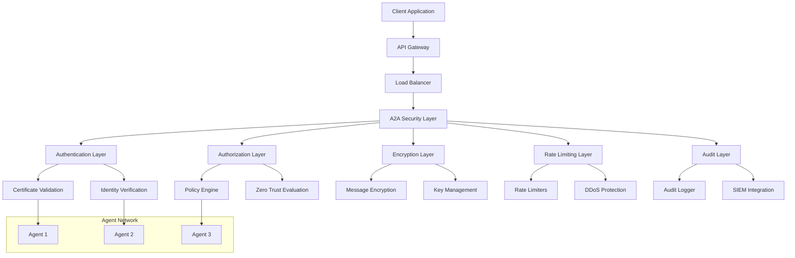

# A2A Security Framework

## Overview

The Agent-to-Agent (A2A) Security Framework provides comprehensive security for distributed AI agent communication in Gemini Flow. This framework implements zero-trust architecture, certificate-based authentication, end-to-end encryption, and advanced threat protection.

## Table of Contents

- [Security Architecture](#security-architecture)
- [Authentication & Authorization](#authentication--authorization)
- [Certificate Management](#certificate-management)
- [Message Security](#message-security)
- [Zero Trust Implementation](#zero-trust-implementation)
- [Rate Limiting & DDoS Protection](#rate-limiting--ddos-protection)
- [Audit & Compliance](#audit--compliance)
- [Security Configuration](#security-configuration)
- [Threat Detection](#threat-detection)
- [Incident Response](#incident-response)

## Security Architecture

### Multi-Layer Security Model



### Security Zones

1. **Public Zone**: Internet-facing components
2. **DMZ Zone**: API gateways and load balancers
3. **Application Zone**: A2A message bus and orchestration
4. **Agent Zone**: Individual agent instances
5. **Data Zone**: Persistent storage and state management

### Core Security Principles

- **Zero Trust**: Never trust, always verify
- **Defense in Depth**: Multiple security layers
- **Least Privilege**: Minimal necessary permissions
- **Continuous Monitoring**: Real-time threat detection
- **Secure by Default**: Safe configuration defaults

## Authentication & Authorization

### Certificate-Based Authentication

All A2A communication uses X.509 certificates for mutual authentication:

```typescript
interface A2ACertificate {
  // Certificate identification
  certificateId: string;
  issuer: string;
  subject: string;
  serialNumber: string;
  
  // Agent identification
  agentId: string;
  agentType: string;
  organizationUnit: string;
  
  // Validity
  notBefore: Date;
  notAfter: Date;
  
  // Extensions
  keyUsage: string[];
  extendedKeyUsage: string[];
  subjectAlternativeNames: string[];
  
  // Security attributes
  publicKey: PublicKey;
  signatureAlgorithm: string;
  certificateChain: X509Certificate[];
}
```

### Authentication Flow

1. **Certificate Presentation**: Agent presents X.509 certificate
2. **Chain Validation**: Verify certificate chain to trusted CA
3. **Revocation Check**: Check Certificate Revocation List (CRL)
4. **Identity Extraction**: Extract agent identity from certificate
5. **Session Establishment**: Create secure session with token
6. **Continuous Validation**: Periodic re-authentication

```typescript
class A2AAuthenticator {
  async authenticateAgent(
    certificate: X509Certificate,
    agentId: string
  ): Promise<AuthenticationResult> {
    
    // 1. Validate certificate format and structure
    if (!this.isValidCertificateFormat(certificate)) {
      throw new SecurityError('Invalid certificate format');
    }
    
    // 2. Verify certificate chain
    const chainValidation = await this.validateCertificateChain(certificate);
    if (!chainValidation.valid) {
      throw new SecurityError(`Certificate chain validation failed: ${chainValidation.reason}`);
    }
    
    // 3. Check certificate revocation status
    const revocationStatus = await this.checkRevocation(certificate);
    if (revocationStatus.revoked) {
      throw new SecurityError('Certificate has been revoked');
    }
    
    // 4. Verify certificate is not expired
    const now = new Date();
    if (now < certificate.notBefore || now > certificate.notAfter) {
      throw new SecurityError('Certificate is expired or not yet valid');
    }
    
    // 5. Extract and validate agent identity
    const identity = this.extractAgentIdentity(certificate);
    if (identity.agentId !== agentId) {
      throw new SecurityError('Agent ID mismatch');
    }
    
    // 6. Check certificate usage constraints
    if (!this.validateKeyUsage(certificate, 'digital-signature')) {
      throw new SecurityError('Certificate not valid for digital signatures');
    }
    
    // 7. Generate session token
    const sessionToken = await this.generateSessionToken(identity);
    
    return {
      authenticated: true,
      identity,
      sessionToken,
      expiresAt: new Date(Date.now() + this.sessionDuration),
      permissions: await this.getAgentPermissions(identity)
    };
  }
  
  private async validateCertificateChain(
    certificate: X509Certificate
  ): Promise<ChainValidationResult> {
    
    const chain = certificate.certificateChain;
    const trustedCAs = await this.getTrustedCAs();
    
    // Build and validate certificate chain
    for (let i = 0; i < chain.length - 1; i++) {
      const current = chain[i];
      const issuer = chain[i + 1];
      
      // Verify signature
      const signatureValid = await this.verifySignature(
        current.tbsCertificate,
        current.signature,
        issuer.publicKey
      );
      
      if (!signatureValid) {
        return {
          valid: false,
          reason: `Invalid signature at chain position ${i}`
        };
      }
      
      // Check validity periods
      if (current.notBefore > issuer.notAfter) {
        return {
          valid: false,
          reason: `Certificate validity period invalid at position ${i}`
        };
      }
    }
    
    // Verify root CA is trusted
    const rootCA = chain[chain.length - 1];
    if (!trustedCAs.includes(rootCA.fingerprint)) {
      return {
        valid: false,
        reason: 'Root CA not trusted'
      };
    }
    
    return { valid: true };
  }
}
```

### Authorization Model

Role-Based Access Control (RBAC) with Attribute-Based Access Control (ABAC):

```typescript
interface A2ARole {
  roleId: string;
  roleName: string;
  permissions: Permission[];
  constraints: Constraint[];
}

interface Permission {
  resource: string;      // e.g., "mcp__claude-flow__agent_spawn"
  actions: string[];     // e.g., ["execute", "monitor"]
  conditions?: string;   // e.g., "time > 09:00 AND time < 17:00"
}

interface Constraint {
  type: 'time' | 'location' | 'resource' | 'custom';
  condition: string;
  enforcement: 'mandatory' | 'advisory';
}

class A2AAuthorizer {
  async authorize(
    agentId: string,
    resource: string,
    action: string,
    context: AuthorizationContext
  ): Promise<AuthorizationResult> {
    
    // 1. Get agent roles and permissions
    const agentRoles = await this.getAgentRoles(agentId);
    const permissions = this.aggregatePermissions(agentRoles);
    
    // 2. Check resource-action permission
    const hasPermission = permissions.some(permission => 
      this.matchesResource(permission.resource, resource) &&
      permission.actions.includes(action)
    );
    
    if (!hasPermission) {
      return {
        allowed: false,
        reason: 'Insufficient permissions',
        requiredPermission: `${resource}:${action}`
      };
    }
    
    // 3. Evaluate conditions and constraints
    const conditionResult = await this.evaluateConditions(
      permissions,
      resource,
      action,
      context
    );
    
    if (!conditionResult.satisfied) {
      return {
        allowed: false,
        reason: 'Condition not satisfied',
        failedCondition: conditionResult.failedCondition
      };
    }
    
    // 4. Apply zero trust evaluation
    const trustEvaluation = await this.evaluateZeroTrust(
      agentId,
      resource,
      action,
      context
    );
    
    if (!trustEvaluation.allowed) {
      return {
        allowed: false,
        reason: 'Zero trust policy violation',
        trustScore: trustEvaluation.trustScore,
        riskFactors: trustEvaluation.riskFactors
      };
    }
    
    return {
      allowed: true,
      permissions: permissions.filter(p => 
        this.matchesResource(p.resource, resource) &&
        p.actions.includes(action)
      ),
      conditions: conditionResult.appliedConditions,
      trustScore: trustEvaluation.trustScore
    };
  }
}
```

## Certificate Management

### Certificate Authority (CA) Hierarchy

```
Root CA (Offline)
├── Intermediate CA (A2A Services)
│   ├── Agent CA (Agent Certificates)
│   ├── Service CA (Service Certificates)
│   └── Client CA (Client Certificates)
└── Intermediate CA (External Services)
    ├── API Gateway CA
    └── Third-party CA
```

### Certificate Lifecycle Management

```typescript
class CertificateManager {
  async issueCertificate(
    agentId: string,
    agentType: string,
    keyPair: KeyPair,
    validityPeriod: number = 31536000000 // 1 year
  ): Promise<X509Certificate> {
    
    // 1. Validate agent registration
    const agent = await this.validateAgentRegistration(agentId, agentType);
    if (!agent.valid) {
      throw new SecurityError('Agent not properly registered');
    }
    
    // 2. Generate certificate serial number
    const serialNumber = await this.generateSerialNumber();
    
    // 3. Create certificate subject
    const subject = new X500Name([
      new AVA(BCStyle.CN, agentId),
      new AVA(BCStyle.OU, agentType),
      new AVA(BCStyle.O, 'Gemini Flow A2A'),
      new AVA(BCStyle.C, 'US')
    ]);
    
    // 4. Set certificate extensions
    const extensions = [
      // Key usage
      new Extension(Extension.keyUsage, true, new KeyUsage(
        KeyUsage.digitalSignature | KeyUsage.keyEncipherment
      )),
      
      // Extended key usage
      new Extension(Extension.extendedKeyUsage, false, new ExtendedKeyUsage([
        KeyPurposeId.id_kp_clientAuth,
        KeyPurposeId.id_kp_serverAuth
      ])),
      
      // Subject alternative names
      new Extension(Extension.subjectAlternativeName, false, new GeneralNames([
        new GeneralName(GeneralName.dNSName, `${agentId}.a2a.gemini-flow.dev`),
        new GeneralName(GeneralName.uniformResourceIdentifier, `urn:a2a:agent:${agentId}`)
      ])),
      
      // Certificate policies
      new Extension(Extension.certificatePolicies, false, new CertificatePolicies([
        new PolicyInformation(new ASN1ObjectIdentifier('1.2.3.4.5.6.7.8.1'))
      ])),
      
      // Authority key identifier
      new Extension(Extension.authorityKeyIdentifier, false, 
        new AuthorityKeyIdentifier(this.intermediateCACert.getPublicKey())
      ),
      
      // Subject key identifier
      new Extension(Extension.subjectKeyIdentifier, false,
        new SubjectKeyIdentifier(keyPair.publicKey)
      )
    ];
    
    // 5. Create and sign certificate
    const certificate = await this.createAndSignCertificate(
      serialNumber,
      subject,
      keyPair.publicKey,
      new Date(),
      new Date(Date.now() + validityPeriod),
      extensions
    );
    
    // 6. Store certificate in registry
    await this.storeCertificate(certificate, agentId);
    
    // 7. Set up revocation monitoring
    await this.setupRevocationMonitoring(certificate);
    
    return certificate;
  }
  
  async revokeCertificate(
    certificateId: string,
    reason: RevocationReason
  ): Promise<void> {
    
    const certificate = await this.getCertificate(certificateId);
    if (!certificate) {
      throw new Error('Certificate not found');
    }
    
    // 1. Add to CRL
    await this.addToCRL(certificate, reason);
    
    // 2. Update OCSP responder
    await this.updateOCSPResponder(certificate, 'revoked');
    
    // 3. Notify dependent systems
    await this.notifyRevocation(certificate, reason);
    
    // 4. Terminate active sessions
    await this.terminateAgentSessions(certificate.agentId);
    
    // 5. Update certificate status
    await this.updateCertificateStatus(certificateId, 'revoked');
    
    // 6. Audit log
    await this.auditLogger.logEvent(
      'certificate_revoked',
      'certificate_management',
      {
        agentId: certificate.agentId,
        certificateId,
        reason: reason.toString()
      },
      {
        resource: 'certificate',
        resourceType: 'security',
        resourceId: certificateId
      },
      'revoke',
      'success',
      {
        description: `Certificate revoked for agent ${certificate.agentId}`,
        metadata: { reason }
      }
    );
  }
  
  async renewCertificate(
    certificateId: string,
    newKeyPair?: KeyPair
  ): Promise<X509Certificate> {
    
    const oldCertificate = await this.getCertificate(certificateId);
    if (!oldCertificate) {
      throw new Error('Certificate not found');
    }
    
    // 1. Validate renewal eligibility
    const renewalWindow = 30 * 24 * 60 * 60 * 1000; // 30 days
    const renewalTime = oldCertificate.notAfter.getTime() - renewalWindow;
    
    if (Date.now() < renewalTime) {
      throw new SecurityError('Certificate not eligible for renewal yet');
    }
    
    // 2. Use existing key pair or generate new one
    const keyPair = newKeyPair || await this.generateKeyPair();
    
    // 3. Issue new certificate
    const newCertificate = await this.issueCertificate(
      oldCertificate.agentId,
      oldCertificate.agentType,
      keyPair
    );
    
    // 4. Overlap period for smooth transition
    const overlapPeriod = 24 * 60 * 60 * 1000; // 24 hours
    setTimeout(async () => {
      await this.revokeCertificate(certificateId, RevocationReason.SUPERSEDED);
    }, overlapPeriod);
    
    return newCertificate;
  }
}
```

### Certificate Validation

```typescript
class CertificateValidator {
  async validateCertificate(
    certificate: X509Certificate,
    validationContext: ValidationContext
  ): Promise<ValidationResult> {
    
    const validationResult: ValidationResult = {
      valid: true,
      errors: [],
      warnings: [],
      trustLevel: 'unknown'
    };
    
    try {
      // 1. Basic format validation
      await this.validateBasicFormat(certificate, validationResult);
      
      // 2. Signature validation
      await this.validateSignature(certificate, validationResult);
      
      // 3. Chain validation
      await this.validateChain(certificate, validationResult);
      
      // 4. Revocation check
      await this.checkRevocation(certificate, validationResult);
      
      // 5. Policy validation
      await this.validatePolicies(certificate, validationResult);
      
      // 6. Extension validation
      await this.validateExtensions(certificate, validationResult);
      
      // 7. Context-specific validation
      await this.validateContext(certificate, validationContext, validationResult);
      
      // 8. Calculate trust level
      validationResult.trustLevel = this.calculateTrustLevel(validationResult);
      
    } catch (error) {
      validationResult.valid = false;
      validationResult.errors.push(`Validation error: ${error.message}`);
    }
    
    return validationResult;
  }
  
  private async checkRevocation(
    certificate: X509Certificate,
    result: ValidationResult
  ): Promise<void> {
    
    // Try OCSP first (faster)
    try {
      const ocspResponse = await this.queryOCSP(certificate);
      if (ocspResponse.status === 'revoked') {
        result.valid = false;
        result.errors.push('Certificate has been revoked (OCSP)');
        return;
      }
    } catch (error) {
      result.warnings.push('OCSP check failed, falling back to CRL');
    }
    
    // Fallback to CRL
    try {
      const crlStatus = await this.checkCRL(certificate);
      if (crlStatus.revoked) {
        result.valid = false;
        result.errors.push('Certificate has been revoked (CRL)');
      }
    } catch (error) {
      result.warnings.push('CRL check failed');
    }
  }
}
```

## Message Security

### End-to-End Encryption

All A2A messages are encrypted end-to-end using hybrid encryption:

```typescript
interface EncryptedA2AMessage {
  // Message metadata (unencrypted)
  messageId: string;
  timestamp: number;
  source: string;
  target: string;
  
  // Encrypted content
  encryptedPayload: string;
  encryptedKey: string;
  
  // Encryption metadata
  encryptionAlgorithm: 'AES-256-GCM';
  keyEncryptionAlgorithm: 'RSA-OAEP' | 'ECDH-ES';
  
  // Authentication
  signature: string;
  signatureAlgorithm: 'RSA-PSS' | 'ECDSA';
  
  // Integrity
  messageAuthenticationCode: string;
  macAlgorithm: 'HMAC-SHA256';
}

class MessageSecurity {
  async encryptMessage(
    message: A2AMessage,
    recipientPublicKey: PublicKey,
    senderPrivateKey: PrivateKey
  ): Promise<EncryptedA2AMessage> {
    
    // 1. Serialize message
    const messageJson = JSON.stringify(message);
    const messageBytes = new TextEncoder().encode(messageJson);
    
    // 2. Generate symmetric key
    const symmetricKey = await crypto.subtle.generateKey(
      { name: 'AES-GCM', length: 256 },
      true,
      ['encrypt', 'decrypt']
    );
    
    // 3. Generate IV
    const iv = crypto.getRandomValues(new Uint8Array(12));
    
    // 4. Encrypt message with symmetric key
    const encryptedPayload = await crypto.subtle.encrypt(
      { name: 'AES-GCM', iv },
      symmetricKey,
      messageBytes
    );
    
    // 5. Export symmetric key
    const symmetricKeyBytes = await crypto.subtle.exportKey('raw', symmetricKey);
    
    // 6. Encrypt symmetric key with recipient's public key
    const encryptedKey = await crypto.subtle.encrypt(
      { name: 'RSA-OAEP' },
      recipientPublicKey,
      symmetricKeyBytes
    );
    
    // 7. Create message for signing
    const messageForSigning = new Uint8Array([
      ...new Uint8Array(encryptedPayload),
      ...new Uint8Array(encryptedKey),
      ...iv
    ]);
    
    // 8. Sign message
    const signature = await crypto.subtle.sign(
      { name: 'RSA-PSS', saltLength: 32 },
      senderPrivateKey,
      messageForSigning
    );
    
    // 9. Generate MAC
    const macKey = await crypto.subtle.importKey(
      'raw',
      symmetricKeyBytes.slice(0, 32),
      { name: 'HMAC', hash: 'SHA-256' },
      false,
      ['sign']
    );
    
    const mac = await crypto.subtle.sign('HMAC', macKey, messageForSigning);
    
    return {
      messageId: message.id || crypto.randomUUID(),
      timestamp: Date.now(),
      source: message.source.agentId,
      target: this.getTargetString(message.target),
      encryptedPayload: this.arrayBufferToBase64(encryptedPayload),
      encryptedKey: this.arrayBufferToBase64(encryptedKey),
      encryptionAlgorithm: 'AES-256-GCM',
      keyEncryptionAlgorithm: 'RSA-OAEP',
      signature: this.arrayBufferToBase64(signature),
      signatureAlgorithm: 'RSA-PSS',
      messageAuthenticationCode: this.arrayBufferToBase64(mac),
      macAlgorithm: 'HMAC-SHA256'
    };
  }
  
  async decryptMessage(
    encryptedMessage: EncryptedA2AMessage,
    recipientPrivateKey: PrivateKey,
    senderPublicKey: PublicKey
  ): Promise<A2AMessage> {
    
    // 1. Decode base64 content
    const encryptedPayload = this.base64ToArrayBuffer(encryptedMessage.encryptedPayload);
    const encryptedKey = this.base64ToArrayBuffer(encryptedMessage.encryptedKey);
    const signature = this.base64ToArrayBuffer(encryptedMessage.signature);
    const mac = this.base64ToArrayBuffer(encryptedMessage.messageAuthenticationCode);
    
    // 2. Verify signature
    const messageForVerification = new Uint8Array([
      ...new Uint8Array(encryptedPayload),
      ...new Uint8Array(encryptedKey)
    ]);
    
    const signatureValid = await crypto.subtle.verify(
      { name: 'RSA-PSS', saltLength: 32 },
      senderPublicKey,
      signature,
      messageForVerification
    );
    
    if (!signatureValid) {
      throw new SecurityError('Message signature verification failed');
    }
    
    // 3. Decrypt symmetric key
    const symmetricKeyBytes = await crypto.subtle.decrypt(
      { name: 'RSA-OAEP' },
      recipientPrivateKey,
      encryptedKey
    );
    
    // 4. Import symmetric key
    const symmetricKey = await crypto.subtle.importKey(
      'raw',
      symmetricKeyBytes,
      { name: 'AES-GCM' },
      false,
      ['decrypt']
    );
    
    // 5. Verify MAC
    const macKey = await crypto.subtle.importKey(
      'raw',
      new Uint8Array(symmetricKeyBytes).slice(0, 32),
      { name: 'HMAC', hash: 'SHA-256' },
      false,
      ['verify']
    );
    
    const macValid = await crypto.subtle.verify(
      'HMAC',
      macKey,
      mac,
      messageForVerification
    );
    
    if (!macValid) {
      throw new SecurityError('Message MAC verification failed');
    }
    
    // 6. Extract IV (last 12 bytes)
    const iv = new Uint8Array(encryptedPayload).slice(-12);
    const actualPayload = new Uint8Array(encryptedPayload).slice(0, -12);
    
    // 7. Decrypt message
    const decryptedBytes = await crypto.subtle.decrypt(
      { name: 'AES-GCM', iv },
      symmetricKey,
      actualPayload
    );
    
    // 8. Parse message
    const messageJson = new TextDecoder().decode(decryptedBytes);
    return JSON.parse(messageJson);
  }
}
```

### Key Management

```typescript
class KeyManager {
  private keyStore: Map<string, KeyPair> = new Map();
  private keyRotationSchedule: Map<string, number> = new Map();
  
  async generateKeyPair(
    agentId: string,
    algorithm: 'RSA' | 'ECDSA' = 'RSA'
  ): Promise<KeyPair> {
    
    let keyPair: CryptoKeyPair;
    
    if (algorithm === 'RSA') {
      keyPair = await crypto.subtle.generateKey(
        {
          name: 'RSA-OAEP',
          modulusLength: 4096,
          publicExponent: new Uint8Array([1, 0, 1]),
          hash: 'SHA-256'
        },
        true,
        ['encrypt', 'decrypt']
      );
    } else {
      keyPair = await crypto.subtle.generateKey(
        {
          name: 'ECDSA',
          namedCurve: 'P-384'
        },
        true,
        ['sign', 'verify']
      );
    }
    
    // Store key pair securely
    const keyPairWrapper: KeyPair = {
      agentId,
      algorithm,
      publicKey: keyPair.publicKey,
      privateKey: keyPair.privateKey,
      createdAt: new Date(),
      expiresAt: new Date(Date.now() + (365 * 24 * 60 * 60 * 1000)) // 1 year
    };
    
    await this.storeKeyPair(agentId, keyPairWrapper);
    
    // Schedule key rotation
    this.scheduleKeyRotation(agentId, keyPairWrapper.expiresAt);
    
    return keyPairWrapper;
  }
  
  async rotateKeys(agentId: string): Promise<KeyPair> {
    const oldKeyPair = await this.getKeyPair(agentId);
    if (!oldKeyPair) {
      throw new Error('No existing key pair found');
    }
    
    // Generate new key pair
    const newKeyPair = await this.generateKeyPair(agentId, oldKeyPair.algorithm);
    
    // Overlap period for smooth transition
    const overlapPeriod = 24 * 60 * 60 * 1000; // 24 hours
    
    setTimeout(async () => {
      await this.revokeKeyPair(agentId, oldKeyPair);
    }, overlapPeriod);
    
    // Update certificate with new public key
    await this.updateCertificate(agentId, newKeyPair.publicKey);
    
    return newKeyPair;
  }
  
  private async storeKeyPair(agentId: string, keyPair: KeyPair): Promise<void> {
    // In production, use hardware security module (HSM)
    // or encrypted key store
    const encryptedPrivateKey = await this.encryptPrivateKey(keyPair.privateKey);
    
    await this.keyVault.store(`${agentId}/private`, encryptedPrivateKey);
    await this.keyVault.store(`${agentId}/public`, keyPair.publicKey);
    
    this.keyStore.set(agentId, keyPair);
  }
}
```

## Zero Trust Implementation

### Trust Score Calculation

```typescript
interface TrustScore {
  overallScore: number;
  factors: {
    authentication: number;
    behavior: number;
    compliance: number;
    network: number;
    temporal: number;
  };
  lastUpdated: Date;
  history: TrustScoreHistory[];
}

class ZeroTrustEngine {
  async calculateTrustScore(
    agentId: string,
    context: SecurityContext
  ): Promise<TrustScore> {
    
    const factors = await this.calculateTrustFactors(agentId, context);
    
    // Weighted trust score calculation
    const weights = {
      authentication: 0.3,
      behavior: 0.25,
      compliance: 0.2,
      network: 0.15,
      temporal: 0.1
    };
    
    const overallScore = Object.entries(factors).reduce(
      (sum, [factor, score]) => sum + (score * weights[factor as keyof typeof weights]),
      0
    );
    
    const trustScore: TrustScore = {
      overallScore: Math.min(Math.max(overallScore, 0), 100),
      factors,
      lastUpdated: new Date(),
      history: await this.getTrustScoreHistory(agentId)
    };
    
    // Store trust score
    await this.storeTrustScore(agentId, trustScore);
    
    return trustScore;
  }
  
  private async calculateTrustFactors(
    agentId: string,
    context: SecurityContext
  ): Promise<TrustScore['factors']> {
    
    // Authentication factor (0-100)
    const authFactor = await this.calculateAuthenticationFactor(agentId, context);
    
    // Behavior factor (0-100)
    const behaviorFactor = await this.calculateBehaviorFactor(agentId);
    
    // Compliance factor (0-100)
    const complianceFactor = await this.calculateComplianceFactor(agentId);
    
    // Network factor (0-100)
    const networkFactor = await this.calculateNetworkFactor(context);
    
    // Temporal factor (0-100)
    const temporalFactor = await this.calculateTemporalFactor(context);
    
    return {
      authentication: authFactor,
      behavior: behaviorFactor,
      compliance: complianceFactor,
      network: networkFactor,
      temporal: temporalFactor
    };
  }
  
  private async calculateAuthenticationFactor(
    agentId: string,
    context: SecurityContext
  ): Promise<number> {
    let score = 50; // Base score
    
    // Certificate validity (+20)
    const certificate = await this.getCertificate(agentId);
    if (certificate && certificate.valid) {
      score += 20;
      
      // Certificate age bonus (newer is better)
      const ageInDays = (Date.now() - certificate.issuedAt.getTime()) / (24 * 60 * 60 * 1000);
      if (ageInDays < 30) score += 10;
      else if (ageInDays < 90) score += 5;
    }
    
    // Multi-factor authentication (+15)
    if (context.multiFactor) {
      score += 15;
    }
    
    // Session security (+10)
    if (context.sessionSecurity?.encrypted && context.sessionSecurity?.integrity) {
      score += 10;
    }
    
    // Recent authentication (-5 for each hour since last auth)
    const hoursSinceAuth = context.hoursSinceLastAuth || 0;
    score -= Math.min(hoursSinceAuth * 5, 30);
    
    return Math.min(Math.max(score, 0), 100);
  }
  
  private async calculateBehaviorFactor(agentId: string): Promise<number> {
    const behaviorHistory = await this.getBehaviorHistory(agentId);
    let score = 70; // Base score
    
    // Anomaly detection
    const anomalies = await this.detectAnomalies(agentId, behaviorHistory);
    score -= anomalies.length * 10;
    
    // Failed attempts
    const recentFailures = behaviorHistory.failedAttempts.filter(
      failure => Date.now() - failure.timestamp < 24 * 60 * 60 * 1000
    );
    score -= recentFailures.length * 5;
    
    // Successful patterns
    const successfulPatterns = behaviorHistory.successfulOperations.length;
    if (successfulPatterns > 100) score += 20;
    else if (successfulPatterns > 50) score += 10;
    
    // Rate limiting violations  
    const rateLimitViolations = behaviorHistory.rateLimitViolations || 0;
    score -= rateLimitViolations * 3;
    
    return Math.min(Math.max(score, 0), 100);
  }
  
  async evaluateAccessDecision(
    agentId: string,
    resource: string,
    action: string,
    context: SecurityContext
  ): Promise<AccessDecision> {
    
    // Calculate current trust score
    const trustScore = await this.calculateTrustScore(agentId, context);
    
    // Get resource sensitivity level
    const resourceSensitivity = await this.getResourceSensitivity(resource);
    
    // Calculate required trust level
    const requiredTrustLevel = this.calculateRequiredTrustLevel(
      resourceSensitivity,
      action,
      context
    );
    
    // Make access decision
    const allowed = trustScore.overallScore >= requiredTrustLevel;
    
    // Determine additional controls
    const additionalControls = await this.determineAdditionalControls(
      trustScore,
      resourceSensitivity,
      context
    );
    
    const decision: AccessDecision = {
      allowed,
      reason: allowed ? 'Trust level sufficient' : 'Trust level insufficient',
      trustScore: trustScore.overallScore,
      requiredTrustLevel,
      riskLevel: this.calculateRiskLevel(trustScore.overallScore, resourceSensitivity),
      conditions: allowed ? additionalControls.conditions : [],
      monitoring: additionalControls.monitoring,
      riskFactors: this.identifyRiskFactors(trustScore, context)
    };
    
    // Log access decision
    await this.logAccessDecision(agentId, resource, action, decision);
    
    return decision;
  }
}
```

### Policy Engine

```typescript
interface ZeroTrustPolicy {
  policyId: string;
  name: string;
  description: string;
  scope: PolicyScope;
  conditions: PolicyCondition[];
  actions: PolicyAction[];
  enabled: boolean;
  priority: number;
}

interface PolicyCondition {
  type: 'agent' | 'resource' | 'context' | 'trust' | 'time' | 'location';
  operator: 'equals' | 'not_equals' | 'greater_than' | 'less_than' | 'contains' | 'matches';
  field: string;
  value: any;
  logicalOperator?: 'AND' | 'OR';
}

class PolicyEngine {
  async evaluatePolicies(
    agentId: string,
    resource: string,
    action: string,
    context: SecurityContext
  ): Promise<PolicyEvaluationResult> {
    
    // Get applicable policies
    const applicablePolicies = await this.getApplicablePolicies(
      agentId,
      resource,
      action
    );
    
    // Sort by priority (higher number = higher priority)
    applicablePolicies.sort((a, b) => b.priority - a.priority);
    
    const evaluationResult: PolicyEvaluationResult = {
      decision: 'allow', // Default allow
      appliedPolicies: [],
      denialReasons: [],
      requiredConditions: [],
      additionalMonitoring: []
    };
    
    // Evaluate each policy
    for (const policy of applicablePolicies) {
      const policyResult = await this.evaluatePolicy(
        policy,
        agentId,
        resource,
        action,
        context
      );
      
      evaluationResult.appliedPolicies.push({
        policyId: policy.policyId,
        result: policyResult.decision,
        conditions: policyResult.matchedConditions
      });
      
      // Handle policy decisions
      if (policyResult.decision === 'deny') {
        evaluationResult.decision = 'deny';
        evaluationResult.denialReasons.push(policyResult.reason);
        // Continue to collect all denial reasons
      } else if (policyResult.decision === 'conditional') {
        evaluationResult.requiredConditions.push(...policyResult.conditions);
      }
      
      // Collect monitoring requirements
      if (policyResult.monitoring) {
        evaluationResult.additionalMonitoring.push(...policyResult.monitoring);
      }
    }
    
    // Final decision (deny takes precedence)
    if (evaluationResult.denialReasons.length > 0) {
      evaluationResult.decision = 'deny';
    } else if (evaluationResult.requiredConditions.length > 0) {
      evaluationResult.decision = 'conditional';
    }
    
    return evaluationResult;
  }
  
  private async evaluatePolicy(
    policy: ZeroTrustPolicy,
    agentId: string,
    resource: string,
    action: string,
    context: SecurityContext
  ): Promise<PolicyResult> {
    
    const conditionResults = await Promise.all(
      policy.conditions.map(condition => 
        this.evaluateCondition(condition, agentId, resource, action, context)
      )
    );
    
    // Evaluate logical operators
    const conditionMet = this.evaluateLogicalExpression(
      policy.conditions,
      conditionResults
    );
    
    if (!conditionMet) {
      return {
        decision: 'allow', // Condition not met, policy doesn't apply
        reason: 'Policy conditions not met',
        matchedConditions: []
      };
    }
    
    // Policy applies, execute actions
    const policyResult: PolicyResult = {
      decision: 'allow',
      reason: 'Policy allows access',
      matchedConditions: policy.conditions.filter((_, index) => conditionResults[index]),
      conditions: [],
      monitoring: []
    };
    
    for (const action of policy.actions) {
      switch (action.type) {
        case 'deny':
          policyResult.decision = 'deny';
          policyResult.reason = action.reason || 'Access denied by policy';
          break;
          
        case 'require_additional_auth':
          policyResult.decision = 'conditional';
          policyResult.conditions.push('additional_authentication');
          break;
          
        case 'require_approval':
          policyResult.decision = 'conditional';
          policyResult.conditions.push('manual_approval');
          break;
          
        case 'enhanced_monitoring':
          policyResult.monitoring.push('enhanced_logging', 'real_time_alerts');
          break;
          
        case 'quarantine':
          policyResult.decision = 'deny';
          policyResult.reason = 'Agent quarantined by policy';
          await this.quarantineAgent(agentId, action.duration || 3600000);
          break;
      }
    }
    
    return policyResult;
  }
}
```

## Rate Limiting & DDoS Protection

### Adaptive Rate Limiting

```typescript
interface RateLimitConfig {
  tokensPerSecond: number;
  burstCapacity: number;
  adaptiveScaling: boolean;
  penaltyMultiplier: number;
  whitelistEnabled: boolean;
}

class AdaptiveRateLimiter {
  private tokenBuckets: Map<string, TokenBucket> = new Map();
  private agentMetrics: Map<string, AgentMetrics> = new Map();
  private systemLoad: SystemLoadMetrics = new SystemLoadMetrics();
  
  async checkRateLimit(
    agentId: string,
    messageType: string,
    payloadSize: number,
    sourceIP?: string
  ): Promise<RateLimitResult> {
    
    // Get or create token bucket for agent
    const bucket = this.getOrCreateTokenBucket(agentId, messageType);
    
    // Calculate tokens required (base + payload size factor)
    const baseTokens = this.getBaseTokenCost(messageType);
    const sizeTokens = Math.ceil(payloadSize / 1024); // 1 token per KB
    const totalTokens = baseTokens + sizeTokens;
    
    // Apply adaptive scaling based on system load
    const scaledTokens = await this.applyAdaptiveScaling(
      totalTokens,
      agentId,
      messageType
    );
    
    // Check if tokens are available
    const tokensAvailable = bucket.consume(scaledTokens);
    
    if (!tokensAvailable) {
      // Rate limit exceeded
      await this.handleRateLimitExceeded(agentId, messageType, sourceIP);
      
      return {
        allowed: false,
        reason: 'Rate limit exceeded',
        retryAfter: bucket.getRefillTime(scaledTokens),
        tokensRemaining: bucket.getTokens(),
        quotaResetTime: bucket.getNextResetTime()
      };
    }
    
    // Update agent metrics
    await this.updateAgentMetrics(agentId, messageType, payloadSize);
    
    return {
      allowed: true,
      tokensRemaining: bucket.getTokens(),
      quotaResetTime: bucket.getNextResetTime()
    };
  }
  
  private async applyAdaptiveScaling(
    tokens: number,
    agentId: string,
    messageType: string
  ): Promise<number> {
    
    // Get current system load
    const systemLoad = await this.systemLoad.getCurrentLoad();
    
    // Get agent trust score
    const trustScore = await this.getTrustScore(agentId);
    
    // Calculate scaling factors
    let scalingFactor = 1.0;
    
    // System load scaling (increase cost when system is loaded)
    if (systemLoad.cpu > 80) scalingFactor *= 2.0;
    else if (systemLoad.cpu > 60) scalingFactor *= 1.5;
    
    if (systemLoad.memory > 85) scalingFactor *= 1.8;
    else if (systemLoad.memory > 70) scalingFactor *= 1.3;
    
    // Trust-based scaling (trusted agents get better rates)
    if (trustScore >= 90) scalingFactor *= 0.5;
    else if (trustScore >= 75) scalingFactor *= 0.7;
    else if (trustScore < 50) scalingFactor *= 2.0;
    
    // Message type scaling
    const messageTypeMultiplier = this.getMessageTypeMultiplier(messageType);
    scalingFactor *= messageTypeMultiplier;
    
    // Agent behavior scaling
    const agentMetrics = this.agentMetrics.get(agentId);
    if (agentMetrics) {
      const errorRate = agentMetrics.getErrorRate();
      if (errorRate > 0.1) scalingFactor *= (1 + errorRate * 2);
      
      const avgResponseTime = agentMetrics.getAverageResponseTime();
      if (avgResponseTime > 5000) scalingFactor *= 1.3;
    }
    
    return Math.ceil(tokens * scalingFactor);
  }
  
  private async handleRateLimitExceeded(
    agentId: string,
    messageType: string,
    sourceIP?: string
  ): Promise<void> {
    
    // Update violation counter
    await this.incrementViolationCounter(agentId);
    
    // Check for patterns indicating DDoS
    const isDDoSPattern = await this.detectDDoSPattern(agentId, sourceIP);
    
    if (isDDoSPattern) {
      // Escalate to DDoS protection
      await this.triggerDDoSProtection(agentId, sourceIP);
    }
    
    // Log rate limit violation
    await this.auditLogger.logEvent(
      'rate_limit_exceeded',
      'rate_limiting',
      {
        agentId,
        agentType: 'agent',
        sourceIP: sourceIP || 'unknown'
      },
      {
        resource: messageType,
        resourceType: 'message_type',
        resourceId: messageType
      },
      'message_send',
      'denied',
      {
        description: `Rate limit exceeded for message type ${messageType}`,
        metadata: {
          messageType,
          sourceIP,
          violationCount: await this.getViolationCount(agentId)
        }
      }
    );
    
    // Update agent trust score
    await this.updateTrustScore(agentId, {
      type: 'security_incident',
      outcome: 'negative',
      details: { rate_limit_exceeded: true, messageType }
    });
  }
  
  private async detectDDoSPattern(
    agentId: string,
    sourceIP?: string
  ): Promise<boolean> {
    
    const timeWindow = 60000; // 1 minute
    const currentTime = Date.now();
    
    // Check violation frequency for this agent
    const agentViolations = await this.getViolationHistory(
      agentId,
      currentTime - timeWindow,
      currentTime
    );
    
    if (agentViolations.length > 10) {
      return true; // More than 10 violations per minute
    }
    
    // Check patterns across source IP (if available)
    if (sourceIP) {
      const ipViolations = await this.getIPViolationHistory(
        sourceIP,
        currentTime - timeWindow,
        currentTime
      );
      
      if (ipViolations.length > 20) {
        return true; // More than 20 violations per minute from same IP
      }
    }
    
    // Check for coordinated attacks (multiple agents from same source)
    if (sourceIP) {
      const coordinatedAgents = await this.getAgentsFromIP(sourceIP);
      if (coordinatedAgents.length > 5) {
        const activeViolations = await Promise.all(
          coordinatedAgents.map(agent => 
            this.getViolationHistory(agent, currentTime - timeWindow, currentTime)
          )
        );
        
        const totalViolations = activeViolations.reduce(
          (sum, violations) => sum + violations.length,
          0
        );
        
        if (totalViolations > 30) {
          return true; // Coordinated attack pattern
        }
      }
    }
    
    return false;
  }
  
  private async triggerDDoSProtection(
    agentId: string,
    sourceIP?: string
  ): Promise<void> {
    
    // Quarantine agent temporarily
    await this.quarantineAgent(agentId, 300000); // 5 minutes
    
    // Block source IP if available
    if (sourceIP) {
      await this.blockIP(sourceIP, 600000); // 10 minutes
    }
    
    // Alert security team
    await this.sendSecurityAlert({
      type: 'ddos_attack_detected',
      severity: 'high',
      agentId,
      sourceIP,
      timestamp: new Date(),
      details: {
        description: 'DDoS attack pattern detected',
        mitigationActions: ['agent_quarantined', sourceIP ? 'ip_blocked' : null].filter(Boolean)
      }
    });
    
    // Update system-wide rate limits temporarily
    await this.enableEmergencyRateLimits();
  }
}
```

## Audit & Compliance

### Comprehensive Audit Logging

```typescript
interface AuditEvent {
  eventId: string;
  timestamp: Date;
  eventType: AuditEventType;
  category: string;
  
  // Actor information
  actor: {
    agentId?: string;
    agentType?: string;
    userId?: string;
    sourceIP?: string;
    userAgent?: string;
    sessionId?: string;
  };
  
  // Resource information
  resource: {
    resource: string;
    resourceType: string;
    resourceId?: string;
  };
  
  // Action details
  action: string;
  outcome: 'success' | 'failure' | 'denied';
  
  // Additional context
  context: {
    description: string;
    metadata: Record<string, any>;
    requestDetails?: {
      method: string;
      endpoint: string;
      parameters: any;
    };
    responseDetails?: {
      statusCode: number;
      responseTime: number;
      errorMessage?: string;
    };
  };
  
  // Security context
  security: {
    trustScore?: number;
    riskLevel?: string;
    authenticationMethod?: string;
    encryptionUsed?: boolean;
    policyViolations?: string[];
  };
}

class ComprehensiveAuditor {
  private auditQueue: AuditEvent[] = [];
  private batchProcessor: BatchProcessor;
  
  constructor() {
    this.batchProcessor = new BatchProcessor({
      batchSize: 100,
      flushInterval: 5000,
      processor: this.processBatch.bind(this)
    });
  }
  
  async logEvent(
    eventType: AuditEventType,
    category: string,
    actor: AuditEvent['actor'],
    resource: AuditEvent['resource'],
    action: string,
    outcome: AuditEvent['outcome'],
    context: AuditEvent['context'],
    security?: AuditEvent['security']
  ): Promise<void> {
    
    const auditEvent: AuditEvent = {
      eventId: crypto.randomUUID(),
      timestamp: new Date(),
      eventType,
      category,
      actor,
      resource,
      action,
      outcome,
      context,
      security: security || {}
    };
    
    // Enrich event with additional context
    await this.enrichAuditEvent(auditEvent);
    
    // Add to batch processor
    this.batchProcessor.add(auditEvent);
    
    // Check for critical events that need immediate processing
    if (this.isCriticalEvent(auditEvent)) {
      await this.processImmediately(auditEvent);
    }
  }
  
  private async enrichAuditEvent(event: AuditEvent): Promise<void> {
    // Add geolocation if IP available
    if (event.actor.sourceIP) {
      const location = await this.getGeolocation(event.actor.sourceIP);
      event.context.metadata.geolocation = location;
    }
    
    // Add agent context if available
    if (event.actor.agentId) {
      const agentContext = await this.getAgentContext(event.actor.agentId);
      event.context.metadata.agentContext = agentContext;
    }
    
    // Add risk assessment
    event.security.riskLevel = await this.assessRiskLevel(event);
    
    // Add correlation ID for related events
    event.context.metadata.correlationId = await this.generateCorrelationId(event);
  }
  
  private async processBatch(events: AuditEvent[]): Promise<void> {
    try {
      // Store in primary audit database
      await this.storeAuditEvents(events);
      
      // Send to SIEM system
      await this.sendToSIEM(events);
      
      // Update security analytics
      await this.updateSecurityAnalytics(events);
      
      // Check for security patterns
      await this.analyzeSecurityPatterns(events);
      
    } catch (error) {
      // Fallback to local storage
      await this.storeToFallback(events);
      console.error('Audit processing failed:', error);
    }
  }
  
  private async analyzeSecurityPatterns(events: AuditEvent[]): Promise<void> {
    const securityEvents = events.filter(e => 
      e.outcome === 'failure' || 
      e.outcome === 'denied' ||
      e.security.riskLevel === 'high'
    );
    
    if (securityEvents.length === 0) return;
    
    // Pattern 1: Multiple failures from same actor
    const failuresByActor = new Map<string, AuditEvent[]>();
    securityEvents.forEach(event => {
      const actorKey = event.actor.agentId || event.actor.sourceIP || 'unknown';
      if (!failuresByActor.has(actorKey)) {
        failuresByActor.set(actorKey, []);
      }
      failuresByActor.get(actorKey)!.push(event);
    });
    
    for (const [actor, failures] of failuresByActor) {
      if (failures.length >= 5) {
        await this.createSecurityAlert({
          type: 'repeated_failures',
          severity: 'medium',
          actor,
          eventCount: failures.length,
          timeWindow: '5 minutes',
          events: failures.map(e => e.eventId)
        });
      }
    }
    
    // Pattern 2: Unusual access patterns
    const accessPatterns = await this.detectUnusualAccessPatterns(securityEvents);
    for (const pattern of accessPatterns) {
      await this.createSecurityAlert({
        type: 'unusual_access_pattern',
        severity: pattern.severity,
        description: pattern.description,
        events: pattern.eventIds
      });
    }
    
    // Pattern 3: Privilege escalation attempts
    const escalationAttempts = securityEvents.filter(e => 
      e.action.includes('admin') || 
      e.resource.resourceType === 'security' ||
      e.context.metadata.privilegeEscalation
    );
    
    if (escalationAttempts.length > 0) {
      await this.createSecurityAlert({
        type: 'privilege_escalation_attempt',
        severity: 'high',
        eventCount: escalationAttempts.length,
        events: escalationAttempts.map(e => e.eventId)
      });
    }
  }
  
  async generateComplianceReport(
    standard: 'SOX' | 'GDPR' | 'HIPAA' | 'PCI-DSS',
    startDate: Date,
    endDate: Date
  ): Promise<ComplianceReport> {
    
    const auditEvents = await this.getAuditEvents(startDate, endDate);
    
    switch (standard) {
      case 'SOX':
        return this.generateSOXReport(auditEvents, startDate, endDate);
      case 'GDPR':
        return this.generateGDPRReport(auditEvents, startDate, endDate);
      case 'HIPAA':
        return this.generateHIPAAReport(auditEvents, startDate, endDate);
      case 'PCI-DSS':
        return this.generatePCIDSSReport(auditEvents, startDate, endDate);
      default:
        throw new Error(`Unsupported compliance standard: ${standard}`);
    }
  }
  
  private async generateSOXReport(
    events: AuditEvent[],
    startDate: Date,
    endDate: Date
  ): Promise<ComplianceReport> {
    
    const report: ComplianceReport = {
      standard: 'SOX',
      reportPeriod: { startDate, endDate },
      generatedAt: new Date(),
      summary: {
        totalEvents: events.length,
        securityEvents: 0,
        complianceViolations: 0,
        remediatedIssues: 0
      },
      sections: []
    };
    
    // Section 1: Access Controls (SOX 404)
    const accessControlEvents = events.filter(e => 
      e.category === 'authentication' || 
      e.category === 'authorization' ||
      e.eventType === 'access_granted' ||
      e.eventType === 'access_denied'
    );
    
    report.sections.push({
      title: 'Access Controls and Authentication',
      requirement: 'SOX Section 404 - Internal Controls',
      findings: [
        {
          description: `Total authentication events: ${accessControlEvents.length}`,
          status: 'compliant',
          evidence: accessControlEvents.slice(0, 10).map(e => ({
            eventId: e.eventId,
            timestamp: e.timestamp,
            description: e.context.description
          }))
        }
      ]
    });
    
    // Section 2: Change Management
    const changeEvents = events.filter(e => 
      e.action.includes('create') || 
      e.action.includes('update') || 
      e.action.includes('delete') ||
      e.eventType === 'configuration_change'
    );
    
    report.sections.push({
      title: 'Change Management and Segregation of Duties',
      requirement: 'SOX Section 302 - Corporate Responsibility',
      findings: [
        {
          description: `Change management events tracked: ${changeEvents.length}`,
          status: changeEvents.length > 0 ? 'compliant' : 'non-compliant',
          evidence: changeEvents.slice(0, 10).map(e => ({
            eventId: e.eventId,
            timestamp: e.timestamp,
            actor: e.actor.agentId || e.actor.userId,
            action: e.action,
            resource: e.resource.resource
          }))
        }
      ]
    });
    
    return report;
  }
}
```

This comprehensive A2A Security Framework provides enterprise-grade security for distributed AI agent communication. The framework includes:

1. **Multi-layer security architecture** with zero-trust principles
2. **Certificate-based authentication** with comprehensive validation
3. **End-to-end message encryption** using hybrid cryptography
4. **Adaptive rate limiting** with DDoS protection
5. **Comprehensive audit logging** with compliance reporting
6. **Real-time threat detection** and incident response

The implementation follows security best practices and provides the foundation for secure A2A communication across all 104 MCP tools in the Gemini Flow ecosystem.