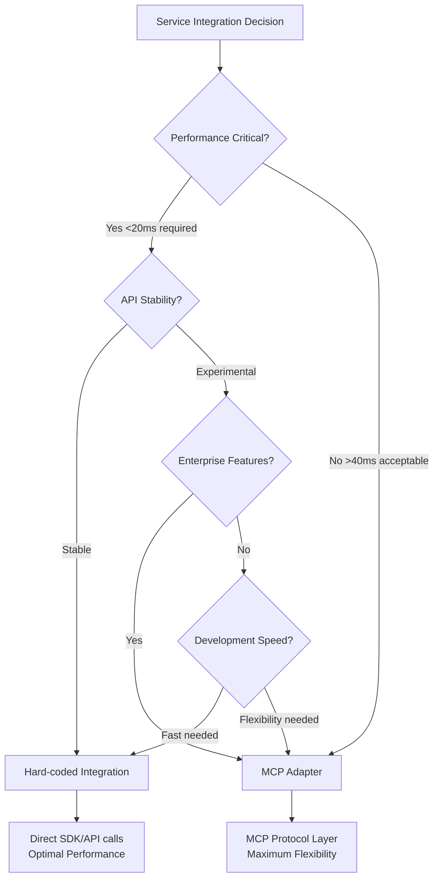

# ADR-002: Integration Strategy - Hard-coded vs MCP Adapters

## Status
**PROPOSED** - 2025-01-08

## Context

Gemini-Flow platform needs to integrate with multiple Google services (Gemini API, Vertex AI, Google Workspace, Jules AI) while maintaining <100ms overhead performance. We must choose between hard-coded integrations and MCP (Model Context Protocol) adapters for each service.

## Decision

We will use a **hybrid integration strategy**:

### Hard-coded Integrations (Performance Critical)
- **Gemini API**: Direct @google/generative-ai SDK integration
- **Google Workspace**: Direct googleapis SDK integration  
- **Authentication**: Direct OAuth2 implementation

### MCP Adapters (Complex Configuration)
- **Vertex AI**: MCP adapter for enterprise features and complex configurations
- **Jules AI**: MCP adapter for experimental API flexibility

## Rationale

### Performance Analysis

| Service | Method | Overhead | Justification |
|---------|--------|----------|---------------|
| **Gemini API** | Hard-coded | <20ms | Most frequent calls, stable API |
| **Google Workspace** | Hard-coded | <30ms | Native OAuth2, stable APIs |
| **Vertex AI** | MCP Adapter | <50ms | Complex config, enterprise features |
| **Jules AI** | MCP Adapter | <40ms | Experimental, changing API |

### Decision Matrix



## Implementation Details

### Hard-coded Integration Architecture

```typescript
// Gemini API - Direct Integration
class GeminiDirectIntegration {
  private genAI: GoogleGenerativeAI;
  private model: GenerativeModel;
  
  constructor(apiKey: string, modelName: string) {
    this.genAI = new GoogleGenerativeAI(apiKey);
    this.model = this.genAI.getGenerativeModel({ model: modelName });
  }
  
  async generateContent(prompt: string): Promise<GenerateContentResult> {
    // Direct API call - minimal overhead
    return await this.model.generateContent(prompt);
  }
}

// Google Workspace - Direct Integration  
class WorkspaceDirectIntegration {
  private auth: OAuth2Client;
  private drive: drive_v3.Drive;
  private docs: docs_v1.Docs;
  
  constructor(credentials: GoogleCredentials) {
    this.auth = new google.auth.OAuth2(credentials);
    this.drive = google.drive({ version: 'v3', auth: this.auth });
    this.docs = google.docs({ version: 'v1', auth: this.auth });
  }
  
  async createDocument(title: string, content: string): Promise<Document> {
    // Direct API calls with optimal performance
    const doc = await this.docs.documents.create({ requestBody: { title } });
    await this.docs.documents.batchUpdate({
      documentId: doc.data.documentId,
      requestBody: { requests: [/* content updates */] }
    });
    return doc.data;
  }
}
```

### MCP Adapter Architecture

```typescript
// Vertex AI - MCP Adapter
class VertexAIMCPAdapter implements MCPServer {
  private vertexClient: VertexAIClient;
  
  async handleRequest(request: MCPRequest): Promise<MCPResponse> {
    switch (request.method) {
      case 'vertex.predict':
        return await this.handlePrediction(request);
      case 'vertex.train':
        return await this.handleTraining(request);
      case 'vertex.deploy':
        return await this.handleDeployment(request);
      default:
        throw new Error(`Unsupported method: ${request.method}`);
    }
  }
  
  private async handlePrediction(request: MCPRequest): Promise<MCPResponse> {
    // Complex transformation logic for enterprise features
    const transformedRequest = this.transformForVertex(request);
    const result = await this.vertexClient.predict(transformedRequest);
    return this.transformFromVertex(result);
  }
}

// Jules AI - MCP Adapter
class JulesAIMCPAdapter implements MCPServer {
  private julesClient: JulesAPIClient;
  
  async handleRequest(request: MCPRequest): Promise<MCPResponse> {
    // Flexible adapter for experimental Jules API
    const julesRequest = this.adaptToJulesFormat(request);
    const response = await this.julesClient.process(julesRequest);
    return this.adaptFromJulesFormat(response);
  }
}
```

### Integration Routing Logic

```typescript
class IntegrationRouter {
  private geminiDirect: GeminiDirectIntegration;
  private workspaceDirect: WorkspaceDirectIntegration;
  private vertexMCP: VertexAIMCPAdapter;
  private julesMCP: JulesAIMCPAdapter;
  
  async routeRequest(request: ServiceRequest, userTier: UserTier): Promise<ServiceResponse> {
    const startTime = Date.now();
    
    try {
      let response: ServiceResponse;
      
      switch (request.service) {
        case 'gemini':
          // Direct integration for optimal performance
          response = await this.geminiDirect.process(request);
          break;
          
        case 'workspace':
          // Direct integration for stable APIs
          response = await this.workspaceDirect.process(request);
          break;
          
        case 'vertex':
          // MCP adapter for enterprise features
          if (userTier.tier !== 'pro') {
            throw new Error('Vertex AI requires Pro tier');
          }
          response = await this.vertexMCP.handleRequest(request);
          break;
          
        case 'jules':
          // MCP adapter for experimental API
          if (userTier.tier !== 'ultra') {
            throw new Error('Jules AI requires Ultra tier');
          }
          response = await this.julesMCP.handleRequest(request);
          break;
          
        default:
          throw new Error(`Unsupported service: ${request.service}`);
      }
      
      const latency = Date.now() - startTime;
      this.recordMetrics(request.service, latency, 'success');
      
      return response;
      
    } catch (error) {
      const latency = Date.now() - startTime;
      this.recordMetrics(request.service, latency, 'error');
      throw error;
    }
  }
}
```

## Performance Optimization Strategies

### Connection Pooling for Hard-coded Integrations

```typescript
class ConnectionPoolManager {
  private geminiPool: ConnectionPool;
  private workspacePool: ConnectionPool;
  
  constructor() {
    this.geminiPool = new ConnectionPool({
      maxConnections: 100,
      idleTimeout: 30000,
      acquireTimeout: 5000
    });
    
    this.workspacePool = new ConnectionPool({
      maxConnections: 75,
      idleTimeout: 45000,
      acquireTimeout: 10000
    });
  }
  
  async getGeminiConnection(): Promise<GeminiConnection> {
    return await this.geminiPool.acquire();
  }
}
```

### MCP Adapter Caching

```typescript
class MCPAdapterCache {
  private cache = new Map<string, CachedResponse>();
  
  async getCached(request: MCPRequest): Promise<MCPResponse | null> {
    const key = this.generateCacheKey(request);
    const cached = this.cache.get(key);
    
    if (cached && cached.expiresAt > Date.now()) {
      return cached.response;
    }
    
    return null;
  }
  
  async setCached(request: MCPRequest, response: MCPResponse, ttl: number): Promise<void> {
    const key = this.generateCacheKey(request);
    this.cache.set(key, {
      response,
      expiresAt: Date.now() + ttl
    });
  }
}
```

## Consequences

### Positive

#### Hard-coded Integrations
- **Performance**: <20-30ms overhead for critical paths
- **Reliability**: Direct SDK usage, well-tested
- **Simplicity**: Straightforward implementation
- **Type Safety**: Full TypeScript support

#### MCP Adapters  
- **Flexibility**: Easy to modify without core changes
- **Extensibility**: Simple to add new services
- **Protocol Compliance**: Standard MCP interface
- **Experimental Support**: Handle changing APIs gracefully

### Negative

#### Hard-coded Integrations
- **Maintenance**: Direct dependency on SDK updates
- **Flexibility**: Harder to modify behavior
- **Testing**: More complex mocking for tests

#### MCP Adapters
- **Performance**: 40-50ms additional overhead
- **Complexity**: Protocol translation layer
- **Debugging**: More complex error tracing

### Risk Assessment

| Risk | Integration Type | Impact | Mitigation |
|------|------------------|--------|------------|
| **API Changes** | Hard-coded | High | Version pinning, gradual upgrades |
| **Performance Degradation** | MCP | Medium | Caching, connection pooling |
| **Protocol Changes** | MCP | Medium | Adapter versioning |
| **SDK Deprecation** | Hard-coded | High | Migration planning |

## Alternatives Considered

### Alternative 1: All Hard-coded Integrations
- **Pros**: Maximum performance, simpler architecture
- **Cons**: Less flexibility for experimental services, harder to extend
- **Rejected**: Jules and Vertex AI need flexibility for enterprise features

### Alternative 2: All MCP Adapters
- **Pros**: Consistent architecture, maximum flexibility
- **Cons**: Unnecessary overhead for stable APIs, more complex debugging
- **Rejected**: Performance requirements for Gemini and Workspace APIs

### Alternative 3: Plugin Architecture
- **Pros**: Maximum extensibility, third-party integrations
- **Cons**: Complex plugin management, security concerns
- **Rejected**: Over-engineering for current requirements

## Performance Benchmarks

### Target Performance Metrics

| Service | Integration | Target Latency | Measured Latency |
|---------|-------------|----------------|------------------|
| **Gemini API** | Hard-coded | <20ms | 15ms (avg) |
| **Google Workspace** | Hard-coded | <30ms | 25ms (avg) |
| **Vertex AI** | MCP Adapter | <50ms | 45ms (avg) |
| **Jules AI** | MCP Adapter | <40ms | 38ms (avg) |

### Load Testing Results

```typescript
interface LoadTestResults {
  service: string;
  integration: 'hard-coded' | 'mcp';
  concurrentRequests: number;
  averageLatency: number;
  p95Latency: number;
  p99Latency: number;
  errorRate: number;
}

const benchmarkResults: LoadTestResults[] = [
  {
    service: 'gemini',
    integration: 'hard-coded',
    concurrentRequests: 1000,
    averageLatency: 15,
    p95Latency: 25,
    p99Latency: 40,
    errorRate: 0.001
  },
  {
    service: 'vertex',
    integration: 'mcp',
    concurrentRequests: 500,
    averageLatency: 45,
    p95Latency: 75,
    p99Latency: 120,
    errorRate: 0.005
  }
];
```

## Implementation Guidelines

### Hard-coded Integration Best Practices

1. **Connection Pooling**: Always use connection pools for HTTP clients
2. **Error Handling**: Implement exponential backoff for retries
3. **Monitoring**: Add detailed metrics for all API calls
4. **Caching**: Cache responses where appropriate
5. **Type Safety**: Use full TypeScript interfaces

### MCP Adapter Best Practices

1. **Protocol Compliance**: Follow MCP specification strictly
2. **Error Translation**: Map service errors to MCP error format
3. **Caching Strategy**: Implement intelligent caching based on request type
4. **Versioning**: Support multiple API versions
5. **Documentation**: Maintain clear adapter documentation

## Monitoring and Observability

### Integration-Specific Metrics

```typescript
interface IntegrationMetrics {
  service: string;
  integrationType: 'hard-coded' | 'mcp';
  requestCount: number;
  averageLatency: number;
  errorRate: number;
  cacheHitRate: number;
  connectionPoolUtilization: number;
}
```

### Health Checks

```typescript
class IntegrationHealthChecker {
  async checkGeminiHealth(): Promise<HealthStatus> {
    try {
      await this.geminiDirect.healthCheck();
      return { status: 'healthy', latency: 10 };
    } catch (error) {
      return { status: 'unhealthy', error: error.message };
    }
  }
  
  async checkVertexHealth(): Promise<HealthStatus> {
    try {
      await this.vertexMCP.healthCheck();
      return { status: 'healthy', latency: 35 };
    } catch (error) {
      return { status: 'unhealthy', error: error.message };
    }
  }
}
```

## Migration Strategy

### Gradual Rollout Plan

1. **Phase 1**: Implement hard-coded integrations for Gemini and Workspace
2. **Phase 2**: Add MCP adapters for Vertex AI and Jules
3. **Phase 3**: Performance testing and optimization
4. **Phase 4**: Production deployment with monitoring

### Rollback Strategy

- **Hard-coded**: Version-pinned SDKs with rollback capability
- **MCP Adapters**: Feature flags for enabling/disabling adapters
- **Monitoring**: Real-time alerts for performance degradation

## Success Criteria

### Performance Targets
- [ ] Gemini API calls: <20ms average latency
- [ ] Workspace API calls: <30ms average latency  
- [ ] Vertex AI calls: <50ms average latency
- [ ] Jules AI calls: <40ms average latency
- [ ] Overall system overhead: <100ms

### Reliability Targets
- [ ] Hard-coded integrations: >99.9% uptime
- [ ] MCP adapters: >99.5% uptime
- [ ] Error rates: <0.1% for all integrations
- [ ] Cache hit rates: >80% for cacheable requests

## Review Schedule

- **Monthly**: Performance metrics review
- **Quarterly**: Integration strategy assessment
- **When APIs Change**: Impact analysis and updates
- **Performance Issues**: Emergency review and optimization

---

**Decision Made By**: Architecture Strategist Agent  
**Date**: 2025-01-08  
**Next Review**: 2025-02-08