# System Architecture Diagrams - Google Tier System

## C4 Model Architecture Overview

### Level 1: System Context Diagram

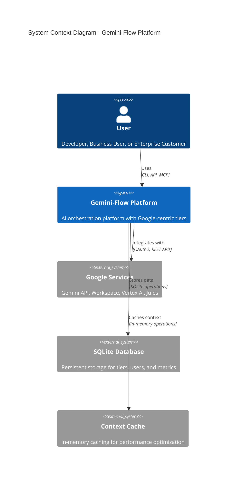

### Level 2: Container Diagram

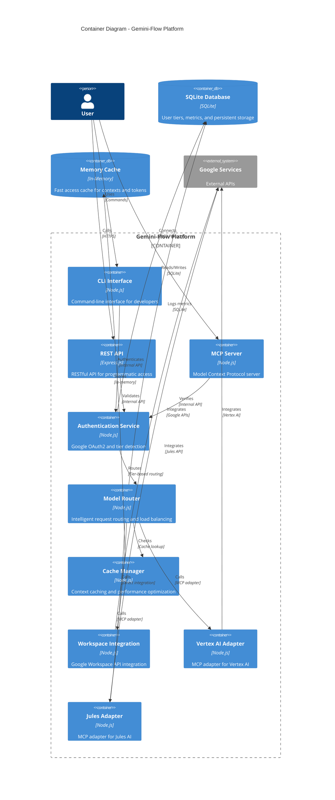

### Level 3: Component Diagram - Authentication Service

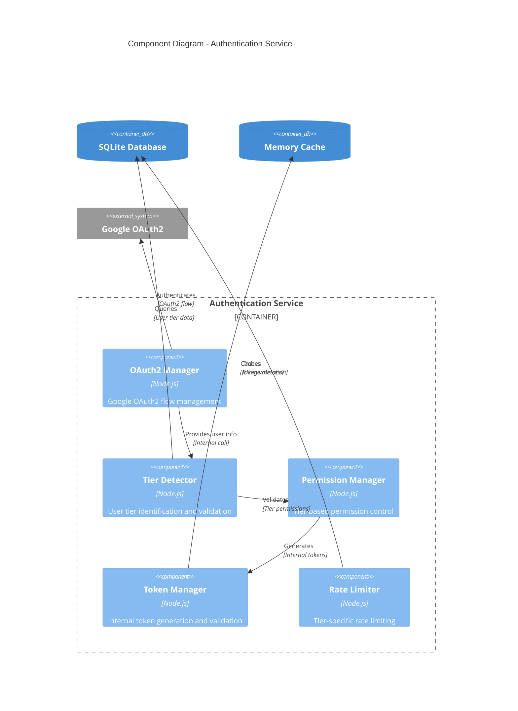

## Detailed Component Interactions

### Authentication Flow Sequence

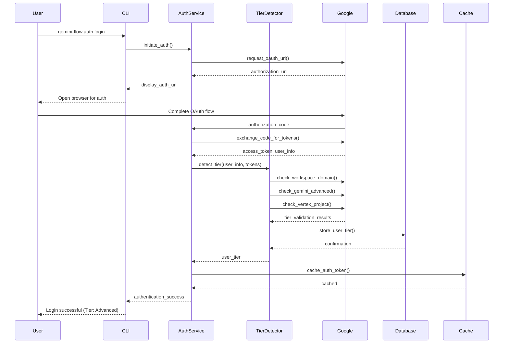

### Model Routing Decision Flow

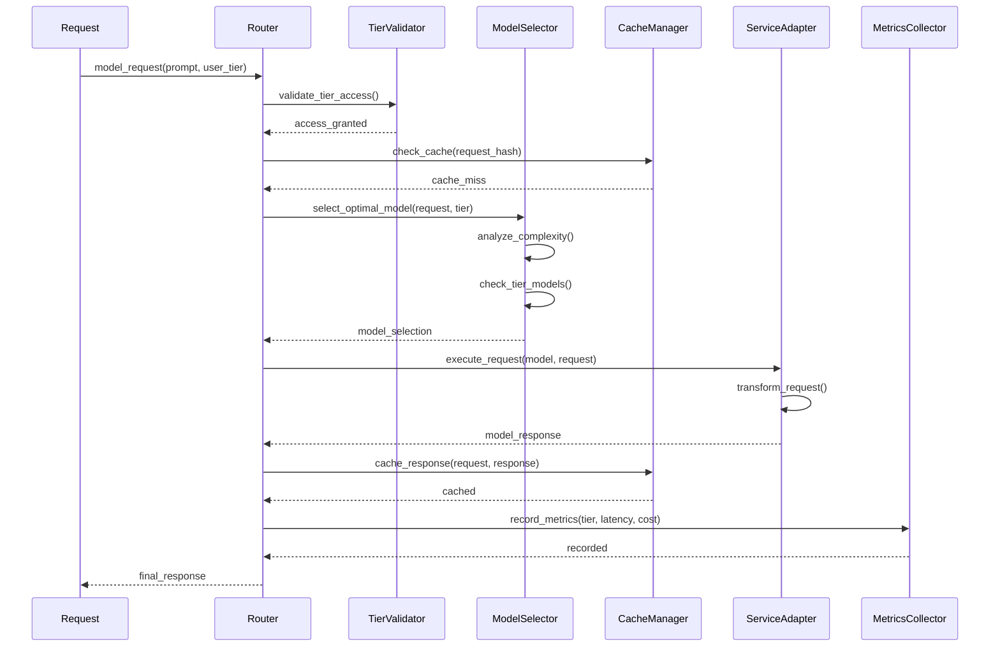

## Data Flow Architecture

### Tier Detection Data Flow

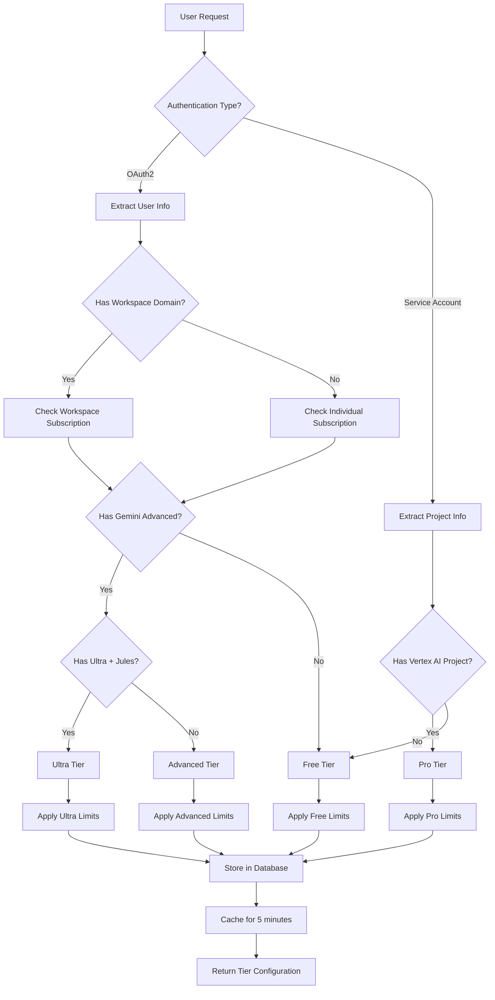

### Model Selection Decision Tree

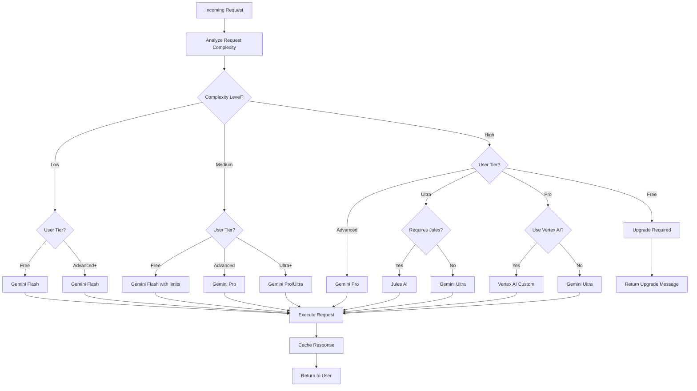

## Integration Architecture Patterns

### Hard-coded vs MCP Integration Decision Matrix

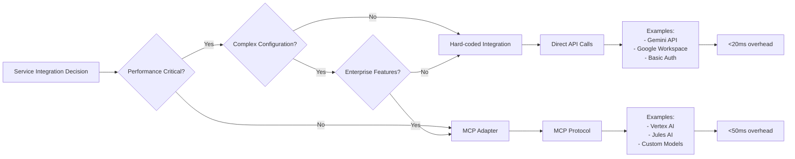

### Performance Optimization Stack

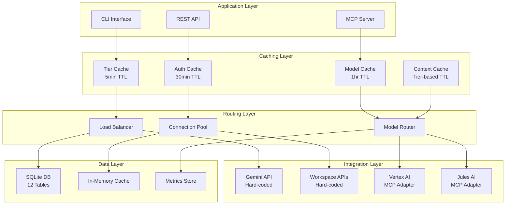

## Security Architecture

### Tier-based Security Model

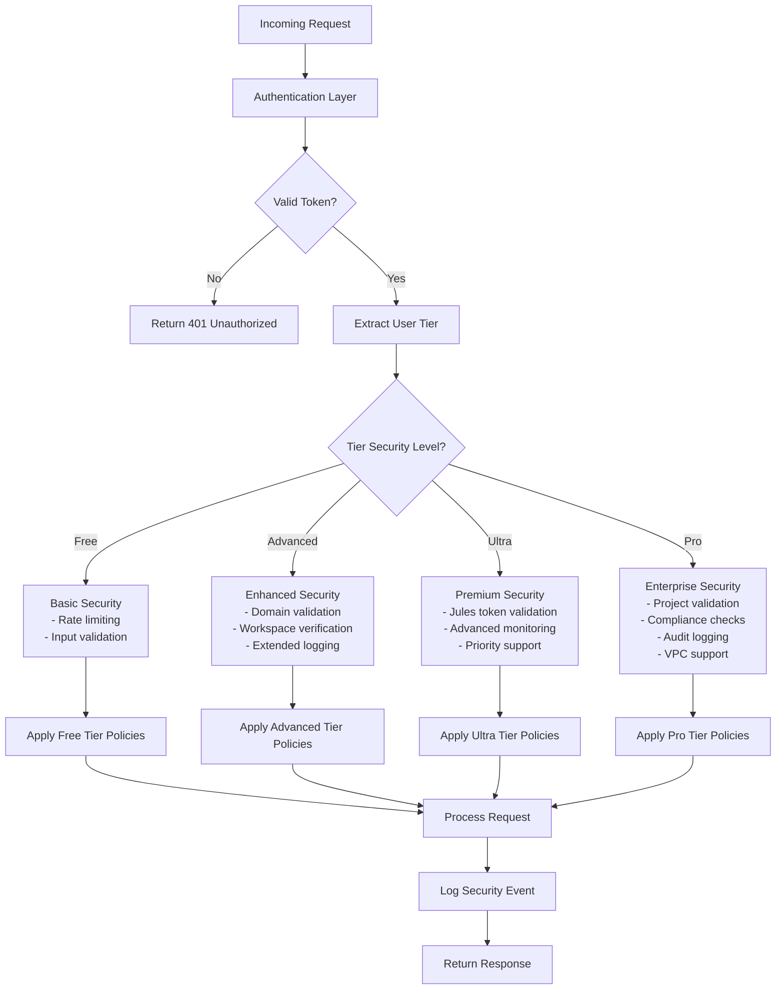

## Monitoring and Observability

### Metrics Collection Architecture

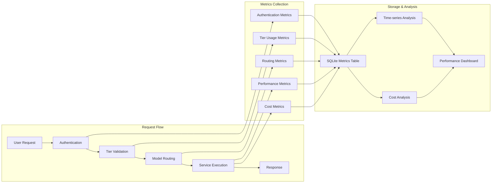

### Real-time Monitoring Dashboard

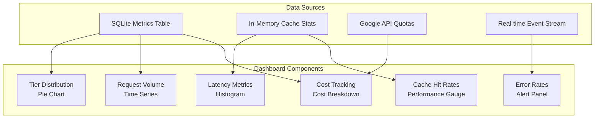

## Deployment Architecture

### Multi-Environment Deployment

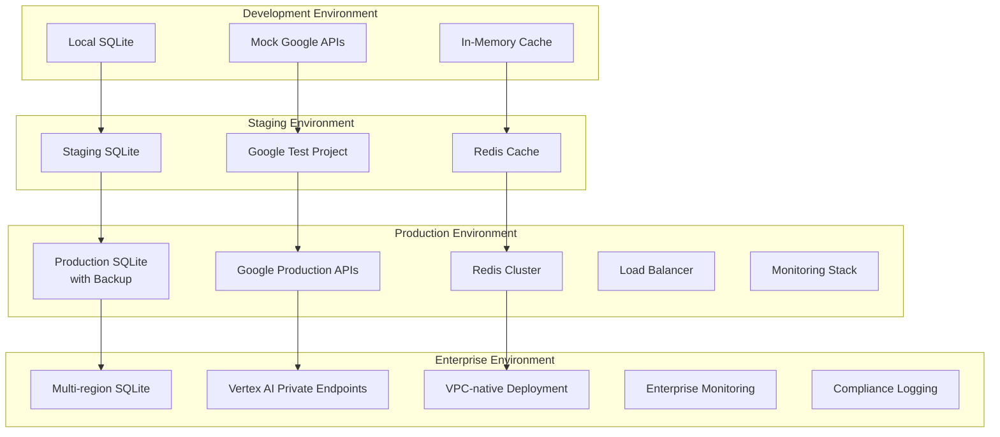

## Technology Stack Overview

### Core Technologies by Layer

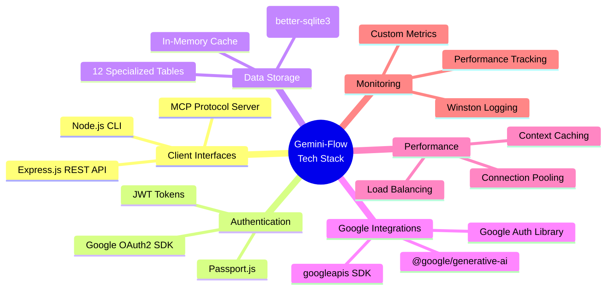

This comprehensive architecture documentation provides detailed visual representations of the Google-centric tier system, showing how all components interact to deliver the <100ms overhead performance while maintaining scalability and cost optimization across all four tiers.