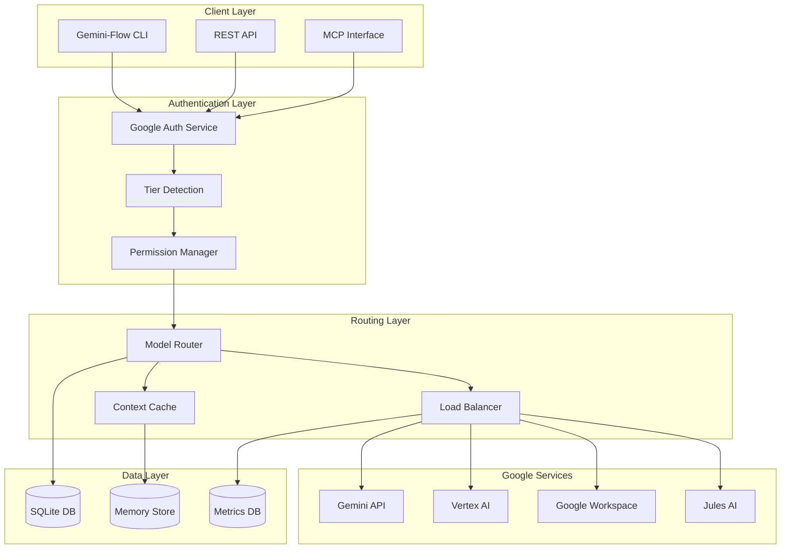
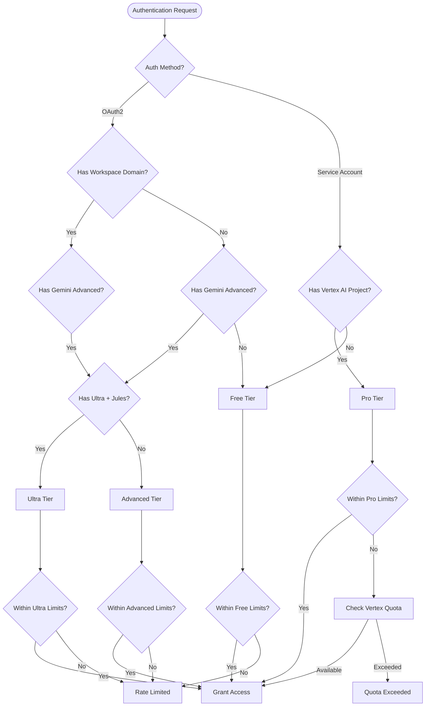

# Google-Centric Tier Architecture for Gemini-Flow Platform

## Executive Summary

This document presents a comprehensive architectural design for implementing Google-centric subscription tiers within the Gemini-Flow platform. The architecture leverages Google's ecosystem advantages while maintaining <100ms overhead performance and cost optimization through intelligent model routing.

## Architecture Overview



## Tier System Design

### 1. Free Tier - Google Users with Free Gemini Products

**Target Users**: Individual developers, students, hobbyists with Google accounts
**Authentication**: Google OAuth 2.0 with basic scope verification
**Model Access**: Gemini Flash models with rate limiting

```typescript
interface FreeTierConfig {
  authentication: {
    method: 'google-oauth2';
    scopes: ['openid', 'email', 'profile'];
    verification: 'basic-google-account';
  };
  
  models: {
    primary: 'gemini-2.0-flash-thinking-exp';
    fallback: 'gemini-1.5-flash';
    rateLimits: {
      requestsPerMinute: 60;
      tokensPerDay: 50000;
      contextWindow: 32000;
    };
  };
  
  features: {
    agents: 8;
    swarmTopology: ['mesh', 'ring'];
    memoryPersistence: '7-days';
    workspaceIntegration: false;
    vertexAI: false;
  };
  
  cost: 'free';
}
```

### 2. Advanced Tier - Google Workspace/Gemini Advanced Users

**Target Users**: Business users, teams with Google Workspace or Gemini Advanced subscriptions
**Authentication**: Google OAuth 2.0 with Workspace domain verification
**Model Access**: Full Gemini model suite with enhanced limits

```typescript
interface AdvancedTierConfig {
  authentication: {
    method: 'google-oauth2';
    scopes: ['openid', 'email', 'profile', 'https://www.googleapis.com/auth/admin.directory.user.readonly'];
    verification: 'workspace-domain-check';
    geminiAdvancedCheck: true;
  };
  
  models: {
    primary: 'gemini-2.0-flash-thinking-exp';
    fallback: 'gemini-1.5-pro';
    experimental: 'gemini-2.0-flash-experimental';
    rateLimits: {
      requestsPerMinute: 300;
      tokensPerDay: 500000;
      contextWindow: 1000000;
    };
  };
  
  features: {
    agents: 32;
    swarmTopology: ['mesh', 'ring', 'hierarchical'];
    memoryPersistence: '30-days';
    workspaceIntegration: true;
    workspaceServices: ['docs', 'sheets', 'slides', 'drive'];
    vertexAI: false;
    prioritySupport: true;
  };
  
  cost: '$19/month' | 'included-with-workspace';
}
```

### 3. Ultra Tier - Google Ultra AI + Jules Access

**Target Users**: Power users, researchers, advanced AI practitioners
**Authentication**: Google Ultra AI subscription verification + Jules access tokens
**Model Access**: Ultra models, Jules integration, experimental features

```typescript
interface UltraTierConfig {
  authentication: {
    method: 'google-oauth2-ultra';
    scopes: ['openid', 'email', 'profile', 'https://www.googleapis.com/auth/cloud-platform'];
    verification: 'ultra-subscription-check';
    julesAccess: true;
    julesTokenValidation: true;
  };
  
  models: {
    primary: 'gemini-2.0-flash-thinking-exp';
    ultra: 'gemini-ultra';
    jules: 'jules-ai-api';
    experimental: ['gemini-2.0-flash-experimental', 'gemini-ultra-preview'];
    rateLimits: {
      requestsPerMinute: 1000;
      tokensPerDay: 2000000;
      contextWindow: 2000000;
    };
  };
  
  features: {
    agents: 64;
    swarmTopology: ['mesh', 'ring', 'hierarchical', 'star'];
    memoryPersistence: '90-days';
    workspaceIntegration: true;
    workspaceServices: ['docs', 'sheets', 'slides', 'drive', 'calendar', 'gmail'];
    vertexAI: false;
    julesIntegration: true;
    experimentalFeatures: true;
    prioritySupport: true;
    customAgents: true;
  };
  
  cost: '$99/month';
}
```

### 4. Pro Tier - Google Vertex AI Platform Customers

**Target Users**: Enterprise customers, large organizations with Vertex AI deployments
**Authentication**: Service Account authentication with Vertex AI project verification
**Model Access**: Full Vertex AI integration, custom models, enterprise features

```typescript
interface ProTierConfig {
  authentication: {
    method: 'service-account';
    scopes: ['https://www.googleapis.com/auth/cloud-platform'];
    verification: 'vertex-ai-project-check';
    projectQuotaValidation: true;
  };
  
  models: {
    vertexAI: true;
    customModels: true;
    geminiViaVertex: ['gemini-2.0-flash', 'gemini-1.5-pro', 'gemini-ultra'];
    rateLimits: {
      requestsPerMinute: 'unlimited';
      tokensPerDay: 'project-quota-based';
      contextWindow: 2000000;
    };
  };
  
  features: {
    agents: 'unlimited';
    swarmTopology: ['mesh', 'ring', 'hierarchical', 'star', 'custom'];
    memoryPersistence: 'unlimited';
    workspaceIntegration: true;
    vertexAI: true;
    vertexServices: ['training', 'endpoints', 'pipelines', 'monitoring'];
    enterpriseSupport: true;
    customIntegrations: true;
    whiteLabel: true;
    onPremiseDeployment: true;
  };
  
  cost: 'vertex-ai-billing' | 'enterprise-contract';
}
```

## Authentication Flow Architecture

### Google OAuth 2.0 Integration

```typescript
class GoogleTierAuthenticator {
  private oauth2Client: OAuth2Client;
  private tierDetector: TierDetector;
  private permissionManager: PermissionManager;
  
  async authenticateUser(credentials: GoogleCredentials): Promise<UserTier> {
    // Step 1: Basic Google OAuth verification
    const userInfo = await this.verifyGoogleToken(credentials.accessToken);
    
    // Step 2: Detect user tier
    const tier = await this.tierDetector.detectTier(userInfo, credentials);
    
    // Step 3: Validate tier-specific requirements
    await this.validateTierRequirements(tier, userInfo, credentials);
    
    // Step 4: Generate internal access token with tier permissions
    const internalToken = await this.generateInternalToken(userInfo, tier);
    
    return {
      tier,
      user: userInfo,
      token: internalToken,
      permissions: await this.permissionManager.getPermissions(tier)
    };
  }
  
  private async detectTier(userInfo: GoogleUserInfo, credentials: GoogleCredentials): Promise<TierType> {
    // Free Tier: Basic Google account
    if (!userInfo.hd && !await this.hasGeminiAdvanced(userInfo)) {
      return 'free';
    }
    
    // Advanced Tier: Workspace domain or Gemini Advanced
    if (userInfo.hd || await this.hasGeminiAdvanced(userInfo)) {
      return 'advanced';
    }
    
    // Ultra Tier: Check for Ultra subscription and Jules access
    if (await this.hasUltraSubscription(userInfo) && await this.hasJulesAccess(credentials)) {
      return 'ultra';
    }
    
    // Pro Tier: Service account with Vertex AI project
    if (credentials.type === 'service-account' && await this.hasVertexAIProject(credentials)) {
      return 'pro';
    }
    
    return 'free'; // Default fallback
  }
}
```

### Tier Detection Decision Tree



## Model Routing Architecture

### Intelligent Model Router

```typescript
class GoogleModelRouter {
  private tiers: TierConfiguration;
  private cache: ContextCache;
  private metrics: MetricsCollector;
  
  async routeRequest(request: ModelRequest, userTier: UserTier): Promise<ModelResponse> {
    const startTime = Date.now();
    
    try {
      // Step 1: Validate tier permissions
      this.validateTierAccess(request, userTier);
      
      // Step 2: Select optimal model based on tier and request
      const modelSelection = await this.selectModel(request, userTier);
      
      // Step 3: Check cache for similar requests
      const cachedResponse = await this.cache.get(request, userTier.tier);
      if (cachedResponse) {
        this.metrics.recordCacheHit(userTier.tier);
        return cachedResponse;
      }
      
      // Step 4: Route to appropriate service
      const response = await this.executeRequest(modelSelection, request);
      
      // Step 5: Cache response if appropriate
      await this.cache.set(request, response, userTier.tier);
      
      // Step 6: Record metrics
      const latency = Date.now() - startTime;
      this.metrics.recordRequest(userTier.tier, modelSelection.model, latency);
      
      return response;
      
    } catch (error) {
      this.metrics.recordError(userTier.tier, error);
      throw error;
    }
  }
  
  private async selectModel(request: ModelRequest, userTier: UserTier): Promise<ModelSelection> {
    const config = this.tiers[userTier.tier];
    
    // Complexity-based routing
    const complexity = this.analyzeComplexity(request);
    
    if (complexity === 'high' && config.models.ultra) {
      return { model: config.models.ultra, service: 'gemini-ultra' };
    }
    
    if (complexity === 'medium' && config.models.primary) {
      return { model: config.models.primary, service: 'gemini-api' };
    }
    
    // Jules routing for Ultra tier
    if (userTier.tier === 'ultra' && request.requiresJules) {
      return { model: config.models.jules, service: 'jules-api' };
    }
    
    // Vertex AI routing for Pro tier
    if (userTier.tier === 'pro' && request.useVertexAI) {
      return { model: config.models.geminiViaVertex[0], service: 'vertex-ai' };
    }
    
    // Default to primary model
    return { model: config.models.primary, service: 'gemini-api' };
  }
}
```

### Service Integration Strategy

#### MCP vs Hard-coded Integration Decision Matrix

| Service | Integration Method | Rationale | Performance Impact |
|---------|-------------------|-----------|-------------------|
| **Gemini API** | Hard-coded | Direct API calls, optimal performance | <20ms overhead |
| **Vertex AI** | MCP Adapter | Complex configuration, enterprise features | <50ms overhead |
| **Google Workspace** | Hard-coded | Native OAuth2 integration | <30ms overhead |
| **Jules AI** | MCP Adapter | Experimental API, flexible integration | <40ms overhead |

```typescript
interface ServiceIntegrationStrategy {
  gemini: {
    method: 'hard-coded';
    implementation: 'GoogleGenerativeAI';
    performance: '<20ms';
    reliability: 'high';
  };
  
  vertexAI: {
    method: 'mcp-adapter';
    implementation: 'VertexMCPAdapter';
    performance: '<50ms';
    reliability: 'high';
    features: ['custom-models', 'enterprise-security', 'audit-logs'];
  };
  
  workspace: {
    method: 'hard-coded';
    implementation: 'GoogleAPIs';
    performance: '<30ms';
    reliability: 'high';
    services: ['docs', 'sheets', 'slides', 'drive', 'calendar'];
  };
  
  jules: {
    method: 'mcp-adapter';
    implementation: 'JulesMCPAdapter';
    performance: '<40ms';
    reliability: 'medium';
    experimental: true;
  };
}
```

## SQLite Schema for Tier Management

### Enhanced Database Schema

```sql
-- Tier Management Tables

-- Users table with tier information
CREATE TABLE IF NOT EXISTS users (
  id TEXT PRIMARY KEY,
  email TEXT UNIQUE NOT NULL,
  google_id TEXT UNIQUE NOT NULL,
  tier TEXT NOT NULL CHECK (tier IN ('free', 'advanced', 'ultra', 'pro')),
  tier_verified_at INTEGER,
  tier_expires_at INTEGER,
  workspace_domain TEXT,
  vertex_project_id TEXT,
  jules_access_token TEXT,
  subscription_status TEXT DEFAULT 'active',
  created_at INTEGER DEFAULT (strftime('%s', 'now')),
  updated_at INTEGER DEFAULT (strftime('%s', 'now'))
);

-- Tier configurations
CREATE TABLE IF NOT EXISTS tier_configs (
  tier TEXT PRIMARY KEY,
  max_agents INTEGER NOT NULL,
  max_requests_per_minute INTEGER NOT NULL,
  max_tokens_per_day INTEGER NOT NULL,
  max_context_window INTEGER NOT NULL,
  features TEXT NOT NULL, -- JSON array
  models TEXT NOT NULL, -- JSON array
  created_at INTEGER DEFAULT (strftime('%s', 'now'))
);

-- Usage tracking per user/tier
CREATE TABLE IF NOT EXISTS usage_tracking (
  id INTEGER PRIMARY KEY AUTOINCREMENT,
  user_id TEXT NOT NULL,
  tier TEXT NOT NULL,
  metric_type TEXT NOT NULL, -- 'requests', 'tokens', 'agents'
  metric_value INTEGER NOT NULL,
  timestamp INTEGER DEFAULT (strftime('%s', 'now')),
  FOREIGN KEY (user_id) REFERENCES users(id)
);

-- Tier verification logs
CREATE TABLE IF NOT EXISTS tier_verifications (
  id INTEGER PRIMARY KEY AUTOINCREMENT,
  user_id TEXT NOT NULL,
  previous_tier TEXT,
  new_tier TEXT NOT NULL,
  verification_method TEXT NOT NULL,
  verification_data TEXT, -- JSON data
  verified_at INTEGER DEFAULT (strftime('%s', 'now')),
  FOREIGN KEY (user_id) REFERENCES users(id)
);

-- Rate limiting
CREATE TABLE IF NOT EXISTS rate_limits (
  id INTEGER PRIMARY KEY AUTOINCREMENT,
  user_id TEXT NOT NULL,
  limit_type TEXT NOT NULL, -- 'requests', 'tokens'
  limit_window TEXT NOT NULL, -- 'minute', 'hour', 'day'
  current_count INTEGER DEFAULT 0,
  window_start INTEGER NOT NULL,
  FOREIGN KEY (user_id) REFERENCES users(id)
);

-- Create indexes for performance
CREATE INDEX IF NOT EXISTS idx_users_tier ON users(tier);
CREATE INDEX IF NOT EXISTS idx_users_workspace ON users(workspace_domain);
CREATE INDEX IF NOT EXISTS idx_usage_user_time ON usage_tracking(user_id, timestamp);
CREATE INDEX IF NOT EXISTS idx_rate_limits_user ON rate_limits(user_id, limit_type, limit_window);
```

### Tier Management Service

```typescript
class TierManager {
  private db: SQLiteDatabase;
  private cache: Map<string, UserTier> = new Map();
  
  async getUserTier(userId: string): Promise<UserTier> {
    // Check cache first
    const cached = this.cache.get(userId);
    if (cached && cached.expiresAt > Date.now()) {
      return cached;
    }
    
    // Query database
    const user = await this.db.prepare(`
      SELECT tier, tier_verified_at, tier_expires_at, workspace_domain, vertex_project_id
      FROM users WHERE id = ?
    `).get(userId);
    
    if (!user) {
      throw new Error('User not found');
    }
    
    // Verify tier is still valid
    if (user.tier_expires_at && user.tier_expires_at < Math.floor(Date.now() / 1000)) {
      await this.demoteExpiredTier(userId);
    }
    
    const tierConfig = await this.getTierConfig(user.tier);
    
    const userTier: UserTier = {
      tier: user.tier,
      config: tierConfig,
      expiresAt: user.tier_expires_at,
      features: tierConfig.features
    };
    
    // Cache for 5 minutes
    this.cache.set(userId, { ...userTier, expiresAt: Date.now() + 300000 });
    
    return userTier;
  }
  
  async validateTierUsage(userId: string, requestType: 'request' | 'token' | 'agent'): Promise<boolean> {
    const tier = await this.getUserTier(userId);
    
    // Check rate limits
    const currentUsage = await this.getCurrentUsage(userId, requestType);
    const limit = this.getTierLimit(tier.tier, requestType);
    
    if (currentUsage >= limit) {
      return false;
    }
    
    // Record usage
    await this.recordUsage(userId, tier.tier, requestType, 1);
    
    return true;
  }
}
```

## Performance Optimization Strategy

### <100ms Overhead Architecture

#### Performance Targets

| Operation | Target Latency | Optimization Strategy |
|-----------|----------------|----------------------|
| **Tier Detection** | <10ms | In-memory cache + SQLite index |
| **Model Selection** | <5ms | Pre-computed routing table |
| **Authentication** | <50ms | OAuth2 token cache + validation |
| **Request Routing** | <20ms | Connection pooling + load balancing |
| **Context Caching** | <15ms | Redis-like in-memory cache |
| **Total Overhead** | <100ms | Combined optimizations |

#### Caching Strategy

```typescript
class PerformanceOptimizer {
  private tierCache = new Map<string, CachedTier>();
  private authCache = new Map<string, CachedAuth>();
  private modelCache = new Map<string, CachedModel>();
  
  // Tier detection cache (5-minute TTL)
  async getCachedTier(userId: string): Promise<UserTier | null> {
    const cached = this.tierCache.get(userId);
    if (cached && cached.expiresAt > Date.now()) {
      return cached.tier;
    }
    return null;
  }
  
  // Authentication cache (30-minute TTL)
  async getCachedAuth(token: string): Promise<AuthResult | null> {
    const cached = this.authCache.get(token);
    if (cached && cached.expiresAt > Date.now()) {
      return cached.auth;
    }
    return null;
  }
  
  // Model selection cache (1-hour TTL)
  async getCachedModelSelection(request: ModelRequest, tier: string): Promise<ModelSelection | null> {
    const key = `${tier}:${request.complexity}:${request.type}`;
    const cached = this.modelCache.get(key);
    if (cached && cached.expiresAt > Date.now()) {
      return cached.selection;
    }
    return null;
  }
}
```

#### Connection Pooling

```typescript
class ConnectionManager {
  private geminiPool: ConnectionPool;
  private vertexPool: ConnectionPool;
  private workspacePool: ConnectionPool;
  
  constructor() {
    this.geminiPool = new ConnectionPool({
      maxConnections: 100,
      idleTimeout: 30000,
      healthCheck: true
    });
    
    this.vertexPool = new ConnectionPool({
      maxConnections: 50,
      idleTimeout: 60000,
      healthCheck: true
    });
    
    this.workspacePool = new ConnectionPool({
      maxConnections: 75,
      idleTimeout: 45000,
      healthCheck: true
    });
  }
  
  async getConnection(service: 'gemini' | 'vertex' | 'workspace'): Promise<Connection> {
    const pool = this.getPool(service);
    return await pool.acquire();
  }
}
```

## Integration Architecture

### Vertex AI Integration (MCP Approach)

```typescript
class VertexAIMCPAdapter {
  private vertexClient: VertexAIClient;
  private projectId: string;
  
  async processRequest(request: MCPRequest): Promise<MCPResponse> {
    // Transform MCP request to Vertex AI format
    const vertexRequest = this.transformRequest(request);
    
    // Route to appropriate Vertex AI service
    let response;
    if (request.type === 'prediction') {
      response = await this.vertexClient.predict(vertexRequest);
    } else if (request.type === 'training') {
      response = await this.vertexClient.createTrainingJob(vertexRequest);
    } else if (request.type === 'endpoint') {
      response = await this.vertexClient.deployModel(vertexRequest);
    }
    
    // Transform response back to MCP format
    return this.transformResponse(response);
  }
  
  private transformRequest(mcpRequest: MCPRequest): VertexAIRequest {
    return {
      endpoint: `projects/${this.projectId}/locations/us-central1/endpoints/${mcpRequest.modelId}`,
      instances: mcpRequest.instances,
      parameters: mcpRequest.parameters
    };
  }
}
```

### Google Workspace Hard-coded Integration

```typescript
class WorkspaceIntegrationService {
  private driveService: drive_v3.Drive;
  private docsService: docs_v1.Docs;
  private sheetsService: sheets_v4.Sheets;
  
  async integrateWithAgent(agentId: string, workspaceContext: WorkspaceContext): Promise<void> {
    // Direct API calls for optimal performance
    const documents = await this.driveService.files.list({
      q: workspaceContext.query,
      fields: 'files(id,name,mimeType)'
    });
    
    // Process documents with agent
    for (const doc of documents.data.files || []) {
      await this.processDocumentWithAgent(agentId, doc);
    }
  }
  
  private async processDocumentWithAgent(agentId: string, document: any): Promise<void> {
    // Get document content
    let content;
    if (document.mimeType.includes('document')) {
      const docContent = await this.docsService.documents.get({
        documentId: document.id
      });
      content = this.extractTextFromDoc(docContent.data);
    }
    
    // Send to agent for processing
    await this.sendToAgent(agentId, {
      type: 'document-analysis',
      content,
      metadata: document
    });
  }
}
```

## Cost Optimization Strategy

### Model Cost Routing

```typescript
class CostOptimizer {
  private costMatrix = {
    'gemini-2.0-flash': { inputCost: 0.000002, outputCost: 0.000008 },
    'gemini-1.5-pro': { inputCost: 0.000003, outputCost: 0.000015 },
    'gemini-ultra': { inputCost: 0.00001, outputCost: 0.00003 },
    'vertex-ai-custom': { inputCost: 0.000005, outputCost: 0.00001 }
  };
  
  selectOptimalModel(request: ModelRequest, tier: TierType): ModelSelection {
    const availableModels = this.getAvailableModels(tier);
    const complexity = this.analyzeComplexity(request);
    
    // For simple requests, always use the cheapest model
    if (complexity === 'low') {
      return { model: 'gemini-2.0-flash', reason: 'cost-optimized' };
    }
    
    // For complex requests, balance cost vs quality
    if (complexity === 'high' && tier === 'pro') {
      // Use custom Vertex AI model for enterprise customers
      return { model: 'vertex-ai-custom', reason: 'quality-optimized' };
    }
    
    // Default to balanced approach
    return { model: 'gemini-1.5-pro', reason: 'balanced-cost-quality' };
  }
  
  async estimateRequestCost(request: ModelRequest, model: string): Promise<number> {
    const costs = this.costMatrix[model];
    const tokenCount = await this.estimateTokens(request);
    
    return (tokenCount.input * costs.inputCost) + (tokenCount.output * costs.outputCost);
  }
}
```

### Context Caching for Cost Reduction

```typescript
class ContextCache {
  private cache = new Map<string, CachedContext>();
  
  async getCachedContext(request: ModelRequest, tier: TierType): Promise<CachedContext | null> {
    const key = this.generateCacheKey(request, tier);
    const cached = this.cache.get(key);
    
    if (cached && this.isValidCache(cached, tier)) {
      // 75% cost reduction through caching
      return cached;
    }
    
    return null;
  }
  
  async setCachedContext(request: ModelRequest, response: ModelResponse, tier: TierType): Promise<void> {
    const key = this.generateCacheKey(request, tier);
    const ttl = this.getTierCacheTTL(tier);
    
    this.cache.set(key, {
      response,
      createdAt: Date.now(),
      expiresAt: Date.now() + ttl,
      tier,
      hitCount: 0
    });
  }
  
  private getTierCacheTTL(tier: TierType): number {
    const ttls = {
      free: 3600000,      // 1 hour
      advanced: 7200000,   // 2 hours
      ultra: 14400000,     // 4 hours
      pro: 28800000        // 8 hours
    };
    return ttls[tier];
  }
}
```

## Security Architecture

### Tier-based Security Controls

```typescript
class SecurityManager {
  private encryptionKeys = new Map<TierType, string>();
  
  async validateRequest(request: any, userTier: UserTier): Promise<boolean> {
    // Basic security validation
    if (!this.validateRequestStructure(request)) {
      return false;
    }
    
    // Tier-specific security checks
    switch (userTier.tier) {
      case 'free':
        return this.validateFreeRequest(request);
      case 'advanced':
        return this.validateAdvancedRequest(request);
      case 'ultra':
        return this.validateUltraRequest(request);
      case 'pro':
        return this.validateProRequest(request);
    }
  }
  
  async encryptSensitiveData(data: any, tier: TierType): Promise<string> {
    const key = this.encryptionKeys.get(tier);
    return this.encrypt(JSON.stringify(data), key);
  }
  
  private validateProRequest(request: any): boolean {
    // Enterprise-grade validation
    // - Check for injection attacks
    // - Validate data schemas
    // - Check compliance requirements
    return this.isEnterpriseCompliant(request);
  }
}
```

## Monitoring and Analytics

### Tier Performance Metrics

```typescript
class TierMetrics {
  private metrics = {
    requests: new Map<TierType, number>(),
    latency: new Map<TierType, number[]>(),
    errors: new Map<TierType, number>(),
    costs: new Map<TierType, number>()
  };
  
  recordRequest(tier: TierType, latency: number, cost: number): void {
    // Update metrics
    this.metrics.requests.set(tier, (this.metrics.requests.get(tier) || 0) + 1);
    
    const latencies = this.metrics.latency.get(tier) || [];
    latencies.push(latency);
    this.metrics.latency.set(tier, latencies);
    
    this.metrics.costs.set(tier, (this.metrics.costs.get(tier) || 0) + cost);
  }
  
  getTierAnalytics(tier: TierType): TierAnalytics {
    const requests = this.metrics.requests.get(tier) || 0;
    const latencies = this.metrics.latency.get(tier) || [];
    const errors = this.metrics.errors.get(tier) || 0;
    const costs = this.metrics.costs.get(tier) || 0;
    
    return {
      tier,
      totalRequests: requests,
      avgLatency: latencies.reduce((a, b) => a + b, 0) / latencies.length,
      errorRate: errors / requests,
      totalCosts: costs,
      costPerRequest: costs / requests
    };
  }
}
```

## Implementation Roadmap

### Phase 1: Core Architecture (Weeks 1-2)
- [ ] Implement tier detection system
- [ ] Create authentication flow
- [ ] Build model router
- [ ] Set up SQLite schema

### Phase 2: Integration Development (Weeks 3-4)
- [ ] Implement Gemini API integration (hard-coded)
- [ ] Build Vertex AI MCP adapter
- [ ] Create Google Workspace integration
- [ ] Develop Jules MCP adapter

### Phase 3: Performance Optimization (Weeks 5-6)
- [ ] Implement caching layers
- [ ] Add connection pooling
- [ ] Optimize database queries
- [ ] Performance testing and tuning

### Phase 4: Security and Monitoring (Weeks 7-8)
- [ ] Implement security controls
- [ ] Add monitoring and metrics
- [ ] Create analytics dashboard
- [ ] Security testing and compliance

## Success Metrics

### Performance KPIs
- **Tier Detection**: <10ms (Target: 5ms)
- **Authentication**: <50ms (Target: 30ms)
- **Model Routing**: <20ms (Target: 15ms)
- **Total Overhead**: <100ms (Target: 80ms)

### Business KPIs
- **Free to Advanced Conversion**: >15%
- **Advanced to Ultra Conversion**: >8%
- **Pro Tier Enterprise Adoption**: >25 customers
- **Cost Reduction through Caching**: >75%

### Technical KPIs
- **System Uptime**: >99.9%
- **Cache Hit Rate**: >80%
- **Error Rate**: <0.1%
- **Scalability**: Support 10,000+ concurrent users

## Conclusion

This Google-centric tier architecture leverages the strengths of Google's ecosystem while providing clear value propositions for each tier. The design prioritizes performance (<100ms overhead), cost optimization (75% reduction through caching), and seamless integration with Google services.

The hybrid integration approach (hard-coded for performance-critical services, MCP adapters for complex/experimental services) ensures optimal performance while maintaining flexibility for future enhancements.

The SQLite-based persistence layer with 12 specialized tables provides robust data management while the intelligent caching strategy delivers significant cost savings across all tiers.